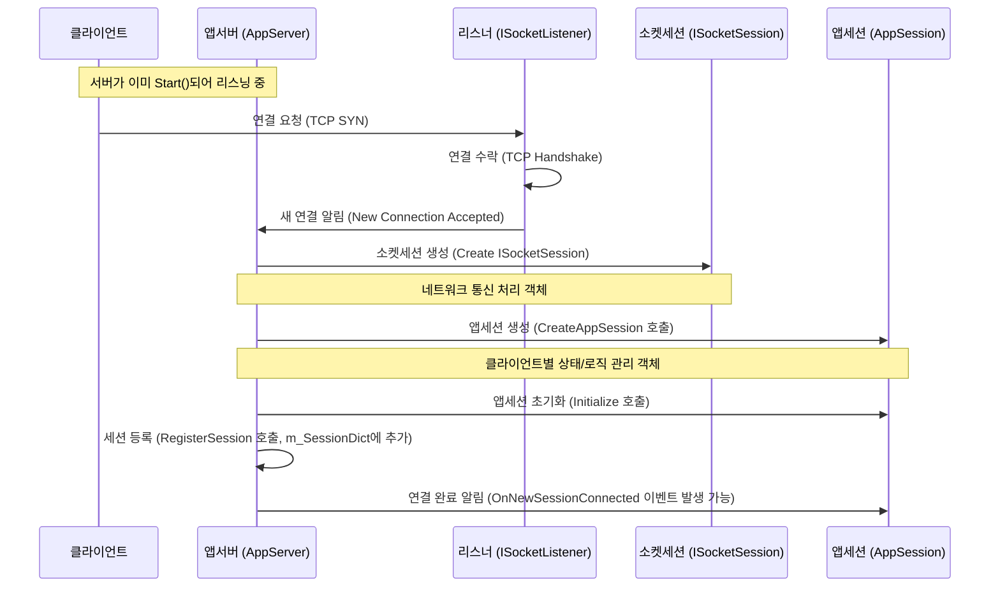

# Chapter 1: 앱서버 (AppServer / AppServerBase)

SuperSocketLite를 사용한 서버 개발 여정에 오신 것을 환영합니다! 첫 번째 장에서는 SuperSocketLite 애플리케이션의 심장과 같은 존재인 **앱서버 (AppServer / AppServerBase)** 에 대해 알아보겠습니다.

## 앱서버는 왜 필요할까요?

간단한 채팅 서버를 만든다고 상상해 보세요. 이 서버는 특정 컴퓨터 주소(IP 주소)와 문(포트 번호)을 열어두고, 여러 사용자들이 동시에 접속해서 메시지를 주고받을 수 있어야 합니다. 이때, 누군가는 이 모든 과정을 총괄해야 합니다.

*   서버 프로그램을 시작하고 종료하는 역할
*   정해진 주소와 포트에서 사용자의 접속을 기다리는 역할 (리스닝)
*   새로운 사용자가 접속하면 연결을 수락하고 관리하는 역할
*   모든 접속된 사용자 목록을 유지하는 역할
*   서버 전체의 설정을 관리하는 역할

바로 이 모든 복잡한 일을 처리해주는 핵심 구성 요소가 **앱서버 (AppServer)** 입니다. 마치 레스토랑의 총괄 매니저처럼, 서버 운영의 전반적인 부분을 책임지고 관리하여 개발자가 비즈니스 로직에 더 집중할 수 있도록 도와줍니다.

## 핵심 개념: 앱서버 파헤치기

앱서버는 크게 다음과 같은 역할들을 수행합니다.

1.  **서버 생명주기 관리**: 서버를 시작(`Start()`)하고 중지(`Stop()`)하는 기본적인 제어를 담당합니다.
2.  **설정 관리**: 서버가 어떤 IP 주소와 포트에서 작동할지, 최대 접속자 수는 몇 명인지 등 서버 운영에 필요한 다양한 설정을 관리합니다. (`IServerConfig` 인터페이스를 통해 설정 정보를 읽습니다.)
3.  **클라이언트 연결 수락**: 지정된 포트에서 클라이언트의 연결 요청을 기다립니다. 이를 '리스닝(Listening)'이라고 합니다. 새로운 연결 요청이 오면 이를 수락합니다. 이 역할은 내부적으로 [소켓 리스너 (ISocketListener / SocketListenerBase)](07_소켓_리스너__isocketlistener___socketlistenerbase__.md)를 통해 이루어집니다.
4.  **세션 생성 및 관리**: 클라이언트 연결이 성공하면, 각 연결을 나타내는 [앱세션 (AppSession)](02_앱세션__appsession__.md) 객체를 생성합니다. 그리고 현재 연결된 모든 세션의 목록을 유지하고 관리합니다. `AppServer` 클래스는 이 세션 목록을 효율적으로 관리하는 기능(예: 세션 검색, 유휴 세션 정리 등)을 제공합니다.

**AppServer vs. AppServerBase**

코드 스니펫을 보면 `AppServer`와 `AppServerBase`라는 두 가지 클래스가 보일 것입니다.

*   `AppServerBase`: 앱서버의 핵심 기능을 정의하는 추상(Abstract) 클래스입니다. 실제 서버 로직의 뼈대를 제공하지만, 직접 인스턴스화해서 사용할 수는 없습니다. 서버 설정 로딩, 리스너 설정, 세션 관리의 기본적인 틀, 시작/종료 로직 등이 포함되어 있습니다.
*   `AppServer`: `AppServerBase`를 상속받아 만들어진 구체적인(Concrete) 클래스입니다. 대부분의 경우 우리는 이 `AppServer` 클래스 (또는 이를 상속받은 사용자 정의 클래스)를 사용하여 서버 인스턴스를 만듭니다. `AppServer`는 기본적인 세션 관리 (예: `ConcurrentDictionary`를 사용한 세션 저장) 및 몇 가지 기본 설정을 제공합니다.

간단히 말해, `AppServerBase`는 설계도이고, `AppServer`는 그 설계도를 바탕으로 만들어진 기본 모델 하우스라고 생각할 수 있습니다. 우리는 보통 이 기본 모델 하우스를 사용하거나, 약간 수정해서 사용합니다.

## 앱서버 사용해보기: 간단한 서버 시작하기

가장 기본적인 앱서버를 설정하고 시작하는 방법을 살펴보겠습니다.

```csharp
using SuperSocketLite.SocketBase;
using SuperSocketLite.SocketBase.Config; // IServerConfig 사용 위해 필요

// 1. AppServer 인스턴스 생성
var appServer = new AppServer();

// 2. 서버 설정 구성
var serverConfig = new ServerConfig
{
    Port = 2024, // 2024번 포트에서 리스닝
    Ip = "Any",  // 모든 IP 주소에서 들어오는 연결 허용
    MaxConnectionNumber = 100 // 최대 100명까지 동시 접속 허용
};

// 3. 서버 설정 및 시작 준비
if (!appServer.Setup(serverConfig))
{
    Console.WriteLine("서버 설정 실패!");
    return;
}

// 4. 서버 시작
if (!appServer.Start())
{
    Console.WriteLine("서버 시작 실패!");
    return;
}

Console.WriteLine("서버가 시작되었습니다. 종료하려면 엔터키를 누르세요...");
Console.ReadLine();

// 5. 서버 종료
appServer.Stop();
Console.WriteLine("서버가 종료되었습니다.");
```

**코드 설명:**

1.  `new AppServer()`: `AppServer` 클래스의 새 인스턴스를 만듭니다. 이것이 우리 서버의 본체입니다.
2.  `new ServerConfig { ... }`: 서버의 기본 설정을 정의합니다. 여기서는 2024번 포트를 사용하고, 모든 IP 주소에서의 연결을 허용하며, 최대 100개의 동시 연결을 처리하도록 설정했습니다. `ServerConfig`는 `IServerConfig` 인터페이스의 기본 구현입니다.
3.  `appServer.Setup(serverConfig)`: 생성된 `appServer` 인스턴스에 `serverConfig` 설정을 적용합니다. 이 단계에서 서버는 리스닝할 준비를 하고 내부 구성 요소들을 초기화합니다. 성공하면 `true`를 반환합니다.
4.  `appServer.Start()`: 준비된 서버를 실제로 시작합니다. 이제 서버는 설정된 포트(2024)에서 클라이언트의 연결 요청을 받기 시작합니다. 성공하면 `true`를 반환합니다.
5.  `appServer.Stop()`: 실행 중인 서버를 중지합니다. 모든 리스너를 닫고 연결된 모든 클라이언트 세션을 종료합니다.

이 코드를 실행하면 콘솔 창에 "서버가 시작되었습니다." 메시지가 표시되고, 프로그램은 사용자가 엔터 키를 누를 때까지 대기합니다. 엔터 키를 누르면 서버가 종료됩니다. 아직 클라이언트가 연결했을 때 어떤 작업을 할지는 정의하지 않았지만, 기본적인 서버의 뼈대가 완성된 것입니다!

**참고:** `AppServer`는 제네릭(Generic) 클래스이기도 합니다. `AppServer<TAppSession>` 또는 `AppServer<TAppSession, TRequestInfo>` 형태로 사용될 수 있습니다. 이는 어떤 종류의 [앱세션 (AppSession)](02_앱세션__appsession__.md)을 사용할지, 그리고 어떤 형태의 [요청 정보 (IRequestInfo / RequestInfo)](03_요청_정보__irequestinfo___requestinfo__.md)를 처리할지 지정하는 데 사용됩니다. 위 예제에서는 기본값인 `AppServer<AppSession, StringRequestInfo>`를 사용한 것과 같습니다. 이 부분은 다음 챕터들에서 더 자세히 다룰 것입니다.

## 내부 동작 들여다보기: 앱서버는 어떻게 작동할까?

`appServer.Start()`를 호출하면 내부적으로 어떤 일이 벌어질까요? 간단한 흐름을 따라가 봅시다.

1.  **상태 확인**: `AppServerBase`의 `Start()` 메서드는 먼저 서버가 시작 가능한 상태인지 확인합니다 (`NotStarted` 상태여야 함).
2.  **소켓 서버 시작**: 내부적으로 관리하는 [소켓 서버 (ISocketServer / SocketServerBase / ...)](05_소켓_서버__isocketserver___socketserverbase___asyncsocketserver___udpsocketserver__.md) 객체의 `Start()` 메서드를 호출합니다. 이 소켓 서버는 실제 네트워크 리스닝 작업을 담당합니다.
3.  **리스너 활성화**: 소켓 서버는 설정된 각 리스너 ([소켓 리스너 (ISocketListener / SocketListenerBase)](07_소켓_리스너__isocketlistener___socketlistenerbase__.md))를 활성화하여 클라이언트 연결 요청을 기다리기 시작합니다.
4.  **이벤트/타이머 시작**: `AppServer` 클래스의 `Start()` 메서드는 추가적으로 세션 스냅샷 타이머(`StartSessionSnapshotTimer`, 설정 시)나 유휴 세션 정리 타이머(`StartClearSessionTimer`, 설정 시) 등을 시작할 수 있습니다.
5.  **상태 변경 및 이벤트 발생**: 모든 준비가 끝나면 서버 상태를 `Running`으로 변경하고, `OnStarted()` 콜백 메서드를 호출하여 서버 시작 관련 추가 작업을 수행할 기회를 제공합니다.

클라이언트가 접속하면 다음과 같은 흐름이 이어집니다.



**코드 레벨에서 살펴보기:**

*   **서버 시작 (`AppServerBase.Start`)**:
    ```csharp
    // File: SocketBase/AppServerBase.cs
    public virtual bool Start()
    {
        // ... 상태 확인 로직 ...

        // ISocketServer에게 실제 리스닝 시작 명령
        if (!m_SocketServer.Start())
        {
            m_StateCode = ServerStateConst.NotStarted;
            return false;
        }

        StartedTime = DateTime.Now;
        m_StateCode = ServerStateConst.Running;

        // ... OnStarted() 호출 등 추가 로직 ...

        return true;
    }
    ```
    `m_SocketServer`는 [소켓 서버 (ISocketServer / SocketServerBase / ...)](05_소켓_서버__isocketserver___socketserverbase___asyncsocketserver___udpsocketserver__.md) 인터페이스의 구현체로, 실제 네트워크 작업을 담당합니다.

*   **세션 생성 (`AppServerBase.CreateAppSession` - 간접 호출됨)**:
    `IAppServer` 인터페이스를 통해 내부적으로 호출됩니다. 기본 `AppServer`는 제네릭 타입 파라미터 `TAppSession`의 기본 생성자를 호출하여 세션을 만듭니다.
    ```csharp
    // File: SocketBase/AppServerBase.cs
    // 실제 호출은 ISocketServer 구현 내부에서 발생
    IAppSession IAppServer.CreateAppSession(ISocketSession socketSession)
    {
        // ... 연결 필터 실행 ...

        // 가상 메서드를 호출하여 실제 AppSession 객체 생성
        var appSession = CreateAppSession(socketSession);

        // 생성된 AppSession 초기화
        appSession.Initialize(this, socketSession);

        return appSession;
    }

    // TAppSession 타입의 객체를 생성하는 기본 구현
    protected virtual TAppSession CreateAppSession(ISocketSession socketSession)
    {
        return new TAppSession(); // TAppSession의 기본 생성자 사용
    }
    ```
    개발자는 `CreateAppSession` 메서드를 오버라이드(재정의)하여 자신만의 초기화 로직을 가진 AppSession 객체를 생성할 수 있습니다.

*   **세션 등록 (`AppServer.RegisterSession`)**:
    ```csharp
    // File: SocketBase/AppServer.cs
    protected override bool RegisterSession(string sessionID, TAppSession appSession)
    {
        // ConcurrentDictionary에 세션 ID와 세션 객체를 추가
        if (m_SessionDict.TryAdd(sessionID, appSession))
            return true;

        // ... 이미 존재하는 ID일 경우 에러 로깅 ...
        return false;
    }
    ```
    `m_SessionDict`는 `ConcurrentDictionary<string, TAppSession>` 타입으로, 여러 스레드에서 안전하게 세션 목록을 관리할 수 있게 해줍니다.

*   **새 세션 연결 처리 (`AppServerBase.OnNewSessionConnected`)**:
    세션이 성공적으로 등록된 후 호출됩니다. `NewSessionConnected` 이벤트 핸들러가 등록되어 있다면 이를 비동기적으로 실행합니다.
    ```csharp
    // File: SocketBase/AppServerBase.cs
    protected virtual void OnNewSessionConnected(TAppSession session)
    {
        var handler = m_NewSessionConnected; // 등록된 이벤트 핸들러 가져오기
        if (handler == null)
        {
            return;
        }
        // 별도 스레드에서 이벤트 핸들러 실행 (비동기)
        Task.Run(() => handler(session));
    }
    ```

## 결론

이번 장에서는 SuperSocketLite 애플리케이션의 핵심 제어 센터인 **앱서버 (AppServer / AppServerBase)** 에 대해 알아보았습니다. 앱서버는 서버의 시작과 종료, 설정 관리, 클라이언트 연결 수락 및 세션 관리 등 서버 운영의 전반적인 책임을 지는 중요한 구성 요소입니다. 간단한 코드를 통해 서버를 설정하고 시작하는 방법도 살펴보았습니다.

앱서버가 클라이언트 연결을 받아들이고 관리하는 방법을 이해했으니, 다음 단계는 개별 클라이언트 연결을 나타내는 객체, 즉 **세션**에 대해 자세히 알아보는 것입니다.

다음 장에서는 [앱세션 (AppSession)](02_앱세션__appsession__.md)이 무엇이며, 각 클라이언트와의 상호작용을 어떻게 처리하는지 배우게 됩니다.

---

Generated by [AI Codebase Knowledge Builder](https://github.com/The-Pocket/Tutorial-Codebase-Knowledge)