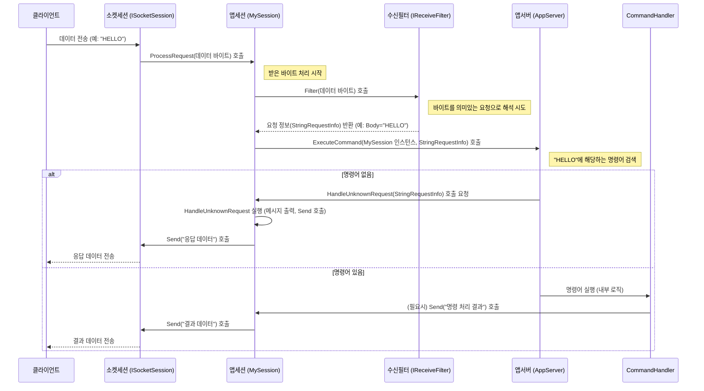

# Chapter 2: 앱세션 (AppSession)


이전 [앱서버 (AppServer / AppServerBase)](01_앱서버__appserver___appserverbase__.md) 장에서는 서버의 전체적인 운영과 클라이언트 연결 수락을 담당하는 '총괄 매니저'에 대해 배웠습니다. 서버가 시작되고 클라이언트가 접속하면, 이제 각 클라이언트와 개별적으로 소통하고 요청을 처리할 누군가가 필요합니다. 바로 이 역할을 하는 것이 **앱세션 (AppSession)** 입니다.

## 앱세션은 왜 필요할까요? 레스토랑의 웨이터 이야기

레스토랑을 다시 생각해 봅시다. 총괄 매니저([앱서버 (AppServer / AppServerBase)](01_앱서버__appserver___appserverbase__.md))는 레스토랑 전체 운영을 책임지지만, 각 테이블의 손님(클라이언트)과 직접 소통하고 주문을 받고 서빙하는 것은 담당 웨이터입니다. 손님마다 담당 웨이터가 있듯이, 서버에 접속하는 **각 클라이언트 연결마다 고유한 앱세션 객체**가 필요합니다.

만약 앱세션이 없다면, 서버는 어떤 데이터가 어느 클라이언트로부터 왔는지, 특정 클라이언트가 로그인을 했는지 아닌지 등의 상태를 구분하기 매우 어려워집니다. 앱세션은 각 클라이언트와의 '개별 대화 창구' 역할을 수행하며, 다음과 같은 문제들을 해결해 줍니다.

*   **클라이언트 식별 및 상태 관리**: 어떤 클라이언트가 연결되어 있는지, 해당 클라이언트가 로그인 상태인지, 어떤 데이터를 주고받았는지 등의 정보를 개별적으로 관리합니다.
*   **맞춤형 상호작용**: 각 클라이언트의 요청에 맞춰 적절한 응답을 보내고, 필요한 작업을 수행합니다. 채팅 유저 A에게 온 메시지를 유저 B에게 보내면 안 되겠죠?
*   **독립적인 처리**: 한 클라이언트의 작업이 다른 클라이언트에게 영향을 주지 않도록 격리합니다.

즉, 앱세션은 서버에 연결된 **개별 클라이언트와의 모든 상호작용을 전담**하는 객체입니다.

## 핵심 개념: 앱세션 파헤치기

앱세션은 다음과 같은 중요한 역할들을 수행합니다.

1.  **클라이언트 대표**: 서버에 연결된 단일 클라이언트 연결을 나타냅니다. 클라이언트가 접속하면 `AppServer`는 해당 연결을 위한 `AppSession` 인스턴스를 생성합니다.
2.  **상태 저장소**: 클라이언트별 데이터를 저장하는 공간입니다. 예를 들어, 사용자의 ID, 닉네임, 로그인 상태, 마지막 활동 시간 등을 `AppSession`의 속성이나 `Items` 컬렉션에 저장할 수 있습니다.
3.  **데이터 송수신 처리**: 클라이언트로부터 데이터를 받고([수신 필터 (IReceiveFilter / ReceiveFilterBase)](04_수신_필터__ireceivefilter___receivefilterbase__.md)를 통해), 처리된 요청에 따라 클라이언트에게 데이터를 보냅니다 (`Send` 메서드 사용).
4.  **비즈니스 로직 실행**: 클라이언트의 요청을 해석하고([요청 정보 (IRequestInfo / RequestInfo)](03_요청_정보__irequestinfo___requestinfo__.md) 객체 사용), 그에 맞는 서버 측 로직(예: 메시지 처리, 데이터베이스 조회)을 실행하는 코드가 주로 이 곳에 위치합니다.
5.  **생명 주기 관리**: 클라이언트 연결 시작(`OnSessionStarted`), 종료(`OnSessionClosed`), 오류 발생(`HandleException`) 시점에 특정 작업을 수행할 수 있는 메서드를 제공합니다.

**AppSession의 구성 요소:**

*   **`AppServer`**: 자신이 속한 `AppServer` 인스턴스를 참조합니다. 이를 통해 서버 전체 설정이나 다른 세션 정보에 접근할 수 있습니다.
*   **`SocketSession`**: 실제 네트워크 통신을 담당하는 저수준 [소켓 세션 (ISocketSession / SocketSession / ...)](06_소켓_세션__isocketsession___socketsession___asyncsocketsession___udpsocketsession__.md) 객체를 참조합니다. 데이터 송수신은 내부적으로 이 `SocketSession`을 통해 이루어집니다.
*   **`SessionID`**: 각 세션을 고유하게 식별하는 ID입니다.
*   **`RemoteEndPoint`**: 연결된 클라이언트의 IP 주소와 포트 정보입니다.
*   **`LastActiveTime`**: 세션이 마지막으로 활동한 시간입니다. 유휴 세션 관리에 사용될 수 있습니다.
*   **`Items`**: 세션과 관련된 사용자 정의 데이터를 저장할 수 있는 딕셔너리(Dictionary)입니다. (예: `session.Items["UserID"] = "Alice";`)
*   **`Send()` 메서드**: 클라이언트에게 데이터를 전송하는 메서드입니다. 문자열 또는 바이트 배열을 보낼 수 있습니다.
*   **`Close()` 메서드**: 현재 세션의 연결을 종료합니다.

## 앱세션 사용해보기: 클라이언트와 인사하기

가장 기본적인 앱세션을 만들어 클라이언트가 연결되었을 때와 데이터를 보냈을 때 간단한 메시지를 출력하고 응답하는 방법을 알아봅시다.

먼저, `AppSession`을 상속받는 사용자 정의 세션 클래스를 만듭니다.

```csharp
using SuperSocketLite.SocketBase;
using SuperSocketLite.SocketBase.Protocol;
using System;

// AppSession<MySession, StringRequestInfo> 를 상속받습니다.
// MySession: 자기 자신의 타입
// StringRequestInfo: 클라이언트 요청을 문자열로 처리 (다음 장에서 자세히 설명)
public class MySession : AppSession<MySession, StringRequestInfo>
{
    // 세션이 처음 시작될 때 호출됩니다.
    protected override void OnSessionStarted()
    {
        // 콘솔에 클라이언트 연결 메시지 출력
        Console.WriteLine($"[{SessionID}] 새로운 클라이언트 접속: {RemoteEndPoint}");
        // 클라이언트에게 환영 메시지 전송
        Send("환영합니다! 서버에 접속하셨습니다.");
        base.OnSessionStarted(); // 기본 구현 호출
    }

    // 알 수 없는 요청(처리할 명령어가 없는 요청)을 받았을 때 호출됩니다.
    protected override void HandleUnknownRequest(StringRequestInfo requestInfo)
    {
        Console.WriteLine($"[{SessionID}] 받은 메시지: {requestInfo.Body}");
        // 받은 메시지를 그대로 클라이언트에게 돌려보냅니다 (에코)
        Send($"'{requestInfo.Body}' 라고 하셨네요!");
    }

    // 세션이 닫힐 때 호출됩니다.
    protected override void OnSessionClosed(CloseReason reason)
    {
        Console.WriteLine($"[{SessionID}] 클라이언트 접속 종료: {reason}");
        base.OnSessionClosed(reason); // 기본 구현 호출
    }

    // 세션 처리 중 예외가 발생했을 때 호출됩니다.
    protected override void HandleException(Exception e)
    {
        Console.WriteLine($"[{SessionID}] 오류 발생: {e.Message}");
        // 오류 메시지를 클라이언트에게 보낼 수도 있습니다.
        Send($"오류가 발생했습니다: {e.GetType().Name}");
        base.HandleException(e); // 기본 구현 호출 (오류 로깅 및 세션 종료 포함)
    }
}
```

**코드 설명:**

1.  `public class MySession : AppSession<MySession, StringRequestInfo>`: `AppSession`을 상속받아 `MySession`이라는 새로운 클래스를 정의합니다. `<MySession, StringRequestInfo>`는 이 세션 클래스가 자기 자신(`MySession`)을 사용하고, 클라이언트 요청을 기본적인 문자열 형태([`StringRequestInfo`](03_요청_정보__irequestinfo___requestinfo__.md))로 다룬다는 것을 의미합니다.
2.  `OnSessionStarted()`: 클라이언트 연결이 성공적으로 수립되고 세션이 초기화된 직후 호출되는 메서드입니다. 여기서는 연결된 클라이언트의 정보(세션 ID, IP 주소 및 포트)를 콘솔에 출력하고, 클라이언트에게 환영 메시지를 보냅니다. `Send()` 메서드를 사용하여 클라이언트에게 데이터를 전송합니다.
3.  `HandleUnknownRequest(StringRequestInfo requestInfo)`: 서버에 정의된 특정 명령(Command)에 해당하지 않는 요청이 들어왔을 때 호출됩니다. `StringRequestInfo`는 간단한 문자열 기반 요청을 처리하기 위한 기본 구현이며, `requestInfo.Body`를 통해 클라이언트가 보낸 원본 메시지 문자열에 접근할 수 있습니다. 여기서는 받은 메시지를 콘솔에 출력하고, 받은 메시지를 포함한 응답을 클라이언트에게 다시 보냅니다 (에코 서버 동작).
4.  `OnSessionClosed(CloseReason reason)`: 클라이언트 연결이 끊어졌을 때 호출됩니다. `reason` 매개변수를 통해 연결 종료 사유(예: 클라이언트가 연결 끊음, 서버 종료, 시간 초과 등)를 알 수 있습니다. 여기서는 종료 사유를 콘솔에 출력합니다.
5.  `HandleException(Exception e)`: 세션 내에서 요청 처리 중 예외가 발생했을 때 호출됩니다. 여기서는 예외 메시지를 콘솔에 출력하고 클라이언트에게 간단한 오류 메시지를 보냅니다. 기본 `HandleException` 구현은 오류를 로깅하고 세션을 닫는 역할을 합니다.

이제 이 `MySession`을 사용하는 `AppServer`를 설정해야 합니다. 이전 장의 코드를 약간 수정합니다.

```csharp
using SuperSocketLite.SocketBase;
using SuperSocketLite.SocketBase.Config;
using System;

// ... MySession 클래스 정의 ...

class Program
{
    static void Main(string[] args)
    {
        // 1. AppServer 인스턴스 생성 시 MySession 타입을 지정합니다.
        var appServer = new AppServer<MySession, StringRequestInfo>(); // <--- 변경된 부분

        // 2. 서버 설정 구성 (이전과 동일)
        var serverConfig = new ServerConfig
        {
            Port = 2024,
            Ip = "Any",
            MaxConnectionNumber = 100,
            Name = "MyEchoServer" // 서버 이름 설정
        };

        // 3. 서버 설정 및 시작 준비
        if (!appServer.Setup(serverConfig))
        {
            Console.WriteLine("서버 설정 실패!");
            return;
        }

        Console.WriteLine("서버 설정을 시작합니다...");

        // (선택 사항) 세션 관련 이벤트 핸들러 등록
        appServer.NewSessionConnected += (session) =>
        {
            Console.WriteLine($"AppServer 이벤트: 새로운 세션 연결됨! ID: {session.SessionID}");
            // OnSessionStarted 와 비슷하지만 AppServer 레벨에서 처리
        };

        appServer.SessionClosed += (session, reason) =>
        {
            Console.WriteLine($"AppServer 이벤트: 세션 종료됨! ID: {session.SessionID}, 이유: {reason}");
            // OnSessionClosed 와 비슷하지만 AppServer 레벨에서 처리
        };

        Console.WriteLine("서버 설정 완료.");

        // 4. 서버 시작 (이전과 동일)
        if (!appServer.Start())
        {
            Console.WriteLine("서버 시작 실패!");
            return;
        }

        Console.WriteLine("서버가 시작되었습니다. 종료하려면 엔터키를 누르세요...");
        Console.ReadLine();

        // 5. 서버 종료 (이전과 동일)
        appServer.Stop();
        Console.WriteLine("서버가 종료되었습니다.");
    }
}
```

**코드 설명:**

1.  `var appServer = new AppServer<MySession, StringRequestInfo>();`: `AppServer`를 생성할 때, 우리가 만든 `MySession` 타입을 제네릭 인자로 전달합니다. 이렇게 하면 `AppServer`는 새로운 클라이언트가 연결될 때마다 `MySession`의 인스턴스를 생성하여 사용하게 됩니다. `StringRequestInfo`는 이 서버가 문자열 기반 요청을 처리함을 명시합니다.
2.  `appServer.NewSessionConnected += ...`: (선택 사항) `AppServer` 수준에서도 새 세션 연결 시 실행될 코드를 등록할 수 있습니다. `MySession`의 `OnSessionStarted`와 유사한 시점에 호출됩니다.
3.  `appServer.SessionClosed += ...`: (선택 사항) `AppServer` 수준에서 세션 종료 시 실행될 코드를 등록할 수 있습니다. `MySession`의 `OnSessionClosed`와 유사한 시점에 호출됩니다.

**실행 결과 예상:**

이 코드를 실행하고, `telnet`이나 다른 TCP 클라이언트 툴을 사용하여 `localhost` (또는 서버가 실행 중인 IP)의 2024번 포트로 접속하면 다음과 같은 상호작용을 볼 수 있습니다.

*   **서버 콘솔:**
    *   클라이언트 접속 시: `[세션ID] 새로운 클라이언트 접속: [클라이언트 IP 주소]:[포트]`
    *   클라이언트가 "안녕하세요" 입력 시: `[세션ID] 받은 메시지: 안녕하세요`
    *   클라이언트 접속 종료 시: `[세션ID] 클라이언트 접속 종료: [종료 이유]`
*   **클라이언트 (telnet):**
    *   접속 직후: `환영합니다! 서버에 접속하셨습니다.`
    *   "안녕하세요" 입력 후 Enter: `'안녕하세요' 라고 하셨네요!`

이제 각 클라이언트는 자신만의 `MySession` 인스턴스를 통해 서버와 독립적으로 통신하게 됩니다.

## 내부 동작 들여다보기: 앱세션은 어떻게 만들어지고 작동할까?

`AppServer`가 클라이언트 연결을 수락하면 `AppSession`이 어떻게 생성되고 상호작용하는지 내부 흐름을 살펴보겠습니다.

1.  **연결 수락 및 소켓 세션 생성**: [앱서버 (AppServer / AppServerBase)](01_앱서버__appserver___appserverbase__.md)의 내부 [소켓 리스너 (ISocketListener / SocketListenerBase)](07_소켓_리스너__isocketlistener___socketlistenerbase__.md)가 클라이언트 연결을 수락하면, 저수준 통신을 위한 [소켓 세션 (ISocketSession / SocketSession / ...)](06_소켓_세션__isocketsession___socketsession___asyncsocketsession___udpsocketsession__.md) 객체가 먼저 생성됩니다.
2.  **앱세션 생성**: `AppServer`는 설정된 `AppSession` 타입 (예: `MySession`)의 인스턴스를 생성합니다. 일반적으로 제네릭 타입 `<TAppSession>`의 기본 생성자를 호출합니다. (`AppServerBase.CreateAppSession` 가상 메서드를 오버라이드하여 생성 로직을 변경할 수도 있습니다.)
3.  **앱세션 초기화**: 생성된 `AppSession` 인스턴스의 `Initialize()` 메서드가 호출됩니다. 이 메서드는 `AppSession`에게 자신이 속한 `AppServer`와 방금 생성된 `ISocketSession`을 알려주고, 세션 ID, 기본 문자 인코딩 등을 설정합니다. 또한, 클라이언트로부터 받은 데이터를 해석할 [수신 필터 (IReceiveFilter / ReceiveFilterBase)](04_수신_필터__ireceivefilter___receivefilterbase__.md)를 생성하고 초기화합니다.
4.  **세션 등록**: `AppServer`는 생성되고 초기화된 `AppSession`을 내부 세션 목록(보통 `ConcurrentDictionary`)에 등록합니다 (`RegisterSession` 메서드).
5.  **세션 시작 알림**: `AppSession`의 `StartSession()` 메서드가 호출되고, 이어서 개발자가 재정의할 수 있는 `OnSessionStarted()` 메서드가 호출됩니다. 이때부터 세션은 완전히 활성화된 상태입니다.
6.  **데이터 수신 및 처리**: 클라이언트가 데이터를 보내면 `ISocketSession`이 데이터를 수신하고, `AppSession`의 `ProcessRequest()` 메서드를 호출합니다.
    *   `ProcessRequest()`는 연결된 `IReceiveFilter`를 사용하여 수신된 바이트 데이터를 의미 있는 요청 정보([`TRequestInfo`](03_요청_정보__irequestinfo___requestinfo__.md))로 변환하려고 시도합니다.
    *   `IReceiveFilter`가 완전한 요청 정보를 반환하면, `AppSession`은 `AppServer`의 `ExecuteCommand()` 메서드를 호출하여 해당 요청을 처리할 명령(Command)을 실행합니다. (명령 처리는 이후 챕터에서 다룹니다.)
    *   만약 적절한 명령을 찾지 못하면, `AppSession`의 `HandleUnknownRequest()` 메서드가 호출됩니다.
7.  **데이터 송신**: 세션 코드(`OnSessionStarted`, `HandleUnknownRequest`, 또는 명령 핸들러 내부)에서 `Send()` 메서드를 호출하면, `AppSession`은 내부적으로 `ISocketSession`의 `Send()` 또는 `TrySend()` 메서드를 호출하여 실제 네트워크 전송을 요청합니다.
8.  **세션 종료**: 클라이언트 연결이 끊어지거나 서버가 세션을 닫으면(`Close()` 메서드 호출), `ISocketSession`이 먼저 닫히고, 이어서 `AppSession`의 `OnSessionClosed()` 메서드가 호출됩니다. 이후 `AppServer`는 세션 목록에서 해당 세션을 제거합니다.

**데이터 수신 및 처리 흐름 다이어그램:**



**코드 레벨에서 살펴보기:**

*   **세션 초기화 (`AppSession.Initialize`)**:
    ```csharp
    // File: SocketBase/AppSession.cs (AppSession<TAppSession, TRequestInfo>)
    public virtual void Initialize(IAppServer<TAppSession, TRequestInfo> appServer, ISocketSession socketSession)
    {
        var castedAppServer = (AppServerBase<TAppSession, TRequestInfo>)appServer;
        AppServer = castedAppServer; // AppServer 참조 설정
        Charset = castedAppServer.TextEncoding; // 문자 인코딩 설정
        SocketSession = socketSession; // ISocketSession 참조 설정
        SessionID = socketSession.SessionID; // 세션 ID 설정
        m_Connected = true; // 연결 상태 플래그 설정
        // 수신 필터 생성 및 초기화
        m_ReceiveFilter = castedAppServer.ReceiveFilterFactory.CreateFilter(appServer, this, socketSession.RemoteEndPoint);
        // ... 필터 초기화 로직 ...

        socketSession.Initialize(this); // ISocketSession에게 AppSession 자신을 알려줌

        OnInit(); // 개발자가 추가 초기화 로직을 넣을 수 있는 가상 메서드 호출
    }
    ```
    `Initialize`는 세션이 서버 및 네트워크 연결과 연결되는 핵심적인 단계입니다. 여기서 세션의 기본 정보가 설정되고, 데이터 수신을 위한 [수신 필터 (IReceiveFilter / ReceiveFilterBase)](04_수신_필터__ireceivefilter___receivefilterbase__.md)가 준비됩니다.

*   **요청 처리 (`AppSession.ProcessRequest`)**:
    ```csharp
    // File: SocketBase/AppSession.cs (IAppSession 구현 부분)
    int IAppSession.ProcessRequest(byte[] readBuffer, int offset, int length, bool toBeCopied)
    {
        int rest, offsetDelta;
        while (true) // 받은 데이터가 여러 요청을 포함할 수 있으므로 반복 처리
        {
            // 수신 필터를 사용하여 요청 정보(TRequestInfo) 추출 시도
            var requestInfo = FilterRequest(readBuffer, offset, length, toBeCopied, out rest, out offsetDelta);

            if (requestInfo != null) // 완전한 요청이 만들어졌다면
            {
                try
                {
                    // AppServer에게 명령 실행 요청
                    AppServer.ExecuteCommand(this, requestInfo);
                }
                catch (Exception e)
                {
                    HandleException(e); // 오류 처리
                }
            }

            if (rest <= 0) // 처리할 데이터가 더 이상 없으면 종료
            {
                return offsetDelta;
            }

            // 남은 데이터로 다음 반복 처리 준비
            offset = offset + length - rest;
            length = rest;
        }
    }
    ```
    `ProcessRequest`는 데이터가 도착할 때마다 호출됩니다. 핵심 역할은 `FilterRequest` (내부적으로 `IReceiveFilter` 사용)를 호출하여 바이트 스트림을 의미 있는 [요청 정보 (IRequestInfo / RequestInfo)](03_요청_정보__irequestinfo___requestinfo__.md) 객체로 변환하고, 변환된 요청 정보를 `AppServer`의 `ExecuteCommand`로 전달하는 것입니다.

*   **데이터 전송 (`AppSession.Send`)**:
    ```csharp
    // File: SocketBase/AppSession.cs (AppSession<TAppSession, TRequestInfo>)
    public virtual void Send(string message)
    {
        // 문자열을 서버 설정에 맞는 인코딩(Charset)으로 바이트 배열 변환
        var data = this.Charset.GetBytes(message);
        // 내부 Send 메서드 호출 (최종적으로 ISocketSession.Send 사용)
        Send(data, 0, data.Length);
    }

    public virtual void Send(byte[] data, int offset, int length)
    {
        // 실제 전송 로직을 처리하는 내부 메서드 호출
        InternalSend(new ArraySegment<byte>(data, offset, length));
    }

    private void InternalSend(ArraySegment<byte> segment)
    {
        if (!m_Connected) // 연결이 끊겼으면 보내지 않음
            return;

        // ISocketSession의 TrySend를 우선 시도
        if (InternalTrySend(segment))
            return; // 성공적으로 전송 큐에 들어갔으면 종료

        // ... 전송 실패 시 재시도 및 타임아웃 로직 (Config.SendTimeOut 설정에 따라) ...
        // 최종적으로는 SocketSession.TrySend 를 반복 호출하거나 예외 발생
    }

    private bool InternalTrySend(ArraySegment<byte> segment)
    {
        // 실제 네트워크 전송은 ISocketSession 에게 위임
        if (!SocketSession.TrySend(segment))
            return false; // 전송 버퍼가 꽉 찼거나 연결 문제

        LastActiveTime = DateTime.Now; // 마지막 활동 시간 갱신
        return true;
    }
    ```
    `Send` 메서드는 개발자가 사용하기 쉽게 문자열이나 바이트 배열을 받아 처리하지만, 실제 네트워크 전송은 내부적으로 `ISocketSession`에게 위임합니다. `TrySend`는 전송 큐가 가득 찼을 때 즉시 실패를 반환하는 논블로킹(non-blocking) 방식 시도이고, `Send`는 성공할 때까지 (또는 타임아웃될 때까지) 기다릴 수 있는 블로킹(blocking) 방식에 가깝습니다.

## 결론

이번 장에서는 서버에 연결된 개별 클라이언트를 대표하고 관리하는 **앱세션 (AppSession)** 에 대해 배웠습니다. 앱세션은 각 클라이언트와의 독립적인 대화 창구로서, 클라이언트별 상태를 유지하고, 데이터를 주고받으며, 비즈니스 로직을 처리하는 핵심적인 역할을 합니다.

`AppSession` 클래스를 상속받아 `OnSessionStarted`, `HandleUnknownRequest`, `OnSessionClosed` 등의 메서드를 재정의하여 클라이언트와의 상호작용 로직을 직접 구현할 수 있음을 확인했습니다. 또한 `AppServer`가 어떻게 `AppSession` 인스턴스를 생성하고 관리하며, 데이터 수신 및 송신이 내부적으로 어떻게 처리되는지 살펴보았습니다.

앱세션은 클라이언트로부터 데이터를 받으면 [수신 필터 (IReceiveFilter / ReceiveFilterBase)](04_수신_필터__ireceivefilter___receivefilterbase__.md)를 통해 의미 있는 데이터 조각, 즉 '요청'으로 변환합니다. 다음 장에서는 이 '요청'을 나타내는 객체인 [요청 정보 (IRequestInfo / RequestInfo)](03_요청_정보__irequestinfo___requestinfo__.md)에 대해 자세히 알아보겠습니다. 클라이언트가 보낸 데이터를 서버가 어떻게 구조화하여 이해하는지 배우게 될 것입니다.

---

Generated by [AI Codebase Knowledge Builder](https://github.com/The-Pocket/Tutorial-Codebase-Knowledge)