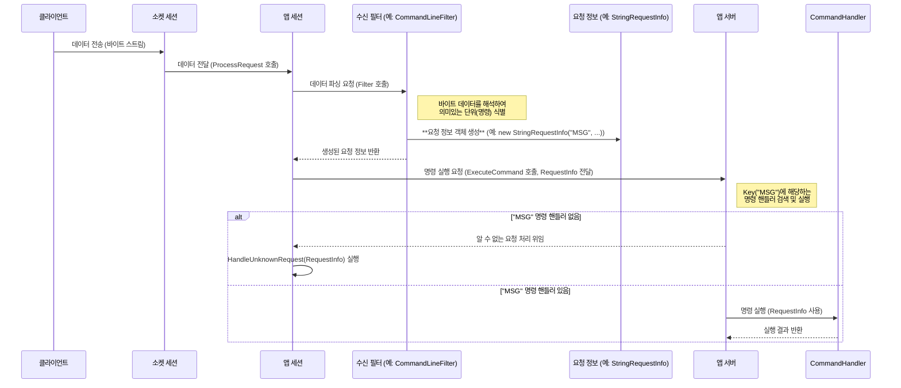

# Chapter 3: 요청 정보 (IRequestInfo / RequestInfo)

이전 [앱세션 (AppSession)](02_앱세션__appsession__.md) 장에서는 서버에 연결된 각 클라이언트를 담당하는 '웨이터'에 대해 배웠습니다. 웨이터는 클라이언트와 직접 대화하며 필요한 서비스를 제공합니다. 하지만 클라이언트가 웨이터에게 무언가를 요청할 때, 예를 들어 "스테이크 주세요, 미디엄 레어로요!" 라고 말하면, 웨이터는 이 요청을 주방에서 알아볼 수 있도록 깔끔하게 정리된 '주문서'에 적어야 합니다.

바로 이 '주문서' 역할을 하는 것이 SuperSocketLite의 **요청 정보 (IRequestInfo / RequestInfo)** 입니다. 클라이언트가 보낸 복잡한 데이터 덩어리(바이트 스트림)를 서버가 이해하고 처리할 수 있는 구조화된 정보로 변환한 결과물입니다.

## 요청 정보는 왜 필요할까요? 뒤죽박죽 주문 대신 깔끔한 주문서!

만약 레스토랑 웨이터가 손님의 주문("스테이크 주세요, 미디엄 레어로요!")을 그대로 주방에 소리친다고 상상해 보세요. 주방에서는 여러 웨이터들의 외침 속에서 어떤 테이블의 주문인지, 정확히 무엇을 원하는지 파악하기 어려울 것입니다.

마찬가지로, 클라이언트가 서버에 데이터를 보낼 때는 단순한 바이트 덩어리로 도착합니다. 서버는 이 바이트 덩어리가 어떤 명령을 의미하는지, 명령 실행에 필요한 추가 정보는 무엇인지 해석해야 합니다.

**요청 정보 (IRequestInfo / RequestInfo)** 는 이러한 문제를 해결합니다.

*   **구조화**: 클라이언트의 요청을 '명령 이름(Key)'과 '세부 내용(Body, Parameters 등)'으로 명확하게 구분합니다.
*   **명확성**: 서버의 각 부분(특히 명령 처리 로직)이 클라이언트의 의도를 정확히 파악하고 필요한 데이터에 쉽게 접근할 수 있도록 합니다.
*   **표준화**: 다양한 형식의 요청(텍스트, 바이너리 등)을 일관된 방식으로 표현할 수 있는 틀을 제공합니다.

요청 정보 객체는 [수신 필터 (IReceiveFilter / ReceiveFilterBase)](04_수신_필터__ireceivefilter___receivefilterbase__.md)(다음 장에서 배울 내용입니다)가 클라이언트로부터 받은 원시 데이터를 파싱하여 생성합니다. 그리고 이렇게 잘 정리된 '주문서'는 [앱세션 (AppSession)](02_앱세션__appsession__.md)이나 서버의 명령 처리 로직으로 전달되어 실제 작업을 수행하는 데 사용됩니다.

## 핵심 개념: 요청 정보 파헤치기

SuperSocketLite에서 요청 정보는 주로 다음 인터페이스와 클래스를 기반으로 합니다.

1.  **`IRequestInfo` 인터페이스**: 모든 요청 정보 객체가 구현해야 하는 가장 기본적인 인터페이스입니다. 오직 하나의 속성만 정의합니다.
    *   **`Key` (string)**: 요청의 종류를 나타내는 고유한 문자열입니다. 예를 들어, 채팅 메시지 전송은 "MSG", 로그인 요청은 "LOGIN"과 같은 키를 가질 수 있습니다. 서버는 이 `Key` 값을 보고 어떤 명령을 실행해야 할지 결정합니다. 마치 주문서의 '메인 메뉴' 이름과 같습니다.

2.  **`RequestInfo<TRequestBody>` 클래스**: `IRequestInfo`를 구현하는 제네릭(Generic) 기본 클래스입니다. `Key` 외에 요청의 '본문(Body)' 데이터를 담는 속성을 추가로 제공합니다.
    *   **`Body` (TRequestBody)**: 요청에 포함된 실제 데이터입니다. `TRequestBody`는 제네릭 타입으로, 문자열(`string`), 바이트 배열(`byte[]`), 또는 사용자 정의 객체 등 다양한 타입을 사용할 수 있습니다. 주문서의 '특별 요청 사항' (예: 스테이크 굽기 정도)과 비슷합니다.

3.  **구체적인 구현 클래스들**: SuperSocketLite는 일반적인 시나리오를 위해 몇 가지 미리 정의된 `RequestInfo` 구현을 제공합니다.
    *   **`StringRequestInfo`**: 가장 흔히 사용되는 텍스트 기반 요청을 위한 클래스입니다. `RequestInfo<string>`을 상속받으며, 추가로 파라미터 배열을 가집니다.
        *   `Key` (string): 명령 이름 (예: "ECHO")
        *   `Body` (string): 명령 이름 뒤에 오는 전체 문자열 (예: "Hello World")
        *   `Parameters` (string[]): `Body`를 공백과 같은 구분자로 나눈 문자열 배열 (예: {"Hello", "World"})
    *   **`BinaryRequestInfo`**: 바이너리 데이터를 처리하기 위한 클래스입니다. `RequestInfo<byte[]>`를 상속받습니다.
        *   `Key` (string): 명령 이름
        *   `Body` (byte[]): 요청의 바이너리 데이터 본문
    *   **`HttpRequestInfo`**: HTTP 요청을 처리하기 위한 클래스입니다. (이 튜토리얼에서는 자세히 다루지 않습니다.)
    *   **`UdpRequestInfo`**: UDP 통신에서 사용되는 요청 정보입니다. (이 튜토리얼에서는 자세히 다루지 않습니다.)

개발자는 이러한 기본 제공 클래스를 사용하거나, 필요에 따라 `RequestInfo<TRequestBody>` 또는 `IRequestInfo`를 직접 구현하여 자신만의 커스텀 요청 정보 타입을 만들 수 있습니다.

## 요청 정보 사용해보기: 에코 서버의 주문서 확인하기

이전 [앱세션 (AppSession)](02_앱세션__appsession__.md) 장에서 만든 에코 서버 예제를 다시 살펴봅시다. `MySession` 클래스에서 `HandleUnknownRequest` 메서드를 보면 `StringRequestInfo` 객체를 사용하는 것을 볼 수 있습니다.

```csharp
// MySession.cs (이전 장의 코드 일부)
using SuperSocketLite.SocketBase.Protocol; // StringRequestInfo 사용 위해 필요
using System;

public class MySession : AppSession<MySession, StringRequestInfo>
{
    // ... (OnSessionStarted, OnSessionClosed 등) ...

    // 알 수 없는 요청(처리할 명령어가 없는 요청)을 받았을 때 호출됩니다.
    protected override void HandleUnknownRequest(StringRequestInfo requestInfo)
    {
        Console.WriteLine($"[{SessionID}] 받은 요청 키(Key): {requestInfo.Key}");
        Console.WriteLine($"[{SessionID}] 받은 요청 본문(Body): {requestInfo.Body}");
        // Parameters 배열의 내용도 출력해 봅시다.
        if (requestInfo.Parameters != null && requestInfo.Parameters.Length > 0)
        {
            Console.WriteLine($"[{SessionID}] 받은 파라미터들: {string.Join(", ", requestInfo.Parameters)}");
        }
        else
        {
            Console.WriteLine($"[{SessionID}] 파라미터 없음.");
        }

        // 받은 메시지를 그대로 클라이언트에게 돌려보냅니다 (에코)
        Send($"'{requestInfo.Body}' 라고 하셨네요! (키: {requestInfo.Key})");
    }

    // ... (HandleException) ...
}
```

**코드 설명:**

1.  `AppSession<MySession, StringRequestInfo>`: `AppSession`을 정의할 때 두 번째 제네릭 인자로 `StringRequestInfo`를 지정했습니다. 이는 이 세션이 처리할 요청 정보의 타입이 `StringRequestInfo`임을 의미합니다. SuperSocketLite의 기본 [수신 필터 (IReceiveFilter / ReceiveFilterBase)](04_수신_필터__ireceivefilter___receivefilterbase__.md) 중 하나(예: `CommandLineReceiveFilter`)는 클라이언트가 보낸 텍스트를 해석하여 `StringRequestInfo` 객체를 생성합니다.
2.  `HandleUnknownRequest(StringRequestInfo requestInfo)`: 이 메서드는 `StringRequestInfo` 타입의 객체를 매개변수로 받습니다. 서버는 [수신 필터 (IReceiveFilter / ReceiveFilterBase)](04_수신_필터__ireceivefilter___receivefilterbase__.md)가 생성한 이 객체를 통해 클라이언트 요청의 내용을 파악합니다.
3.  `requestInfo.Key`: 클라이언트가 보낸 텍스트의 첫 번째 단어(공백 기준)입니다. 이것이 요청의 '명령 이름'이 됩니다.
4.  `requestInfo.Body`: 첫 번째 단어(Key)를 제외한 나머지 전체 문자열입니다.
5.  `requestInfo.Parameters`: `Body` 부분을 공백으로 구분하여 만든 문자열 배열입니다. 명령 실행에 필요한 추가 정보들을 담습니다.

**실행 예시:**

만약 클라이언트가 다음과 같은 텍스트를 서버로 전송했다고 가정해 봅시다. (telnet에서 입력 후 Enter)

```
MSG User1 안녕하세요 반갑습니다
```

서버 (기본 `CommandLineReceiveFilter` 사용 시)는 이 텍스트를 다음과 같이 해석하여 `StringRequestInfo` 객체를 생성하고, `HandleUnknownRequest` 메서드(만약 "MSG" 명령이 등록되지 않았다면)를 호출합니다.

*   `requestInfo.Key`: "MSG"
*   `requestInfo.Body`: "User1 안녕하세요 반갑습니다"
*   `requestInfo.Parameters`: {"User1", "안녕하세요", "반갑습니다"}

그러면 서버 콘솔에는 다음과 같은 내용이 출력될 것입니다.

```
[세션ID] 받은 요청 키(Key): MSG
[세션ID] 받은 요청 본문(Body): User1 안녕하세요 반갑습니다
[세션ID] 받은 파라미터들: User1, 안녕하세요, 반갑습니다
```

그리고 클라이언트는 다음과 같은 응답을 받게 됩니다.

```
'User1 안녕하세요 반갑습니다' 라고 하셨네요! (키: MSG)
```

이처럼 `StringRequestInfo`는 클라이언트가 보낸 단순한 텍스트를 '명령(Key)', '전체 내용(Body)', '개별 인자(Parameters)'로 구조화하여 서버 로직에서 사용하기 쉽게 만들어 줍니다. 마치 웨이터가 손님의 말을 깔끔한 주문서 형식으로 정리한 것과 같습니다.

## 내부 동작 들여다보기: 요청 정보는 어떻게 만들어질까?

클라이언트가 보낸 데이터가 어떻게 `IRequestInfo` 객체로 변환되는지 간단한 흐름을 살펴보겠습니다. 이 과정의 핵심 역할은 **수신 필터 (IReceiveFilter / ReceiveFilterBase)** 가 담당하며, 다음 장에서 더 자세히 다룹니다.

1.  **데이터 수신**: [앱세션 (AppSession)](02_앱세션__appsession__.md)에 연결된 내부 [소켓 세션 (ISocketSession / SocketSession / ...)](06_소켓_세션__isocketsession___socketsession___asyncsocketsession___udpsocketsession__.md)이 클라이언트로부터 바이트 데이터를 수신합니다.
2.  **필터링 요청**: 수신된 바이트 데이터는 `AppSession`의 `ProcessRequest` 메서드로 전달됩니다.
3.  **수신 필터 호출**: `ProcessRequest` 메서드는 자신이 가지고 있는 [수신 필터 (IReceiveFilter / ReceiveFilterBase)](04_수신_필터__ireceivefilter___receivefilterbase__.md) 인스턴스의 `Filter` 메서드를 호출하여 받은 바이트 데이터를 넘겨줍니다.
4.  **데이터 파싱 및 요청 정보 생성**: `Filter` 메서드는 미리 정의된 프로토콜 규칙(예: 텍스트 명령은 공백으로 구분, 특정 구분자 사용 등)에 따라 바이트 데이터를 해석합니다. 해석 결과, 완전한 하나의 요청 단위를 식별하면 해당 요청에 맞는 `IRequestInfo` 객체(예: `StringRequestInfo`, `BinaryRequestInfo`)를 생성하고 필요한 속성(Key, Body, Parameters 등)을 채웁니다.
5.  **요청 정보 반환**: 생성된 `IRequestInfo` 객체는 `Filter` 메서드에서 `AppSession`으로 반환됩니다.
6.  **명령 실행 또는 처리**: `AppSession`은 반환된 `IRequestInfo` 객체를 사용하여 [앱서버 (AppServer / AppServerBase)](01_앱서버__appserver___appserverbase__.md)의 `ExecuteCommand` 메서드를 호출하거나, 적절한 명령이 없을 경우 `HandleUnknownRequest` 또는 `HandleException` 등의 메서드를 호출합니다.

**데이터가 요청 정보로 변환되는 과정:**



**핵심은 `IReceiveFilter`가 원시 데이터를 파싱하여 구조화된 `IRequestInfo` 객체를 '만들어낸다'는 것입니다.** 이 `IRequestInfo` 객체가 바로 서버 로직이 클라이언트 요청을 이해하는 '언어'가 됩니다.

## 코드 레벨에서 살펴보기: 요청 정보의 구조

관련 소스 코드 파일을 통해 `IRequestInfo`와 주요 구현 클래스의 구조를 간단히 살펴보겠습니다.

*   **`IRequestInfo` 인터페이스 (`SocketBase/Protocol/IRequestInfo.cs`)**:
    가장 기본적인 계약입니다. 오직 `Key` 속성만을 요구합니다.

    ```csharp
    // File: SocketBase/Protocol/IRequestInfo.cs
    namespace SuperSocketLite.SocketBase.Protocol;

    public interface IRequestInfo
    {
        /// <summary>
        /// 이 요청의 키(Key)를 가져옵니다.
        /// </summary>
        string Key { get; }
    }

    // Body를 포함하는 제네릭 버전
    public interface IRequestInfo<TRequestBody> : IRequestInfo
    {
        /// <summary>
        /// 이 요청의 본문(Body)을 가져옵니다.
        /// </summary>
        TRequestBody Body { get; }
    }
    ```
    모든 요청 정보는 최소한 `Key`를 가져야 함을 명시합니다.

*   **`RequestInfo<TRequestBody>` 기본 클래스 (`SocketBase/Protocol/RequestInfo.cs`)**:
    `IRequestInfo<TRequestBody>`를 구현하며, `Key`와 `Body` 속성을 실제로 가집니다.

    ```csharp
    // File: SocketBase/Protocol/RequestInfo.cs
    namespace SuperSocketLite.SocketBase.Protocol;

    public class RequestInfo<TRequestBody> : IRequestInfo<TRequestBody>
    {
        // 생성자 등 ...

        /// <summary>
        /// 이 요청의 키(Key)를 가져옵니다.
        /// </summary>
        public string Key { get; private set; }

        /// <summary>
        /// 본문(Body)을 가져옵니다.
        /// </summary>
        public TRequestBody Body { get; private set; }

        // 초기화 메서드 등 ...
        protected void Initialize(string key, TRequestBody body)
        {
            Key = key;
            Body = body;
        }
    }
    ```
    대부분의 커스텀 요청 정보는 이 클래스를 상속받아 만듭니다.

*   **`StringRequestInfo` 클래스 (`SocketBase/Protocol/StringRequestInfo.cs`)**:
    `RequestInfo<string>`을 상속받아 텍스트 기반 요청 처리에 특화된 `Parameters` 속성을 추가합니다.

    ```csharp
    // File: SocketBase/Protocol/StringRequestInfo.cs
    namespace SuperSocketLite.SocketBase.Protocol;

    public class StringRequestInfo : RequestInfo<string>
    {
        /// <summary>
        /// StringRequestInfo 클래스의 새 인스턴스를 초기화합니다.
        /// </summary>
        /// <param name="key">키.</param>
        /// <param name="body">본문.</param>
        /// <param name="parameters">파라미터들.</param>
        public StringRequestInfo(string key, string body, string[] parameters)
            : base(key, body) // 부모 클래스의 생성자 호출 (Key, Body 설정)
        {
            Parameters = parameters; // Parameters 속성 설정
        }

        /// <summary>
        /// 파라미터들을 가져옵니다.
        /// </summary>
        public string[] Parameters { get; private set; }

        // 편의 메서드들 (예: 첫 번째 파라미터 가져오기) ...
    }
    ```
    `Key`, `Body`, `Parameters` 세 가지 주요 속성을 통해 텍스트 명령을 쉽게 다룰 수 있도록 설계되었습니다.

## 결론

이번 장에서는 클라이언트가 보낸 데이터를 서버가 이해할 수 있는 구조화된 형태로 변환한 결과물인 **요청 정보 (IRequestInfo / RequestInfo)** 에 대해 알아보았습니다. 마치 레스토랑의 '주문서'처럼, 요청 정보는 클라이언트 요청의 핵심 내용(Key)과 세부 사항(Body, Parameters 등)을 명확하게 담고 있어 서버 로직에서 활용하기 편리합니다.

가장 기본적인 `IRequestInfo` 인터페이스부터, `Body`를 포함하는 `RequestInfo<T>` 기본 클래스, 그리고 널리 사용되는 `StringRequestInfo`와 `BinaryRequestInfo` 구현까지 살펴보았습니다. `StringRequestInfo`를 통해 간단한 텍스트 명령이 어떻게 `Key`, `Body`, `Parameters`로 분해되어 사용되는지 예제를 통해 확인했습니다.

이제 클라이언트의 요청이 어떤 '모양'으로 서버 내부에 전달되는지 알게 되었습니다. 그렇다면 이 '모양'은 누가, 어떻게 만들어내는 걸까요? 다음 장에서는 클라이언트로부터 들어오는 원시 바이트 데이터를 해석하여 이 의미있는 `IRequestInfo` 객체를 생성하는 마법사, 바로 [수신 필터 (IReceiveFilter / ReceiveFilterBase)](04_수신_필터__ireceivefilter___receivefilterbase__.md)에 대해 자세히 알아볼 것입니다. 클라이언트와 서버 간의 약속(프로토콜)을 정의하고 해석하는 방법을 배우게 됩니다.

---

Generated by [AI Codebase Knowledge Builder](https://github.com/The-Pocket/Tutorial-Codebase-Knowledge)