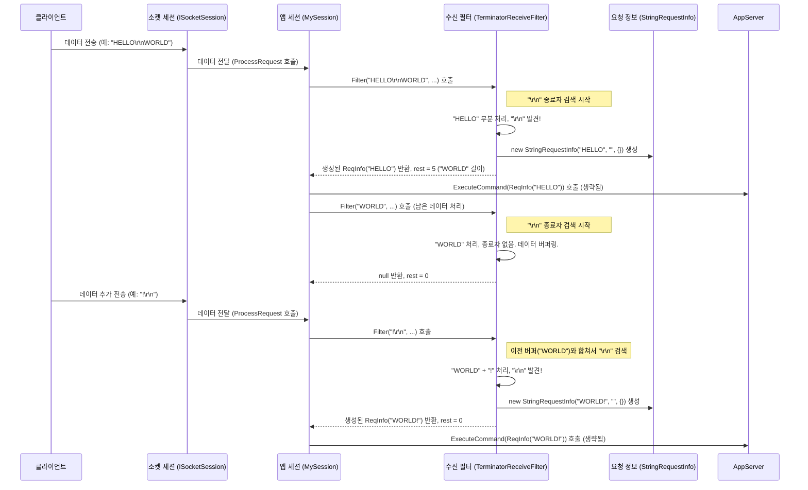

# Chapter 4: 수신 필터 (IReceiveFilter / ReceiveFilterBase)

이전 [요청 정보 (IRequestInfo / RequestInfo)](03_요청_정보__irequestinfo___requestinfo__.md) 장에서는 클라이언트가 보낸 데이터를 서버가 이해하기 쉬운 '주문서' 형태로 가공한 결과물에 대해 배웠습니다. 이 '주문서'(`IRequestInfo`)는 서버 로직에서 사용하기 매우 편리하지만, 한 가지 질문이 남습니다: 과연 누가, 그리고 어떻게 클라이언트로부터 날아온 연속적인 바이트 덩어리를 이렇게 깔끔한 '주문서'로 변환하는 걸까요?

바로 이 중요한 역할을 하는 마법사가 **수신 필터 (IReceiveFilter / ReceiveFilterBase)** 입니다.

## 수신 필터는 왜 필요할까요? 외국 손님의 말을 알아듣는 번역가!

다시 레스토랑 비유로 돌아가 봅시다. 외국인 손님이 알 수 없는 언어로 길게 무언가를 이야기합니다 ("Blah blah blah END"). 웨이터([앱세션 (AppSession)](02_앱세션__appsession__.md))는 이 말을 바로 알아들을 수 없습니다. 이때, 손님의 언어(프로토콜)를 이해하고, 그 말 속에서 의미 있는 주문("Blah blah blah")을 찾아내어 "END"라는 말이 나오면 주문이 끝났음을 알고 깔끔한 주문서([요청 정보 (IRequestInfo / RequestInfo)](03_요청_정보__irequestinfo___requestinfo__.md))로 만들어주는 '번역가'가 필요합니다.

네트워크 통신에서도 마찬가지입니다. 클라이언트는 서버에게 단순히 연속된 바이트 데이터(0과 1의 나열)를 보냅니다. 이 데이터는 TCP/IP 네트워크의 특성상 한 번에 다 도착하지 않을 수도 있고, 여러 메시지가 붙어서 올 수도 있습니다. 서버는 이 뒤죽박죽 섞인 바이트 스트림 속에서 의미 있는 메시지 단위를 정확히 구분해내야 합니다. 예를 들어, 메시지 끝을 알리는 특정 문자(종료자, 예를 들어 줄바꿈 문자)를 찾거나, 메시지 시작 부분에 포함된 '길이 정보'만큼 데이터를 읽는 등의 규칙을 따라야 합니다.

**수신 필터 (IReceiveFilter)** 는 바로 이 '번역가' 역할을 합니다.

*   **데이터 분리**: 연속적인 바이트 스트림에서 개별 메시지(요청)의 시작과 끝을 식별합니다.
*   **프로토콜 해석**: 클라이언트와 서버 간에 미리 약속된 통신 규칙(프로토콜)에 따라 데이터를 해석합니다.
*   **요청 정보 생성**: 해석된 데이터를 바탕으로 서버가 이해할 수 있는 구조화된 [요청 정보 (IRequestInfo / RequestInfo)](03_요청_정보__irequestinfo___requestinfo__.md) 객체를 생성합니다.

수신 필터는 SuperSocketLite 서버가 다양한 클라이언트 및 통신 방식과 상호작용할 수 있도록 하는 핵심적인 유연성을 제공합니다.

## 핵심 개념: 수신 필터 파헤치기

SuperSocketLite에서 수신 필터는 주로 다음 인터페이스와 클래스를 중심으로 구현됩니다.

1.  **`IReceiveFilter<TRequestInfo>` 인터페이스**: 모든 수신 필터가 구현해야 하는 핵심 인터페이스입니다. 여기서 `TRequestInfo`는 필터가 최종적으로 만들어낼 [요청 정보 (IRequestInfo / RequestInfo)](03_요청_정보__irequestinfo___requestinfo__.md)의 타입을 지정합니다.
    *   **`Filter(byte[] readBuffer, int offset, int length, bool toBeCopied, out int rest)` 메서드**: 수신 필터의 심장과 같은 메서드입니다. 소켓으로부터 새로 도착한 데이터(`readBuffer`, `offset`, `length`)를 받아, 정의된 프로토콜 규칙에 따라 해석합니다. 완전한 요청 하나를 성공적으로 찾아내면 해당 `TRequestInfo` 객체를 반환하고, 아직 요청이 완성되지 않았거나 오류가 발생하면 `null` (또는 `default(TRequestInfo)`)을 반환합니다. `rest` 매개변수에는 처리되지 않고 남은 데이터의 길이를 반환합니다.
    *   **`LeftBufferSize` (int)**: 현재 필터 내부에 임시로 저장(버퍼링)되어 있는 데이터의 크기를 나타냅니다. 메시지가 여러 조각으로 나뉘어 도착했을 때, 이전 조각을 기억하기 위해 사용됩니다.
    *   **`NextReceiveFilter` (IReceiveFilter<TRequestInfo>)**: (고급 기능) 하나의 필터가 작업을 마친 후 다음 단계 처리를 위해 다른 필터로 전환할 수 있게 합니다.
    *   **`Reset()` 메서드**: 필터의 내부 상태를 초기화합니다. 하나의 요청 처리가 완료된 후 다음 요청을 받기 위해 준비하거나, 연결이 초기화될 때 호출됩니다.
    *   **`State` (FilterState)**: 현재 필터의 상태 (예: 정상, 오류)를 나타냅니다.

2.  **`ReceiveFilterBase<TRequestInfo>` 추상 클래스**: `IReceiveFilter<TRequestInfo>` 인터페이스를 구현하는 편리한 추상 기본 클래스입니다. 많은 수신 필터들이 공통적으로 필요로 하는 기능을 미리 구현해 놓았습니다.
    *   **`BufferSegments` (ArraySegmentList)**: 여러 조각으로 나뉘어 도착하는 데이터를 효율적으로 관리하기 위한 내부 버퍼입니다. 개발자는 이 버퍼를 직접 다루기보다 `AddArraySegment`, `ClearBufferSegments` 같은 헬퍼 메서드를 사용하는 것이 일반적입니다.
    *   **기본 `Reset()` 구현**: `BufferSegments`를 비우는 기본적인 리셋 로직을 제공합니다.
    *   대부분의 경우, 직접 `IReceiveFilter` 인터페이스를 구현하기보다는 `ReceiveFilterBase`를 상속받아 필요한 부분(`Filter` 메서드 등)만 구현하는 것이 더 쉽습니다.

3.  **다양한 내장 필터 구현**: SuperSocketLite는 일반적인 통신 프로토콜을 위한 몇 가지 수신 필터를 미리 제공합니다.
    *   **`TerminatorReceiveFilter`**: 메시지 끝을 특정 바이트 배열(종료자, 예: "\r\n")로 구분하는 프로토콜을 위한 필터입니다. 채팅이나 간단한 텍스트 기반 프로토콜에 많이 사용됩니다. `TerminatorReceiveFilter : TerminatorReceiveFilter<StringRequestInfo>`는 텍스트 기반의 종료자 프로토콜을 처리하여 `StringRequestInfo`를 생성하는 구체적인 구현입니다.
    *   **`BeginEndMarkReceiveFilter`**: 메시지가 특정 시작 표시와 끝 표시로 감싸진 프로토콜을 위한 필터입니다. (예: `<START>데이터<END>`)
    *   **`FixedHeaderReceiveFilter`**: 메시지 앞에 고정된 길이의 헤더가 오고, 그 헤더 안에 실제 데이터(Body)의 길이가 명시된 프로토콜을 위한 필터입니다. 많은 바이너리 프로토콜이 이 방식을 사용합니다.
    *   **`FixedSizeReceiveFilter`**: 모든 메시지가 항상 동일한 고정된 길이인 프로토콜을 위한 필터입니다.
    *   **`CountSpliterReceiveFilter`**: 메시지가 특정 구분자(Spliter)로 정해진 횟수만큼 나뉘는 프로토콜을 위한 필터입니다. (예: `#데이터1#데이터2#데이터3#`)
    *   **`CommandLineReceiveFilter`**: (별도 패키지에 있을 수 있음) 공백으로 구분된 텍스트 명령(예: "LOGIN user pass")을 처리하는 필터입니다. `StringRequestInfo`를 생성합니다. 이전 장의 예제에서 사용된 `StringRequestInfo`는 내부적으로 이와 유사한 필터 또는 `TerminatorReceiveFilter`와 조합되어 사용될 수 있습니다.

개발자는 이러한 내장 필터를 사용하거나, `ReceiveFilterBase`를 상속받아 자신만의 통신 프로토콜 규칙에 맞는 커스텀 수신 필터를 만들 수 있습니다.

## 수신 필터 사용해보기: 줄바꿈으로 메시지 구분하기

이전 장들의 에코 서버 예제는 클라이언트가 보낸 한 줄의 텍스트 전체를 하나의 메시지로 간주했습니다(암묵적으로 `CommandLineReceiveFilter`와 유사한 동작 또는 기본 `TerminatorReceiveFilter`가 사용되었을 수 있습니다). 이번에는 클라이언트가 메시지를 보낼 때마다 **줄바꿈("\r\n")** 을 기준으로 메시지를 구분하도록 명시적으로 `TerminatorReceiveFilter`를 사용해 보겠습니다.

**1. 수신 필터 선택 (내장 필터 사용)**

우리는 줄바꿈(`\r\n`)을 메시지 종료자로 사용하는 프로토콜을 원하므로, SuperSocketLite에 내장된 `TerminatorReceiveFilter`를 사용할 수 있습니다. 특히, 텍스트 데이터를 처리하여 `StringRequestInfo`를 만들어주는 구체적인 클래스를 사용합니다.

```csharp
using System.Text;
using SuperSocketLite.SocketBase.Protocol; // TerminatorReceiveFilter 사용 위해 필요

// 줄바꿈("\r\n")을 종료자로 사용하고, UTF-8 인코딩을 사용하는 TerminatorReceiveFilter 인스턴스 생성
// 실제로는 AppServer 설정 시 FilterFactory를 통해 생성됩니다.
// 여기서는 개념 설명을 위한 예시입니다.
var utf8NewlineFilter = new TerminatorReceiveFilter(Encoding.UTF8.GetBytes("\r\n"), Encoding.UTF8);
```

**2. 서버 설정 시 수신 필터 팩토리 지정**

`AppServer`는 클라이언트 연결이 새로 생성될 때마다 해당 세션을 위한 `IReceiveFilter` 인스턴스를 필요로 합니다. 이 인스턴스를 어떻게 생성할지는 `ReceiveFilterFactory`를 통해 지정합니다. 여기서는 간단하게 `TerminatorReceiveFilter`를 생성하는 팩토리를 만들어 사용합니다.

먼저, `IReceiveFilterFactory`를 구현하는 클래스를 만듭니다.

```csharp
using SuperSocketLite.SocketBase;
using SuperSocketLite.SocketBase.Protocol;
using System.Net;
using System.Text;

// TerminatorReceiveFilter를 생성하는 팩토리 클래스
public class MyTerminatorFilterFactory : IReceiveFilterFactory<StringRequestInfo>
{
    private readonly Encoding _encoding;
    private readonly byte[] _terminator;

    public MyTerminatorFilterFactory() : this(Encoding.UTF8, "\r\n") // 기본값: UTF8, 줄바꿈
    { }

    public MyTerminatorFilterFactory(Encoding encoding, string terminator)
    {
        _encoding = encoding;
        _terminator = encoding.GetBytes(terminator);
    }

    // AppServer가 새 세션에 대한 필터를 요청할 때 이 메서드를 호출합니다.
    public IReceiveFilter<StringRequestInfo> CreateFilter(IAppServer appServer, IAppSession appSession, IPEndPoint remoteEndPoint)
    {
        // 각 세션마다 새로운 필터 인스턴스를 생성하여 반환합니다.
        return new TerminatorReceiveFilter(_terminator, _encoding);
    }
}
```

이제 `AppServer`를 설정할 때 이 팩토리를 사용하도록 알려줍니다.

```csharp
using SuperSocketLite.SocketBase;
using SuperSocketLite.SocketBase.Config;
using System;
// MySession, MyTerminatorFilterFactory 클래스 정의는 위에 있다고 가정

class Program
{
    static void Main(string[] args)
    {
        // 1. AppServer 인스턴스 생성 (MySession과 StringRequestInfo 사용)
        var appServer = new AppServer<MySession, StringRequestInfo>();

        // 2. 서버 설정 구성
        var serverConfig = new ServerConfig
        {
            Port = 2024,
            Ip = "Any",
            MaxConnectionNumber = 100,
            Name = "MyTerminatorEchoServer"
        };

        // 3. 서버 설정 및 시작 준비
        // 중요: Setup 메서드 호출 시 ReceiveFilterFactory 인스턴스를 전달합니다.
        if (!appServer.Setup(serverConfig, receiveFilterFactory: new MyTerminatorFilterFactory()))
        {
            Console.WriteLine("서버 설정 실패!");
            return;
        }

        // ... (이벤트 핸들러 등록 등은 이전과 동일) ...

        Console.WriteLine("서버 설정 완료. 이제 줄바꿈(\\r\\n) 기준으로 메시지를 처리합니다.");

        // 4. 서버 시작
        if (!appServer.Start())
        {
            Console.WriteLine("서버 시작 실패!");
            return;
        }

        Console.WriteLine("서버가 시작되었습니다. 종료하려면 엔터키를 누르세요...");
        Console.ReadLine();

        // 5. 서버 종료
        appServer.Stop();
        Console.WriteLine("서버가 종료되었습니다.");
    }
}
```

**코드 설명:**

1.  `MyTerminatorFilterFactory`: `IReceiveFilterFactory<StringRequestInfo>` 인터페이스를 구현합니다. `CreateFilter` 메서드는 `AppServer`가 요구할 때마다 지정된 종료자(`\r\n`)와 인코딩(UTF-8)을 사용하는 `TerminatorReceiveFilter`의 새 인스턴스를 생성하여 반환합니다.
2.  `appServer.Setup(serverConfig, receiveFilterFactory: new MyTerminatorFilterFactory())`: `AppServer`를 설정하는 `Setup` 메서드를 호출할 때, `receiveFilterFactory` 매개변수에 우리가 만든 팩토리 인스턴스를 전달합니다. 이렇게 하면 `AppServer`는 앞으로 새로운 클라이언트 연결([앱세션 (AppSession)](02_앱세션__appsession__.md))이 생성될 때마다 이 팩토리를 사용하여 `TerminatorReceiveFilter`를 만들어 해당 세션에 연결합니다.

**실행 결과 예상:**

이제 서버는 클라이언트가 보낸 데이터 스트림에서 `\r\n` (CRLF, 줄바꿈)을 만날 때마다 하나의 메시지가 끝났다고 판단하고, 그 앞까지의 내용을 `StringRequestInfo`로 만들어 `MySession`의 `HandleUnknownRequest` (또는 해당 Key를 처리하는 명령 핸들러)로 전달합니다.

*   **클라이언트 (telnet):**
    *   `Hello` 입력 후 Enter (`\r\n` 전송됨)
    *   서버 응답: `'Hello' 라고 하셨네요! (키: Hello)` (만약 `Hello`라는 명령이 없다면)
    *   `World` 입력 후 Enter (`\r\n` 전송됨)
    *   서버 응답: `'World' 라고 하셨네요! (키: World)` (만약 `World`라는 명령이 없다면)
    *   `Test Message` 입력 후 Enter (`\r\n` 전송됨)
    *   서버 응답: `'Message' 라고 하셨네요! (키: Test)` (`Test`가 Key, `Message`가 Body의 첫 파라미터가 됨)

*   **서버 콘솔:** (클라이언트가 위와 같이 입력했을 때)
    *   `[세션ID] 받은 요청 키(Key): Hello`
    *   `[세션ID] 받은 요청 본문(Body):` (Body 없음)
    *   `[세션ID] 파라미터 없음.`
    *   `[세션ID] 받은 요청 키(Key): World`
    *   `[세션ID] 받은 요청 본문(Body):` (Body 없음)
    *   `[세션ID] 파라미터 없음.`
    *   `[세션ID] 받은 요청 키(Key): Test`
    *   `[세션ID] 받은 요청 본문(Body): Message`
    *   `[세션ID] 받은 파라미터들: Message`

이제 서버는 명확하게 줄바꿈을 기준으로 메시지를 해석하게 됩니다.

## 내부 동작 들여다보기: 수신 필터는 어떻게 데이터를 처리할까?

클라이언트로부터 데이터가 도착했을 때, `AppSession`과 `IReceiveFilter`가 어떻게 상호작용하여 `IRequestInfo`를 만들어내는지 내부 흐름을 자세히 살펴보겠습니다.

1.  **데이터 수신**: [소켓 세션 (ISocketSession / SocketSession / ...)](06_소켓_세션__isocketsession___socketsession___asyncsocketsession___udpsocketsession__.md)이 네트워크로부터 바이트 데이터를 수신합니다.
2.  **AppSession으로 전달**: 수신된 데이터는 해당 클라이언트 연결을 담당하는 [앱세션 (AppSession)](02_앱세션__appsession__.md)의 내부 메서드(예: `ProcessRequest`)로 전달됩니다.
3.  **Filter 메서드 호출**: `AppSession`은 자신이 가지고 있는 `IReceiveFilter` 인스턴스 (이 예제에서는 `TerminatorReceiveFilter` 인스턴스)의 `Filter` 메서드를 호출하며, 수신된 데이터(바이트 배열, 시작 위치, 길이)를 넘겨줍니다.
4.  **데이터 처리 및 버퍼링**: `Filter` 메서드는 넘겨받은 데이터를 검사합니다.
    *   이전에 처리하다 남은 데이터가 있다면(`LeftBufferSize` > 0 또는 `ReceiveFilterBase`의 `BufferSegments` 사용), 새로 도착한 데이터를 이전 데이터 뒤에 덧붙여서 함께 처리합니다. (`TerminatorReceiveFilter`는 내부적으로 `SearchMarkState`를 사용하여 종료자 패턴을 검색합니다.)
    *   데이터 속에서 정의된 프로토콜 규칙(여기서는 `\r\n` 종료자 검색)을 만족하는 완전한 메시지 단위를 찾습니다.
5.  **요청 정보 생성 또는 대기**:
    *   **완전한 메시지 발견**: 만약 `\r\n` 종료자를 찾았다면, 종료자 앞까지의 데이터를 사용하여 `StringRequestInfo` 객체를 생성합니다. (`Key`, `Body`, `Parameters` 등을 설정합니다.) 생성된 `StringRequestInfo` 객체를 반환하고, 내부 상태(`SearchState`, `BufferSegments` 등)를 리셋하여 다음 메시지를 받을 준비를 합니다. 처리하고 남은 데이터가 있다면 `rest` 값으로 알려줍니다.
    *   **불완전한 메시지**: 아직 `\r\n` 종료자를 찾지 못했다면, 현재까지 받은 데이터를 내부 버퍼(`BufferSegments` 또는 임시 저장 공간)에 저장하고 `null` (또는 `default`)을 반환합니다. `rest`는 0이 됩니다. 다음번에 데이터가 더 도착하면 이어서 처리합니다.
    *   **오류 발생**: 프로토콜 규칙에 맞지 않는 데이터가 감지되면 (예: 너무 긴 메시지, 잘못된 형식), 필터의 상태(`State`)를 `FilterState.Error`로 설정하고 `null`을 반환할 수 있습니다.
6.  **AppSession의 후속 처리**: `AppSession`은 `Filter` 메서드의 반환값을 확인합니다.
    *   `IRequestInfo` 객체가 반환되면, 이 객체를 사용하여 [앱서버 (AppServer / AppServerBase)](01_앱서버__appserver___appserverbase__.md)의 명령 실행 로직(`ExecuteCommand`)을 호출하거나, 적절한 명령이 없을 경우 `HandleUnknownRequest` 등을 호출합니다.
    *   `null`이 반환되면, 아직 완전한 메시지가 도착하지 않았으므로 다음 데이터 수신을 기다립니다.

**데이터 처리 흐름 다이어그램 (TerminatorReceiveFilter 예시):**



**코드 레벨에서 살펴보기:**

*   **`ReceiveFilterBase<TRequestInfo>` (`SocketBase/Protocol/ReceiveFilterBase.cs`)**:
    데이터 조각들을 모으는 `BufferSegments`를 제공합니다.

    ```csharp
    // File: SocketBase/Protocol/ReceiveFilterBase.cs
    public abstract class ReceiveFilterBase<TRequestInfo> : IReceiveFilter<TRequestInfo>
        where TRequestInfo : IRequestInfo
    {
        private ArraySegmentList m_BufferSegments; // 데이터 조각들을 저장하는 리스트

        protected ArraySegmentList BufferSegments { get { return m_BufferSegments; } }

        // 생성자에서 BufferSegments 초기화
        protected ReceiveFilterBase() { m_BufferSegments = new ArraySegmentList(); }

        // 버퍼에 데이터 조각 추가 (내부적으로 효율적인 메모리 관리)
        protected void AddArraySegment(byte[] buffer, int offset, int length, bool toBeCopied)
        {
            m_BufferSegments.AddSegment(buffer, offset, length, toBeCopied);
        }

        // 버퍼 비우기
        protected void ClearBufferSegments() { m_BufferSegments.ClearSegements(); }

        // 리셋 시 버퍼 비우기
        public virtual void Reset()
        {
            if(m_BufferSegments != null && m_BufferSegments.Count > 0)
                m_BufferSegments.ClearSegements();
        }

        // Filter 메서드는 추상 메서드로, 상속받는 클래스가 구현해야 함
        public abstract TRequestInfo Filter(byte[] readBuffer, int offset, int length, bool toBeCopied, out int rest);

        // ... 기타 속성 및 메서드 ...
    }
    ```
    `ReceiveFilterBase`는 필터 구현에 필요한 기본적인 도구 상자(특히 데이터 조각 관리)를 제공하여 개발을 더 쉽게 만듭니다.

*   **`TerminatorReceiveFilter<TRequestInfo>` (`SocketBase/Protocol/TerminatorReceiveFilter.cs`)**:
    `ReceiveFilterBase`를 상속받아 특정 종료자(Terminator)를 찾는 로직을 구현합니다.

    ```csharp
    // File: SocketBase/Protocol/TerminatorReceiveFilter.cs (간략화된 개념)
    public abstract class TerminatorReceiveFilter<TRequestInfo> : ReceiveFilterBase<TRequestInfo>, IOffsetAdapter
        where TRequestInfo : IRequestInfo
    {
        private readonly SearchMarkState<byte> m_SearchState; // 종료자 패턴 검색 상태 관리 객체
        // ... 기타 필드 ...

        protected TerminatorReceiveFilter(byte[] terminator)
        {
            m_SearchState = new SearchMarkState<byte>(terminator); // 찾을 종료자 패턴 설정
        }

        public override TRequestInfo Filter(byte[] readBuffer, int offset, int length, bool toBeCopied, out int rest)
        {
            rest = 0;
            // 1. 현재 버퍼 + 새로 들어온 데이터에서 종료자(m_SearchState.Mark)를 검색
            int result = readBuffer.SearchMark(offset, length, m_SearchState); // SearchMark는 패턴을 찾는 헬퍼 메서드

            if (result < 0) // 종료자를 찾지 못함
            {
                // 2. 데이터를 내부 버퍼(BufferSegments 또는 임시 공간)에 저장하고 null 반환
                //    (실제 코드는 버퍼 관리 로직이 더 복잡함)
                AddArraySegment(readBuffer, offset, length, toBeCopied); // 간단화된 예시
                rest = 0;
                return default(TRequestInfo); // 또는 NullRequestInfo
            }

            // 3. 종료자를 찾음!
            var findLen = result - offset; // 종료자 직전까지의 길이
            var currentMatched = m_SearchState.Mark.Length; // 종료자 자체의 길이

            // 4. 종료자 앞부분까지의 데이터로 TRequestInfo 생성 (ProcessMatchedRequest 호출)
            TRequestInfo requestInfo;
            if (LeftBufferSize > 0) // 이전에 저장된 데이터가 있다면 함께 처리
            {
                AddArraySegment(readBuffer, offset, findLen, true); // 새로 찾은 부분 추가
                requestInfo = ProcessMatchedRequest(BufferSegments.ToArrayData(0, BufferSegments.Count), 0, BufferSegments.Count);
            }
            else // 이전 데이터 없이 이번 데이터만으로 완성
            {
                requestInfo = ProcessMatchedRequest(readBuffer, offset, findLen);
            }

            // 5. 처리하고 남은 데이터 길이 계산
            rest = length - findLen - currentMatched;

            // 6. 내부 상태 초기화 (다음 메시지 준비)
            InternalReset(); // m_SearchState.Matched = 0; BufferSegments.Clear(); 등

            return requestInfo;
        }

        // 실제 요청 정보를 생성하는 추상 메서드 (상속 클래스가 구현)
        protected abstract TRequestInfo ProcessMatchedRequest(byte[] data, int offset, int length);

        // 내부 상태 리셋 헬퍼
        private void InternalReset()
        {
            m_SearchState.Matched = 0;
            base.Reset(); // BufferSegments 클리어 포함
        }
        // ... 기타 메서드 ...
    }
    ```
    `TerminatorReceiveFilter`의 `Filter` 메서드는 종료자를 효율적으로 검색하고, 데이터가 여러 번에 나뉘어 들어오더라도 이를 올바르게 조합하여 완전한 메시지를 찾아내는 로직을 담고 있습니다. `ProcessMatchedRequest`는 찾아낸 데이터 조각을 실제 `TRequestInfo` 객체로 변환하는 역할을 합니다 (예: 텍스트 인코딩 적용, Key/Body 파싱 등).

## 결론

이번 장에서는 클라이언트로부터 들어오는 원시 바이트 스트림을 서버가 이해할 수 있는 의미 있는 [요청 정보 (IRequestInfo / RequestInfo)](03_요청_정보__irequestinfo___requestinfo__.md) 객체로 변환하는 중요한 역할, 즉 '번역가' 역할을 수행하는 **수신 필터 (IReceiveFilter / ReceiveFilterBase)** 에 대해 배웠습니다.

수신 필터는 클라이언트와 서버 간의 통신 규칙(프로토콜)을 정의하고 구현하는 핵심 요소입니다. `IReceiveFilter` 인터페이스와 `ReceiveFilterBase` 추상 클래스를 기반으로 하며, 메시지 종료자, 고정 길이, 헤더 기반 길이 등 다양한 프로토콜을 처리할 수 있는 내장 필터들을 제공합니다. 또한, `ReceiveFilterBase`를 상속하여 사용자 정의 프로토콜을 위한 필터를 직접 만들 수도 있습니다.

`TerminatorReceiveFilter`를 사용하여 줄바꿈 문자를 기준으로 메시지를 처리하도록 서버를 설정하는 구체적인 예제를 통해 수신 필터의 사용법과 내부 동작 원리를 살펴보았습니다. 수신 필터가 어떻게 데이터 조각을 관리하고(버퍼링), 프로토콜 규칙에 따라 완전한 메시지를 식별하며, 최종적으로 `IRequestInfo` 객체를 생성하는지 이해했습니다.

이제 우리는 클라이언트 연결 관리([앱세션 (AppSession)](02_앱세션__appsession__.md)), 요청 내용 표현([요청 정보 (IRequestInfo / RequestInfo)](03_요청_정보__irequestinfo___requestinfo__.md)), 그리고 데이터 해석 규칙([수신 필터 (IReceiveFilter / ReceiveFilterBase)](04_수신_필터__ireceivefilter___receivefilterbase__.md))까지 서버의 핵심 처리 흐름을 이해했습니다.

다음 장에서는 이 모든 것의 기반이 되는, 실제 네트워크 연결을 받아들이고 저수준 통신을 관리하는 구성 요소인 [소켓 서버 (ISocketServer / SocketServerBase / ...)](05_소켓_서버__isocketserver___socketserverbase___asyncsocketserver___udpsocketserver__.md)에 대해 더 깊이 알아볼 것입니다. 서버가 어떻게 네트워크 요청을 '듣고' 있는지 그 근본 원리를 탐구해 봅시다.

---

Generated by [AI Codebase Knowledge Builder](https://github.com/The-Pocket/Tutorial-Codebase-Knowledge)