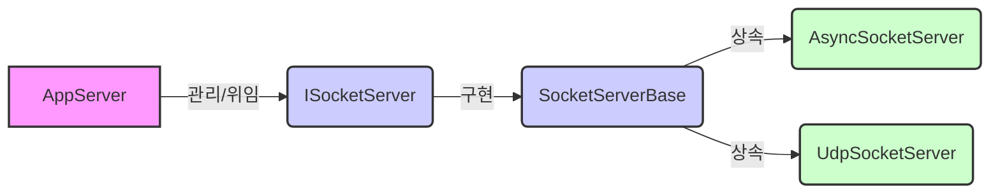
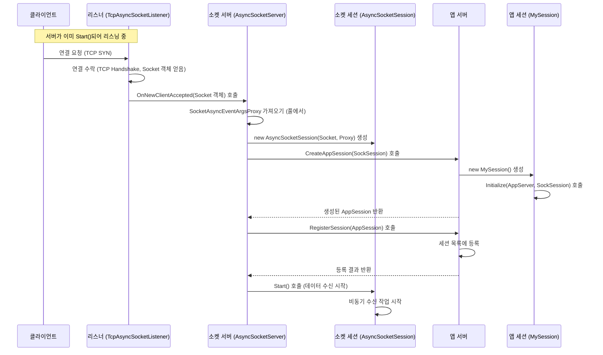

# Chapter 5: 소켓 서버 (ISocketServer / SocketServerBase / AsyncSocketServer / UdpSocketServer)

이전 [수신 필터 (IReceiveFilter / ReceiveFilterBase)](04_수신_필터__ireceivefilter___receivefilterbase__.md) 장에서는 클라이언트가 보낸 원시 데이터를 서버가 이해할 수 있는 '주문서'([요청 정보 (IRequestInfo / RequestInfo)](03_요청_정보__irequestinfo___requestinfo__.md))로 변환하는 '번역가'에 대해 배웠습니다. 번역가는 클라이언트의 말을 알아듣는 중요한 역할을 하지만, 애초에 클라이언트가 레스토랑(서버)에 들어올 수 있도록 문을 열어주고, 주방에서 실제 요리(네트워크 통신 처리)를 담당하는 사람은 누구일까요?

바로 이 핵심적인 '주방장' 또는 '엔진실 기술 책임자' 역할을 하는 것이 **소켓 서버 (ISocketServer / SocketServerBase / ...)** 입니다.

## 소켓 서버는 왜 필요할까요? 보이지 않는 곳의 핵심 엔진!

우리가 만든 [앱서버 (AppServer / AppServerBase)](01_앱서버__appserver___appserverbase__.md)가 레스토랑의 총괄 매니저라면, 소켓 서버는 레스토랑의 **주방**과 같습니다. 손님(클라이언트)이 레스토랑에 들어오는 과정 자체(네트워크 포트 열기, 연결 요청 수락)와 주방 내부의 복잡한 조리 과정(저수준 데이터 송수신)을 실제로 담당하는 곳입니다.

[앱서버 (AppServer / AppServerBase)](01_앱서버__appserver___appserverbase__.md)는 서버 운영의 전반적인 관리(설정, 세션 관리 등)를 책임지지만, 다음과 같은 실제 네트워크 작업은 소켓 서버에게 위임합니다.

*   **네트워크 포트 열기**: 특정 IP 주소와 포트 번호에서 클라이언트의 연결 요청을 기다리기 위해 실제로 네트워크 '문'을 엽니다 (리스닝 시작).
*   **연결 수락**: 클라이언트가 연결을 시도하면 이를 받아들입니다.
*   **통신 방식 결정**: TCP를 사용할지 UDP를 사용할지 결정하고 그에 맞는 방식으로 동작합니다.
*   **저수준 데이터 처리**: 실제로 네트워크를 통해 바이트 데이터를 주고받는 가장 기본적인 작업을 수행합니다.
*   **비동기 작업 관리**: 많은 클라이언트 연결을 효율적으로 처리하기 위해 비동기적인 소켓 작업을 관리합니다.

즉, 소켓 서버는 [앱서버 (AppServer / AppServerBase)](01_앱서버__appserver___appserverbase__.md) 뒤에서 묵묵히 **핵심 네트워크 통신 엔진 역할**을 수행하는 구성 요소입니다. 개발자는 대부분의 경우 [앱서버 (AppServer / AppServerBase)](01_앱서버__appserver___appserverbase__.md)를 통해 서버를 제어하므로 소켓 서버를 직접 다룰 일은 적지만, SuperSocketLite가 어떻게 네트워크 통신을 처리하는지 이해하는 데 중요한 개념입니다.

## 핵심 개념: 소켓 서버 파헤치기

SuperSocketLite에서 소켓 서버와 관련된 주요 인터페이스 및 클래스는 다음과 같습니다.

1.  **`ISocketServer` 인터페이스**: 모든 종류의 소켓 서버가 구현해야 하는 가장 기본적인 계약입니다. 서버를 시작하고(`Start()`) 중지하는(`Stop()`) 기능, 실행 상태 확인(`IsRunning`), 세션 보안 설정 변경(`ResetSessionSecurity`) 등의 핵심 기능을 정의합니다.
    *   *파일 위치: `SocketBase/ISocketServer.cs`*

2.  **`SocketServerBase` 추상 클래스**: `ISocketServer`를 구현하는 기본적인 뼈대 클래스입니다. TCP와 UDP 서버가 공통적으로 사용하는 기능들, 예를 들어 리스너 관리(어떤 주소와 포트에서 들을지 관리), 시작/중지 로직의 기본 틀 등을 제공합니다. 직접 사용하기보다는 `AsyncSocketServer`나 `UdpSocketServer`의 부모 클래스로 사용됩니다.
    *   *파일 위치: `SocketEngine/SocketServerBase.cs`*

3.  **`AsyncSocketServer` 클래스**: **TCP** 통신을 위한 구체적인 소켓 서버 구현체입니다. `.NET`의 비동기 소켓 API (`SocketAsyncEventArgs`)를 사용하여 많은 수의 동시 클라이언트 연결을 효율적으로 처리합니다. 대부분의 TCP 기반 서버(채팅, 게임 서버 등)는 내부적으로 이 클래스를 사용합니다. `SocketServerBase`를 상속받습니다.
    *   *파일 위치: `SocketEngine/AsyncSocketServer.cs`*

4.  **`UdpSocketServer` 클래스**: **UDP** 통신을 위한 구체적인 소켓 서버 구현체입니다. UDP는 TCP와 달리 연결 설정 과정이 없고 메시지 순서나 도착을 보장하지 않는 특징이 있습니다. 실시간 스트리밍이나 일부 게임 데이터 전송에 사용될 수 있습니다. `SocketServerBase`를 상속받습니다.
    *   *파일 위치: `SocketEngine/UdpSocketServer.cs`*

**관계 요약:**

*   [앱서버 (AppServer / AppServerBase)](01_앱서버__appserver___appserverbase__.md)는 자신이 어떤 통신 방식(TCP 또는 UDP)으로 동작해야 하는지에 따라 적절한 `ISocketServer` 구현체(`AsyncSocketServer` 또는 `UdpSocketServer`)를 내부적으로 생성하고 관리합니다.
*   개발자는 주로 [앱서버 (AppServer / AppServerBase)](01_앱서버__appserver___appserverbase__.md)의 `Start()`와 `Stop()` 메서드를 호출하지만, 실제 네트워크 작업의 시작과 중지는 내부적으로 `ISocketServer`의 `Start()`와 `Stop()` 메서드를 통해 이루어집니다.



## 소켓 서버 사용하기 (앱서버를 통해 간접적으로)

일반적으로 개발자가 `AsyncSocketServer`나 `UdpSocketServer`를 직접 생성하거나 호출할 필요는 없습니다. [앱서버 (AppServer / AppServerBase)](01_앱서버__appserver___appserverbase__.md)를 설정하고 시작할 때, 서버 설정(`IServerConfig`)에 따라 자동으로 적절한 소켓 서버가 선택되고 사용됩니다.

```csharp
using SuperSocketLite.SocketBase;
using SuperSocketLite.SocketBase.Config; // IServerConfig 사용 위해 필요

// ... MySession 클래스 정의 ...

class Program
{
    static void Main(string[] args)
    {
        var appServer = new AppServer<MySession, StringRequestInfo>();

        // 서버 설정 객체 생성
        var serverConfig = new ServerConfig
        {
            Port = 2024,
            Ip = "Any",
            MaxConnectionNumber = 100,
            Mode = SocketMode.Tcp // <--- 중요: 통신 모드 설정!
            // Mode = SocketMode.Udp 로 설정하면 UdpSocketServer가 사용됩니다.
        };

        // 서버 설정 적용 (내부적으로 SocketServerFactory를 통해 적절한 ISocketServer 생성)
        if (!appServer.Setup(serverConfig))
        {
            Console.WriteLine("서버 설정 실패!");
            return;
        }

        // 서버 시작 (AppServer.Start()가 내부적으로 ISocketServer.Start() 호출)
        if (!appServer.Start())
        {
            Console.WriteLine("서버 시작 실패!");
            return;
        }

        Console.WriteLine($"서버가 {serverConfig.Mode} 모드로 시작되었습니다.");
        // ... (서버 실행 및 종료 로직) ...
        appServer.Stop(); // AppServer.Stop()이 내부적으로 ISocketServer.Stop() 호출
    }
}
```

**코드 설명:**

1.  `Mode = SocketMode.Tcp`: `ServerConfig` 객체의 `Mode` 속성을 `SocketMode.Tcp`로 설정하면, `appServer.Setup()` 과정에서 내부적으로 `SocketServerFactory`가 `AsyncSocketServer`를 생성하여 [앱서버 (AppServer / AppServerBase)](01_앱서버__appserver___appserverbase__.md)에 연결합니다.
2.  `Mode = SocketMode.Udp`: 만약 이 값을 `SocketMode.Udp`로 변경하면, `UdpSocketServer`가 생성됩니다.
3.  `appServer.Start()` / `appServer.Stop()`: 개발자는 여전히 [앱서버 (AppServer / AppServerBase)](01_앱서버__appserver___appserverbase__.md)의 메서드를 호출하지만, 이 메서드들은 내부적으로 `ISocketServer`의 해당 메서드를 호출하여 실제 네트워크 리스닝을 시작하거나 중지합니다.

이처럼 소켓 서버는 [앱서버 (AppServer / AppServerBase)](01_앱서버__appserver___appserverbase__.md)라는 '매니저' 뒤에서 동작하는 '기술 전문가'이며, 개발자는 주로 매니저를 통해 서버를 제어합니다.

## 내부 동작 들여다보기: 소켓 서버는 어떻게 연결을 처리할까?

`AppServer.Start()`가 호출되고 클라이언트가 접속했을 때, 소켓 서버(`AsyncSocketServer` 기준)는 내부적으로 어떤 일을 할까요?

1.  **AppServer 시작**: 개발자가 `appServer.Start()`를 호출합니다.
2.  **SocketServer 시작 요청**: `AppServerBase`의 `Start()` 메서드는 내부적으로 가지고 있는 `ISocketServer` (예: `AsyncSocketServer` 인스턴스)의 `Start()` 메서드를 호출합니다.
3.  **리소스 준비 (AsyncSocketServer)**: `AsyncSocketServer.Start()`는 비동기 통신에 필요한 리소스(버퍼 관리자 `BufferManager`, `SocketAsyncEventArgs` 풀 `m_ReadWritePool`)를 초기화하고 준비합니다. 많은 연결을 효율적으로 처리하기 위해 미리 메모리 버퍼와 비동기 작업 객체들을 할당해 둡니다.
4.  **리스너 시작**: `SocketServerBase.Start()` (부모 클래스)는 설정된 각 [소켓 리스너 (ISocketListener / SocketListenerBase)](07_소켓_리스너__isocketlistener___socketlistenerbase__.md)에게 `Start()` 명령을 내려 실제 포트에서 클라이언트 연결 요청을 기다리기 시작합니다.
5.  **클라이언트 연결 시도**: 클라이언트가 서버의 IP 주소와 포트로 연결을 시도합니다.
6.  **리스너의 연결 수락**: [소켓 리스너 (ISocketListener / SocketListenerBase)](07_소켓_리스너__isocketlistener___socketlistenerbase__.md)는 들어오는 연결 요청을 감지하고 수락(Accept)하여 클라이언트와 연결된 `Socket` 객체를 얻습니다.
7.  **SocketServer에게 알림**: 리스너는 `NewClientAccepted` 이벤트를 발생시켜 `SocketServerBase`의 `OnNewClientAccepted` 메서드를 호출하고, 수락된 `Socket` 객체를 전달합니다.
8.  **새 클라이언트 처리 (AsyncSocketServer)**: `AsyncSocketServer.OnNewClientAccepted`는 전달받은 `Socket` 객체를 사용하여 다음 작업을 수행합니다.
    *   `SocketAsyncEventArgsProxy` 가져오기: 미리 준비된 풀(`m_ReadWritePool`)에서 비동기 작업을 위한 객체를 하나 꺼냅니다. 풀이 비어있으면 최대 연결 수에 도달한 것입니다.
    *   [소켓 세션 (ISocketSession / SocketSession / ...)](06_소켓_세션__isocketsession___socketsession___asyncsocketsession___udpsocketsession__.md) 생성: 꺼낸 `SocketAsyncEventArgsProxy`와 `Socket` 객체를 사용하여 저수준 통신을 담당할 `ISocketSession` 구현체(예: `AsyncSocketSession`)를 생성합니다. SSL/TLS가 설정되었다면 `AsyncStreamSocketSession`을 사용합니다.
    *   [앱세션 (AppSession)](02_앱세션__appsession__.md) 생성 요청: `AppServer.CreateAppSession(socketSession)`을 호출하여 이 클라이언트 연결을 위한 [앱세션 (AppSession)](02_앱세션__appsession__.md) 객체(예: `MySession`) 생성을 요청합니다.
    *   세션 등록: 생성된 [앱세션 (AppSession)](02_앱세션__appsession__.md)을 `AppServer`의 세션 목록에 등록합니다 (`AppServer.RegisterSession`).
    *   세션 시작: 생성된 `ISocketSession`의 `Start()` 메서드를 호출하여 실제 데이터 수신을 시작하도록 합니다.

**연결 수락 및 세션 생성 흐름 (TCP - AsyncSocketServer 기준):**



이 다이어그램은 클라이언트 연결이 어떻게 저수준(`Listener`, `SocketServer`, `SocketSession`)에서 고수준(`AppServer`, `AppSession`)으로 이어지며 처리되는지 보여줍니다. 소켓 서버는 이 과정에서 핵심적인 다리 역할을 수행합니다.

## 코드 레벨에서 살펴보기: 소켓 서버의 구조

주요 소스 코드 파일을 통해 소켓 서버 관련 클래스들의 구조를 간단히 살펴보겠습니다.

*   **`ISocketServer` 인터페이스 (`SocketBase/ISocketServer.cs`)**:
    소켓 서버의 기본 기능을 정의합니다.

    ```csharp
    // File: SocketBase/ISocketServer.cs
    namespace SuperSocketLite.SocketBase;

    public interface ISocketServer
    {
        // 서버 시작
        bool Start();

        // 세션 보안 프로토콜 재설정
        void ResetSessionSecurity(IAppSession session, SslProtocols security);

        // 서버 실행 여부 확인
        bool IsRunning { get; }

        // (Sending Queue Pool 정보는 이 레벨에서는 생략)

        // 서버 중지
        void Stop();
    }
    ```
    가장 기본적인 시작, 중지, 상태 확인 등의 계약을 정의합니다.

*   **`SocketServerBase.Start()` 메서드 (`SocketEngine/SocketServerBase.cs`)**:
    리스너들을 생성하고 시작하는 공통 로직을 보여줍니다.

    ```csharp
    // File: SocketEngine/SocketServerBase.cs
    abstract class SocketServerBase : ISocketServer, IDisposable
    {
        // ... (필드 정의) ...
        public virtual bool Start()
        {
            IsStopped = false;
            ILog log = AppServer.Logger;
            var config = AppServer.Config;
            // ... (SendingQueuePool 초기화 로직) ...

            // 설정된 각 리스너 정보에 대해 리스너 생성 및 시작
            for (var i = 0; i < ListenerInfos.Length; i++)
            {
                // 자식 클래스(AsyncSocketServer 등)가 구현한 CreateListener 호출
                var listener = CreateListener(ListenerInfos[i]);
                // 이벤트 핸들러 등록 (에러, 중지, 새 클라이언트 연결)
                listener.Error += new ErrorHandler(OnListenerError);
                listener.Stopped += new EventHandler(OnListenerStopped);
                listener.NewClientAccepted += new NewClientAcceptHandler(OnNewClientAccepted);

                // 리스너 시작
                if (listener.Start(AppServer.Config))
                {
                    Listeners.Add(listener); // 성공 시 리스너 목록에 추가
                }
                else // 하나라도 시작 실패하면 모두 중지하고 실패 반환
                {
                    // ... (실패 로깅 및 이미 시작된 리스너 중지 로직) ...
                    return false;
                }
            }

            IsRunning = true; // 모든 리스너 시작 성공
            return true;
        }

        // 새 클라이언트 연결 처리 메서드 (추상, 자식 클래스가 구현)
        protected abstract void OnNewClientAccepted(ISocketListener listener, Socket client, object state);

        // 리스너 생성 메서드 (추상, 자식 클래스가 구현)
        protected abstract ISocketListener CreateListener(ListenerInfo listenerInfo);
        // ... (Stop, Dispose 등) ...
    }
    ```
    `SocketServerBase`는 리스너들을 관리하고 시작/중지하는 공통적인 흐름을 제어합니다. 실제 리스너 생성(`CreateListener`)과 새 클라이언트 처리(`OnNewClientAccepted`) 방식은 TCP(`AsyncSocketServer`)와 UDP(`UdpSocketServer`)가 다르게 구현합니다.

*   **`AsyncSocketServer.OnNewClientAccepted()` 메서드 (`SocketEngine/AsyncSocketServer.cs`)**:
    TCP 연결 수락 후 세션을 생성하는 구체적인 로직을 보여줍니다.

    ```csharp
    // File: SocketEngine/AsyncSocketServer.cs
    class AsyncSocketServer : TcpSocketServerBase, IActiveConnector
    {
        // ... (필드 및 Start 메서드) ...

        protected override void OnNewClientAccepted(ISocketListener listener, Socket client, object state)
        {
            if (IsStopped) // 서버가 중지 중이면 처리하지 않음
                return;

            // 실제 새 클라이언트 처리 로직 호출
            ProcessNewClient(client, listener.Info.Security);
        }

        private IAppSession ProcessNewClient(Socket client, SslProtocols security)
        {
            // 1. 비동기 작업 객체 풀에서 SocketAsyncEventArgsProxy 가져오기
            SocketAsyncEventArgsProxy socketEventArgsProxy;
            if (!m_ReadWritePool.TryPop(out socketEventArgsProxy))
            {
                // 풀이 비었으면 최대 연결 도달, 클라이언트 소켓 닫기
                AppServer.AsyncRun(client.SafeClose);
                AppServer.Logger.Error($"최대 연결 수 {AppServer.Config.MaxConnectionNumber} 도달!");
                return null;
            }

            // 2. 저수준 소켓 세션(ISocketSession) 생성
            ISocketSession socketSession;
            if (security == SslProtocols.None) // SSL/TLS 사용 안 함
                socketSession = new AsyncSocketSession(client, socketEventArgsProxy);
            else // SSL/TLS 사용
                socketSession = new AsyncStreamSocketSession(client, security, socketEventArgsProxy);

            // 3. AppServer에게 AppSession 생성 요청 (AppServer.CreateAppSession 호출)
            var session = CreateSession(client, socketSession); // CreateSession은 내부적으로 AppServer.CreateAppSession 호출

            if (session == null) // AppSession 생성 실패 시
            {
                socketEventArgsProxy.Reset(); // 프록시 리셋
                this.m_ReadWritePool.Push(socketEventArgsProxy); // 프록시 풀에 반환
                AppServer.AsyncRun(client.SafeClose); // 소켓 닫기
                return null;
            }

            // 4. 소켓 세션 닫힘 이벤트 핸들러 등록 (자원 반환 목적)
            socketSession.Closed += SessionClosed;

            // 5. (SSL/TLS 협상 로직은 생략) ...

            // 6. AppServer에 세션 등록 및 소켓 세션 시작
            if (RegisterSession(session)) // RegisterSession은 AppServer.RegisterSession 호출
            {
                AppServer.AsyncRun(() => socketSession.Start()); // 비동기로 소켓 세션 시작
            }

            return session; // 생성된 AppSession 반환 (실제로는 ProcessNewClient는 IAppSession을 반환하지만 OnNewClientAccepted는 void)
        }
        // ... (SessionClosed, Stop 등) ...
    }
    ```
    `AsyncSocketServer`는 비동기 I/O 모델(`SocketAsyncEventArgs`)을 활용하여 효율적으로 클라이언트 연결을 받아들이고, 필요한 저수준 세션([`ISocketSession`](06_소켓_세션__isocketsession___socketsession___asyncsocketsession___udpsocketsession__.md))과 고수준 세션([`AppSession`](02_앱세션__appsession__.md)) 객체를 생성하며 이를 [앱서버 (AppServer / AppServerBase)](01_앱서버__appserver___appserverbase__.md)와 연결하는 복잡한 과정을 처리합니다.

*   **`SocketServerFactory.CreateSocketServer()` 메서드 (`SocketEngine/SocketServerFactory.cs`)**:
    서버 설정의 `Mode`에 따라 어떤 소켓 서버를 생성할지 결정합니다.

    ```csharp
    // File: SocketEngine/SocketServerFactory.cs
    namespace SuperSocketLite.SocketEngine;

    public class SocketServerFactory : ISocketServerFactory
    {
        public ISocketServer CreateSocketServer<TRequestInfo>(IAppServer appServer, ListenerInfo[] listeners, IServerConfig config)
            where TRequestInfo : IRequestInfo
        {
            // ... (null 체크) ...

            // 설정된 SocketMode에 따라 적절한 ISocketServer 구현체 반환
            switch(config.Mode)
            {
                case(SocketMode.Tcp):
                    return new AsyncSocketServer(appServer, listeners); // TCP 모드면 AsyncSocketServer
                case(SocketMode.Udp):
                    return new UdpSocketServer<TRequestInfo>(appServer, listeners); // UDP 모드면 UdpSocketServer
                default:
                    throw new NotSupportedException("지원되지 않는 SocketMode:" + config.Mode);
            }
        }
    }
    ```
    이 팩토리 클래스는 [앱서버 (AppServer / AppServerBase)](01_앱서버__appserver___appserverbase__.md)가 `Setup` 과정에서 내부적으로 사용하여, 설정에 맞는 통신 방식(TCP 또는 UDP)을 처리할 소켓 서버를 선택합니다.

## 결론

이번 장에서는 SuperSocketLite의 심장부 역할을 하는 **소켓 서버 (ISocketServer / SocketServerBase / AsyncSocketServer / UdpSocketServer)** 에 대해 알아보았습니다. 소켓 서버는 [앱서버 (AppServer / AppServerBase)](01_앱서버__appserver___appserverbase__.md)의 지시에 따라 실제 네트워크 포트를 열고 클라이언트 연결을 수락하며, 저수준의 데이터 송수신을 담당하는 핵심 네트워크 엔진입니다.

우리는 일반적으로 [앱서버 (AppServer / AppServerBase)](01_앱서버__appserver___appserverbase__.md)를 통해 서버를 제어하지만, 내부적으로 `IServerConfig`의 `Mode` 설정에 따라 `AsyncSocketServer`(TCP) 또는 `UdpSocketServer`(UDP)가 선택되어 동작한다는 것을 이해했습니다. 또한 클라이언트 연결이 수락되었을 때, 소켓 서버가 어떻게 저수준 [소켓 세션 (ISocketSession / SocketSession / ...)](06_소켓_세션__isocketsession___socketsession___asyncsocketsession___udpsocketsession__.md)과 고수준 [앱세션 (AppSession)](02_앱세션__appsession__.md)을 생성하고 연결하는지 내부 흐름을 살펴보았습니다.

소켓 서버는 실제 네트워크 통신의 '엔진' 역할을 하며, 이 엔진이 각 클라이언트와의 통신 채널을 직접 관리하기 위해 사용하는 객체가 바로 '소켓 세션'입니다. 다음 장에서는 이 소켓 서버가 직접 생성하고 관리하는, 각 클라이언트 연결에 대한 저수준 네트워크 인터페이스인 [소켓 세션 (ISocketSession / SocketSession / AsyncSocketSession / UdpSocketSession)](06_소켓_세션__isocketsession___socketsession___asyncsocketsession___udpsocketsession__.md)에 대해 자세히 알아볼 것입니다. 네트워크 통신의 가장 기본적인 '파이프라인'을 들여다볼 차례입니다.

---

Generated by [AI Codebase Knowledge Builder](https://github.com/The-Pocket/Tutorial-Codebase-Knowledge)