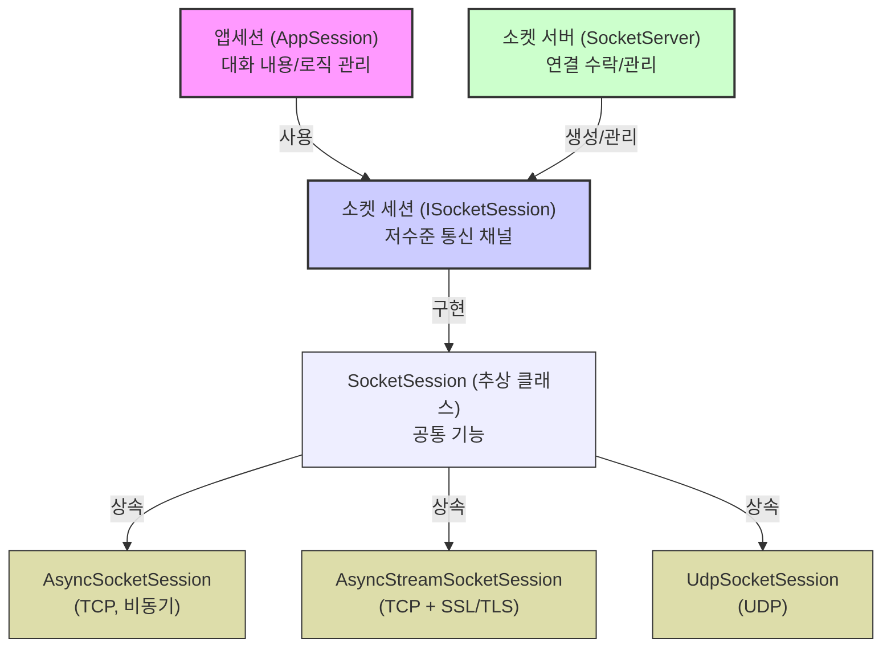
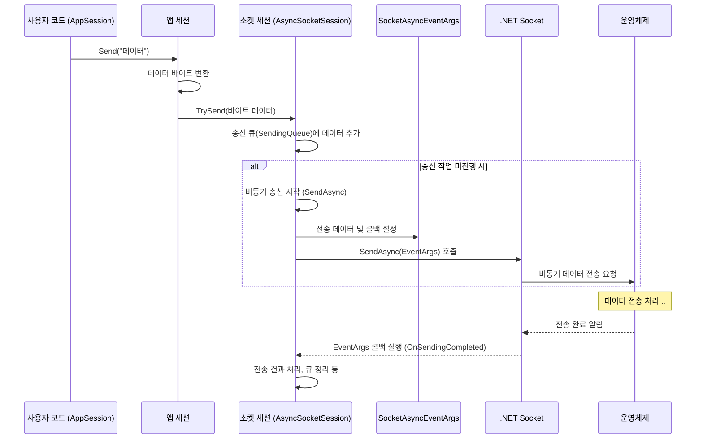
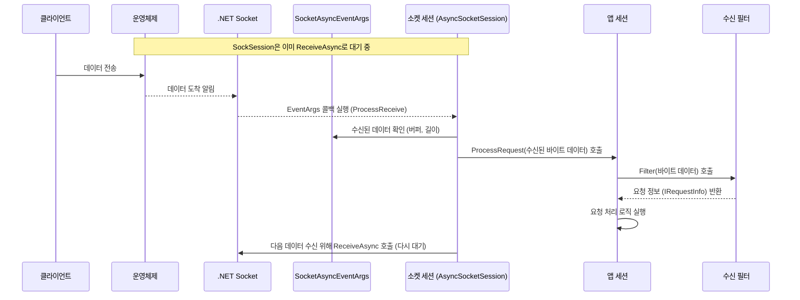

# Chapter 6: 소켓 세션 (ISocketSession / SocketSession / AsyncSocketSession / UdpSocketSession)

이전 [소켓 서버 (ISocketServer / SocketServerBase / AsyncSocketServer / UdpSocketServer)](05_소켓_서버__isocketserver___socketserverbase___asyncsocketserver___udpsocketserver__.md) 장에서는 서버의 핵심 네트워크 엔진, 즉 클라이언트 연결을 받아들이고 관리하는 '주방장'에 대해 배웠습니다. 주방장이 연결을 수락하면, 이제 각 클라이언트와 실제로 데이터를 주고받을 통로가 필요합니다. 레스토랑에 비유하면, 각 손님 테이블까지 직접 연결된 '전화선'과 같은 역할입니다.

이번 장에서는 바로 이 개별 클라이언트 연결을 위한 저수준 통신 채널, **소켓 세션 (ISocketSession / SocketSession / AsyncSocketSession / UdpSocketSession)** 에 대해 알아보겠습니다.

## 소켓 세션은 왜 필요할까요? 개별 통화를 위한 전화선!

[앱세션 (AppSession)](02_앱세션__appsession__.md)이 클라이언트와의 '대화' 내용(상태, 로직)을 관리하는 웨이터라면, **소켓 세션 (ISocketSession)** 은 그 대화를 가능하게 하는 물리적인 '전화선' 자체에 해당합니다. [소켓 서버 (ISocketServer / SocketServerBase / AsyncSocketServer / UdpSocketServer)](05_소켓_서버__isocketserver___socketserverbase___asyncsocketserver___udpsocketserver__.md)는 여러 클라이언트 연결 요청을 받는 교환원과 같고, 연결이 성사되면 각 연결마다 독립적인 통신 라인, 즉 `ISocketSession`을 할당합니다.

이 소켓 세션은 다음과 같은 중요한 역할을 수행합니다.

*   **실제 소켓 래핑**: 운영체제 수준의 소켓 연결(클라이언트와 직접 연결된 통신 끝점)을 감싸고 관리합니다.
*   **저수준 데이터 송수신**: 네트워크를 통해 바이트(byte) 데이터를 실제로 읽고 쓰는 기본적인 작업을 담당합니다. 특히 비동기(asynchronous) 방식으로 효율적인 데이터 처리를 수행합니다.
*   **연결 상태 관리**: 전화선이 연결되어 있는지, 끊어졌는지 기본적인 상태를 추적합니다.
*   **기초 오류 처리**: 통신 중 발생할 수 있는 기본적인 네트워크 오류(예: 연결 끊김)를 감지합니다.

[앱세션 (AppSession)](02_앱세션__appsession__.md)은 이 `ISocketSession`이라는 전화선을 통해 클라이언트와 메시지를 주고받습니다. `AppSession`이 "안녕하세요!" 라고 메시지를 보내면, `ISocketSession`이 이 메시지를 전기 신호(바이트 데이터)로 바꿔 전화선을 통해 실제로 전송하는 것입니다. 반대로 전화선을 통해 신호가 들어오면, `ISocketSession`이 이를 받아 `AppSession`에게 전달하여 처리하도록 합니다.

즉, 소켓 세션은 **각 클라이언트 연결에 대한 가장 기본적인 네트워크 통신 인터페이스**입니다.

## 핵심 개념: 소켓 세션 파헤치기

SuperSocketLite에서 소켓 세션은 다음과 같은 인터페이스와 클래스들로 구성됩니다.

1.  **`ISocketSession` 인터페이스**: 모든 소켓 세션 구현체가 따라야 하는 기본 계약입니다. 각 클라이언트 연결에 대한 저수준 통신 채널을 나타냅니다.
    *   **`Client` (Socket)**: 내부적으로 관리하는 실제 `.NET`의 `Socket` 객체입니다.
    *   **`LocalEndPoint` / `RemoteEndPoint` (IPEndPoint)**: 서버 측과 클라이언트 측의 IP 주소 및 포트 정보를 제공합니다.
    *   **`Initialize(IAppSession appSession)`**: 이 소켓 세션을 사용할 [앱세션 (AppSession)](02_앱세션__appsession__.md) 객체를 연결합니다.
    *   **`Start()`**: 소켓 세션을 시작하여 데이터 수신 준비를 합니다.
    *   **`TrySend(ArraySegment<byte> segment)` / `TrySend(IList<ArraySegment<byte>> segments)`**: 클라이언트에게 데이터를 비동기적으로 전송하는 메서드입니다. 전송 큐가 가득 찼을 경우 실패(`false`)를 반환할 수 있습니다.
    *   **`Close(CloseReason reason)`**: 현재 소켓 세션의 연결을 지정된 이유로 종료합니다.
    *   **`Closed` (Action<ISocketSession, CloseReason>)**: 세션이 닫혔을 때 발생하는 이벤트입니다.
    *   *파일 위치: `SocketBase/ISocketSession.cs`*

2.  **`SocketSession` 추상 클래스**: `ISocketSession` 인터페이스의 기본적인 구현을 제공하는 추상 클래스입니다. 많은 소켓 세션들이 공통적으로 사용하는 기능들(예: 세션 ID 관리, 상태 관리(송신 중, 수신 중, 닫힘 등), `Send` 요청 큐 관리, 기본 오류 로깅)을 포함합니다. 실제 네트워크 통신 방식(TCP 비동기, UDP 등)에 따른 구체적인 구현은 자식 클래스에서 이루어집니다.
    *   *파일 위치: `SocketEngine/SocketSession.cs`*

3.  **`AsyncSocketSession` 클래스**: **TCP** 통신을 위한 `SocketSession`의 구체적인 구현입니다. `.NET`의 고성능 비동기 소켓 API (`SocketAsyncEventArgs`)를 사용하여 네트워크 읽기/쓰기 작업을 효율적으로 처리합니다. 우리가 일반적으로 TCP 서버를 만들 때 내부적으로 사용되는 클래스입니다.
    *   *파일 위치: `SocketEngine/AsyncSocketSession.cs`*

4.  **`AsyncStreamSocketSession` 클래스**: `AsyncSocketSession`과 유사하지만, **SSL/TLS 암호화**가 적용된 TCP 통신을 처리합니다. 내부적으로 `SslStream`을 사용하여 데이터를 암호화/복호화합니다. 서버 설정에서 보안 연결(Secure connection)을 사용하도록 지정하면 이 클래스가 사용됩니다.
    *   *파일 위치: `SocketEngine/AsyncStreamSocketSession.cs`*

5.  **`UdpSocketSession` 클래스**: **UDP** 통신을 위한 `SocketSession`의 구체적인 구현입니다. UDP는 비연결형 프로토콜이므로, 연결 상태 관리나 데이터 도착 순서 보장 등이 TCP와 다릅니다.
    *   *파일 위치: `SocketEngine/UdpSocketSession.cs`*

**관계 요약:**

*   [소켓 서버 (ISocketServer / SocketServerBase / AsyncSocketServer / UdpSocketServer)](05_소켓_서버__isocketserver___socketserverbase___asyncsocketserver___udpsocketserver__.md)(예: `AsyncSocketServer`)는 새로운 클라이언트 연결이 수락될 때마다 해당 연결에 맞는 `ISocketSession` 구현체(예: `AsyncSocketSession`)를 생성합니다.
*   생성된 `ISocketSession`은 [앱세션 (AppSession)](02_앱세션__appsession__.md) 객체와 연결됩니다 (`Initialize` 호출).
*   `AppSession`은 데이터를 보내고 싶을 때 `ISocketSession`의 `TrySend` 메서드를 사용합니다.
*   `ISocketSession`은 네트워크로부터 데이터를 받으면 `AppSession`의 `ProcessRequest` 메서드를 호출하여 처리를 위임합니다.



## 소켓 세션 사용하기 (주로 내부적으로)

앞서 언급했듯이, 개발자가 일반적으로 `ISocketSession`의 메서드를 직접 호출하는 경우는 많지 않습니다. 대부분의 상호작용은 [앱세션 (AppSession)](02_앱세션__appsession__.md)을 통해 이루어집니다. 하지만 `AppSession`이 어떻게 `ISocketSession`을 사용하는지 이해하는 것은 중요합니다.

**1. 데이터 전송 시:**

[앱세션 (AppSession)](02_앱세션__appsession__.md) 장에서 본 `Send` 메서드를 다시 살펴봅시다.

```csharp
// MySession.cs (AppSession 상속 클래스)
public class MySession : AppSession<MySession, StringRequestInfo>
{
    // ...
    public void SayHello()
    {
        string message = "안녕하세요!";
        // AppSession의 Send 메서드 호출
        this.Send(message);
    }
    // ...
}
```

`MySession`의 `SayHello` 메서드에서 `this.Send(message)`를 호출하면 어떤 일이 벌어질까요?

*   `AppSession.Send(string message)` 메서드는 내부적으로 문자열을 서버 설정에 맞는 인코딩(예: UTF-8)을 사용하여 바이트 배열(`byte[]`)로 변환합니다.
*   변환된 바이트 배열을 가지고 `AppSession`은 다시 내부 `Send(byte[] data, int offset, int length)` 메서드를 호출합니다.
*   이 메서드는 최종적으로 자신이 가지고 있는 `ISocketSession` 참조(`this.SocketSession`)의 `TrySend` 메서드를 호출하여 실제 네트워크 전송을 요청합니다.

```csharp
// AppSession.cs (간략화된 내부 Send 로직)
public abstract class AppSession<TAppSession, TRequestInfo>
    where TAppSession : AppSession<TAppSession, TRequestInfo>, new()
    where TRequestInfo : IRequestInfo
{
    public ISocketSession SocketSession { get; internal set; } // 연결된 ISocketSession
    // ...
    public virtual void Send(byte[] data, int offset, int length)
    {
        // 내부적으로 ISocketSession의 TrySend 호출
        InternalSend(new ArraySegment<byte>(data, offset, length));
    }

    private void InternalSend(ArraySegment<byte> segment)
    {
        // ... (연결 상태 확인 등) ...
        if (!SocketSession.TrySend(segment)) // <--- ISocketSession 사용!
        {
            // 전송 큐가 꽉 찼거나 오류 발생 시 처리
            Logger.Error("전송 실패: 큐가 가득 찼거나 오류 발생.");
            Close(CloseReason.ServerClosing); // 예시: 실패 시 연결 종료
        }
        else
        {
            LastActiveTime = DateTime.Now; // 마지막 활동 시간 갱신
        }
    }
    // ...
}
```

이처럼 `AppSession`의 `Send`는 결국 `ISocketSession`의 `TrySend`를 통해 실제 데이터 전송 작업을 위임합니다.

**2. 데이터 수신 시:**

클라이언트로부터 데이터가 도착하면 다음과 같은 흐름으로 처리됩니다.

*   [소켓 서버 (ISocketServer / SocketServerBase / AsyncSocketServer / UdpSocketServer)](05_소켓_서버__isocketserver___socketserverbase___asyncsocketserver___udpsocketserver__.md)(예: `AsyncSocketServer`)는 네트워크로부터 데이터를 감지합니다.
*   `AsyncSocketServer`는 이 데이터가 어떤 클라이언트 연결(`ISocketSession`)로부터 왔는지 확인하고, 해당 `ISocketSession`의 비동기 수신 처리 로직(예: `AsyncSocketSession.ProcessReceive`)을 실행시킵니다.
*   `ISocketSession`은 받은 바이트 데이터를 가지고 자신이 연결된 `AppSession`의 `ProcessRequest` 메서드를 호출합니다.
*   `AppSession.ProcessRequest`는 [수신 필터 (IReceiveFilter / ReceiveFilterBase)](04_수신_필터__ireceivefilter___receivefilterbase__.md)를 사용하여 바이트 데이터를 의미있는 [요청 정보 (IRequestInfo / RequestInfo)](03_요청_정보__irequestinfo___requestinfo__.md)로 변환하고, 해당 요청을 처리하는 로직(명령 핸들러 또는 `HandleUnknownRequest`)을 실행합니다.

이 과정에서 개발자는 `AppSession`의 `ProcessRequest`나 `HandleUnknownRequest` 등에서 이미 가공된 `IRequestInfo`를 다루게 되므로, `ISocketSession`의 저수준 데이터 수신 과정을 직접 코딩할 필요는 없습니다.

## 내부 동작 들여다보기: 소켓 세션은 어떻게 통신할까?

`ISocketSession`이 실제로 데이터를 보내고 받는 내부 메커니즘을 간단히 살펴보겠습니다. (TCP, `AsyncSocketSession` 기준)

**데이터 전송 (`AppSession.Send` -> `ISocketSession.TrySend`)**

1.  **AppSession.Send 호출**: 개발자가 `AppSession`의 `Send` 메서드를 호출합니다.
2.  **데이터 준비**: `AppSession`은 데이터를 바이트 배열로 준비합니다.
3.  **ISocketSession.TrySend 호출**: `AppSession`은 내부적으로 `ISocketSession`의 `TrySend` 메서드를 호출합니다.
4.  **송신 큐에 추가**: `SocketSession` (기본 클래스)은 받은 데이터를 내부 송신 큐(`SendingQueue`)에 안전하게 추가합니다. 여러 스레드에서 동시에 `Send`를 호출해도 문제가 없도록 설계되었습니다.
5.  **비동기 전송 시작**: `SocketSession`은 송신 큐에 데이터가 있고 현재 다른 전송 작업이 진행 중이 아니라면, 실제 비동기 전송을 시작합니다. `AsyncSocketSession`의 `SendAsync` 메서드가 호출됩니다.
6.  **SocketAsyncEventArgs 사용**: `AsyncSocketSession.SendAsync`는 `SocketAsyncEventArgs` 객체를 설정합니다. 보낼 데이터(버퍼), 콜백 함수 등을 지정합니다.
7.  **Socket.SendAsync 호출**: 실제 `.NET`의 `Socket.SendAsync` 메서드를 호출하여 운영체제에 비동기 데이터 전송을 요청합니다. 이 호출은 즉시 반환될 수 있습니다.
8.  **전송 완료 콜백**: 데이터 전송이 완료되면(성공 또는 실패), 운영체제가 이를 알려주고 `SocketAsyncEventArgs`에 등록된 콜백 함수(예: `AsyncSocketSession.OnSendingCompleted`)가 실행됩니다.
9.  **결과 처리**: 콜백 함수는 전송 결과를 확인하고, 송신 큐 정리, 다음 데이터 전송 시작, 오류 처리 등의 후속 작업을 수행합니다.



**데이터 수신 (네트워크 -> `AppSession.ProcessRequest`)**

1.  **비동기 수신 대기**: `AsyncSocketSession`은 시작(`Start`)될 때 `Socket.ReceiveAsync`를 호출하여 데이터 수신을 비동기적으로 기다립니다. `SocketAsyncEventArgs` 객체가 사용됩니다.
2.  **데이터 도착 및 콜백**: 네트워크로부터 데이터가 도착하면, 운영체제가 이를 감지하고 `Socket.ReceiveAsync` 작업이 완료되었음을 알립니다. `SocketAsyncEventArgs`에 등록된 콜백 함수(예: `AsyncSocketSession.ProcessReceive`)가 실행됩니다.
3.  **데이터 획득**: `ProcessReceive` 메서드는 `SocketAsyncEventArgs` 객체에서 수신된 데이터(바이트 배열, 길이)를 얻습니다.
4.  **AppSession.ProcessRequest 호출**: `AsyncSocketSession`은 획득한 데이터를 가지고 `AppSession.ProcessRequest` 메서드를 호출합니다.
5.  **데이터 처리 (AppSession)**: `AppSession`은 [수신 필터 (IReceiveFilter / ReceiveFilterBase)](04_수신_필터__ireceivefilter___receivefilterbase__.md)를 사용하여 데이터를 해석하고 [요청 정보 (IRequestInfo / RequestInfo)](03_요청_정보__irequestinfo___requestinfo__.md)를 생성한 후, 적절한 로직을 실행합니다.
6.  **다음 수신 시작**: `AsyncSocketSession`은 데이터 처리가 끝나면 즉시 다음 데이터 수신을 위해 다시 `Socket.ReceiveAsync`를 호출하여 대기 상태로 들어갑니다.



이러한 비동기 메커니즘 덕분에 SuperSocketLite 서버는 많은 클라이언트 연결을 동시에 효율적으로 처리할 수 있습니다.

## 코드 레벨에서 살펴보기: 소켓 세션의 구현

주요 소스 코드 파일을 통해 소켓 세션 관련 클래스들의 구조를 간단히 살펴보겠습니다.

*   **`ISocketSession` 인터페이스 (`SocketBase/ISocketSession.cs`)**:
    소켓 세션의 핵심 기능을 정의합니다.

    ```csharp
    // File: SocketBase/ISocketSession.cs
    namespace SuperSocketLite.SocketBase;

    public interface ISocketSession : ISessionBase
    {
        // 연결된 AppSession 설정
        void Initialize(IAppSession appSession);
        // 세션 시작 (데이터 수신 준비)
        void Start();
        // 데이터 비동기 전송 시도 (단일 세그먼트)
        bool TrySend(ArraySegment<byte> segment);
        // 데이터 비동기 전송 시도 (여러 세그먼트)
        bool TrySend(IList<ArraySegment<byte>> segments);
        // 세션 닫기
        void Close(CloseReason reason);
        // 실제 .NET Socket 객체
        Socket Client { get; }
        // 연결된 AppSession 객체
        IAppSession AppSession { get; }
        // 세션 닫힘 이벤트
        Action<ISocketSession, CloseReason> Closed { get; set; }
        // ... 기타 속성 및 메서드 ...
    }
    ```

*   **`SocketSession` 추상 클래스 (`SocketEngine/SocketSession.cs`)**:
    공통 상태 관리 및 송신 큐 로직을 포함합니다.

    ```csharp
    // File: SocketEngine/SocketSession.cs
    namespace SuperSocketLite.SocketEngine;

    abstract partial class SocketSession : ISocketSession
    {
        public IAppSession AppSession { get; private set; }
        protected readonly object SyncRoot = new object(); // 동기화 객체
        private int m_State = 0; // 세션 상태 (비트 플래그 사용)
        private SendingQueue m_SendingQueue; // 현재 송신 큐
        private ISmartPool<SendingQueue> m_SendingQueuePool; // 송신 큐 풀

        // 상태 플래그 추가/제거/확인 메서드 (AddStateFlag, RemoveStateFlag, CheckState)
        // ...

        public virtual void Initialize(IAppSession appSession)
        {
            AppSession = appSession;
            // ... 송신 큐 풀 및 현재 큐 초기화 ...
        }

        // 데이터 전송 시도 (내부 구현)
        public bool TrySend(ArraySegment<byte> segment)
        {
            if (IsClosed) return false; // 이미 닫혔으면 실패
            var queue = m_SendingQueue;
            if (queue == null) return false; // 큐가 없으면 실패

            var trackID = queue.TrackID;
            if (!queue.Enqueue(segment, trackID)) return false; // 큐에 추가 실패 시

            StartSend(queue, trackID, true); // 실제 전송 시작 요청
            return true;
        }

        // 실제 비동기/동기 전송 시작 (StartSend -> SendAsync/SendSync)
        private void StartSend(SendingQueue queue, int sendingTrackID, bool initial)
        {
            // ... 상태 확인 및 큐 교체 로직 ...
            // 자식 클래스의 SendAsync 또는 SendSync 호출
            Send(queue);
        }

        // 자식 클래스가 구현해야 하는 비동기/동기 전송 메서드
        protected abstract void SendAsync(SendingQueue queue);
        protected abstract void SendSync(SendingQueue queue);

        // 전송 완료 시 호출되는 메서드 (큐 정리, 다음 전송 시작 등)
        protected virtual void OnSendingCompleted(SendingQueue queue)
        {
            // ... 큐 반환, 다음 큐 처리 로직 ...
        }

        // 닫기 로직 (상태 변경, 실제 소켓 닫기, 이벤트 발생)
        public virtual void Close(CloseReason reason)
        {
            // ... 상태 변경 및 중복 닫기 방지 로직 ...
            InternalClose(Client, reason, true); // 실제 소켓 닫기 등
        }

        protected virtual void OnClosed(CloseReason reason)
        {
            // ... 상태 변경, 리소스 정리, Closed 이벤트 발생 ...
        }

        // ... 기타 추상 메서드(Start) 및 속성 ...
    }
    ```
    `SocketSession`은 상태 관리(`m_State` 비트 필드)와 송신 큐(`SendingQueue`) 관리를 통해 동시성과 안정성을 확보하는 중요한 역할을 합니다.

*   **`AsyncSocketSession` 클래스 (`SocketEngine/AsyncSocketSession.cs`)**:
    TCP 비동기 통신을 구현합니다.

    ```csharp
    // File: SocketEngine/AsyncSocketSession.cs
    namespace SuperSocketLite.SocketEngine;

    class AsyncSocketSession : SocketSession, IAsyncSocketSession
    {
        private SocketAsyncEventArgs m_SocketEventArgSend; // 송신용 EventArgs
        public SocketAsyncEventArgsProxy SocketAsyncProxy { get; private set; } // 수신용 EventArgs 관리 객체

        public AsyncSocketSession(Socket client, SocketAsyncEventArgsProxy socketAsyncProxy)
            : base(client) { /* ... 초기화 ... */ }

        public override void Initialize(IAppSession appSession)
        {
            base.Initialize(appSession);
            SocketAsyncProxy.Initialize(this); // 수신 EventArgs 초기화
            m_SocketEventArgSend = new SocketAsyncEventArgs(); // 송신 EventArgs 생성
            m_SocketEventArgSend.Completed += OnSendingCompleted; // 송신 완료 콜백 등록
        }

        public override void Start()
        {
            StartReceive(SocketAsyncProxy.SocketEventArgs); // 비동기 수신 시작
            StartSession(); // AppSession 시작 알림
        }

        // 비동기 수신 시작 메서드
        private void StartReceive(SocketAsyncEventArgs e)
        {
            // ... 버퍼 설정, 수신 시작 상태 확인 ...
            bool willRaiseEvent = Client.ReceiveAsync(e); // 실제 비동기 수신 호출
            if (!willRaiseEvent) // 동기적으로 완료된 경우
                ProcessReceive(e); // 즉시 처리
        }

        // 수신 완료 콜백 메서드
        public void ProcessReceive(SocketAsyncEventArgs e)
        {
            if (!ProcessCompleted(e)) // 오류 또는 연결 종료 확인
            {
                OnReceiveTerminated(/* 이유 설정 */);
                return;
            }
            OnReceiveEnded(); // 수신 종료 상태 처리

            int offsetDelta = AppSession.ProcessRequest(e.Buffer, e.Offset, e.BytesTransferred, true); // AppSession에 데이터 처리 위임

            StartReceive(e, offsetDelta); // 다음 수신 시작
        }

        // 비동기 송신 구현
        protected override void SendAsync(SendingQueue queue)
        {
            // ... m_SocketEventArgSend 설정 (버퍼, UserToken 등) ...
            if (!Client.SendAsync(m_SocketEventArgSend)) // 실제 비동기 송신 호출
                OnSendingCompleted(Client, m_SocketEventArgSend); // 동기 완료 시 콜백 직접 호출
        }

        // 송신 완료 콜백 메서드
        void OnSendingCompleted(object sender, SocketAsyncEventArgs e)
        {
            var queue = e.UserToken as SendingQueue;
            // ... 오류 확인, 전송된 바이트 수 확인, 큐 정리 ...
            base.OnSendingCompleted(queue); // 부모 클래스의 완료 처리 호출
        }

        // ... 기타 메서드 (동기 송신, 닫기 시 리소스 해제 등) ...
    }
    ```
    `AsyncSocketSession`은 `SocketAsyncEventArgs`를 핵심적으로 사용하여 TCP 소켓의 비동기 읽기/쓰기 작업을 효율적으로 관리합니다.

## 결론

이번 장에서는 개별 클라이언트 연결에 대한 저수준 네트워크 통신 채널인 **소켓 세션 (ISocketSession / SocketSession / AsyncSocketSession / UdpSocketSession)** 에 대해 배웠습니다. 소켓 세션은 실제 소켓 연결을 감싸고, 기본적인 데이터 송수신, 연결 상태 관리, 오류 처리 등을 담당하는 '전화선'과 같은 역할을 합니다.

[앱세션 (AppSession)](02_앱세션__appsession__.md)은 이 `ISocketSession`을 통해 클라이언트와 상호작용하며, [소켓 서버 (ISocketServer / SocketServerBase / AsyncSocketServer / UdpSocketServer)](05_소켓_서버__isocketserver___socketserverbase___asyncsocketserver___udpsocketserver__.md)는 각 연결마다 적절한 `ISocketSession` 구현체를 생성하고 관리합니다. 내부적으로 비동기 I/O 모델(특히 `AsyncSocketSession`의 `SocketAsyncEventArgs` 사용)을 통해 효율적인 통신이 이루어짐을 확인했습니다.

우리는 이제 클라이언트와의 대화 내용 관리([앱세션 (AppSession)](02_앱세션__appsession__.md)), 대화 내용 형식([요청 정보 (IRequestInfo / RequestInfo)](03_요청_정보__irequestinfo___requestinfo__.md)), 대화 규칙 해석([수신 필터 (IReceiveFilter / ReceiveFilterBase)](04_수신_필터__ireceivefilter___receivefilterbase__.md)), 통신 엔진([소켓 서버 (ISocketServer / SocketServerBase / AsyncSocketServer / UdpSocketServer)](05_소켓_서버__isocketserver___socketserverbase___asyncsocketserver___udpsocketserver__.md)), 그리고 실제 통신 라인([소켓 세션 (ISocketSession / SocketSession / AsyncSocketSession / UdpSocketSession)](06_소켓_세션__isocketsession___socketsession___asyncsocketsession___udpsocketsession__.md))까지 SuperSocketLite 서버의 주요 구성 요소를 대부분 살펴보았습니다.

하지만 이 모든 연결이 시작되는 지점, 즉 서버가 특정 주소와 포트에서 클라이언트의 접속 요청을 '듣고' 있는 부분은 아직 자세히 다루지 않았습니다. 다음 장에서는 바로 이 '귀 기울이는' 역할을 하는 [소켓 리스너 (ISocketListener / SocketListenerBase)](07_소켓_리스너__isocketlistener___socketlistenerbase__.md)에 대해 알아볼 것입니다. 서버가 어떻게 문을 열고 손님을 기다리는지 그 시작점을 탐험해 봅시다.

---

Generated by [AI Codebase Knowledge Builder](https://github.com/The-Pocket/Tutorial-Codebase-Knowledge)