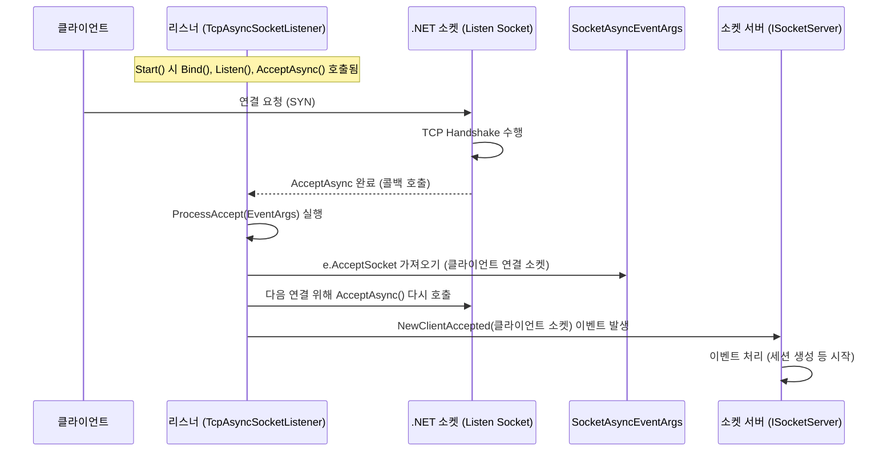

# Chapter 7: 소켓 리스너 (ISocketListener / SocketListenerBase)

이전 [소켓 세션 (ISocketSession / SocketSession / AsyncSocketSession / UdpSocketSession)](06_소켓_세션__isocketsession___socketsession___asyncsocketsession___udpsocketsession__.md) 장에서는 클라이언트와의 개별적인 저수준 통신 채널, 즉 '전화선' 역할을 하는 소켓 세션에 대해 알아보았습니다. 이 전화선은 클라이언트와 서버 간의 실제 데이터 교환을 담당합니다. 하지만 서버가 클라이언트의 전화를 받으려면, 먼저 특정 전화번호(네트워크 주소)를 열어두고 걸려오는 전화를 기다려야 합니다.

이번 장에서는 바로 이 '전화를 기다리는' 역할, 즉 서버가 특정 네트워크 주소에서 클라이언트의 연결 요청을 기다리는 **소켓 리스너 (ISocketListener / SocketListenerBase)** 에 대해 배우게 됩니다. SuperSocketLite 서버 아키텍처의 가장 첫 번째 관문이라고 할 수 있습니다.

## 소켓 리스너는 왜 필요할까요? 레스토랑의 친절한 문지기!

레스토랑을 운영한다고 상상해 봅시다. 레스토랑 문 앞에는 손님을 맞이하고 안내하는 '문지기'가 필요합니다. 문지기는 레스토랑 입구(특정 IP 주소와 포트 번호)를 지키면서, 새로운 손님(클라이언트)이 오는지 주의 깊게 살핍니다. 손님이 도착하면, 문지기는 손님을 안으로 맞이하고(연결 수락), 내부 직원([소켓 서버 (ISocketServer / SocketServerBase / ...)](05_소켓_서버__isocketserver___socketserverbase___asyncsocketserver___udpsocketserver__.md))에게 새 손님이 왔다고 알려줍니다.

**소켓 리스너 (ISocketListener)** 는 바로 이 '문지기'와 같습니다.

*   **지정된 주소 감시**: 서버 설정에 명시된 특정 IP 주소와 포트 번호에서 들어오는 네트워크 연결 시도를 지속적으로 감시합니다.
*   **연결 수락**: 새로운 클라이언트 연결 요청이 감지되면, 이를 수락하여 실제 통신이 가능한 소켓 연결(Socket 객체)을 생성합니다.
*   **알림 역할**: 새로 생성된 소켓 연결을 [소켓 서버 (ISocketServer / SocketServerBase / ...)](05_소켓_서버__isocketserver___socketserverbase___asyncsocketserver___udpsocketserver__.md)에게 전달하여 후속 처리(예: [소켓 세션 (ISocketSession / SocketSession / AsyncSocketSession / UdpSocketSession)](06_소켓_세션__isocketsession___socketsession___asyncsocketsession___udpsocketsession__.md) 생성)를 할 수 있도록 합니다.
*   **다중 접점 지원**: 하나의 서버는 여러 개의 리스너를 가질 수 있습니다. 예를 들어, 서로 다른 포트 번호나 IP 주소에서 동시에 연결을 기다릴 수 있습니다. 또한, 일반 TCP 연결과 보안(SSL/TLS) 연결을 위한 리스너를 동시에 운영할 수도 있습니다.

소켓 리스너가 없다면, 서버는 클라이언트가 어디로 접속해야 하는지 알 수 없고, 접속 시도를 감지하거나 받아들일 방법이 없습니다. 리스너는 서버 애플리케이션이 세상과 소통하는 첫 번째 창구인 셈입니다.

## 핵심 개념: 소켓 리스너 파헤치기

SuperSocketLite에서 소켓 리스너와 관련된 주요 인터페이스 및 클래스는 다음과 같습니다.

1.  **`ISocketListener` 인터페이스**: 모든 소켓 리스너 구현체가 따라야 하는 기본 계약입니다. 리스너의 핵심 기능(시작, 중지, 정보 접근)과 이벤트(새 연결 수락, 오류 발생, 중지)를 정의합니다.
    *   `Info` (ListenerInfo): 리스너 설정 정보(IP, 포트, 보안 설정 등)를 담고 있습니다.
    *   `EndPoint` (IPEndPoint): 리스너가 실제로 작동하는 IP 주소와 포트 번호입니다.
    *   `Start(IServerConfig config)`: 리스닝을 시작하는 메서드입니다.
    *   `Stop()`: 리스닝을 중지하는 메서드입니다.
    *   `NewClientAccepted` (event): 새로운 클라이언트 연결이 수락되었을 때 발생하는 이벤트입니다. 수락된 `Socket` 객체를 전달합니다.
    *   `Error` (event): 리스닝 중 오류가 발생했을 때 발생하는 이벤트입니다.
    *   `Stopped` (event): 리스너가 중지되었을 때 발생하는 이벤트입니다.
    *   *파일 위치: `SocketEngine/ISocketListener.cs`*

2.  **`SocketListenerBase` 추상 클래스**: `ISocketListener` 인터페이스의 기본적인 구현을 제공하는 추상 클래스입니다. 리스너 정보(`Info`) 저장, 이벤트 발생을 위한 헬퍼 메서드(`OnNewClientAccepted`, `OnError`, `OnStopped`) 등을 공통으로 제공합니다. 실제 리스닝 로직(`Start`, `Stop`)은 상속받는 구체적인 클래스에서 구현해야 합니다.
    *   *파일 위치: `SocketEngine/SocketListenerBase.cs`*

3.  **구체적인 리스너 구현 클래스들**: SuperSocketLite는 통신 방식(TCP/UDP)과 구현 방식(비동기)에 따라 몇 가지 리스너를 제공합니다.
    *   **`TcpAsyncSocketListener`**: `.NET`의 비동기 소켓 API (`Socket.AcceptAsync`)를 사용하여 **TCP** 연결 요청을 효율적으로 처리하는 리스너입니다. 대부분의 TCP 기반 SuperSocketLite 서버에서 사용됩니다.
        *   *파일 위치: `SocketEngine/TcpAsyncSocketListener.cs`*
    *   **`UdpSocketListener`**: **UDP** 통신을 위한 리스너입니다. UDP는 비연결형이므로 `Accept` 과정은 없지만, 지정된 포트로 들어오는 UDP 패킷을 비동기적으로 수신 대기합니다 (`Socket.ReceiveFromAsync`).
        *   *파일 위치: `SocketEngine/UdpSocketListener.cs`*

**관계 요약:**

*   [앱서버 (AppServer / AppServerBase)](01_앱서버__appserver___appserverbase__.md)의 설정 (`IServerConfig`)에는 하나 이상의 리스너 설정(`Listeners` 속성 또는 기본 `Port`/`Ip` 설정)이 포함될 수 있습니다.
*   [소켓 서버 (ISocketServer / SocketServerBase / ...)](05_소켓_서버__isocketserver___socketserverbase___asyncsocketserver___udpsocketserver__.md)(예: `AsyncSocketServer`)는 시작 시(`Start()`) 이 설정 정보를 바탕으로 필요한 `ISocketListener` 구현체(예: `TcpAsyncSocketListener`)들을 생성하고 각각의 `Start()` 메서드를 호출합니다.
*   리스너는 클라이언트 연결을 수락하면 `NewClientAccepted` 이벤트를 발생시켜 `ISocketServer`에게 알립니다.

```mermaid
graph LR
    Config["서버 설정 (IServerConfig)<br/>(IP, 포트, 보안 등)"] -- 정의 --> ListenerInfo["리스너 정보 (ListenerInfo)"];
    AppServer["앱 서버 (AppServer)"] -- 참조 --> Config;
    SocketServer["소켓 서버 (ISocketServer)"] -- 관리 --> ListenerInfo;
    SocketServer -- 생성/시작 --> ISocketListener["리스너 (ISocketListener)"];
    ISocketListener -- 구현 --> ListenerBase["SocketListenerBase (추상)"];
    ListenerBase -- 상속 --> TcpListener["TcpAsyncSocketListener (TCP)"];
    ListenerBase -- 상속 --> UdpListener["UdpSocketListener (UDP)"];
    ISocketListener -- 발생 --> SocketServer -- 이벤트 처리: NewClientAccepted;

    style Config fill:#ddd,stroke:#333,stroke-width:1px;
    style ListenerInfo fill:#eee,stroke:#333,stroke-width:1px;
    style AppServer fill:#f9f,stroke:#333,stroke-width:2px;
    style SocketServer fill:#cfc,stroke:#333,stroke-width:2px;
    style ISocketListener fill:#ccf,stroke:#333,stroke-width:2px;
    style ListenerBase fill:#eef,stroke:#333,stroke-width:1px;
    style TcpListener fill:#dda,stroke:#333,stroke-width:1px;
    style UdpListener fill:#dda,stroke:#333,stroke-width:1px;

```

## 소켓 리스너 사용하기 (앱서버 설정을 통해 간접적으로)

일반적으로 개발자는 `ISocketListener` 객체를 직접 생성하거나 메서드를 호출할 필요가 없습니다. [앱서버 (AppServer / AppServerBase)](01_앱서버__appserver___appserverbase__.md)를 설정하고 시작하는 과정에서 리스너는 내부적으로 관리됩니다.

[Chapter 1: 앱서버 (AppServer / AppServerBase)](01_앱서버__appserver___appserverbase__.md)에서 사용했던 서버 설정 코드를 다시 살펴봅시다.

```csharp
// Program.cs (AppServer 설정 부분)
using SuperSocketLite.SocketBase.Config;
using SuperSocketLite.SocketBase;

// ... (MySession 클래스 정의) ...

class Program
{
    static void Main(string[] args)
    {
        var appServer = new AppServer<MySession, StringRequestInfo>();

        // 1. 서버 설정 객체 생성
        var serverConfig = new ServerConfig
        {
            // 이 정보들이 리스너 설정을 위해 사용됩니다.
            Port = 2024,         // 리스너가 사용할 포트 번호
            Ip = "Any",          // 리스너가 사용할 IP 주소 ("Any"는 모든 로컬 IP)
            MaxConnectionNumber = 100,
            Mode = SocketMode.Tcp, // 통신 방식 (TcpAsyncSocketListener 사용됨)
            Name = "MySimpleServer"
            // Listeners 속성을 사용하여 여러 리스너를 명시적으로 설정할 수도 있습니다.
            // Listeners = new List<ListenerConfig>
            // {
            //     new ListenerConfig { Ip = "Any", Port = 2024, Security = SslProtocols.None },
            //     new ListenerConfig { Ip = "Any", Port = 2025, Security = SslProtocols.Tls } // 보안 리스너 예시
            // }
        };

        // 2. 서버 설정 적용
        // appServer.Setup() 내부에서 SocketServerFactory를 통해 ISocketServer를 생성하고,
        // ISocketServer는 serverConfig의 리스너 정보를 바탕으로 ISocketListener들을 준비합니다.
        if (!appServer.Setup(serverConfig))
        {
            Console.WriteLine("서버 설정 실패!");
            return;
        }

        // 3. 서버 시작
        // appServer.Start() 호출 시, 내부적으로 ISocketServer.Start()가 호출되고,
        // 이는 다시 각 ISocketListener.Start()를 호출하여 실제 리스닝을 시작합니다.
        if (!appServer.Start())
        {
            Console.WriteLine("서버 시작 실패!");
            return;
        }

        Console.WriteLine("서버가 시작되어 클라이언트 연결을 기다립니다...");
        // ... (서버 실행 및 종료 로직) ...
        appServer.Stop(); // 서버 중지 시 리스너들도 중지됩니다.
    }
}
```

**코드 설명:**

1.  **`ServerConfig` 설정:** `Port`와 `Ip` 속성은 가장 기본적인 리스너 설정을 정의합니다. `Mode` 속성은 어떤 종류의 리스너(`TcpAsyncSocketListener` 또는 `UdpSocketListener`)를 사용할지 결정하는 데 영향을 줍니다. 주석 처리된 `Listeners` 속성을 사용하면 여러 개의 리스너를 각각 다른 설정(예: 다른 포트, 보안 설정)으로 명시적으로 정의할 수 있습니다.
2.  **`appServer.Setup()`:** 이 단계에서 [앱서버 (AppServer / AppServerBase)](01_앱서버__appserver___appserverbase__.md)는 설정을 읽고 내부적으로 필요한 [소켓 서버 (ISocketServer / SocketServerBase / ...)](05_소켓_서버__isocketserver___socketserverbase___asyncsocketserver___udpsocketserver__.md)를 생성합니다. 소켓 서버는 설정된 리스너 정보를 인지하고 준비합니다.
3.  **`appServer.Start()`:** 이 메서드가 호출되면, 내부의 [소켓 서버 (ISocketServer / SocketServerBase / ...)](05_소켓_서버__isocketserver___socketserverbase___asyncsocketserver___udpsocketserver__.md)가 자신이 관리하는 모든 `ISocketListener` 인스턴스의 `Start()` 메서드를 호출합니다. 이때부터 각 리스너는 지정된 IP 주소와 포트에서 실제 네트워크 연결 요청을 받기 시작합니다.

즉, 개발자는 서버 설정을 통해 '어떤 문을 열고 기다릴지'를 지정하고, `Start()` 메서드를 호출하여 '문지기에게 일을 시작하라'고 명령하는 셈입니다.

## 내부 동작 들여다보기: 리스너는 어떻게 연결을 받을까?

클라이언트가 서버에 접속을 시도할 때 `ISocketListener` (특히 `TcpAsyncSocketListener`)가 내부적으로 어떻게 동작하는지 단계별로 살펴보겠습니다.

1.  **리스너 시작 (`Listener.Start`)**: [소켓 서버 (ISocketServer / SocketServerBase / ...)](05_소켓_서버__isocketserver___socketserverbase___asyncsocketserver___udpsocketserver__.md)가 `TcpAsyncSocketListener.Start()`를 호출합니다.
    *   **소켓 생성**: 리스닝에 사용할 `.NET`의 `Socket` 객체를 생성합니다 (`SocketType.Stream`, `ProtocolType.Tcp`).
    *   **바인딩 (`Socket.Bind`)**: 생성된 소켓을 설정된 IP 주소와 포트 번호 (`ListenerInfo.EndPoint`)에 연결(바인딩)합니다. 운영체제에게 이 주소로 오는 TCP 연결 요청을 이 소켓으로 보내달라고 알리는 과정입니다.
    *   **리스닝 시작 (`Socket.Listen`)**: 소켓을 리스닝 상태로 전환합니다. 이제 이 소켓은 들어오는 연결 요청을 받아들일 준비가 됩니다. `backLog` 매개변수는 연결 요청을 잠시 대기시킬 수 있는 큐의 크기를 지정합니다.
    *   **비동기 수락 준비 (`Socket.AcceptAsync`)**: 첫 번째 클라이언트 연결을 비동기적으로 받아들이기 위해 `Socket.AcceptAsync` 메서드를 호출합니다. `SocketAsyncEventArgs` 객체를 사용하여 비동기 작업 완료 시 호출될 콜백 함수(`acceptEventArg_Completed`)를 등록합니다.
2.  **클라이언트 연결 요청**: 클라이언트가 서버의 IP 주소와 포트로 TCP 연결을 시도합니다 (SYN 패킷 전송).
3.  **운영체제 처리**: 운영체제 네트워크 스택은 이 연결 요청을 감지하고, 해당 포트에서 리스닝 중인 소켓(`m_ListenSocket`)에게 알립니다. TCP 3-way 핸드셰이크가 진행됩니다.
4.  **연결 수락 완료 및 콜백 호출**: 핸드셰이크가 성공적으로 완료되면, `Socket.AcceptAsync` 작업이 완료됩니다. 등록된 콜백 함수 `acceptEventArg_Completed`가 호출됩니다.
5.  **`ProcessAccept` 실행**: 콜백 함수는 `ProcessAccept` 메서드를 호출합니다.
    *   **결과 확인**: `SocketAsyncEventArgs` 객체에서 작업 결과(`e.SocketError`)를 확인합니다. 오류가 있다면 `OnError` 이벤트를 발생시킵니다.
    *   **연결된 소켓 얻기**: 성공했다면, `e.AcceptSocket` 속성에서 새로 생성된, 클라이언트와 직접 연결된 `Socket` 객체를 가져옵니다.
    *   **다음 수락 준비**: 즉시 `e.AcceptSocket = null;`로 설정하고 다시 `m_ListenSocket.AcceptAsync(e)`를 호출하여 다음 클라이언트 연결 요청을 기다립니다. 이렇게 해야 끊임없이 새 연결을 받아들일 수 있습니다.
    *   **새 연결 알림 (`OnNewClientAccepted`)**: 가져온 클라이언트 `Socket` 객체를 가지고 `OnNewClientAccepted(socket, null)` 메서드를 호출합니다.
6.  **`NewClientAccepted` 이벤트 발생**: `OnNewClientAccepted` 메서드는 `NewClientAccepted` 이벤트를 발생시킵니다.
7.  **소켓 서버 처리**: [소켓 서버 (ISocketServer / SocketServerBase / ...)](05_소켓_서버__isocketserver___socketserverbase___asyncsocketserver___udpsocketserver__.md)는 이 이벤트를 구독하고 있다가, 이벤트가 발생하면 전달된 `Socket` 객체를 받아 [소켓 세션 (ISocketSession / SocketSession / AsyncSocketSession / UdpSocketSession)](06_소켓_세션__isocketsession___socketsession___asyncsocketsession___udpsocketsession__.md)과 [앱세션 (AppSession)](02_앱세션__appsession__.md)을 생성하는 등의 후속 처리를 시작합니다. (이 과정은 [소켓 서버 (ISocketServer / SocketServerBase / AsyncSocketServer / UdpSocketServer)](05_소켓_서버__isocketserver___socketserverbase___asyncsocketserver___udpsocketserver__.md) 장에서 자세히 다뤘습니다.)

**연결 수락 과정 다이어그램 (TCP):**



이 흐름을 통해 리스너는 끊임없이 새로운 클라이언트 연결을 비동기적으로 받아들이고, 이를 서버의 다른 부분으로 전달하는 역할을 수행합니다.

## 코드 레벨에서 살펴보기: 리스너의 구현

관련 소스 코드 파일을 통해 리스너의 구조를 더 자세히 살펴보겠습니다.

*   **`ISocketListener` 인터페이스 (`SocketEngine/ISocketListener.cs`)**:
    리스너의 기본 계약입니다.

    ```csharp
    // File: SocketEngine/ISocketListener.cs
    namespace SuperSocketLite.SocketEngine;

    // 이벤트 핸들러 델리게이트 정의
    delegate void ErrorHandler(ISocketListener listener, Exception e);
    delegate void NewClientAcceptHandler(ISocketListener listener, Socket client, object state);

    interface ISocketListener
    {
        ListenerInfo Info { get; } // 리스너 설정 정보
        IPEndPoint EndPoint { get; } // 실제 리스닝 주소
        bool Start(IServerConfig config); // 리스닝 시작
        void Stop(); // 리스닝 중지
        event NewClientAcceptHandler NewClientAccepted; // 새 클라이언트 연결 이벤트
        event ErrorHandler Error; // 오류 발생 이벤트
        event EventHandler Stopped; // 중지 이벤트
    }
    ```
    핵심 기능과 이벤트를 명확하게 정의합니다.

*   **`SocketListenerBase` 추상 클래스 (`SocketEngine/SocketListenerBase.cs`)**:
    공통 기능(정보 저장, 이벤트 발생 헬퍼)을 제공합니다.

    ```csharp
    // File: SocketEngine/SocketListenerBase.cs
    namespace SuperSocketLite.SocketEngine;

    abstract class SocketListenerBase : ISocketListener
    {
        public ListenerInfo Info { get; private set; }
        public IPEndPoint EndPoint => Info.EndPoint; // 단축 속성

        protected SocketListenerBase(ListenerInfo info) { Info = info; }

        // Start와 Stop은 상속받는 클래스가 구현해야 함 (abstract)
        public abstract bool Start(IServerConfig config);
        public abstract void Stop();

        public event NewClientAcceptHandler NewClientAccepted;
        public event ErrorHandler Error;
        public event EventHandler Stopped;

        // 이벤트 발생을 위한 protected 헬퍼 메서드들
        protected virtual void OnNewClientAccepted(Socket socket, object state)
        {
            NewClientAccepted?.Invoke(this, socket, state); // 이벤트 호출
        }

        protected void OnError(Exception e)
        {
            Error?.Invoke(this, e); // 이벤트 호출
        }

        protected void OnStopped()
        {
            Stopped?.Invoke(this, EventArgs.Empty); // 이벤트 호출
        }
        // ... (비동기 이벤트 발생 헬퍼 등) ...
    }
    ```
    상속받는 클래스가 실제 네트워크 로직에 집중할 수 있도록 기반을 마련해 줍니다.

*   **`TcpAsyncSocketListener.Start()` 메서드 (`SocketEngine/TcpAsyncSocketListener.cs`)**:
    TCP 리스닝을 시작하는 핵심 로직입니다.

    ```csharp
    // File: SocketEngine/TcpAsyncSocketListener.cs
    class TcpAsyncSocketListener : SocketListenerBase
    {
        private Socket m_ListenSocket; // 리스닝 소켓
        private SocketAsyncEventArgs m_AcceptSAE; // Accept용 EventArgs

        // ... 생성자 ...

        public override bool Start(IServerConfig config)
        {
            // 1. 리스닝 소켓 생성 (TCP)
            m_ListenSocket = new Socket(this.Info.EndPoint.AddressFamily, SocketType.Stream, ProtocolType.Tcp);

            try
            {
                // 2. 소켓을 지정된 주소와 포트에 바인딩
                m_ListenSocket.Bind(this.Info.EndPoint);
                // 3. 리스닝 시작 (backlog 설정)
                m_ListenSocket.Listen(m_ListenBackLog);

                // 4. 비동기 Accept 준비
                m_AcceptSAE = new SocketAsyncEventArgs();
                m_AcceptSAE.Completed += acceptEventArg_Completed; // 콜백 등록

                // 5. 첫 비동기 Accept 시작
                if (!m_ListenSocket.AcceptAsync(m_AcceptSAE))
                    ProcessAccept(m_AcceptSAE); // 동기적으로 완료된 경우 즉시 처리

                return true; // 시작 성공
            }
            catch (Exception e)
            {
                OnError(e); // 오류 발생 시 이벤트 호출
                return false; // 시작 실패
            }
        }
        // ... (acceptEventArg_Completed, ProcessAccept, Stop 메서드 등) ...
    }
    ```
    `.NET`의 소켓 API를 사용하여 TCP 연결 요청을 받아들일 준비를 하는 과정을 보여줍니다.

*   **`TcpAsyncSocketListener.ProcessAccept()` 메서드 (`SocketEngine/TcpAsyncSocketListener.cs`)**:
    비동기 Accept 작업 완료 후 호출되어 실제 처리를 담당합니다.

    ```csharp
    // File: SocketEngine/TcpAsyncSocketListener.cs
    void ProcessAccept(SocketAsyncEventArgs e)
    {
        Socket socket = null;

        if (e.SocketError != SocketError.Success) // 오류 확인
        {
            // 리스닝 소켓 닫힘 오류 코드는 무시
            if (e.SocketError == SocketError.OperationAborted || e.SocketError == SocketError.SocketError)
                return;
            OnError(new SocketException((int)e.SocketError)); // 다른 오류는 보고
        }
        else
        {
            socket = e.AcceptSocket; // 성공 시 클라이언트 소켓 가져오기
        }

        // 다음 Accept를 위해 EventArgs 초기화
        e.AcceptSocket = null;

        bool willRaiseEvent = false;
        try
        {
            // 즉시 다음 비동기 Accept 시작
            willRaiseEvent = m_ListenSocket.AcceptAsync(e);
        }
        catch (ObjectDisposedException) { /* 리스너 중지됨 */ willRaiseEvent = true; }
        catch (Exception exc) { OnError(exc); willRaiseEvent = true; }

        if (socket != null) // 유효한 클라이언트 소켓이 있다면
            OnNewClientAccepted(socket, null); // 새 연결 이벤트 발생

        if (!willRaiseEvent) // 만약 AcceptAsync가 동기적으로 완료되었다면
            ProcessAccept(e); // 재귀적으로 즉시 처리
    }
    ```
    이 메서드는 성공적으로 수락된 클라이언트 소켓을 `OnNewClientAccepted`를 통해 상위 계층([소켓 서버 (ISocketServer / SocketServerBase / ...)](05_소켓_서버__isocketserver___socketserverbase___asyncsocketserver___udpsocketserver__.md))으로 전달하고, 동시에 다음 연결을 받을 준비를 하는 중요한 역할을 합니다.

## 결론

이번 장에서는 SuperSocketLite 서버의 '문지기' 역할을 하는 **소켓 리스너 (ISocketListener / SocketListenerBase)** 에 대해 배웠습니다. 리스너는 서버 설정에 따라 특정 네트워크 주소(IP와 포트)에서 클라이언트의 연결 요청을 기다리고, 새로운 연결이 들어오면 이를 수락하여 서버의 다른 구성 요소에게 알려주는 핵심적인 첫 관문입니다.

우리는 개발자가 직접 리스너를 다루기보다는 [앱서버 (AppServer / AppServerBase)](01_앱서버__appserver___appserverbase__.md) 설정을 통해 간접적으로 리스너를 구성하고 제어한다는 것을 확인했습니다. 또한 TCP 리스너(`TcpAsyncSocketListener`)가 내부적으로 `.NET`의 비동기 소켓 API를 사용하여 어떻게 효율적으로 연결 요청을 받아들이는지 그 과정을 살펴보았습니다.

이것으로 SuperSocketLite의 주요 구성 요소들에 대한 여정을 마무리합니다. 우리는 서버 애플리케이션의 전체적인 관리자([앱서버 (AppServer / AppServerBase)](01_앱서버__appserver___appserverbase__.md))부터 시작하여, 개별 클라이언트 담당자([앱세션 (AppSession)](02_앱세션__appsession__.md)), 주고받는 메시지의 형식([요청 정보 (IRequestInfo / RequestInfo)](03_요청_정보__irequestinfo___requestinfo__.md)), 메시지 해석 규칙([수신 필터 (IReceiveFilter / ReceiveFilterBase)](04_수신_필터__ireceivefilter___receivefilterbase__.md)), 핵심 통신 엔진([소켓 서버 (ISocketServer / SocketServerBase / ...)](05_소켓_서버__isocketserver___socketserverbase___asyncsocketserver___udpsocketserver__.md)), 실제 통신 라인([소켓 세션 (ISocketSession / SocketSession / AsyncSocketSession / UdpSocketSession)](06_소켓_세션__isocketsession___socketsession___asyncsocketsession___udpsocketsession__.md)), 그리고 마지막으로 연결의 시작점인 리스너까지 모두 살펴보았습니다.

이제 여러분은 SuperSocketLite를 사용하여 자신만의 네트워크 애플리케이션을 구축하기 위한 기본적인 지식을 갖추게 되었습니다. 각 구성 요소들이 어떻게 상호작용하는지 이해했으므로, 앞으로 더 복잡한 기능을 구현하거나 문제를 해결하는 데 큰 도움이 될 것입니다. Happy coding!

---

Generated by [AI Codebase Knowledge Builder](https://github.com/The-Pocket/Tutorial-Codebase-Knowledge)