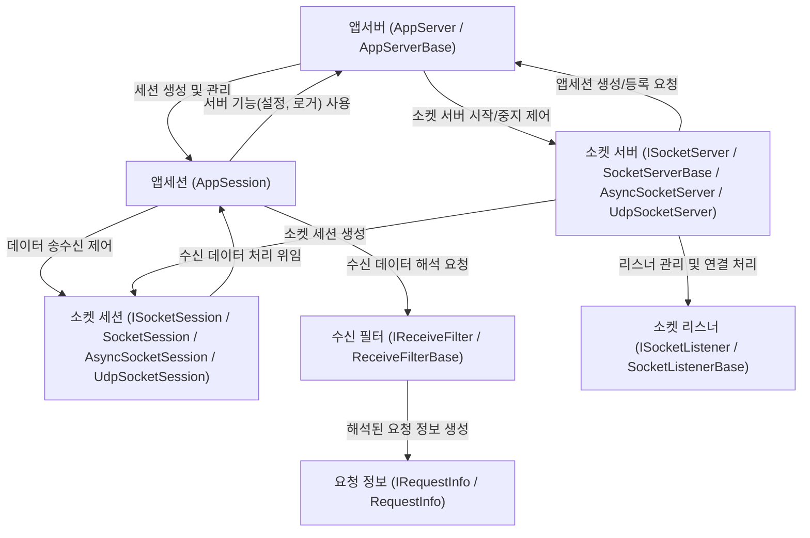

# Tutorial: SuperSocketLite

SuperSocketLite는 TCP/UDP **네트워크 통신**을 쉽게 구현할 수 있도록 도와주는 *서버 프레임워크*입니다. 
개발자는 복잡한 소켓 프로그래밍 대신, **애플리케이션 로직**에 집중할 수 있습니다. 
클라이언트 연결 관리, 데이터 수신 및 처리, 요청 해석 등의 기능을 추상화된 컴포넌트를 통해 제공합니다.

**Source Repository:** [https://github.com/jacking75/SuperSocketLite/tree/master/SuperSocketLite](https://github.com/jacking75/SuperSocketLite/tree/master/SuperSocketLite)

## Chapters

1. [앱서버 (AppServer / AppServerBase)
](01_앱서버__appserver___appserverbase__.md)
2. [앱세션 (AppSession)
](02_앱세션__appsession__.md)
3. [요청 정보 (IRequestInfo / RequestInfo)
](03_요청_정보__irequestinfo___requestinfo__.md)
4. [수신 필터 (IReceiveFilter / ReceiveFilterBase)
](04_수신_필터__ireceivefilter___receivefilterbase__.md)
5. [소켓 서버 (ISocketServer / SocketServerBase / AsyncSocketServer / UdpSocketServer)
](05_소켓_서버__isocketserver___socketserverbase___asyncsocketserver___udpsocketserver__.md)
6. [소켓 세션 (ISocketSession / SocketSession / AsyncSocketSession / UdpSocketSession)
](06_소켓_세션__isocketsession___socketsession___asyncsocketsession___udpsocketsession__.md)
7. [소켓 리스너 (ISocketListener / SocketListenerBase)
](07_소켓_리스너__isocketlistener___socketlistenerbase__.md)

---

Generated by [AI Codebase Knowledge Builder](https://github.com/The-Pocket/Tutorial-Codebase-Knowledge)