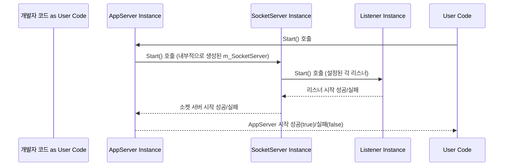

# Chapter 2: 애플리케이션 서버 (AppServer / AppServerBase)

[이전 챕터 (서버 설정 (IServerConfig))](01_서버_설정__iserverconfig__.md)에서는 서버의 기본적인 동작 규칙을 정하는 `IServerConfig`에 대해 배웠습니다. 마치 레스토랑의 운영 매뉴얼처럼, 서버가 어떤 IP 주소와 포트 번호를 사용하고, 얼마나 많은 손님(클라이언트)을 동시에 받을 수 있는지 등을 정의했죠.

이제, 이 운영 매뉴얼을 가지고 실제로 레스토랑을 운영하는 **총괄 매니저** 역할을 하는 구성 요소를 만나볼 차례입니다. SuperSocketLite에서는 이 역할을 **애플리케이션 서버 (AppServer)** 가 담당합니다.

## 왜 애플리케이션 서버가 필요할까요?

간단한 메아리(Echo) 서버를 만든다고 생각해 봅시다. 클라이언트가 메시지를 보내면, 서버는 받은 메시지를 그대로 다시 클라이언트에게 돌려주는 서버입니다.

이 서버를 만들기 위해서는 다음과 같은 일들을 처리할 누군가가 필요합니다.

1.  **서버 시작 및 중지:** 정해진 IP 주소와 포트 번호로 서버를 열고, 필요할 때 안전하게 닫아야 합니다.
2.  **클라이언트 맞이하기:** 새로운 클라이언트가 접속하면 연결을 수락하고, 각 클라이언트와의 통신을 준비해야 합니다.
3.  **손님(클라이언트) 관리:** 현재 접속 중인 모든 클라이언트들을 기억하고 관리해야 합니다. 누가 언제 접속했고, 마지막 활동은 언제였는지 등을 파악해야 하죠.
4.  **메시지 처리 연결:** 클라이언트로부터 메시지가 도착하면, 이 메시지를 분석하고 처리할 담당자(나중에 배울 [애플리케이션 세션 (AppSession)](03_애플리케이션_세션__appsession__.md))에게 전달해야 합니다.
5.  **설정 적용:** [서버 설정 (IServerConfig)](01_서버_설정__iserverconfig__.md)에 정의된 규칙(최대 접속자 수, 타임아웃 시간 등)에 따라 서버 전체를 운영해야 합니다.

이 모든 복잡한 조율과 관리를 담당하는 핵심 요소가 바로 **애플리케이션 서버 (AppServer)** 입니다. 마치 레스토랑의 매니저가 주방, 홀 서빙, 예약 관리 등 모든 것을 총괄 지휘하듯이, AppServer는 SuperSocketLite 기반 애플리케이션의 두뇌 역할을 수행합니다.

## `AppServer` 와 `AppServerBase` 란 무엇인가요?

SuperSocketLite에서 애플리케이션 서버 기능을 제공하는 핵심 클래스는 `AppServerBase`와 이를 상속받는 `AppServer` 입니다.

*   **`AppServerBase<TAppSession, TRequestInfo>`:**
    *   이것은 **추상 클래스(Abstract Class)** 입니다. 즉, 애플리케이션 서버가 갖춰야 할 기본적인 기능과 구조(뼈대)를 정의하지만, 일부 세부적인 구현(예: 접속한 세션들을 어떻게 저장하고 관리할지)은 직접 완성해야 하는 반제품과 같습니다.
    *   서버 시작/중지 로직, 설정 로드, 클라이언트 연결 수락 요청 처리, 보안 설정 적용 등 서버 운영의 핵심적인 부분들을 구현하고 있습니다.
    *   `TAppSession`은 각 클라이언트 연결을 나타내는 타입(다음 챕터에서 배울 [애플리케이션 세션 (AppSession)](03_애플리케이션_세션__appsession__.md)의 구체적인 타입), `TRequestInfo`는 클라이언트 요청 정보를 나타내는 타입(나중에 배울 [요청 정보 (IRequestInfo)](05_요청_정보__irequestinfo__.md)의 구체적인 타입)을 의미하는 제네릭 파라미터입니다. 지금은 그냥 'AppServer가 관리할 세션과 요청의 종류를 지정하는구나' 정도로 이해해도 충분합니다.

*   **`AppServer<TAppSession, TRequestInfo>`:**
    *   `AppServerBase`를 상속받아 만들어진 **구현 클래스(Concrete Class)** 입니다. `AppServerBase`가 제공하는 뼈대에 살을 붙여 완성된 제품이라고 할 수 있습니다.
    *   가장 큰 특징은 접속한 클라이언트 세션들을 **딕셔너리(Dictionary)** 라는 자료 구조를 사용해 효율적으로 관리하는 기능을 추가로 구현했다는 점입니다. (세션 ID를 키로 사용하여 빠르게 세션을 찾을 수 있습니다.)
    *   대부분의 경우, 우리는 이 `AppServer` 클래스 (또는 여기서 조금 더 기능을 추가한 `AppServer<TAppSession>`)를 직접 사용하거나 상속받아 우리만의 서버를 만들게 됩니다.

**비유:** `AppServerBase`는 '매니저의 역할 명세서'와 같고, `AppServer`는 그 명세서를 바탕으로 '실제로 손님 목록(딕셔너리)을 들고 일하는 매니저'와 같다고 생각할 수 있습니다.

## `AppServer` 사용하기 (간단한 서버 시작 예시)

이제 실제로 `AppServer`를 사용하여 서버를 설정하고 시작하는 기본적인 방법을 살펴보겠습니다. 이전 챕터에서 만든 `IServerConfig` 객체를 사용합니다.

```csharp
using SuperSocketLite.SocketBase;
using SuperSocketLite.SocketBase.Config;
using SuperSocketLite.SocketBase.Protocol; // StringRequestInfo 사용 위해 추가

// Chapter 1에서 생성한 서버 설정 객체
var serverConfig = new ServerConfig
{
    Name = "MyEchoServer",
    Ip = "Any",
    Port = 8080,
    MaxConnectionNumber = 50,
    Mode = SocketMode.Tcp,
    // ... 기타 설정들 ...
};

// AppServer 인스턴스 생성 (가장 기본적인 형태)
// AppSession과 StringRequestInfo를 사용한다고 가정합니다.
var appServer = new AppServer<AppSession, StringRequestInfo>();

// 1. 서버 설정(Config)을 사용하여 AppServer 설정(Setup)
if (!appServer.Setup(serverConfig))
{
    Console.WriteLine("서버 설정(Setup) 실패!");
    return;
}

// 2. AppServer 시작(Start)
if (!appServer.Start())
{
    Console.WriteLine("서버 시작(Start) 실패!");
    return;
}

Console.WriteLine($"{appServer.Name} 시작 완료! Port: {serverConfig.Port}");
Console.WriteLine("종료하려면 엔터 키를 누르세요...");

// 서버가 계속 실행되도록 대기 (실제 애플리케이션에서는 다른 방식으로 처리)
Console.ReadLine();

// 3. AppServer 중지(Stop)
appServer.Stop();

Console.WriteLine($"{appServer.Name} 종료됨.");
```

위 코드는 매우 간단한 서버의 시작과 종료 과정을 보여줍니다.

1.  `AppServer<AppSession, StringRequestInfo>` 객체를 생성합니다. 여기서 `AppSession`은 클라이언트 연결을 나타내는 기본 클래스이고, `StringRequestInfo`는 클라이언트 요청이 간단한 문자열 명령이라고 가정하는 기본 클래스입니다. (이들은 다음 챕터들에서 자세히 다룹니다.)
2.  `appServer.Setup(serverConfig)`: 이전 챕터에서 만든 `serverConfig` 객체를 넘겨주어 AppServer를 설정합니다. 이 단계에서 AppServer는 설정값을 읽고 내부적으로 필요한 준비를 합니다. (예: 사용할 포트 번호, 최대 접속자 수 등을 기억)
3.  `appServer.Start()`: 실제 서버를 시작하여 클라이언트의 연결을 기다리기 시작합니다. 내부적으로는 [소켓 서버 (SocketServer / SocketServerBase)](06_소켓_서버__socketserver___socketserverbase__.md)를 생성하고, 지정된 포트에서 [소켓 리스너 (ISocketListener)](08_소켓_리스너__isocketlistener__.md)를 동작시킵니다.
4.  `appServer.Stop()`: 실행 중인 서버를 안전하게 종료합니다. 모든 클라이언트 연결을 닫고 사용했던 자원들을 해제합니다.

**중요:** 위 코드는 서버를 시작하고 종료하는 뼈대일 뿐, 클라이언트가 접속했을 때 또는 메시지를 보냈을 때 **무엇을 할지에 대한 로직은 아직 없습니다.** 실제 동작하는 서버를 만들려면 클라이언트 연결 처리(`NewSessionConnected` 이벤트), 메시지 수신 처리(`NewRequestReceived` 이벤트) 등을 구현해야 합니다. 이는 다음 챕터들에서 자세히 다룰 내용입니다.

## `AppServer`의 주요 기능 (초보자 눈높이)

`AppServer`는 많은 기능을 가지고 있지만, 초보자 입장에서 가장 중요하게 알아야 할 몇 가지 기능을 살펴보겠습니다.

### 1. 서버 생명주기 관리 (Lifecycle Management)

*   **`Setup()`:** 서버를 시작하기 전에 필요한 설정을 로드하고 초기화하는 단계입니다. [서버 설정 (IServerConfig)](01_서버_설정__iserverconfig__.md) 객체를 전달받아 서버 운영에 필요한 정보들을 설정합니다.
*   **`Start()`:** 실제 서버를 가동시켜 클라이언트의 접속을 받을 준비를 완료합니다. 성공하면 `true`를 반환합니다.
*   **`Stop()`:** 실행 중인 서버를 안전하게 중지시킵니다. 모든 활성 [애플리케이션 세션 (AppSession)](03_애플리케이션_세션__appsession__.md)들을 닫고 리소스를 정리합니다.

### 2. 세션 관리 (Session Management)

`AppServer`는 자신에게 연결된 모든 클라이언트([애플리케이션 세션 (AppSession)](03_애플리케이션_세션__appsession__.md))를 관리합니다.

*   **`NewSessionConnected` 이벤트:** 새로운 클라이언트가 성공적으로 서버에 접속했을 때 발생하는 이벤트입니다. 이 이벤트를 구독(Subscribe)하여 클라이언트가 처음 접속했을 때 환영 메시지를 보내거나 필요한 초기화 작업을 수행할 수 있습니다.

    ```csharp
    // 클라이언트가 새로 접속했을 때 호출될 함수
    void AppServer_NewSessionConnected(AppSession session)
    {
        Console.WriteLine($"새 클라이언트 접속: {session.RemoteEndPoint}");
        session.Send("환영합니다!"); // 클라이언트에게 환영 메시지 전송
    }

    // 이벤트 핸들러 등록
    appServer.NewSessionConnected += AppServer_NewSessionConnected;
    ```

*   **`SessionClosed` 이벤트:** 클라이언트와의 연결이 끊어졌을 때 발생하는 이벤트입니다. 연결이 끊어진 이유(`CloseReason`)도 함께 전달됩니다. 이 이벤트를 사용하여 사용자가 나갔음을 기록하거나 관련 리소스를 정리할 수 있습니다.

    ```csharp
    // 클라이언트 접속이 끊겼을 때 호출될 함수
    void AppServer_SessionClosed(AppSession session, CloseReason reason)
    {
        Console.WriteLine($"클라이언트 접속 종료: {session.RemoteEndPoint}, 이유: {reason}");
        // 사용자가 나갔음을 DB에 기록하거나, 관련 데이터 정리 등
    }

    // 이벤트 핸들러 등록
    appServer.SessionClosed += AppServer_SessionClosed;
    ```

*   **`GetSessionByID(string sessionID)` 메서드:** 특정 세션 ID를 가진 클라이언트 세션 객체를 찾아 반환합니다. (세션 ID는 각 세션을 고유하게 식별하는 값입니다.)
*   **`GetAllSessions()` 메서드:** 현재 연결된 모든 클라이언트 세션의 목록을 가져옵니다. (주의: 이 메서드는 성능에 영향을 줄 수 있으므로 꼭 필요한 경우에만 사용하세요.)
*   **`SessionCount` 속성:** 현재 연결된 클라이언트의 수를 알려줍니다.

### 3. 요청 처리 (Request Handling)

클라이언트로부터 완전한 형태의 요청 데이터가 도착했을 때, `AppServer`는 이를 개발자가 정의한 로직으로 연결해 줍니다.

*   **`NewRequestReceived` 이벤트:** 클라이언트로부터 하나의 완전한 요청([요청 정보 (IRequestInfo)](05_요청_정보__irequestinfo__.md))이 수신되고 파싱되었을 때 발생하는 이벤트입니다. 이 이벤트에 실제 요청 처리 로직을 연결합니다.

    ```csharp
    // 클라이언트로부터 요청이 왔을 때 호출될 함수
    void AppServer_NewRequestReceived(AppSession session, StringRequestInfo requestInfo)
    {
        Console.WriteLine($"클라이언트 {session.RemoteEndPoint} 로부터 요청 수신:");
        Console.WriteLine($"  Key: {requestInfo.Key}"); // 요청 키 (예: 명령어)
        // requestInfo.Body 또는 Parameters 등을 사용하여 실제 처리 로직 구현
        // 예를 들어, 받은 메시지를 그대로 돌려주는 에코(Echo) 기능
        session.Send($"당신이 보낸 메시지({requestInfo.Key}): {requestInfo.Body}");
    }

    // 이벤트 핸들러 등록
    appServer.NewRequestReceived += AppServer_NewRequestReceived;
    ```

    위 예시에서는 `StringRequestInfo`를 사용한다고 가정했습니다. 이 객체는 보통 요청의 키(명령어)와 본문(데이터)으로 구성됩니다. (자세한 내용은 [요청 정보 (IRequestInfo)](05_요청_정보__irequestinfo__.md) 챕터에서 다룹니다.) 이 이벤트 핸들러 안에서 `requestInfo`의 내용을 분석하여 필요한 작업을 수행하고, `session.Send()` 메서드를 사용하여 클라이언트에게 응답을 보낼 수 있습니다.

## 내부 동작 방식 (간단히 엿보기)

`AppServer`가 어떻게 이 모든 일을 처리하는지 내부 동작을 간단히 살펴보겠습니다.

### 서버 시작 (`Start()`) 과정

1.  개발자가 `appServer.Start()`를 호출합니다.
2.  `AppServerBase`의 `Start()` 메서드가 호출됩니다.
3.  내부적으로 `IServerConfig` 설정을 바탕으로 실제 네트워크 통신을 담당할 [소켓 서버 (SocketServer / SocketServerBase)](06_소켓_서버__socketserver___socketserverbase__.md) 인스턴스를 생성합니다. (`m_SocketServer` 필드)
4.  `m_SocketServer.Start()`를 호출하여 소켓 서버를 시작시킵니다.
5.  소켓 서버는 설정된 각 리스너 정보([소켓 리스너 (ISocketListener)](08_소켓_리스너__isocketlistener__.md))에 따라 해당 IP 주소와 포트에서 클라이언트 연결을 기다리기 시작합니다. (`listener.Start()`)
6.  모든 리스너가 성공적으로 시작되면 `AppServer`의 상태가 'Running'으로 변경되고, `Start()` 메서드는 `true`를 반환합니다.



### 클라이언트 연결 및 요청 처리 과정 (개략적)

1.  클라이언트가 서버에 접속을 시도합니다.
2.  [소켓 리스너 (ISocketListener)](08_소켓_리스너__isocketlistener__.md)가 이 연결 요청을 감지하고 수락합니다.
3.  [소켓 서버 (SocketServer / SocketServerBase)](06_소켓_서버__socketserver___socketserverbase__.md)는 새로운 클라이언트 소켓(Socket)을 받아서 이를 위한 [소켓 세션 (SocketSession)](07_소켓_세션__socketsession__.md) 객체를 생성합니다.
4.  `AppServer`는 이 `SocketSession`을 기반으로 대응되는 [애플리케이션 세션 (AppSession)](03_애플리케이션_세션__appsession__.md) 객체를 생성합니다 (`CreateAppSession`).
5.  생성된 `AppSession`을 내부 세션 관리자(예: `AppServer`의 딕셔너리)에 등록합니다 (`RegisterSession`).
6.  `NewSessionConnected` 이벤트가 발생하여 개발자가 정의한 로직이 실행됩니다.
7.  클라이언트가 데이터를 보내면 `SocketSession`이 데이터를 수신합니다.
8.  데이터는 설정된 [수신 필터 (IReceiveFilter)](04_수신_필터__ireceivefilter__.md)에 의해 분석되어 완전한 요청([요청 정보 (IRequestInfo)](05_요청_정보__irequestinfo__.md))으로 변환됩니다.
9.  `AppServer`의 `NewRequestReceived` 이벤트가 발생하고, 해당 `AppSession`과 `IRequestInfo` 객체가 전달되어 개발자가 정의한 요청 처리 로직이 실행됩니다.

### 관련 코드 엿보기

`AppServerBase` 클래스는 서버의 기본적인 설정과 시작/중지 로직을 담당합니다.

```csharp
// 파일: SocketBase/AppServerBase.cs (일부 발췌 및 간략화)
public abstract partial class AppServerBase<TAppSession, TRequestInfo> : IAppServer<TAppSession, TRequestInfo>, ...
{
    public IServerConfig Config { get; private set; } // 서버 설정 저장
    private ISocketServer m_SocketServer; // 실제 소켓 통신 담당
    private int m_StateCode = ServerStateConst.NotInitialized; // 서버 상태

    // 서버 설정 메서드 (Setup)
    public bool Setup(IRootConfig rootConfig, IServerConfig config, ...)
    {
        TrySetInitializedState(); // 초기화 상태 확인
        SetupBasic(rootConfig, config, socketServerFactory); // 기본 설정
        // ... 중략 ...
        SetupLogFactory(logFactory); // 로깅 설정
        Logger = CreateLogger(this.Name); // 로거 생성
        if (!SetupMedium(receiveFilterFactory, connectionFilters)) return false; // 중간 단계 설정
        if (!SetupAdvanced(config)) return false; // 고급 설정 (보안, 리스너 등)
        if (!Setup(rootConfig, config)) return false; // 사용자 정의 추가 설정
        if (!SetupFinal()) return false; // 최종 설정 (소켓 서버 생성 등)
        m_StateCode = ServerStateConst.NotStarted; // 설정 완료, 시작 대기 상태
        return true;
    }

    // 서버 시작 메서드 (Start)
    public virtual bool Start()
    {
        // 상태 변경 시도 (NotStarted -> Starting)
        if (Interlocked.CompareExchange(ref m_StateCode, ServerStateConst.Starting, ServerStateConst.NotStarted) != ServerStateConst.NotStarted)
        {
            // 이미 시작되었거나 다른 상태이면 실패
            Logger.Error("...");
            return false;
        }

        // 내부 소켓 서버 시작
        if (!m_SocketServer.Start())
        {
            m_StateCode = ServerStateConst.NotStarted; // 실패 시 상태 복원
            return false;
        }

        StartedTime = DateTime.Now; // 시작 시간 기록
        m_StateCode = ServerStateConst.Running; // 실행 중 상태로 변경

        OnStarted(); // 시작 완료 후 처리 로직 호출

        Logger.Info($"{Name} 서버 시작됨!");
        return true;
    }

    // 서버 중지 메서드 (Stop) - 유사한 로직
    public virtual void Stop() { /* ... m_SocketServer.Stop() 호출 등 ... */ }

    // 새로운 세션 연결 시 호출될 내부 메서드
    internal bool OnRawDataReceived(IAppSession session, byte[] buffer, int offset, int length) { /* ... */ }

    // 새로운 요청 수신 시 호출될 내부 메서드
    internal void ExecuteCommand(IAppSession session, TRequestInfo requestInfo)
    {
        // 등록된 NewRequestReceived 이벤트 핸들러 호출 등
        m_RequestHandler?.Invoke((TAppSession)session, requestInfo);
    }

    // ... 기타 여러 메서드들 ...
}
```

`AppServer` 클래스는 `AppServerBase`를 상속받아 세션 관리를 위한 딕셔너리 기능을 추가합니다.

```csharp
// 파일: SocketBase/AppServer.cs (일부 발췌 및 간략화)
public class AppServer<TAppSession, TRequestInfo> : AppServerBase<TAppSession, TRequestInfo>
    where TRequestInfo : class, IRequestInfo
    where TAppSession : AppSession<TAppSession, TRequestInfo>, IAppSession, new()
{
    // 세션을 저장하기 위한 동시성 지원 딕셔너리
    private ConcurrentDictionary<string, TAppSession> m_SessionDict
        = new ConcurrentDictionary<string, TAppSession>(StringComparer.OrdinalIgnoreCase);

    // 세션을 딕셔너리에 등록하는 메서드 (AppServerBase에서 호출됨)
    protected override bool RegisterSession(string sessionID, TAppSession appSession)
    {
        // 딕셔너리에 추가 시도
        if (m_SessionDict.TryAdd(sessionID, appSession))
            return true; // 성공

        // 실패 (이미 같은 ID의 세션이 존재)
        Logger.Error($"{sessionID} 세션 등록 실패: 이미 존재함");
        return false;
    }

    // 세션 ID로 세션을 찾는 메서드
    public override TAppSession GetSessionByID(string sessionID)
    {
        if (string.IsNullOrEmpty(sessionID))
            return null;

        m_SessionDict.TryGetValue(sessionID, out TAppSession targetSession);
        return targetSession; // 찾았으면 반환, 없으면 null 반환
    }

    // 세션 연결 종료 시 딕셔너리에서 제거하는 메서드 (AppServerBase에서 호출됨)
    protected override void OnSessionClosed(TAppSession session, CloseReason reason)
    {
        if (!string.IsNullOrEmpty(session.SessionID))
        {
            // 딕셔너리에서 제거 시도
            m_SessionDict.TryRemove(session.SessionID, out _);
        }
        base.OnSessionClosed(session, reason); // 부모 클래스의 종료 처리 호출
    }

    // 현재 세션 수 반환
    public override int SessionCount => m_SessionDict.Count;

    // 모든 세션 목록 반환 (주기적으로 스냅샷을 찍어 성능 개선)
    public override IEnumerable<TAppSession> GetAllSessions()
    {
        // 스냅샷 기능 활성화 시 스냅샷 반환, 아니면 딕셔너리 복사본 반환
        var sessionSource = SessionSource;
        return sessionSource?.Select(p => p.Value);
    }

    // ... 타임아웃 세션 정리, 세션 스냅샷 타이머 관련 로직 등 ...
}
```

이처럼 `AppServer`와 `AppServerBase`는 서버의 핵심적인 운영과 관리를 담당하며, 다른 구성 요소들([IServerConfig](01_서버_설정__iserverconfig__.md), [AppSession](03_애플리케이션_세션__appsession__.md), [IReceiveFilter](04_수신_필터__ireceivefilter__.md), [SocketServer](06_소켓_서버__socketserver___socketserverbase__.md) 등)과 긴밀하게 협력하여 동작합니다.

## 정리 및 다음 단계

이번 챕터에서는 SuperSocketLite 애플리케이션의 **총괄 매니저** 역할을 하는 `AppServer`와 그 기반인 `AppServerBase`에 대해 알아보았습니다. `AppServer`는 서버의 생명주기를 관리하고, 클라이언트 연결(세션)을 추적하며, 들어오는 요청을 처리 로직으로 연결하는 등 서버 운영의 중심적인 역할을 수행한다는 것을 배웠습니다. 또한, 간단한 코드를 통해 `AppServer`를 설정하고 시작하는 방법과 주요 이벤트(`NewSessionConnected`, `SessionClosed`, `NewRequestReceived`)를 사용하는 기본적인 방법을 살펴보았습니다.

이제 서버의 전체적인 구조와 운영을 담당하는 매니저를 만났으니, 다음으로는 각 클라이언트(손님)를 개별적으로 담당하고 통신하는 **담당자** 역할인 **애플리케이션 세션 (AppSession)** 에 대해 자세히 알아볼 차례입니다. AppSession은 서버와 특정 클라이언트 간의 연결 상태와 통신 방법을 정의합니다.

다음 챕터에서 만나요!

**다음 챕터:** [Chapter 3: 애플리케이션 세션 (AppSession)](03_애플리케이션_세션__appsession__.md)

---

Generated by [AI Codebase Knowledge Builder](https://github.com/The-Pocket/Tutorial-Codebase-Knowledge)