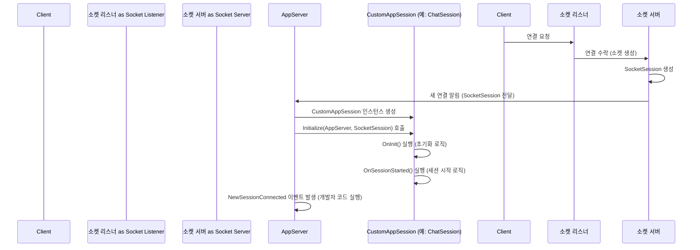

# Chapter 3: 애플리케이션 세션 (AppSession)

[이전 챕터 (애플리케이션 서버 (AppServer / AppServerBase))](02_애플리케이션_서버__appserver___appserverbase__.md)에서는 서버 전체를 운영하고 관리하는 **총괄 매니저**, 즉 `AppServer`에 대해 배웠습니다. `AppServer`는 서버를 시작하고, 새로운 클라이언트 연결을 받아들이며, 기본적인 관리 작업을 수행했죠.

하지만 서버에 여러 클라이언트가 동시에 접속하면 어떻게 될까요? 각 클라이언트는 자신만의 상태(예: 로그인 정보, 장바구니 내용, 게임 캐릭터 위치 등)를 가지고 있을 수 있습니다. 서버는 이 모든 클라이언트를 개별적으로 기억하고 상호작용해야 합니다.

바로 이럴 때 등장하는 것이 **애플리케이션 세션 (AppSession)** 입니다. AppSession은 서버에 연결된 **개별 클라이언트를 대표하는 객체**입니다. 마치 레스토랑에서 각 테이블마다 담당 웨이터가 배정되는 것과 같습니다. 웨이터는 자신이 맡은 테이블의 손님(클라이언트)이 누구인지, 무엇을 주문했는지, 추가로 필요한 것은 없는지 등을 기억하고 서비스를 제공합니다. AppSession도 마찬가지로 특정 클라이언트와의 연결 상태, 데이터, 그리고 해당 클라이언트와 관련된 로직을 관리하는 역할을 합니다.

간단한 채팅 서버를 만든다고 상상해 봅시다. 여러 사용자가 서버에 접속해서 대화를 나눕니다. 서버는 각 사용자를 구분해야 하고, 사용자마다 고유한 닉네임을 부여하고 싶습니다. 이럴 때 AppSession이 각 사용자의 '담당 웨이터' 역할을 하여, 사용자의 닉네임과 같은 개별 정보를 저장하고 관리하게 됩니다.

## AppSession이란 무엇인가요?

`AppSession`은 SuperSocketLite에서 서버에 연결된 **단일 클라이언트 연결**을 추상화한 개념입니다. 좀 더 자세히 살펴보면 다음과 같은 역할을 수행합니다.

1.  **클라이언트 대변인:** 서버 코드 내에서 특정 클라이언트와의 연결 그 자체를 나타냅니다.
2.  **상태 저장소:** 해당 클라이언트와 관련된 데이터를 저장합니다. 예를 들어, 사용자의 ID, 닉네임, 로그인 상태, 마지막 활동 시간 등을 `AppSession` 객체 안에 저장할 수 있습니다.
3.  **통신 창구:** 해당 클라이언트에게 데이터를 보내거나(`Send()`), 클라이언트로부터 받은 데이터를 처리하는 로직과 연결됩니다. (데이터 수신 자체는 내부의 [소켓 세션 (SocketSession)](07_소켓_세션__socketsession__.md)과 [수신 필터 (IReceiveFilter)](04_수신_필터__ireceivefilter__.md)가 처리하지만, AppSession이 그 최종 결과물을 받아 처리 로직으로 연결합니다.)
4.  **개별 로직 수행:** 특정 클라이언트에게만 적용되는 로직(예: 특정 권한 확인, 맞춤 응답 생성)을 수행할 수 있는 기반을 제공합니다.

SuperSocketLite는 `AppSession`을 위한 여러 기본 클래스를 제공합니다.

*   `AppSession<TAppSession, TRequestInfo>`: 가장 기본적인 제네릭 추상 클래스입니다. 우리가 만들 구체적인 세션 클래스(`TAppSession`)와 요청 정보 클래스(`TRequestInfo`) 타입을 지정해야 합니다.
*   `AppSession<TAppSession>`: 요청 정보 타입으로 `StringRequestInfo` (문자열 기반 요청 정보)를 사용하도록 미리 지정한 편리한 클래스입니다. `AppSession<TAppSession, StringRequestInfo>`를 상속받습니다.
*   `AppSession`: 가장 간단한 형태로, `AppSession<AppSession, StringRequestInfo>`를 상속받습니다. 추가적인 커스터마이징 없이 기본 `AppSession` 기능을 사용하고 싶을 때 쓸 수 있습니다.

대부분의 경우, 우리는 `AppSession<TAppSession>` 또는 `AppSession<TAppSession, TRequestInfo>`를 **상속**받아 우리 애플리케이션에 맞는 **커스텀 세션 클래스**를 만들게 됩니다.

## AppSession 사용하기 (채팅 닉네임 예시)

이제 `AppSession`을 사용하여 각 클라이언트에게 닉네임을 부여하고 관리하는 간단한 예시를 만들어 보겠습니다.

### 1. 커스텀 세션 클래스 만들기

먼저, `AppSession`을 상속받아 `Nickname`이라는 속성을 추가한 `ChatSession` 클래스를 만듭니다.

```csharp
using SuperSocketLite.SocketBase;
using SuperSocketLite.SocketBase.Protocol; // StringRequestInfo 사용 위해

// AppSession<ChatSession>을 상속받아 ChatSession 클래스 정의
// AppSession<ChatSession>은 내부적으로 StringRequestInfo를 사용합니다.
public class ChatSession : AppSession<ChatSession>
{
    // 각 클라이언트 세션이 가질 닉네임 속성 추가
    public string? Nickname { get; set; }

    // 세션이 처음 시작될 때 호출되는 메서드 재정의
    protected override void OnSessionStarted()
    {
        // 처음 접속 시 닉네임 설정을 요청하는 메시지 전송
        this.Send("환영합니다! 닉네임을 설정해주세요. 예: /nick 내닉네임");
        base.OnSessionStarted(); // 기본 동작도 호출
    }

    // 세션 연결이 닫힐 때 호출되는 메서드 재정의
    protected override void OnSessionClosed(CloseReason reason)
    {
        // 닉네임이 설정된 사용자였다면, 다른 사용자들에게 퇴장 알림
        if (!string.IsNullOrEmpty(Nickname))
        {
            // AppServer를 통해 모든 세션에게 메시지 보내기 (Broadcasting - AppServer 기능)
            // (참고: 실제 구현은 AppServer에서 처리해야 함)
            // this.AppServer.Broadcast($"{Nickname}님이 퇴장했습니다.");
            Console.WriteLine($"{Nickname} ({this.RemoteEndPoint}) 퇴장. 이유: {reason}");
        }
        base.OnSessionClosed(reason); // 기본 동작도 호출
    }

    // 알 수 없는 요청(명령)을 받았을 때 처리하는 메서드 재정의
    protected override void HandleUnknownRequest(StringRequestInfo requestInfo)
    {
        this.Send($"알 수 없는 명령입니다: {requestInfo.Key}");
    }
}
```

*   `AppSession<ChatSession>`를 상속받아 `ChatSession` 클래스를 정의했습니다. 이제 `ChatSession` 객체는 `AppSession`의 모든 기능을 가지면서 추가로 `Nickname` 속성을 갖게 됩니다.
*   `OnSessionStarted()`: 클라이언트가 처음 접속했을 때 자동으로 호출되는 메서드입니다. 여기서는 환영 메시지와 닉네임 설정 방법을 안내합니다.
*   `OnSessionClosed()`: 클라이언트 연결이 끊어졌을 때 호출됩니다. 만약 닉네임이 설정되어 있었다면 콘솔에 퇴장 로그를 남깁니다. (실제 채팅 서버라면 다른 사용자들에게 퇴장 사실을 알리는 로직이 필요합니다.)
*   `HandleUnknownRequest()`: 서버가 이해할 수 없는 요청(예: 정의되지 않은 명령어)을 받았을 때 호출됩니다. 여기서는 클라이언트에게 알 수 없는 명령이라고 응답합니다.

### 2. AppServer에서 커스텀 세션 사용하기

이제 [이전 챕터](02_애플리케이션_서버__appserver___appserverbase__.md)에서 배운 `AppServer`를 설정할 때, 우리가 만든 `ChatSession`을 사용하도록 지정해야 합니다.

```csharp
using SuperSocketLite.SocketBase;
using SuperSocketLite.SocketBase.Config;
using SuperSocketLite.SocketBase.Protocol; // StringRequestInfo

// ... (ChatSession 클래스 정의는 위에 있다고 가정) ...

// 서버 설정 (Chapter 1 내용)
var serverConfig = new ServerConfig { /* ... 설정값들 ... */ Port = 2024 };

// AppServer 인스턴스 생성 시 ChatSession과 StringRequestInfo를 지정!
var appServer = new AppServer<ChatSession, StringRequestInfo>(); // ChatSession 사용

// 클라이언트가 새로 접속했을 때 처리 (AppServer 이벤트)
appServer.NewSessionConnected += (session) =>
{
    // session 파라미터는 이제 우리가 정의한 ChatSession 타입입니다!
    Console.WriteLine($"새 클라이언트 접속: {session.RemoteEndPoint}, SessionID: {session.SessionID}");
    // OnSessionStarted()가 자동으로 호출되어 환영 메시지가 전송됩니다.
};

// 클라이언트로부터 요청이 왔을 때 처리 (AppServer 이벤트)
appServer.NewRequestReceived += (session, requestInfo) =>
{
    // requestInfo.Key는 명령어 (예: "NICK"), requestInfo.Body는 나머지 내용
    Console.WriteLine($"[{session.SessionID}] 요청 수신: {requestInfo.Key} {requestInfo.Body}");

    // 닉네임 설정 명령 처리
    if (requestInfo.Key.Equals("NICK", StringComparison.OrdinalIgnoreCase))
    {
        var newNickname = requestInfo.Body.Trim();
        if (!string.IsNullOrEmpty(newNickname))
        {
            // ChatSession의 Nickname 속성에 값 할당
            session.Nickname = newNickname;
            session.Send($"닉네임이 '{session.Nickname}'(으)로 설정되었습니다.");
            Console.WriteLine($"[{session.SessionID}] 닉네임 설정: {session.Nickname}");
        }
        else
        {
            session.Send("닉네임은 공백일 수 없습니다.");
        }
    }
    // 다른 명령 처리 (예: 메시지 보내기 "MSG 안녕하세요")
    else if (requestInfo.Key.Equals("MSG", StringComparison.OrdinalIgnoreCase))
    {
        if(string.IsNullOrEmpty(session.Nickname))
        {
             session.Send("닉네임을 먼저 설정해야 메시지를 보낼 수 있습니다. (/nick 이름)");
             return;
        }
        // 실제 채팅 서버라면 여기서 다른 세션들에게 메시지를 전달 (Broadcast)
        var message = requestInfo.Body;
        Console.WriteLine($"[{session.Nickname}]: {message}");
        // 임시로 보낸 사람에게만 다시 보냄
        session.Send($"[{session.Nickname}]: {message}");
    }
    else
    {
        // 알 수 없는 명령은 ChatSession의 HandleUnknownRequest가 처리하도록 유도 가능
        // (또는 여기서 직접 처리)
        session.InternalHandleUnknownRequest(requestInfo);
    }
};

// 서버 설정 및 시작 (Chapter 2 내용)
if (!appServer.Setup(serverConfig)) { /* ... 에러 처리 ... */ return; }
if (!appServer.Start()) { /* ... 에러 처리 ... */ return; }

Console.WriteLine("채팅 서버 시작됨! Port: 2024");
Console.ReadLine(); // 서버 실행 유지
appServer.Stop();
```

*   `AppServer<ChatSession, StringRequestInfo>()` : `AppServer`를 생성할 때 제네릭 파라미터로 우리가 만든 `ChatSession`을 지정했습니다. 이렇게 하면 `AppServer`는 새로운 클라이언트가 연결될 때마다 `ChatSession` 타입의 객체를 자동으로 생성하여 관리합니다.
*   `appServer.NewSessionConnected += (session) => { ... }`: 새로운 클라이언트가 접속했을 때 실행되는 코드입니다. 여기서 `session` 파라미터는 `ChatSession` 타입이므로, `session.Nickname` 같은 커스텀 속성에 접근할 수 있습니다 (물론 이 시점에는 아직 `null`입니다). `ChatSession`의 `OnSessionStarted()` 메서드가 내부적으로 호출되어 클라이언트에게 첫 메시지를 보냅니다.
*   `appServer.NewRequestReceived += (session, requestInfo) => { ... }`: 클라이언트로부터 요청이 도착했을 때 실행됩니다.
    *   `session` 파라미터는 역시 `ChatSession` 타입입니다.
    *   `requestInfo`는 클라이언트가 보낸 데이터를 [수신 필터 (IReceiveFilter)](04_수신_필터__ireceivefilter__.md)가 분석하여 만든 [요청 정보 (IRequestInfo)](05_요청_정보__irequestinfo__.md) 객체입니다. 여기서는 `StringRequestInfo`를 사용하므로, `Key` (명령어)와 `Body` (내용) 등으로 구분됩니다. (자세한 내용은 다음 챕터들에서!)
    *   "NICK" 명령어를 받으면 `session.Nickname` 속성에 값을 저장합니다. 각 `session` 객체는 독립적이므로, 다른 클라이언트의 닉네임에 영향을 주지 않습니다.
    *   "MSG" 명령어를 받으면 닉네임이 설정되었는지 확인하고 메시지를 처리합니다.
    *   `session.Send(...)`를 사용하여 **해당 클라이언트에게만** 응답 메시지를 보냅니다.

이제 각 클라이언트는 자신만의 `ChatSession` 인스턴스를 가지게 되고, 이 인스턴스는 해당 클라이언트의 닉네임 정보를 독립적으로 저장하고 관리합니다. 이것이 `AppSession`의 핵심 역할입니다!

## AppSession의 주요 기능 살펴보기

`AppSession` 클래스 (그리고 우리가 상속받은 커스텀 클래스)는 개별 클라이언트와의 상호작용을 위한 다양한 속성과 메서드를 제공합니다.

*   **식별 정보:**
    *   `SessionID` (string): 각 세션을 고유하게 식별하는 ID입니다. SuperSocketLite가 자동으로 생성합니다.
    *   `RemoteEndPoint` (IPEndPoint): 연결된 클라이언트의 IP 주소와 포트 번호입니다.
    *   `LocalEndPoint` (IPEndPoint): 서버에서 이 연결을 위해 사용하고 있는 로컬 IP 주소와 포트 번호입니다.
*   **상태 정보:**
    *   `Connected` (bool): 현재 세션이 연결 상태인지 여부를 나타냅니다.
    *   `LastActiveTime` (DateTime): 이 세션에서 마지막으로 데이터 송수신이 있었던 시간입니다. [서버 설정 (IServerConfig)](01_서버_설정__iserverconfig__.md)의 `IdleSessionTimeOut`과 연계하여 유휴 상태의 클라이언트를 감지하는 데 사용됩니다.
    *   `StartTime` (DateTime): 세션이 시작된 시간입니다.
*   **데이터 저장:**
    *   **사용자 정의 속성:** 위 예시의 `Nickname`처럼 클래스에 직접 속성을 추가하여 클라이언트 관련 데이터를 저장하는 것이 가장 일반적입니다.
    *   `Items` (IDictionary<object, object>): 세션과 관련된 임시 데이터를 저장할 수 있는 딕셔너리입니다. 간단한 플래그 값 등을 저장할 때 유용할 수 있습니다.
        ```csharp
        // ChatSession 클래스 내부에 있다고 가정
        public void MarkAsVerified()
        {
            this.Items["IsVerified"] = true;
        }

        public bool CheckIfVerified()
        {
            return this.Items.ContainsKey("IsVerified") && (bool)this.Items["IsVerified"];
        }
        ```
*   **통신:**
    *   `Send(string message)` / `Send(byte[] data, int offset, int length)` / `Send(ArraySegment<byte> segment)` / `Send(IList<ArraySegment<byte>> segments)`: 클라이언트에게 데이터를 보냅니다. 내부적으로는 비동기적으로 처리될 수 있으며, 보내기 큐가 꽉 차 있는 경우 설정된 타임아웃(`SendTimeOut`)까지 대기하거나 예외를 발생시킬 수 있습니다.
    *   `TrySend(...)`: `Send`와 유사하지만, 보내기 큐가 즉시 수용할 수 없는 경우 데이터를 버리고 `false`를 반환합니다. 블로킹 없이 빠르게 전송 시도를 하고 싶을 때 사용합니다.
    *   `Charset` (Encoding): 문자열을 주고받을 때 사용할 인코딩 방식입니다(기본값은 `AppServer`의 설정을 따름). 보통 UTF-8을 많이 사용합니다.
*   **세션 생명주기 메서드 (재정의 가능):**
    *   `OnInit()`: 세션 객체가 초기화될 때(`Initialize` 메서드 내부에서) 호출됩니다. 세션에 필요한 리소스를 준비하는 등의 작업을 할 수 있습니다.
    *   `OnSessionStarted()`: 세션이 완전히 시작되고 클라이언트와 통신이 가능한 상태가 되었을 때 호출됩니다. 위 예시처럼 초기 메시지를 보내는 데 사용하기 좋습니다.
    *   `OnSessionClosed(CloseReason reason)`: 세션 연결이 종료될 때 호출됩니다. 종료 이유(`CloseReason`)도 함께 전달되어, 왜 연결이 끊어졌는지(예: 클라이언트 요청, 서버 종료, 타임아웃, 프로토콜 오류 등) 알 수 있습니다. 사용자가 사용하던 리소스를 정리하는 등의 작업을 합니다.
*   **오류 및 요청 처리 메서드 (재정의 가능):**
    *   `HandleException(Exception e)`: 세션과 관련된 요청을 처리하는 도중 예외가 발생했을 때 호출됩니다. 기본적으로는 오류를 로깅하고 세션을 닫습니다. 필요에 따라 특정 예외를 다르게 처리하도록 재정의할 수 있습니다.
    *   `HandleUnknownRequest(TRequestInfo requestInfo)`: `AppServer`에서 해당 요청을 처리할 로직을 찾지 못했을 때 호출될 수 있습니다. (위 예시의 `StringRequestInfo` 버전처럼) 기본 구현은 비어있거나 간단한 응답을 보낼 수 있습니다.
*   **연결 제어:**
    *   `Close()` / `Close(CloseReason reason)`: 현재 세션 연결을 종료합니다.

## 내부 동작 방식 (간단히 엿보기)

`AppSession`은 어떻게 생성되고 `AppServer` 및 다른 구성 요소들과 상호작용할까요?

### 세션 생성 및 초기화 과정

1.  클라이언트가 서버에 접속합니다.
2.  서버의 [소켓 리스너 (ISocketListener)](08_소켓_리스너__isocketlistener__.md)가 연결을 수락하고, 내부적으로 클라이언트와 통신할 기본 소켓(Socket)을 생성합니다.
3.  [소켓 서버 (SocketServer / SocketServerBase)](06_소켓_서버__socketserver___socketserverbase__.md)는 이 소켓을 관리하기 위한 [소켓 세션 (SocketSession)](07_소켓_세션__socketsession__.md) 객체를 생성합니다. `SocketSession`은 실제 네트워크 데이터 송수신을 담당합니다.
4.  `SocketServer`는 새로운 연결이 생성되었음을 `AppServer`에게 알립니다.
5.  `AppServer`는 설정 시 지정된 `AppSession` 타입(예: `ChatSession`)의 새 인스턴스를 생성합니다. (`CreateAppSession` 메서드 호출)
6.  생성된 `AppSession` 인스턴스의 `Initialize(appServer, socketSession)` 메서드를 호출합니다.
    *   `Initialize` 메서드 내부에서는 `AppServer` 참조, `SocketSession` 참조, `SessionID` 등을 `AppSession` 객체에 저장합니다.
    *   또한, 클라이언트로부터 들어오는 데이터를 해석할 [수신 필터 (IReceiveFilter)](04_수신_필터__ireceivefilter__.md) 인스턴스를 생성하고 설정합니다.
    *   `OnInit()` 메서드를 호출합니다.
7.  `AppSession`의 `StartSession()` 메서드가 호출되고, 이 안에서 `OnSessionStarted()` 메서드가 호출됩니다. 이제 세션은 완전히 준비된 상태입니다.
8.  마지막으로 `AppServer`는 `NewSessionConnected` 이벤트를 발생시켜, 개발자가 정의한 접속 처리 코드가 실행되도록 합니다.

아래는 이 과정을 시각적으로 보여주는 간단한 순서 다이어그램입니다.



### 데이터 수신 및 처리 과정

1.  클라이언트가 데이터를 보냅니다.
2.  `SocketSession`이 네트워크로부터 데이터를 수신합니다.
3.  수신된 데이터(바이트 배열)는 `AppSession`의 `ProcessRequest()` 메서드로 전달됩니다.
4.  `ProcessRequest()` 메서드는 내부적으로 가지고 있는 [수신 필터 (IReceiveFilter)](04_수신_필터__ireceivefilter__.md) (`m_ReceiveFilter`)를 사용하여 데이터를 분석합니다.
5.  수신 필터는 정해진 규칙(프로토콜)에 따라 데이터를 파싱하여 의미 있는 하나의 요청 단위([요청 정보 (IRequestInfo)](05_요청_정보__irequestinfo__.md))로 만듭니다. (예: 줄바꿈 문자까지 읽어서 하나의 문자열 요청으로 만들기)
6.  완전한 요청이 만들어지면, `AppSession`은 이 `IRequestInfo` 객체를 `AppServer`에게 전달합니다.
7.  `AppServer`는 `NewRequestReceived` 이벤트를 발생시키고, 해당 `AppSession`과 생성된 `IRequestInfo` 객체를 이벤트 핸들러에게 넘겨줍니다.
8.  개발자가 `NewRequestReceived` 이벤트에 등록한 코드(예: 닉네임 설정, 메시지 처리 로직)가 실행됩니다.

### 관련 코드 엿보기

`AppSession`의 핵심 로직은 `SocketBase/AppSession.cs` 파일에 정의되어 있습니다.

`Initialize` 메서드는 세션 객체를 설정하는 중요한 역할을 합니다.

```csharp
// 파일: SocketBase/AppSession.cs (일부 발췌 및 간략화)
public abstract class AppSession<TAppSession, TRequestInfo> : IAppSession, ...
    where TAppSession : AppSession<TAppSession, TRequestInfo>, IAppSession, new()
    where TRequestInfo : class, IRequestInfo
{
    public virtual AppServerBase<TAppSession, TRequestInfo> AppServer { get; private set; }
    public ISocketSession SocketSession { get; private set; }
    public string SessionID { get; private set; }
    public Encoding Charset { get; set; }
    IReceiveFilter<TRequestInfo> m_ReceiveFilter; // 수신 필터

    // 세션 초기화 메서드
    public virtual void Initialize(IAppServer<TAppSession, TRequestInfo> appServer, ISocketSession socketSession)
    {
        var castedAppServer = (AppServerBase<TAppSession, TRequestInfo>)appServer;
        AppServer = castedAppServer; // AppServer 참조 저장
        Charset = castedAppServer.TextEncoding; // 기본 문자 인코딩 설정
        SocketSession = socketSession; // SocketSession 참조 저장
        SessionID = socketSession.SessionID; // 세션 ID 설정
        m_Connected = true; // 연결 상태로 설정

        // AppServer의 팩토리를 사용해 이 세션에 맞는 수신 필터 생성
        m_ReceiveFilter = castedAppServer.ReceiveFilterFactory.CreateFilter(appServer, this, socketSession.RemoteEndPoint);

        // 수신 필터가 초기화가 필요하면 수행 (IReceiveFilterInitializer 구현 시)
        var filterInitializer = m_ReceiveFilter as IReceiveFilterInitializer;
        if (filterInitializer != null)
            filterInitializer.Initialize(castedAppServer, this);

        // SocketSession에도 AppSession 참조 전달 (상호 참조)
        socketSession.Initialize(this);

        // 사용자 정의 초기화 로직 호출
        OnInit();
    }

    // 사용자가 재정의할 수 있는 초기화 메서드
    protected virtual void OnInit()
    {
        // 여기에 세션별 초기화 코드 작성 가능
    }

    // 세션 시작 시 호출 (StartSession() 내부에서)
    protected virtual void OnSessionStarted()
    {
        // 여기에 세션 시작 시 필요한 코드 작성 가능 (예: 환영 메시지 전송)
    }

    // 세션 시작 진입점 (IAppSession 인터페이스 구현)
    void IAppSession.StartSession()
    {
        OnSessionStarted(); // 실제 시작 로직 호출
    }
    // ... (다른 메서드들) ...
}
```

데이터를 보내는 `Send` 메서드는 내부적으로 `SocketSession`의 기능을 사용합니다.

```csharp
// 파일: SocketBase/AppSession.cs (Send 메서드 관련 부분 간략화)
public abstract class AppSession<TAppSession, TRequestInfo> : IAppSession, ...
{
    // ... (다른 속성 및 메서드) ...

    // 문자열 메시지를 보내는 메서드
    public virtual void Send(string message)
    {
        // 설정된 Charset을 사용해 문자열을 바이트 배열로 변환
        var data = this.Charset.GetBytes(message);
        // 내부 Send 메서드 호출
        Send(data, 0, data.Length);
    }

    // 바이트 배열 데이터를 보내는 메서드
    public virtual void Send(byte[] data, int offset, int length)
    {
        // 실제 전송 로직 호출 (ArraySegment 사용)
        InternalSend(new ArraySegment<byte>(data, offset, length));
    }

    // ArraySegment 데이터를 보내는 내부 로직 (TrySend와 유사하게 동작)
    private void InternalSend(ArraySegment<byte> segment)
    {
        if (!m_Connected) // 연결되어 있지 않으면 전송 시도 안 함
            return;

        // SocketSession의 TrySend를 이용해 즉시 전송 시도
        if (InternalTrySend(segment))
            return; // 성공하면 바로 반환

        // 즉시 전송 실패 시 (예: 보내기 큐가 꽉 참)
        var sendTimeOut = Config.SendTimeOut; // 설정된 타임아웃 값 가져오기

        if (sendTimeOut < 0) // 타임아웃 < 0 이면 즉시 예외 발생
        {
            throw new TimeoutException("전송 시도가 타임아웃되었습니다 (즉시 실패 설정)");
        }

        var timeOutTime = sendTimeOut > 0 ? DateTime.Now.AddMilliseconds(sendTimeOut) : DateTime.Now;
        var spinWait = new SpinWait(); // 짧은 대기를 위한 SpinWait 사용

        // 연결된 상태이고 타임아웃되지 않았다면 계속 재시도
        while (m_Connected)
        {
            spinWait.SpinOnce(); // CPU 잠시 양보하며 대기

            if (InternalTrySend(segment)) // 다시 전송 시도
                return; // 성공하면 반환

            // 타임아웃 > 0 일 때만 시간 체크
            if (sendTimeOut > 0 && DateTime.Now >= timeOutTime)
            {
                throw new TimeoutException("전송 시도가 타임아웃되었습니다");
            }
            // 타임아웃 = 0 이면 무한 대기 (주의!)
        }
    }

    // 실제 SocketSession의 TrySend를 호출하는 도우미 메서드
    private bool InternalTrySend(ArraySegment<byte> segment)
    {
        // SocketSession의 비동기 전송 큐에 데이터 넣기 시도
        if (!SocketSession.TrySend(segment))
            return false; // 큐가 꽉 찼으면 false 반환

        LastActiveTime = DateTime.Now; // 성공 시 마지막 활동 시간 갱신
        return true;
    }

    // ... (TrySend, Send(IList<ArraySegment>) 등 다른 Send 관련 메서드들) ...
}
```

또한, 모든 `AppSession` 객체는 `IAppSession` 인터페이스를 구현해야 합니다. 이 인터페이스는 `AppSession`이 가져야 할 기본적인 속성과 메서드를 정의합니다. (`SocketBase/IAppSession.cs` 파일 참고)

## 정리 및 다음 단계

이번 챕터에서는 SuperSocketLite에서 서버에 연결된 각 클라이언트를 대표하는 **애플리케이션 세션 (AppSession)** 에 대해 자세히 알아보았습니다. `AppSession`은 마치 식당의 '담당 웨이터'처럼 각 클라이언트의 상태(닉네임, 로그인 정보 등)를 저장하고, 해당 클라이언트와의 통신(`Send()`) 및 관련 로직을 처리하는 핵심 요소임을 배웠습니다. `AppSession`을 상속받아 우리만의 커스텀 세션 클래스를 만들고, `AppServer` 이벤트 내에서 이 세션 객체를 활용하는 방법을 실제 예시를 통해 살펴보았습니다. 또한 `OnSessionStarted`, `OnSessionClosed`와 같은 생명주기 메서드를 재정의하여 세션의 시작과 끝에 원하는 동작을 추가할 수 있다는 것도 알게 되었습니다.

이제 우리는 각 클라이언트를 어떻게 개별적으로 관리하는지 알게 되었습니다. 하지만 클라이언트가 보낸 원시 데이터(raw data, 바이트 덩어리)를 어떻게 의미 있는 요청(`StringRequestInfo`의 Key와 Body 같은)으로 해석할 수 있었을까요? 이 과정은 바로 **수신 필터 (IReceiveFilter)** 가 담당합니다.

다음 챕터에서는 클라이언트로부터 들어오는 바이트 스트림을 우리가 이해할 수 있는 요청 정보([IRequestInfo](05_요청_정보__irequestinfo__.md))로 변환하는 마법사인 `IReceiveFilter`에 대해 자세히 알아볼 것입니다.

**다음 챕터:** [Chapter 4: 수신 필터 (IReceiveFilter)](04_수신_필터__ireceivefilter__.md)

---

Generated by [AI Codebase Knowledge Builder](https://github.com/The-Pocket/Tutorial-Codebase-Knowledge)