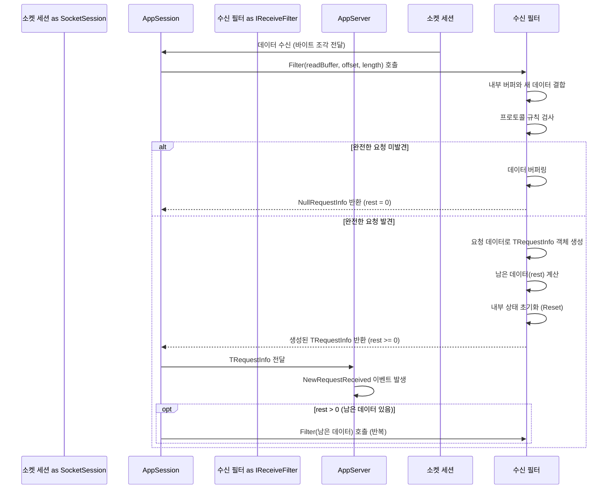

# Chapter 4: 수신 필터 (IReceiveFilter)

[이전 챕터 (애플리케이션 세션 (AppSession))](03_애플리케이션_세션__appsession__.md)에서는 서버에 접속한 개별 클라이언트를 대표하는 '담당 웨이터'인 `AppSession`에 대해 배웠습니다. 각 `AppSession`은 특정 클라이언트의 상태를 기억하고, 그 클라이언트와 통신하는 역할을 했죠.

하지만 여기서 한 가지 궁금증이 생깁니다. 클라이언트가 네트워크를 통해 서버로 데이터를 보낼 때, 그 데이터는 사실 끊어지지 않고 이어지는 **바이트(byte)들의 흐름(stream)** 으로 도착합니다. 마치 외국어로 된 긴 문장이 통째로 도착하는 것과 같습니다. 서버는 이 바이트 덩어리 속에서 어디까지가 하나의 완전한 메시지(요청)인지, 그리고 그 내용은 무엇인지 어떻게 알 수 있을까요? 예를 들어 클라이언트가 "안녕"이라고 보내고 바로 뒤이어 "잘가"라고 보냈을 때, 서버는 "안녕잘가"라는 하나의 덩어리로 받을 수도 있고, "안녕잘", "가" 와 같이 쪼개져서 받을 수도 있습니다.

이 문제를 해결하기 위해 등장하는 것이 바로 **수신 필터 (Receive Filter)**, 즉 `IReceiveFilter`입니다.

## 수신 필터는 왜 필요할까요? (외국어 주문서 번역하기)

여러분이 레스토랑 주방에서 일한다고 상상해 보세요. 외국인 손님으로부터 주문서가 계속 들어오는데, 모두 외국어로 적혀 있고, 때로는 여러 주문이 한 장에 붙어 오거나 한 주문이 여러 장에 나뉘어 오기도 합니다. 주방에서는 이 주문서를 바로 알아볼 수 없겠죠?

이때, 외국어 주문서를 받아서 주방에서 알아볼 수 있는 언어로 번역하고, 각 주문 단위로 깔끔하게 정리해서 넘겨주는 **번역가**가 필요합니다. 이 번역가는 정해진 규칙(예: 주문 하나는 항상 마침표(`.`)로 끝난다, 또는 주문 내용은 항상 10글자다)에 따라 주문서를 해석합니다.

SuperSocketLite에서 `IReceiveFilter`가 바로 이 **번역가** 역할을 합니다. 클라이언트로부터 받은 연속적인 바이트 스트림 데이터를 미리 정의된 규칙(프로토콜)에 따라 해석하고, 의미 있는 하나의 요청 단위([요청 정보 (IRequestInfo)](05_요청_정보__irequestinfo__.md))로 분리하여 서버의 다른 부분(예: `AppServer`의 `NewRequestReceived` 이벤트 핸들러)이 쉽게 처리할 수 있도록 만들어 줍니다.

데이터 패킷이 여러 개로 나뉘어 오거나, 여러 요청이 하나의 패킷에 담겨 오는 복잡한 상황에서도, `IReceiveFilter`는 정의된 프로토콜 규칙(예: 특정 종료 문자열, 고정된 길이의 헤더 등)에 따라 **완전한 요청(RequestInfo) 하나**를 정확하게 만들어내는 중요한 임무를 수행합니다.

## `IReceiveFilter`란 무엇인가요?

`IReceiveFilter<TRequestInfo>`는 SuperSocketLite에서 수신 데이터 파싱 규칙을 정의하는 **인터페이스**입니다. 여기서 `<TRequestInfo>`는 필터가 최종적으로 만들어낼 요청 정보 객체의 타입을 의미합니다. (예: `StringRequestInfo`는 문자열 기반 요청 정보를 나타냅니다.)

`IReceiveFilter`의 핵심 역할은 다음과 같습니다.

1.  **데이터 수신 및 버퍼링:** 네트워크로부터 바이트 데이터를 받습니다. 아직 완전한 요청이 만들어지지 않았다면, 데이터를 내부 버퍼에 임시로 저장합니다.
2.  **프로토콜 기반 파싱:** 미리 정의된 규칙(프로토콜)에 따라 수신된 데이터(와 버퍼링된 데이터)를 검사하여 완전한 요청의 끝을 찾습니다.
3.  **요청 정보 생성:** 완전한 요청 데이터를 찾으면, 이 데이터를 사용하여 `TRequestInfo` 타입의 객체를 생성합니다. 예를 들어, "LOGIN user pass"라는 데이터를 받으면, Key="LOGIN", Body="user pass", Parameters=["user", "pass"] 와 같은 정보를 가진 `StringRequestInfo` 객체를 만들 수 있습니다.
4.  **결과 전달:** 생성된 `TRequestInfo` 객체를 반환하여 `AppSession`과 `AppServer`가 이 요청을 처리할 수 있도록 합니다.

SuperSocketLite는 일반적인 통신 프로토콜을 위한 여러 가지 기본 `IReceiveFilter` 구현체를 제공합니다. 이를 사용하면 직접 복잡한 파싱 로직을 만들 필요 없이 편리하게 서버를 개발할 수 있습니다.

*   **`TerminatorReceiveFilter`:** 각 요청이 특정 **종료 문자(열)**(예: 엔터 키에 해당하는 `\r\n`)로 끝나는 프로토콜에 사용됩니다. 가장 흔하게 사용되는 필터 중 하나입니다. (예: 간단한 명령어 기반 채팅 서버)
*   **`FixedSizeReceiveFilter`:** 모든 요청의 길이가 **고정된 크기**인 프로토콜에 사용됩니다. (예: 모든 요청이 항상 100바이트)
*   **`FixedHeaderReceiveFilter`:** 요청 시작 부분에 **고정된 크기의 헤더**가 있고, 이 헤더 안에 **뒤따라올 본문(Body)의 길이** 정보가 포함된 프로토콜에 사용됩니다. (예: [헤더 4바이트: 본문 길이] + [본문 데이터...])
*   **`BeginEndMarkReceiveFilter`:** 각 요청이 특정 **시작 표시(Begin Mark)** 와 **종료 표시(End Mark)** 를 가지는 프로토콜에 사용됩니다. (예: `[START]`와 `[END]` 사이의 데이터)
*   **`CountSpliterReceiveFilter`:** 요청이 특정 **구분자(Spliter)** 로 정해진 **횟수(Count)** 만큼 나뉘는 프로토콜에 사용됩니다. (예: `#부분1#부분2#부분3#`)
*   **`HttpReceiveFilterBase`:** HTTP 프로토콜 기반의 요청을 처리하기 위한 기반 클래스입니다.

## `IReceiveFilter` 사용하기 (채팅 예제 다시 보기)

[이전 챕터](03_애플리케이션_세션__appsession__.md)의 채팅 예제에서 클라이언트가 닉네임을 설정하기 위해 `/nick MyName`과 같은 메시지를 보낸다고 가정해 봅시다. 대부분의 터미널 클라이언트는 엔터 키를 누르면 메시지 끝에 `\r\n` (캐리지 리턴 + 라인 피드) 문자를 추가하여 보냅니다. 즉, 실제로는 `/nick MyName\r\n` 이라는 바이트 데이터가 서버로 전송됩니다.

우리가 사용했던 `AppServer<ChatSession>` (내부적으로 `StringRequestInfo` 사용)은 별도의 설정을 하지 않으면, 종종 기본적으로 라인(Line) 프로토콜, 즉 `\r\n`을 종료 문자로 사용하는 `TerminatorReceiveFilter`와 유사한 방식으로 동작하거나, 이를 사용하도록 쉽게 설정할 수 있습니다.

어떻게 `IReceiveFilter`가 이 데이터를 처리하는지 단계별로 살펴봅시다.

1.  **데이터 수신:** `AppSession`에 연결된 내부 [소켓 세션 (SocketSession)](07_소켓_세션__socketsession__.md)이 클라이언트로부터 `/nick MyName\r\n`에 해당하는 바이트 데이터를 수신합니다. (데이터가 한 번에 다 올 수도 있고, 나눠서 올 수도 있습니다.)
2.  **필터 호출:** 수신된 데이터는 `AppSession` 내부의 `IReceiveFilter` 인스턴스 (여기서는 `TerminatorReceiveFilter`라고 가정)의 `Filter` 메서드로 전달됩니다.
3.  **종료 문자 검색:** `TerminatorReceiveFilter`는 전달받은 데이터(와 혹시 이전에 버퍼링된 데이터)에서 종료 문자인 `\r\n`을 찾습니다.
4.  **요청 데이터 추출:** `\r\n`을 발견하면, 그 이전까지의 데이터(`/nick MyName`)가 하나의 완전한 요청이라고 판단하고 추출합니다.
5.  **`StringRequestInfo` 생성:** 추출된 `/nick MyName` 문자열 데이터를 `StringRequestInfo` 파서(보통 공백을 기준으로 Key와 나머지 Body로 나누는 `BasicRequestInfoParser`)에게 전달합니다. 파서는 이를 분석하여 `Key="NICK"`, `Body="MyName"`, `Parameters=["MyName"]` 정보를 가진 `StringRequestInfo` 객체를 생성합니다.
6.  **결과 반환:** 생성된 `StringRequestInfo` 객체가 `Filter` 메서드의 결과로 반환됩니다.
7.  **`NewRequestReceived` 이벤트 발생:** `AppSession`은 이 `StringRequestInfo` 객체를 `AppServer`에게 전달하고, `AppServer`는 `NewRequestReceived` 이벤트를 발생시킵니다. 이때, 해당 `ChatSession` 객체와 방금 생성된 `requestInfo` 객체가 이벤트 핸들러에게 전달됩니다.

```csharp
// Chapter 3의 NewRequestReceived 이벤트 핸들러 부분
appServer.NewRequestReceived += (session, requestInfo) =>
{
    // 이 시점에는 이미 IReceiveFilter가 바이트 데이터를 해석하여
    // requestInfo (여기서는 StringRequestInfo) 객체를 만들어 준 상태입니다!

    Console.WriteLine($"[{session.SessionID}] 요청 수신: {requestInfo.Key} {requestInfo.Body}");

    // Key가 "NICK" 인지 확인 (IReceiveFilter 덕분에 Key와 Body가 분리됨)
    if (requestInfo.Key.Equals("NICK", StringComparison.OrdinalIgnoreCase))
    {
        var newNickname = requestInfo.Body.Trim();
        // ... 닉네임 설정 로직 ...
        session.Send($"닉네임이 '{session.Nickname}'(으)로 설정되었습니다.\r\n"); // 응답에도 \r\n 추가 (클라이언트가 기대한다면)
    }
    // ... (다른 명령어 처리) ...
    else
    {
        session.InternalHandleUnknownRequest(requestInfo);
    }
};
```

이처럼 `IReceiveFilter`는 보이지 않는 곳에서 중요한 번역가 역할을 수행하여, 우리가 `NewRequestReceived` 이벤트 핸들러에서는 이미 잘 정제된 `requestInfo` 객체를 가지고 비즈니스 로직에만 집중할 수 있도록 도와줍니다.

**어떻게 특정 필터를 사용하도록 지정할까요?**

SuperSocketLite에서는 보통 다음과 같은 방법으로 사용할 필터를 지정합니다.

*   **특화된 `AppServer` 사용:** `AppServer`를 상속하여 특정 필터를 사용하도록 미리 설정된 서버 클래스를 만들거나 사용합니다.
*   **`ReceiveFilterFactory` 제공:** `AppServer`를 설정(Setup)할 때, 특정 `IReceiveFilter`를 생성하는 팩토리(`IReceiveFilterFactory`)를 제공합니다.
*   **커스텀 `AppSession`:** `AppSession` 클래스 내에서 필터 생성 로직을 포함할 수도 있습니다.

가장 간단한 방법은 `TerminatorReceiveFilter`와 같은 내장 필터를 사용하는 것입니다. 만약 커스텀 프로토콜을 사용한다면, 해당 프로토콜에 맞는 필터 클래스를 직접 구현하거나 기존 필터를 상속받아 확장할 수 있습니다.

예를 들어, 모든 메시지가 `##`로 시작하고 `$$`로 끝난다고 가정해 봅시다. 이때는 `BeginEndMarkReceiveFilter`를 상속받아 사용할 수 있습니다.

```csharp
using SuperSocketLite.SocketBase.Protocol;
using System.Text;

// BeginEndMarkReceiveFilter를 상속받아 커스텀 필터 정의
public class MyCustomFilter : BeginEndMarkReceiveFilter<StringRequestInfo>
{
    // 시작 표시와 종료 표시 정의 (바이트 배열로)
    private readonly static byte[] BeginMark = Encoding.ASCII.GetBytes("##");
    private readonly static byte[] EndMark = Encoding.ASCII.GetBytes("$$");

    // 생성자에서 부모 클래스에게 시작/종료 표시 전달
    public MyCustomFilter()
        : base(BeginMark, EndMark)
    {
    }

    // 부모 클래스가 찾아낸 완전한 데이터(시작/종료 표시 제외)를 처리하는 메서드
    protected override StringRequestInfo ProcessMatchedRequest(byte[] readBuffer, int offset, int length)
    {
        // 여기서는 ASCII 인코딩으로 문자열을 만들고, 기본 파서 사용
        string message = Encoding.ASCII.GetString(readBuffer, offset, length);
        // BasicRequestInfoParser를 사용하여 Key, Body, Parameters 분리
        return BasicRequestInfoParser.DefaultInstance.ParseRequestInfo(message);
    }
}
```

이렇게 만든 `MyCustomFilter`를 사용하려면, 이 필터를 생성하는 `ReceiveFilterFactory`를 만들고 `AppServer` 설정 시 넘겨주어야 합니다. (팩토리 구현은 조금 더 고급 내용이므로 여기서는 생략합니다.)

## 주요 내장 수신 필터 살펴보기

SuperSocketLite가 제공하는 몇 가지 유용한 내장 필터들을 좀 더 자세히 살펴보겠습니다.

*   **`TerminatorReceiveFilter<TRequestInfo>` ([Protocol/TerminatorReceiveFilter.cs](Protocol/TerminatorReceiveFilter.cs))**
    *   가장 널리 사용되는 필터 중 하나입니다.
    *   생성자에서 지정된 **종료 문자열(terminator)** 을 기준으로 데이터를 분리합니다.
    *   예: `new TerminatorReceiveFilter(Encoding.ASCII.GetBytes("\r\n"))` - CR+LF로 끝나는 라인 단위 프로토콜 처리.
    *   찾은 데이터 부분은 `ProcessMatchedRequest` 메서드로 전달되어 `TRequestInfo` 객체로 변환됩니다. (기본 `TerminatorReceiveFilter`는 `StringRequestInfo`를 사용)

*   **`FixedHeaderReceiveFilter<TRequestInfo>` ([Protocol/FixedHeaderReceiveFilter.cs](Protocol/FixedHeaderReceiveFilter.cs))**
    *   많은 바이너리 프로토콜에서 사용됩니다.
    *   먼저 고정된 크기(생성자에서 지정)의 **헤더**를 읽습니다.
    *   `GetBodyLengthFromHeader` 추상 메서드를 구현하여, 읽어들인 헤더 정보로부터 **뒤따라올 본문의 길이**를 계산해야 합니다.
    *   계산된 길이만큼의 본문 데이터를 마저 읽어들입니다.
    *   최종적으로 헤더와 본문 데이터를 합쳐 `ResolveRequestInfo` 추상 메서드를 통해 `TRequestInfo` 객체를 만듭니다.
    *   이 필터는 내부적으로 `FixedSizeReceiveFilter`를 사용합니다. ([Protocol/FixedSizeReceiveFilter.cs](Protocol/FixedSizeReceiveFilter.cs))

*   **`BeginEndMarkReceiveFilter<TRequestInfo>` ([Protocol/BeginEndMarkReceiveFilter.cs](Protocol/BeginEndMarkReceiveFilter.cs))**
    *   요청 데이터가 명확한 **시작 표시**와 **종료 표시**를 가질 때 유용합니다.
    *   생성자에서 시작 표시와 종료 표시에 해당하는 바이트 배열을 전달받습니다.
    *   시작 표시부터 종료 표시까지의 데이터를 찾아 `ProcessMatchedRequest` 메서드로 전달합니다. (시작/종료 표시는 제외됨)

*   **`CountSpliterReceiveFilter<TRequestInfo>` ([Protocol/CountSpliterReceiveFilter.cs](Protocol/CountSpliterReceiveFilter.cs))**
    *   데이터가 특정 **구분자(spliter)** 로 정해진 **횟수(count)** 만큼 나뉘어 있을 때 사용됩니다.
    *   예: `#A#B#C#` 와 같은 데이터를 처리하려면 `new CountSpliterReceiveFilter((byte)'#', 4)` 와 같이 사용합니다.
    *   구분자를 포함한 전체 데이터를 `ProcessMatchedRequest` 메서드로 전달합니다. (기본 `CountSpliterReceiveFilter`는 `StringRequestInfo`를 사용하며, 구분자로 분리된 배열을 Parameters로 제공합니다.)

## 내부 동작 방식 (간단히 엿보기)

`IReceiveFilter`가 내부적으로 어떻게 작동하는지 간단히 살펴보겠습니다. 핵심은 `Filter` 메서드입니다.

### `Filter` 메서드 동작 과정

1.  **데이터 수신:** `AppSession`이 [소켓 세션 (SocketSession)](07_소켓_세션__socketsession__.md)으로부터 새로운 데이터 조각 (`readBuffer`, `offset`, `length`)을 받으면, 해당 `AppSession`에 연결된 `IReceiveFilter`의 `Filter` 메서드를 호출합니다.
2.  **데이터 결합:** 필터는 새로 받은 데이터 조각을 이전에 처리하지 못하고 내부 버퍼(`BufferSegments` 또는 유사한 메커니즘)에 저장해 둔 데이터와 합칩니다.
3.  **프로토콜 규칙 검사:** 필터는 결합된 데이터를 자신의 규칙에 따라 검사합니다.
    *   (Terminator) 종료 문자가 있는가?
    *   (FixedHeader) 헤더를 읽을 만큼 데이터가 충분한가? 헤더를 읽었다면, 본문 길이만큼 데이터가 다 도착했는가?
    *   (BeginEndMark) 시작 표시와 종료 표시가 모두 발견되었는가?
4.  **요청 미완성 시:** 만약 규칙에 따라 완전한 요청을 만들 수 없다면,
    *   현재까지의 데이터를 내부 버퍼에 저장(또는 업데이트)합니다.
    *   `rest` (남은 데이터)를 0으로 설정합니다.
    *   `NullRequestInfo` (`default(TRequestInfo)` 와 동일, 보통 `null`)를 반환합니다. `AppSession`은 다음 데이터 조각이 올 때까지 기다립니다.
5.  **요청 완성 시:** 만약 규칙에 맞는 완전한 요청 데이터를 찾았다면,
    *   해당 요청 데이터를 사용하여 `TRequestInfo` 객체를 생성합니다. (보통 `ProcessMatchedRequest` 또는 `ResolveRequestInfo` 같은 내부 메서드 호출)
    *   요청 데이터 부분을 제외한 **나머지 데이터**가 있는지 확인하고, 있다면 그 길이를 `rest`에 설정합니다. (하나의 데이터 조각에 여러 요청이 포함된 경우)
    *   다음 요청 처리를 위해 필터의 내부 상태를 초기화합니다 (`Reset()` 메서드).
    *   생성된 `TRequestInfo` 객체를 반환합니다.
6.  **결과 처리:** `Filter` 메서드가 `TRequestInfo` 객체를 반환하면, `AppSession`은 이를 `AppServer`에게 전달하고, `AppServer`는 `NewRequestReceived` 이벤트를 발생시킵니다. 만약 `rest` 값이 0보다 크다면, 남은 데이터(`rest` 길이만큼)를 가지고 다시 `Filter` 메서드를 호출하여 연속된 요청을 처리합니다.

아래는 이 과정을 간단하게 보여주는 순서 다이어그램입니다.



### 관련 코드 엿보기

`IReceiveFilter` 인터페이스는 필터가 구현해야 하는 기본적인 약속을 정의합니다.

```csharp
// 파일: SocketBase\Protocol\IReceiveFilter.cs
namespace SuperSocketLite.SocketBase.Protocol
{
    /// <summary>
    /// 수신 필터 인터페이스
    /// </summary>
    /// <typeparam name="TRequestInfo">요청 정보의 타입</typeparam>
    public interface IReceiveFilter<TRequestInfo>
        where TRequestInfo : IRequestInfo
    {
        /// <summary>
        /// 특정 세션에서 수신된 데이터를 요청 정보로 필터링합니다.
        /// </summary>
        /// <param name="readBuffer">읽기 버퍼.</param>
        /// <param name="offset">현재 수신된 데이터의 시작 오프셋.</param>
        /// <param name="length">현재 수신된 데이터의 길이.</param>
        /// <param name="toBeCopied">버퍼 데이터 복사 여부.</param>
        /// <param name="rest">파싱되지 않고 남은 데이터의 길이.</param>
        /// <returns>파싱된 요청 정보 객체. 아직 완전한 요청이 아니면 NullRequestInfo(보통 null).</returns>
        TRequestInfo Filter(byte[] readBuffer, int offset, int length, bool toBeCopied, out int rest);

        /// <summary>
        /// 아직 처리되지 않고 버퍼에 남아있는 데이터의 크기를 가져옵니다.
        /// </summary>
        int LeftBufferSize { get; }

        /// <summary>
        /// (필요시) 다음 단계에서 사용할 수신 필터를 가져옵니다. (상태 기반 프로토콜 등)
        /// </summary>
        IReceiveFilter<TRequestInfo> NextReceiveFilter { get; }

        /// <summary>
        /// 필터의 내부 상태를 초기 상태로 리셋합니다.
        /// </summary>
        void Reset();

        /// <summary>
        /// 현재 필터의 상태를 가져옵니다. (예: 정상, 오류 등)
        /// </summary>
        FilterState State { get; }
    }
}
```

대부분의 내장 필터들은 `ReceiveFilterBase<TRequestInfo>` 라는 추상 클래스를 상속받아 구현됩니다. 이 클래스는 내부 버퍼(`BufferSegments`) 관리 등 공통적인 기능을 제공합니다.

```csharp
// 파일: SocketBase\Protocol\ReceiveFilterBase.cs (일부 발췌 및 간략화)
namespace SuperSocketLite.SocketBase.Protocol
{
    public abstract class ReceiveFilterBase<TRequestInfo> : IReceiveFilter<TRequestInfo>
        where TRequestInfo : IRequestInfo
    {
        // 데이터를 조각 단위로 저장하는 리스트
        private ArraySegmentList m_BufferSegments;

        // 자식 클래스에서 버퍼에 접근할 수 있도록 protected로 제공
        protected ArraySegmentList BufferSegments
        {
            get { return m_BufferSegments; }
        }

        protected ReceiveFilterBase()
        {
            m_BufferSegments = new ArraySegmentList();
        }

        // IReceiveFilter 인터페이스의 Filter 메서드는 자식 클래스에서 반드시 구현해야 함 (abstract)
        public abstract TRequestInfo Filter(byte[] readBuffer, int offset, int length, bool toBeCopied, out int rest);

        // 현재 버퍼에 남은 데이터 크기
        public int LeftBufferSize
        {
            get { return m_BufferSegments.Count; }
        }

        // 다음 필터 (기본값은 null)
        public IReceiveFilter<TRequestInfo> NextReceiveFilter { get; protected set; }

        // 버퍼에 데이터 조각 추가 (자식 클래스에서 사용)
        protected void AddArraySegment(byte[] buffer, int offset, int length, bool toBeCopied)
        {
            m_BufferSegments.AddSegment(buffer, offset, length, toBeCopied);
        }

        // 버퍼 비우기 (자식 클래스에서 사용)
        protected void ClearBufferSegments()
        {
            m_BufferSegments.ClearSegements();
        }

        // 필터 리셋 (기본적으로 버퍼를 비움)
        public virtual void Reset()
        {
            if(m_BufferSegments != null && m_BufferSegments.Count > 0)
                m_BufferSegments.ClearSegements();
        }

        // 필터 상태 (기본값은 Normal 또는 Unspecified일 수 있음)
        public FilterState State { get; protected set; }
    }
}
```

예를 들어 `TerminatorReceiveFilter`는 `ReceiveFilterBase`를 상속하고, `Filter` 메서드 내에서 `SearchMarkState`를 사용하여 종료 문자열을 찾고, 찾으면 `ProcessMatchedRequest`를 호출하는 로직을 구현합니다.

```csharp
// 파일: SocketBase\Protocol\TerminatorReceiveFilter.cs (Filter 메서드 부분 개념적 요약)
public abstract class TerminatorReceiveFilter<TRequestInfo> : ReceiveFilterBase<TRequestInfo>, ...
    where TRequestInfo : IRequestInfo
{
    private readonly SearchMarkState<byte> m_SearchState; // 종료 문자열 검색 상태 관리
    // ... 다른 멤버들 ...

    protected TerminatorReceiveFilter(byte[] terminator) : base()
    {
        m_SearchState = new SearchMarkState<byte>(terminator);
    }

    public override TRequestInfo Filter(byte[] readBuffer, int offset, int length, bool toBeCopied, out int rest)
    {
        rest = 0;
        // 1. readBuffer에서 m_SearchState를 이용해 종료 문자열 검색
        int pos = readBuffer.SearchMark(offset, length, m_SearchState);

        if (pos < 0) // 종료 문자열 못 찾음
        {
            // 2. 현재 데이터를 내부 버퍼(BufferSegments)에 추가 (AddArraySegment 등)
            // 3. rest = 0 설정
            // 4. NullRequestInfo 반환
            // ... (버퍼 관리 및 오프셋 조정 로직) ...
            return NullRequestInfo;
        }
        else // 종료 문자열 찾음
        {
            // 5. 종료 문자열 이전까지의 데이터 길이 계산
            // 6. 해당 데이터를 사용하여 ProcessMatchedRequest 호출 -> TRequestInfo 생성
            TRequestInfo requestInfo;
            // ... (버퍼에 있던 데이터와 현재 데이터를 합쳐 ProcessMatchedRequest 호출) ...
            // requestInfo = ProcessMatchedRequest(combinedData, ...);

            // 7. 종료 문자열 이후 남은 데이터 길이 계산 -> rest에 설정
            rest = length - (pos - offset) - m_SearchState.Mark.Length;

            // 8. 필터 상태 리셋 (Reset() 또는 InternalReset() 호출)
            InternalReset();

            // 9. 생성된 TRequestInfo 반환
            return requestInfo;
        }
    }

    // 자식 클래스에서 구현해야 하는 메서드: 찾은 데이터를 TRequestInfo로 변환
    protected abstract TRequestInfo ProcessMatchedRequest(byte[] data, int offset, int length);

    // 내부 상태 리셋 로직
    private void InternalReset() { /* m_SearchState.Matched = 0; base.Reset(); 등 */ }
    // ...
}
```

이처럼 각 필터는 자신만의 규칙에 따라 데이터를 해석하고, 완전한 요청이 만들어지면 `TRequestInfo` 객체로 변환하여 반환하는 역할을 합니다.

## 정리 및 다음 단계

이번 챕터에서는 클라이언트로부터 오는 연속적인 바이트 스트림을 서버가 이해할 수 있는 의미 있는 요청 단위로 해석해주는 **수신 필터 (IReceiveFilter)** 에 대해 배웠습니다. `IReceiveFilter`는 마치 '외국어 주문서 번역가'처럼, 정의된 프로토콜 규칙(종료 문자, 고정 길이 헤더 등)에 따라 데이터를 분리하고 파싱하여, `AppServer`의 `NewRequestReceived` 이벤트 핸들러가 쉽게 처리할 수 있는 [요청 정보 (IRequestInfo)](05_요청_정보__irequestinfo__.md) 객체를 만들어주는 중요한 역할을 한다는 것을 알게 되었습니다. 또한 `TerminatorReceiveFilter`, `FixedHeaderReceiveFilter` 등 SuperSocketLite가 제공하는 유용한 내장 필터들도 살펴보았습니다.

이제 우리는 바이트 데이터가 어떻게 의미 있는 요청 정보로 변환되는지 알게 되었습니다. 그렇다면 이 변환의 최종 결과물인 **요청 정보 (IRequestInfo)** 는 정확히 무엇이고, 어떤 구조를 가지고 있으며, 어떻게 활용될 수 있을까요?

다음 챕터에서는 `IReceiveFilter`가 만들어내는 결과물이자, 우리의 애플리케이션 로직이 직접 다루게 될 `IRequestInfo`에 대해 자세히 알아볼 것입니다.

**다음 챕터:** [Chapter 5: 요청 정보 (IRequestInfo)](05_요청_정보__irequestinfo__.md)

---

Generated by [AI Codebase Knowledge Builder](https://github.com/The-Pocket/Tutorial-Codebase-Knowledge)