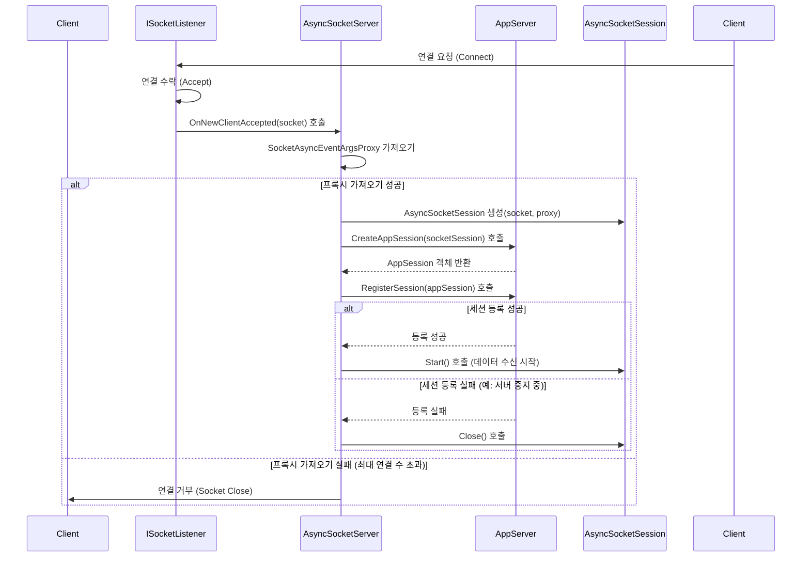

# Chapter 6: 소켓 서버 (SocketServer / SocketServerBase)


[이전 챕터 (요청 정보 (IRequestInfo))](05_요청_정보__irequestinfo__.md)에서는 잘 번역되고 정리된 '주문서'인 `IRequestInfo`가 어떻게 우리의 서버 로직에 전달되어 사용되는지 알아보았습니다. 이를 통해 `Key`, `Body`, `Parameters` 같은 구조화된 정보 덕분에 비즈니스 로직 개발이 훨씬 수월해진다는 것을 확인했죠.

지금까지 우리는 서버의 겉모습과 상위 레벨의 동작 방식([IServerConfig](01_서버_설정__iserverconfig__.md), [AppServer](02_애플리케이션_서버__appserver___appserverbase__.md), [AppSession](03_애플리케이션_세션__appsession__.md), [IReceiveFilter](04_수신_필터__ireceivefilter__.md), [IRequestInfo](05_요청_정보__irequestinfo__.md))에 초점을 맞춰왔습니다. 하지만 이 모든 편리함 뒤에는, 실제로 네트워크 통신이라는 복잡하고 까다로운 작업을 묵묵히 처리하는 더 낮은 수준의 엔진이 숨어있습니다.

이번 챕터에서는 바로 그 엔진의 핵심 부품, **소켓 서버 (SocketServer / SocketServerBase)** 에 대해 알아볼 것입니다. 소켓 서버는 보이지 않는 곳에서 실제 네트워크 연결을 관리하고 데이터를 주고받는 기반을 마련하는 중요한 역할을 담당합니다.

## 왜 소켓 서버가 필요할까요? (주방 스태프의 역할)

우리가 계속 사용했던 레스토랑 비유를 다시 가져와 봅시다. [AppServer](02_애플리케이션_서버__appserver___appserverbase__.md)가 레스토랑 전체를 관리하는 '총괄 매니저'이고, [AppSession](03_애플리케이션_세션__appsession__.md)이 각 손님 테이블을 담당하는 '웨이터'라면, **소켓 서버(SocketServer)** 는 무엇일까요?

소켓 서버는 마치 레스토랑의 **주방 스태프**나 **매장 시설 관리팀**과 같습니다. 손님(클라이언트)이 레스토랑 문 앞에 도착했을 때(네트워크 연결 요청), 문을 열어주고(연결 수락), 손님이 앉을 테이블을 준비하는(소켓 생성 및 기본 설정) 실제적인 물리적 작업을 처리합니다. 즉, 눈에 보이는 서비스(AppSession의 상호작용)가 이루어지기 위한 가장 기본적인 네트워크 통신 기반을 마련하고 관리하는 역할을 합니다.

총괄 매니저(AppServer)가 "자, 이제 가게 문 열고 손님 맞을 준비 하자!"라고 지시하면(`AppServer.Start()`), 주방 스태프(SocketServer)는 실제로 주방 설비를 가동하고(네트워크 리스닝 시작), 현관에서 손님을 기다리는(연결 대기) 작업을 수행합니다. 손님이 도착하면, 주방 스태프는 손님을 확인하고(연결 수락), 빈 테이블로 안내한 뒤(소켓 생성), 해당 테이블 담당 웨이터(AppSession)에게 손님이 왔음을 알리는(AppServer에 알림) 역할을 합니다.

이처럼 소켓 서버는 실제 네트워크 통신이라는 저수준(low-level) 작업을 처리하여, `AppServer`나 `AppSession` 같은 상위 레벨 컴포넌트들이 좀 더 애플리케이션 로직에 집중할 수 있도록 돕습니다.

## `SocketServer` 와 `SocketServerBase` 란 무엇인가요?

SuperSocketLite에서 이러한 저수준 네트워크 통신 기능을 제공하는 핵심적인 역할을 하는 것이 `SocketServerBase`와 이를 상속받는 구체적인 소켓 서버 클래스들입니다.

*   **`SocketServerBase` ([SocketEngine/SocketServerBase.cs](SocketEngine/SocketServerBase.cs))**:
    *   이는 **추상 클래스(Abstract Class)** 입니다. 즉, 소켓 서버가 가져야 할 기본적인 기능과 구조(뼈대) - 예를 들어 리스너 관리, 시작/중지 로직, 기본적인 오류 처리 등 - 를 정의하지만, 실제 통신 방식(TCP인지 UDP인지, 어떻게 연결을 처리할지 등)에 대한 세부 구현은 자식 클래스에게 맡깁니다. '주방 스태프 업무 매뉴얼'과 같다고 볼 수 있습니다.

*   **구체적인 `SocketServer` 구현체들:**
    *   **`AsyncSocketServer` ([SocketEngine/AsyncSocketServer.cs](SocketEngine/AsyncSocketServer.cs))**: `SocketServerBase`를 상속받아 **비동기 TCP/IP 통신**을 구현한 클래스입니다. 우리가 일반적으로 만드는 대부분의 서버(채팅, 게임 등)는 이 클래스를 기반으로 동작합니다. .NET의 `SocketAsyncEventArgs` 모델을 사용하여 고성능 비동기 네트워킹을 처리합니다.
    *   **`UdpSocketServer<TRequestInfo>` ([SocketEngine/UdpSocketServer.cs](SocketEngine/UdpSocketServer.cs))**: `SocketServerBase`를 상속받아 **UDP 통신**을 구현한 클래스입니다. UDP 프로토콜을 사용해야 하는 경우(예: 실시간 스트리밍, 일부 게임 데이터 전송)에 사용됩니다.

일반적으로 SuperSocketLite를 사용하는 개발자는 `AsyncSocketServer`나 `UdpSocketServer` 같은 구체적인 클래스를 직접 생성하거나 다룰 필요가 거의 없습니다. 왜냐하면 [AppServer](02_애플리케이션_서버__appserver___appserverbase__.md)가 내부적으로 [서버 설정 (IServerConfig)](01_서버_설정__iserverconfig__.md)의 `Mode` (Tcp 또는 Udp) 값에 따라 적절한 소켓 서버 인스턴스를 **자동으로 생성**하고 관리하기 때문입니다. (`SocketServerFactory` ([SocketEngine/SocketServerFactory.cs](SocketEngine/SocketServerFactory.cs))가 이 역할을 담당합니다.)

## `SocketServer`는 어떻게 사용되나요? (AppServer 내부)

앞서 말했듯이, 우리는 보통 `SocketServer`를 직접 다루지 않습니다. 대신 [AppServer](02_애플리케이션_서버__appserver___appserverbase__.md)가 우리를 대신해서 `SocketServer`를 사용합니다. `AppServer`의 `Start()` 메서드가 호출될 때 내부적으로 어떤 일이 일어나는지 다시 한번 살펴보면서 `SocketServer`의 역할을 확인해 봅시다.

```csharp
// Chapter 2에서 봤던 AppServer 시작 코드
// ... (AppServer 객체 생성 및 Setup 완료 가정) ...

// AppServer 시작!
if (!appServer.Start())
{
    Console.WriteLine("서버 시작 실패!");
    return;
}

Console.WriteLine("서버가 성공적으로 시작되었습니다.");
```

위 코드에서 `appServer.Start()`가 호출되면, `AppServer` 내부에서는 다음과 같은 일들이 진행됩니다. (간략화)

1.  `AppServer`는 `Setup` 과정에서 [서버 설정 (IServerConfig)](01_서버_설정__iserverconfig__.md)을 바탕으로 `SocketServerFactory`를 통해 적절한 `SocketServer` 인스턴스(예: `AsyncSocketServer`)를 생성하여 내부 멤버 변수(`m_SocketServer`)에 저장해 둡니다.
2.  `appServer.Start()` 메서드는 내부적으로 `m_SocketServer.Start()` 메서드를 호출합니다.
3.  `SocketServer`의 `Start()` 메서드가 실행됩니다.
    *   설정된 리스너 정보([소켓 리스너 (ISocketListener)](08_소켓_리스너__isocketlistener__.md)) 각각에 대해 `listener.Start()`를 호출하여 지정된 IP 주소와 포트에서 실제 네트워크 연결 대기를 시작합니다.
    *   TCP 서버(`AsyncSocketServer`)의 경우, 비동기 소켓 통신에 필요한 버퍼 풀(`BufferManager`)과 `SocketAsyncEventArgs` 풀(`m_ReadWritePool`)을 초기화합니다.
4.  모든 리스너가 성공적으로 시작되면 `SocketServer`의 `Start()`는 `true`를 반환하고, 결과적으로 `appServer.Start()`도 성공(`true`)을 반환합니다.

이처럼 `SocketServer`는 `AppServer`의 지시에 따라 실제 네트워크 레벨의 준비 작업을 수행하는 역할을 합니다.

## `SocketServer`의 주요 책임

`SocketServer`는 네트워크 통신의 가장 기본적인 부분을 담당하며, 주요 책임은 다음과 같습니다.

1.  **리스닝 (Listening):** [서버 설정 (IServerConfig)](01_서버_설정__iserverconfig__.md)에 명시된 IP 주소와 포트 번호에서 클라이언트의 연결 요청을 기다립니다. 이 작업은 내부적으로 하나 이상의 [소켓 리스너 (ISocketListener)](08_소켓_리스너__isocketlistener__.md) 객체를 통해 수행됩니다.

2.  **연결 수락 (Connection Acceptance):** 클라이언트로부터 유효한 연결 요청이 들어오면 이를 수락합니다. TCP의 경우 `Socket.AcceptAsync()` 또는 유사한 비동기 메서드를 사용합니다.

3.  **소켓 생성 및 기본 설정:** 연결이 수락되면, 해당 클라이언트와의 통신을 위한 기본적인 **소켓(Socket) 객체**가 생성됩니다. `SocketServer`는 이 소켓에 필요한 기본 설정(예: KeepAlive 옵션, 버퍼 크기, Send/Receive Timeout 등 - `TcpSocketServerBase` ([SocketEngine/TcpSocketServerBase.cs](SocketEngine/TcpSocketServerBase.cs)) 참조)을 적용합니다.

4.  **저수준 세션 래퍼 생성:** 생성된 소켓 객체를 직접 다루는 것은 복잡하므로, `SocketServer`는 이 소켓을 감싸는 저수준(low-level) 래퍼(wrapper) 객체를 만듭니다.
    *   `AsyncSocketServer`의 경우, `SocketAsyncEventArgsProxy` ([09_비동기_소켓_이벤트_인자_프록시__socketasynceventargsproxy__.md](09_비동기_소켓_이벤트_인자_프록시__socketasynceventargsproxy__.md)) 와 이를 사용하는 **[소켓 세션 (SocketSession)](07_소켓_세션__socketsession__.md)** (예: `AsyncSocketSession`) 객체를 생성합니다. 이 `SocketSession`은 실제 바이트 데이터의 비동기 송수신을 담당합니다.
    *   `UdpSocketServer`의 경우, `UdpSocketSession`을 생성하여 UDP 통신을 위한 상태와 메서드를 제공합니다.

5.  **AppServer에게 알림 (Handover):** 새로운 연결이 준비되었음을 (생성된 `SocketSession`과 함께) [AppServer](02_애플리케이션_서버__appserver___appserverbase__.md)에게 알립니다. `AppServer`는 이 정보를 받아 해당 연결을 위한 고수준(high-level) 세션인 [애플리케이션 세션 (AppSession)](03_애플리케이션_세션__appsession__.md) 객체를 생성하고 관리하기 시작합니다.

## 내부 동작 방식 (간단히 엿보기)

`SocketServer`가 클라이언트 연결을 어떻게 처리하고 `AppServer`와 상호작용하는지 좀 더 자세히 살펴보겠습니다. (TCP 기반의 `AsyncSocketServer`를 예시로)

### 클라이언트 연결 처리 과정

1.  클라이언트가 서버의 IP 주소와 포트로 연결을 시도합니다.
2.  해당 포트에서 대기 중이던 [소켓 리스너 (ISocketListener)](08_소켓_리스너__isocketlistener__.md) (예: `TcpAsyncSocketListener`)가 연결 요청을 감지하고 내부적으로 `Socket.AcceptAsync()`를 호출합니다.
3.  연결이 성공적으로 수락되면, 리스너는 `NewClientAccepted` 이벤트를 발생시키고, 이때 생성된 클라이언트 소켓(Socket) 객체를 `SocketServer` (예: `AsyncSocketServer`)에게 전달합니다. (`OnNewClientAccepted` 메서드 호출)
4.  `AsyncSocketServer`의 `OnNewClientAccepted` 메서드는 전달받은 클라이언트 소켓(Socket)을 처리합니다.
    *   미리 준비된 `SocketAsyncEventArgsProxy` 풀에서 재사용 가능한 프록시 객체를 하나 가져옵니다. (만약 풀이 비어있으면, 최대 연결 수에 도달했음을 의미하므로 연결을 거부하고 소켓을 닫습니다.)
    *   가져온 `SocketAsyncEventArgsProxy`와 클라이언트 소켓을 사용하여 저수준 세션 래퍼인 `AsyncSocketSession` 객체를 생성합니다. (만약 SSL/TLS 같은 보안 연결이 필요하다면 `AsyncStreamSocketSession`을 생성합니다.)
    *   `AppServer`의 `CreateAppSession(socketSession)` 메서드를 호출하여, 이 `AsyncSocketSession`에 대응하는 고수준 [애플리케이션 세션 (AppSession)](03_애플리케이션_세션__appsession__.md) 객체를 생성하도록 요청합니다.
    *   `AppServer`가 성공적으로 `AppSession`을 생성하고 반환하면, `AsyncSocketServer`는 `AppServer`의 `RegisterSession(appSession)`을 호출하여 이 새로운 세션을 `AppServer`의 관리 목록에 등록합니다.
    *   등록이 성공하면, `socketSession.Start()`를 호출하여 실제 데이터 수신 대기(비동기 ReceiveAsync 호출)를 시작합니다.

아래는 이 과정을 보여주는 간단한 시퀀스 다이어그램입니다.



### 관련 코드 엿보기

`SocketServerBase`는 모든 소켓 서버의 공통 기반 클래스입니다.

```csharp
// 파일: SocketEngine/SocketServerBase.cs (일부 발췌 및 간략화)
namespace SuperSocketLite.SocketEngine
{
    abstract class SocketServerBase : ISocketServer, IDisposable
    {
        public IAppServer AppServer { get; private set; } // 이 소켓 서버를 소유한 AppServer
        protected ListenerInfo[] ListenerInfos { get; private set; } // 리스너 설정 정보 배열
        protected List<ISocketListener> Listeners { get; private set; } // 실제 리스너 객체 리스트
        public bool IsRunning { get; protected set; } // 서버 실행 상태
        protected bool IsStopped { get; set; } // 서버 중지 요청 상태

        public SocketServerBase(IAppServer appServer, ListenerInfo[] listeners)
        {
            AppServer = appServer;
            ListenerInfos = listeners;
            Listeners = new List<ISocketListener>(listeners.Length);
            // ...
        }

        // 서버 시작 로직
        public virtual bool Start()
        {
            IsStopped = false;
            // ... (SendingQueuePool 초기화 등) ...

            // 설정된 각 리스너 정보로 리스너 객체 생성 및 시작
            for (var i = 0; i < ListenerInfos.Length; i++)
            {
                // 자식 클래스에서 구현한 CreateListener 호출
                var listener = CreateListener(ListenerInfos[i]);
                // 리스너 이벤트 핸들러 연결
                listener.NewClientAccepted += new NewClientAcceptHandler(OnNewClientAccepted);
                listener.Error += new ErrorHandler(OnListenerError);
                listener.Stopped += new EventHandler(OnListenerStopped);

                // 리스너 시작 시도
                if (listener.Start(AppServer.Config))
                {
                    Listeners.Add(listener); // 성공 시 리스트에 추가
                }
                else // 하나라도 실패하면
                {
                    // 이미 시작된 리스너들 중지 및 정리
                    // ...
                    Listeners.Clear();
                    return false; // 시작 실패 반환
                }
            }

            IsRunning = true; // 모든 리스너 시작 성공
            return true;
        }

        // 자식 클래스에서 반드시 구현해야 할 메서드: 새 클라이언트 연결 처리
        protected abstract void OnNewClientAccepted(ISocketListener listener, Socket client, object state);

        // 자식 클래스에서 반드시 구현해야 할 메서드: 리스너 객체 생성
        protected abstract ISocketListener CreateListener(ListenerInfo listenerInfo);

        // 서버 중지 로직
        public virtual void Stop()
        {
            if (IsStopped) return;
            IsStopped = true;

            // 모든 리스너 중지
            foreach(var listener in Listeners)
            {
                listener.Stop();
            }
            Listeners.Clear();

            // ... (SendingQueuePool 정리 등) ...
            IsRunning = false;
        }

        // 세션 보안 설정 변경 (자식 클래스에서 구현)
        public abstract void ResetSessionSecurity(IAppSession session, SslProtocols security);

        // ... (오류/중지 이벤트 핸들러, Dispose 등) ...
    }
}
```

`AsyncSocketServer`는 TCP 통신을 위한 구체적인 구현을 제공합니다. 특히 `OnNewClientAccepted` 메서드에서 위에서 설명한 연결 처리 과정이 일어납니다.

```csharp
// 파일: SocketEngine/AsyncSocketServer.cs (OnNewClientAccepted 부분 간략화)
namespace SuperSocketLite.SocketEngine
{
    class AsyncSocketServer : TcpSocketServerBase, IActiveConnector
    {
        private BufferManager m_BufferManager; // 버퍼 관리자
        private ConcurrentStack<SocketAsyncEventArgsProxy> m_ReadWritePool; // 프록시 풀

        // ... (Start 메서드에서 버퍼, 풀 초기화) ...

        // 리스너로부터 새 클라이언트 소켓을 받았을 때 호출됨
        protected override void OnNewClientAccepted(ISocketListener listener, Socket client, object state)
        {
            if (IsStopped) return; // 서버 중지 중이면 무시

            // ProcessNewClient 메서드 호출하여 처리 위임
            ProcessNewClient(client, listener.Info.Security);
        }

        // 실제 새 클라이언트 처리 로직
        private IAppSession ProcessNewClient(Socket client, SslProtocols security)
        {
            SocketAsyncEventArgsProxy socketEventArgsProxy;
            // 1. 프록시 풀에서 사용 가능한 프록시 가져오기 시도
            if (!m_ReadWritePool.TryPop(out socketEventArgsProxy))
            {
                // 실패: 최대 연결 수 도달
                AppServer.Logger.Error($"최대 연결 수({AppServer.Config.MaxConnectionNumber}) 도달!");
                client.SafeClose(); // 소켓 닫기
                return null;
            }

            ISocketSession socketSession;
            // 2. 보안 설정에 따라 적절한 SocketSession 생성
            if (security == SslProtocols.None)
                socketSession = new AsyncSocketSession(client, socketEventArgsProxy); // 일반 TCP
            else
                socketSession = new AsyncStreamSocketSession(client, security, socketEventArgsProxy); // SSL/TLS

            // 3. AppServer에게 AppSession 생성을 요청
            var session = CreateSession(client, socketSession); // CreateSession은 TcpSocketServerBase에 있음

            if (session == null) // AppSession 생성 실패 시
            {
                socketEventArgsProxy.Reset(); // 프록시 리셋
                this.m_ReadWritePool.Push(socketEventArgsProxy); // 풀에 반환
                client.SafeClose(); // 소켓 닫기
                return null;
            }

            // 4. SocketSession의 Closed 이벤트 핸들러 연결 (자원 반환 위함)
            socketSession.Closed += SessionClosed;

            // (만약 Negotiate (협상) 과정이 필요하면 처리 - 여기서는 생략)

            // 5. AppServer에 세션 등록 시도
            if (RegisterSession(session)) // RegisterSession 내부에서 AppServer.RegisterSession 호출
            {
                // 6. 등록 성공 시, 비동기로 SocketSession 시작 (데이터 수신 대기 시작)
                AppServer.AsyncRun(() => socketSession.Start());
            }
            else
            {
                // 등록 실패 시 처리 (예: 이미 서버가 닫히는 중)
                // RegisterSession 내부에서 Close 처리됨
            }

            // 주의: AppSession이 바로 반환되는 것이 아니라, 비동기 등록 및 시작 후 null이 반환될 수 있음
            return session; // 혹은 상황에 따라 null
        }

        // 세션 등록 도우미 메서드
        private bool RegisterSession(IAppSession appSession)
        {
            if (AppServer.RegisterSession(appSession))
                return true;

            // 등록 실패 시 세션 닫기
            appSession.SocketSession.Close(CloseReason.InternalError);
            return false;
        }

        // 세션이 닫혔을 때 호출되는 핸들러 (프록시 객체 풀에 반환)
        void SessionClosed(ISocketSession session, CloseReason reason)
        {
            var socketSession = session as IAsyncSocketSessionBase;
            if (socketSession == null) return;

            var proxy = socketSession.SocketAsyncProxy;
            proxy.Reset(); // 프록시 상태 리셋

            // ... (버퍼 설정 복원 로직) ...

            // 서버가 실행 중이고 프록시가 재활용 가능하면 풀에 반환
            if (!IsStopped && proxy.IsRecyclable && m_ReadWritePool != null)
                m_ReadWritePool.Push(proxy);
            else // 아니면 프록시가 가진 리소스(SocketAsyncEventArgs) 해제
                proxy.SocketEventArgs.Dispose();
        }

        // ... (Stop 메서드에서 풀 정리, ResetSessionSecurity 등) ...
    }
}
```

코드가 다소 복잡해 보일 수 있지만, 핵심은 `SocketServer`가 네트워크 연결의 수락, 기본 소켓 설정, 그리고 저수준 세션 래퍼(`SocketSession`, `SocketAsyncEventArgsProxy`) 관리를 담당하며, 준비가 완료되면 `AppServer`에게 제어권을 넘겨준다는 것입니다.

## 정리 및 다음 단계

이번 챕터에서는 SuperSocketLite의 내부 엔진 역할을 하는 **소켓 서버 (SocketServer / SocketServerBase)** 에 대해 알아보았습니다. `SocketServer`는 `AppServer`의 지시를 받아 실제 네트워크 연결을 수신 대기하고, 새로운 연결을 수락하며, 기본적인 소켓 설정을 처리하는 저수준 컴포넌트입니다. TCP 통신을 위한 `AsyncSocketServer`와 UDP 통신을 위한 `UdpSocketServer`가 있으며, 이들은 내부적으로 복잡한 비동기 I/O 작업을 처리하여 개발자가 애플리케이션 로직에 집중할 수 있도록 돕는다는 것을 배웠습니다. 또한 `SocketServer`가 새로운 연결을 처리하여 [AppServer](02_애플리케이션_서버__appserver___appserverbase__.md)에게 전달하는 과정을 살펴보았습니다.

`SocketServer`는 새로운 연결이 수립되면, 단순히 원시 소켓(raw Socket) 객체를 그대로 넘기는 것이 아니라, 이 소켓을 감싸고 실제 데이터 송수신 로직을 포함하는 **소켓 세션 (SocketSession)** 이라는 객체를 만들어 함께 전달합니다. 이 `SocketSession`은 [애플리케이션 세션 (AppSession)](03_애플리케이션_세션__appsession__.md)과 어떻게 다르고, 정확히 어떤 역할을 할까요?

다음 챕터에서는 네트워크 통신의 실무를 담당하는 또 다른 중요한 저수준 컴포넌트인 **소켓 세션 (SocketSession)** 에 대해 자세히 알아볼 것입니다.

**다음 챕터:** [제 7장: 소켓 세션 (SocketSession)](07_소켓_세션__socketsession__.md)

---

Generated by [AI Codebase Knowledge Builder](https://github.com/The-Pocket/Tutorial-Codebase-Knowledge)