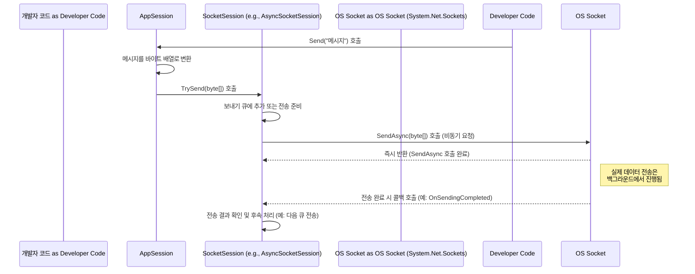

# Chapter 7: 소켓 세션 (SocketSession)


[이전 챕터 (소켓 서버 (SocketServer / SocketServerBase))](06_소켓_서버__socketserver___socketserverbase__.md)에서는 보이지 않는 곳에서 실제 네트워크 연결을 관리하고 기반을 다지는 '주방 스태프' 역할의 `SocketServer`에 대해 알아보았습니다. `SocketServer`는 새로운 클라이언트 연결 요청을 받아들이고, 기본적인 소켓 설정을 마친 뒤, 이 연결을 [AppServer](02_애플리케이션_서버__appserver___appserverbase__.md)에게 넘겨주는 중요한 역할을 했습니다.

하지만 `SocketServer`가 연결을 넘겨줄 때, 그냥 날것 그대로의 소켓(Socket) 객체를 넘겨주는 것이 아니라, 이 소켓을 한번 감싸서 실제 데이터 송수신 로직을 담은 **소켓 세션 (SocketSession)** 이라는 객체를 만들어 함께 전달한다고 언급했습니다. 이 `SocketSession`은 우리가 이전에 배운 [애플리케이션 세션 (AppSession)](03_애플리케이션_세션__appsession__.md)과는 어떻게 다르고, 정확히 어떤 일을 할까요?

이번 챕터에서는 네트워크 통신의 가장 밑단에서 실제 '데이터 배달부' 역할을 수행하는 `SocketSession`에 대해 자세히 알아보겠습니다.

## 왜 소켓 세션이 필요할까요? (데이터 배달부의 역할)

다시 레스토랑 비유를 사용해 봅시다. [AppSession](03_애플리케이션_세션__appsession__.md)이 손님(클라이언트)과 직접 소통하고 주문을 받는 '웨이터'라면, **SocketSession**은 무엇에 비유할 수 있을까요?

`SocketSession`은 마치 주방과 손님 테이블 사이에서 **음식과 메시지를 실제로 실어 나르는 '데이터 배달부'** 또는 **테이블과 주방을 연결하는 '전용 통신 회선 관리자'** 와 같습니다. 웨이터(AppSession)가 "손님에게 '안녕하세요'라고 전달해줘!"라고 지시하면 (`appSession.Send("안녕하세요")`), 이 배달부(SocketSession)는 그 메시지를 실제로 네트워크라는 길을 통해 손님에게 전달하는 저수준(low-level) 작업을 처리합니다. 반대로 손님(클라이언트)이 보낸 메시지가 도착하면, 배달부(SocketSession)는 이 원시 데이터(raw data)를 받아서 웨이터(AppSession)에게 전달하여 처리하도록 합니다.

즉, `AppSession`이 클라이언트와의 '관계'와 애플리케이션 로직을 담당한다면, `SocketSession`은 그 관계를 유지하기 위한 **실제 데이터 송수신 통로** 그 자체를 관리하고 운영하는 역할을 합니다. 전화 통화에 비유하면, `AppSession`이 대화 상대방과의 '대화 내용과 상태'라면, `SocketSession`은 실제 목소리가 오가는 '전화선과 통신 장비'에 해당합니다.

## SocketSession이란 무엇인가요?

`SocketSession`은 SuperSocketLite에서 **개별 클라이언트와의 실제 네트워크 연결(System.Net.Sockets.Socket 객체)을 직접 감싸고 관리하는 객체**입니다. 좀 더 자세히 살펴보면 다음과 같은 핵심 책임을 가집니다.

1.  **저수준 데이터 송수신:** 실제 네트워크 소켓을 통해 원시 바이트(byte) 데이터를 주고받는 입출력(I/O) 작업을 직접 수행합니다. `AppSession`의 `Send()` 요청을 받아 실제로 네트워크에 데이터를 쓰고, 네트워크로부터 도착한 데이터를 읽어들입니다.
2.  **버퍼 관리:** 데이터를 보내거나 받을 때 사용하는 내부 버퍼(임시 저장 공간)를 관리합니다. 특히 비동기 통신에서는 `SocketAsyncEventArgs`와 같은 객체를 사용하여 효율적으로 버퍼를 재사용하고 관리합니다. (이 부분은 [비동기 소켓 이벤트 인자 프록시 (SocketAsyncEventArgsProxy)](09_비동기_소켓_이벤트_인자_프록시__socketasynceventargsproxy__.md) 챕터에서 더 자세히 다룹니다.)
3.  **소켓 상태 감지:** 기본적인 소켓 연결 상태(연결됨, 닫힘 등)를 인지합니다. 네트워크 오류나 클라이언트의 갑작스러운 연결 종료 등으로 인해 물리적인 연결이 끊어지면 이를 감지하고 관련 처리(예: `AppSession` 및 `AppServer`에 알림)를 시작합니다.
4.  **암호화 처리 (선택적):** SSL/TLS와 같은 보안 연결을 사용하는 경우, 데이터를 암호화하고 복호화하는 저수준 스트림(Stream) 처리를 담당할 수 있습니다. (예: `AsyncStreamSocketSession`)

**중요한 관계:** 하나의 [애플리케이션 세션 (AppSession)](03_애플리케이션_세션__appsession__.md) 객체는 항상 하나의 `SocketSession` 객체와 짝을 이룹니다. `AppSession`은 `SocketSession`을 통해 실제 통신을 수행하고, `SocketSession`은 `AppSession`에게 받은 데이터를 전달하거나 보낼 데이터를 받습니다.

SuperSocketLite 내부에는 통신 방식에 따라 여러 종류의 `SocketSession` 구현체가 있습니다.

*   `AsyncSocketSession` ([SocketEngine/AsyncSocketSession.cs](SocketEngine/AsyncSocketSession.cs)): 일반적인 비동기 TCP 통신을 위한 구현체입니다.
*   `AsyncStreamSocketSession` ([SocketEngine/AsyncStreamSocketSession.cs](SocketEngine/AsyncStreamSocketSession.cs)): SSL/TLS 암호화 통신을 위한 구현체입니다. 내부적으로 `SslStream`을 사용합니다.
*   `UdpSocketSession` ([SocketEngine/UdpSocketSession.cs](SocketEngine/UdpSocketSession.cs)): UDP 통신을 위한 구현체입니다.

하지만 걱정 마세요! 대부분의 경우, 우리는 이 클래스들을 직접 선택하거나 생성할 필요가 없습니다. [AppServer](02_애플리케이션_서버__appserver___appserverbase__.md)와 [SocketServer](06_소켓_서버__socketserver___socketserverbase__.md)가 서버 설정([IServerConfig](01_서버_설정__iserverconfig__.md))에 따라 자동으로 적절한 `SocketSession` 객체를 생성하고 [AppSession](03_애플리케이션_세션__appsession__.md)과 연결해 줍니다.

## SocketSession은 어떻게 사용되나요? (주로 내부적으로)

일반적인 SuperSocketLite 애플리케이션 개발에서는 `SocketSession` 객체를 직접 코드에서 다룰 일이 거의 없습니다. 왜냐하면 `AppSession`이 `SocketSession`의 기능을 편리하게 사용할 수 있도록 이미 감싸고 있기 때문입니다.

예를 들어, 우리가 [AppSession](03_애플리케이션_세션__appsession__.md) 챕터에서 클라이언트에게 메시지를 보낼 때 사용했던 `appSession.Send()` 메서드를 생각해 봅시다.

```csharp
// AppSession 챕터의 예시 코드
public class ChatSession : AppSession<ChatSession>
{
    // ...
    protected override void OnSessionStarted()
    {
        // AppSession의 Send 메서드를 호출합니다.
        this.Send("환영합니다! 닉네임을 설정해주세요.");
        base.OnSessionStarted();
    }
    // ...
}
```

위 코드에서 `this.Send()`를 호출하면, `ChatSession`(즉, `AppSession`) 내부에서는 다음과 같은 일이 일어납니다 (개념적으로):

1.  `AppSession`은 "환영합니다! ..." 문자열을 서버 설정에 맞는 인코딩(예: UTF-8)을 사용하여 **바이트 배열(byte[])** 로 변환합니다.
2.  `AppSession`은 자신이 가지고 있는 `SocketSession` 객체의 `TrySend()` 또는 유사한 메서드를 호출하면서 이 바이트 배열을 전달합니다.
3.  `SocketSession`은 전달받은 바이트 배열을 실제 네트워크 소켓을 통해 비동기적으로 전송하기 시작합니다.

이번에는 데이터 수신 과정을 살펴볼까요?

1.  클라이언트가 데이터를 보내면, `SocketSession`의 내부 메커니즘(예: `ReceiveAsync` 완료 콜백)이 이를 감지하고 원시 바이트 데이터를 읽어들입니다.
2.  `SocketSession`은 읽어들인 바이트 데이터를 자신의 `AppSession` 객체에게 전달합니다. (예: `AppSession.ProcessRequest()` 메서드 호출)
3.  `AppSession`은 전달받은 바이트 데이터를 자신이 가지고 있는 [수신 필터 (IReceiveFilter)](04_수신_필터__ireceivefilter__.md)에게 넘겨서 의미 있는 요청([IRequestInfo](05_요청_정보__irequestinfo__.md))으로 분석하도록 합니다.
4.  `IReceiveFilter`가 완전한 `IRequestInfo` 객체를 만들어 반환하면, `AppSession`은 이를 [AppServer](02_애플리케이션_서버__appserver___appserverbase__.md)에게 전달하여 `NewRequestReceived` 이벤트를 발생시키도록 합니다.

이처럼 `SocketSession`은 `AppSession`과 긴밀하게 협력하며 실제 데이터 통신 작업을 처리합니다. 우리는 주로 `AppSession`을 통해 `SocketSession`의 기능을 간접적으로 사용하게 됩니다.

## SocketSession의 주요 기능 (초보자 눈높이)

`SocketSession`이 내부적으로 수행하는 주요 기능들을 좀 더 살펴보겠습니다.

*   **데이터 보내기 (`TrySend`)**:
    *   `AppSession`으로부터 받은 바이트 데이터를 네트워크 전송을 위해 준비합니다.
    *   내부적으로 보내기 큐(Sending Queue)를 사용하여 여러 보내기 요청을 관리할 수 있습니다.
    *   `Socket.SendAsync()`와 같은 비동기 메서드를 호출하여 실제 전송을 시작합니다. 네트워크 상황에 따라 즉시 전송되지 않고 운영체제의 버퍼에 잠시 머무를 수 있습니다.
    *   `TrySend()`는 보내기 큐가 꽉 찼거나 하는 이유로 즉시 데이터를 처리할 수 없을 때 `false`를 반환하여, 호출자(주로 `AppSession`)가 상황을 인지하고 대처(예: 잠시 후 재시도 또는 오류 처리)할 수 있도록 합니다.

    ```csharp
    // SocketSession 내부의 TrySend 메서드 개념 (실제 코드는 더 복잡함)
    public bool TrySend(ArraySegment<byte> segment)
    {
        if (IsClosed) // 이미 닫힌 세션이면 실패
            return false;

        var queue = m_SendingQueue; // 현재 사용 중인 보내기 큐

        if (queue == null) // 큐가 없으면 (초기화 전 등) 실패
            return false;

        var trackID = queue.TrackID; // 큐의 현재 상태 식별자

        // 큐에 데이터 추가 시도 (큐가 꽉 찼으면 실패할 수 있음)
        if (!queue.Enqueue(segment, trackID))
            return false;

        // 큐에 데이터 추가 성공! 비동기 전송 시작 요청
        StartSend(queue, trackID, true); // 내부적으로 SendAsync 또는 SendSync 호출
        return true; // 성공적으로 전송 요청 시작됨
    }
    ```

*   **데이터 받기 (비동기 수신)**:
    *   `SocketSession`은 일반적으로 연결이 활성화된 동안 계속해서 비동기적으로 데이터 수신을 시도합니다 (`Client.ReceiveAsync(e)` 호출).
    *   네트워크로부터 데이터가 도착하면, 비동기 콜백 메서드(예: `ProcessReceive`)가 실행됩니다.
    *   콜백 메서드에서는 수신된 데이터의 유효성을 검사하고, 문제가 없으면 해당 바이트 데이터를 `AppSession.ProcessRequest()`로 넘겨서 상위 레벨에서 처리하도록 합니다.
    *   처리가 끝나면 다시 다음 데이터 수신을 위해 `Client.ReceiveAsync(e)`를 호출하여 계속해서 데이터를 기다립니다.

    ```csharp
    // AsyncSocketSession의 ProcessReceive 메서드 개념 (실제 코드는 더 복잡함)
    public void ProcessReceive(SocketAsyncEventArgs e)
    {
        // 1. 수신 결과 확인 (성공 여부, 받은 바이트 수 등)
        if (!ProcessCompleted(e)) // 오류 발생 또는 연결 종료됨
        {
            OnReceiveTerminated(/* 닫힌 이유 */); // 수신 종료 처리
            return;
        }

        OnReceiveEnded(); // 수신 성공 후 내부 상태 정리

        int offsetDelta; // 다음 수신 시작 위치 조정을 위한 값

        try
        {
            // 2. AppSession에게 받은 데이터 처리 요청 (내부적으로 IReceiveFilter 사용)
            offsetDelta = this.AppSession.ProcessRequest(e.Buffer, e.Offset, e.BytesTransferred, true);
        }
        catch (Exception exc) // AppSession 처리 중 오류 발생 시
        {
            LogError("프로토콜 오류", exc);
            this.Close(CloseReason.ProtocolError); // 세션 종료
            return;
        }

        // 3. 다음 데이터 수신을 위해 다시 ReceiveAsync 호출
        StartReceive(e, offsetDelta);
    }
    ```

*   **연결 상태 관리**:
    *   `SocketSession`은 내부적으로 `System.Net.Sockets.Socket` 객체를 가지고 있으며, 이 소켓의 연결 상태를 알고 있습니다.
    *   네트워크 오류, 상대방의 연결 종료, 또는 서버 측의 명시적인 `Close()` 호출 등으로 소켓 연결이 끊어지면, `SocketSession`은 이를 인지하고 `Closed` 이벤트를 발생시킵니다. 이 이벤트는 결국 `AppSession.OnSessionClosed()`와 `AppServer.SessionClosed` 이벤트로 이어져 상위 레벨에서 연결 종료를 처리할 수 있게 합니다.

*   **리소스 관리**:
    *   `SocketSession`은 자신이 사용하는 네트워크 소켓, 내부 버퍼, 비동기 작업 객체(`SocketAsyncEventArgs`) 등의 리소스를 관리합니다. 세션이 종료될 때 이러한 리소스들이 적절하게 해제되도록 보장합니다.

## 내부 동작 방식 (간단히 엿보기)

`AppSession`이 `Send()`를 호출했을 때 `SocketSession` 내부에서 어떤 일이 일어나는지 간단한 흐름을 살펴봅시다.

1.  **`AppSession.Send(message)` 호출:** 개발자 코드에서 메시지 전송을 요청합니다.
2.  **바이트 변환:** `AppSession`은 문자열 메시지를 바이트 배열로 변환합니다.
3.  **`SocketSession.TrySend(bytes)` 호출:** `AppSession`은 자신의 `SocketSession`에게 바이트 데이터 전송을 위임합니다.
4.  **큐 추가 또는 전송 시작:** `SocketSession`은 데이터를 내부 보내기 큐에 추가하거나, 만약 현재 전송 중인 데이터가 없다면 즉시 비동기 전송(`SendAsync`)을 시작합니다.
5.  **`Socket.SendAsync()` 호출:** `SocketSession`(예: `AsyncSocketSession`)은 내부적으로 `System.Net.Sockets.Socket` 객체의 `SendAsync()` 메서드를 호출하여 운영체제에게 데이터 전송을 요청합니다. 이 과정은 비동기적이므로 즉시 반환됩니다.
6.  **비동기 완료 콜백:** 실제 데이터 전송이 완료되면 (네트워크 상황에 따라 시간이 걸릴 수 있음), 운영체제가 이를 알리고 `SocketSession`에 등록된 콜백 메서드(예: `OnSendingCompleted`)가 호출됩니다.
7.  **후속 처리:** 콜백 메서드에서는 전송 결과를 확인하고, 만약 보내기 큐에 더 보낼 데이터가 남아있다면 다음 전송을 시작하는 등의 후속 처리를 합니다.

아래는 이 과정을 시각화한 간단한 순서 다이어그램입니다.



### 관련 코드 엿보기

`SocketSession`의 기본 추상 클래스는 `SocketEngine/SocketSession.cs` 파일에 정의되어 있습니다. 여기에는 모든 `SocketSession` 구현체가 공통적으로 가져야 할 상태 관리, 보내기 큐 로직, 닫기 처리 등의 기반 코드가 포함되어 있습니다.

```csharp
// 파일: SocketEngine/SocketSession.cs (일부 발췌 및 간략화)
abstract partial class SocketSession : ISocketSession
{
    public IAppSession AppSession { get; private set; } // 연결된 AppSession
    public Socket Client { get; private set; } // 실제 네트워크 소켓 객체
    public string SessionID { get; private set; } // 세션 ID
    public IServerConfig Config { get; set; } // 서버 설정 참조

    private int m_State = 0; // 세션 상태 플래그 (Normal, InSending, InClosing, Closed 등)
    private SendingQueue m_SendingQueue; // 현재 사용 중인 보내기 큐
    private ISmartPool<SendingQueue> m_SendingQueuePool; // 보내기 큐 풀

    // 생성자 (SocketServer에서 호출됨)
    public SocketSession(Socket client) : this(Guid.NewGuid().ToString())
    {
        m_Client = client;
        LocalEndPoint = (IPEndPoint)client.LocalEndPoint;
        RemoteEndPoint = (IPEndPoint)client.RemoteEndPoint;
    }

    // AppSession과 연결 및 초기화
    public virtual void Initialize(IAppSession appSession)
    {
        AppSession = appSession;
        Config = appSession.Config;
        // 보내기 큐 풀 가져오기 및 현재 큐 할당
        m_SendingQueuePool = ((SocketServerBase)((ISocketServerAccessor)appSession.AppServer).SocketServer).SendingQueuePool;
        // ... 큐 할당 로직 ...
    }

    // 세션 시작 (SocketServer에서 호출)
    public abstract void Start();

    // 데이터 보내기 시도 (AppSession에서 호출됨)
    public bool TrySend(ArraySegment<byte> segment)
    {
        if (IsClosed) return false;
        var queue = m_SendingQueue;
        if (queue == null) return false;
        var trackID = queue.TrackID;
        if (!queue.Enqueue(segment, trackID)) return false; // 큐에 데이터 넣기
        StartSend(queue, trackID, true); // 비동기 전송 시작 요청
        return true;
    }

    // 실제 비동기/동기 전송 시작 요청 로직 (내부 호출)
    private void StartSend(SendingQueue queue, int sendingTrackID, bool initial)
    {
        // ... 상태 확인 및 큐 교체 로직 ...
        // ... 적절한 SendAsync 또는 SendSync 호출 ...
        Send(queue);
    }

    // 자식 클래스에서 구현해야 함: 비동기 데이터 전송
    protected abstract void SendAsync(SendingQueue queue);
    // 자식 클래스에서 구현해야 함: 동기 데이터 전송
    protected abstract void SendSync(SendingQueue queue);

    // 전송 완료 시 호출되는 콜백 (내부 또는 자식 클래스에서 호출)
    protected virtual void OnSendingCompleted(SendingQueue queue)
    {
        // 사용 완료된 큐 반환 및 다음 큐 처리 로직
        // ...
    }

    // 세션 닫기 요청 (AppSession 등에서 호출 가능)
    public virtual void Close(CloseReason reason)
    {
        // ... 상태 변경 및 실제 소켓 닫기 로직 (InternalClose 호출 등) ...
    }

    // 실제 소켓 닫기 및 이벤트 발생 (내부 호출)
    protected virtual void OnClosed(CloseReason reason)
    {
        // ... 상태 변경, 리소스 정리, Closed 이벤트 발생 ...
    }

    // ... (수신 관련 OnReceiveStarted, OnReceiveEnded, OnReceiveTerminated 등) ...
}
```

`AsyncSocketSession` 클래스(`SocketEngine/AsyncSocketSession.cs`)는 `SocketSession`을 상속받아 `SocketAsyncEventArgs`를 사용한 비동기 TCP 통신을 구체적으로 구현합니다.

```csharp
// 파일: SocketEngine/AsyncSocketSession.cs (일부 발췌 및 간략화)
class AsyncSocketSession : SocketSession, IAsyncSocketSession
{
    private SocketAsyncEventArgs m_SocketEventArgSend; // 보내기용 SocketAsyncEventArgs
    public SocketAsyncEventArgsProxy SocketAsyncProxy { get; private set; } // 받기용 프록시 (버퍼 포함)

    // 생성자
    public AsyncSocketSession(Socket client, SocketAsyncEventArgsProxy socketAsyncProxy)
        : base(client)
    {
        SocketAsyncProxy = socketAsyncProxy;
    }

    // 초기화 (SocketSession.Initialize에서 호출됨)
    public override void Initialize(IAppSession appSession)
    {
        base.Initialize(appSession);
        SocketAsyncProxy.Initialize(this); // 받기 프록시 초기화
        // 보내기용 EventArgs 설정
        m_SocketEventArgSend = new SocketAsyncEventArgs();
        m_SocketEventArgSend.Completed += OnSendingCompleted; // 완료 콜백 연결
    }

    // 세션 시작 (SocketSession.Start() 구현)
    public override void Start()
    {
        StartReceive(SocketAsyncProxy.SocketEventArgs); // 첫 비동기 받기 시작
        StartSession(); // AppSession 시작 알림
    }

    // 비동기 받기 시작
    private void StartReceive(SocketAsyncEventArgs e)
    {
        // ... 버퍼 설정 및 오류 처리 ...
        bool willRaiseEvent = Client.ReceiveAsync(e); // 실제 비동기 받기 호출
        if (!willRaiseEvent) // 동기적으로 완료된 경우
        {
            ProcessReceive(e); // 즉시 처리
        }
    }

    // 데이터 수신 완료 시 호출되는 메서드 (콜백 또는 동기 완료 시)
    public void ProcessReceive(SocketAsyncEventArgs e)
    {
        // ... 수신 결과 처리 ...
        // AppSession에게 데이터 처리 요청
        int offsetDelta = this.AppSession.ProcessRequest(e.Buffer, e.Offset, e.BytesTransferred, true);
        // 다음 받기 시작
        StartReceive(e, offsetDelta);
    }

    // 비동기 보내기 구현 (SendAsync 추상 메서드 구현)
    protected override void SendAsync(SendingQueue queue)
    {
        try
        {
            m_SocketEventArgSend.UserToken = queue; // 큐 정보 저장
            // 보낼 데이터 설정 (BufferList 또는 SetBuffer)
            // ...
            if (!Client.SendAsync(m_SocketEventArgSend)) // 실제 비동기 보내기 호출
                OnSendingCompleted(this, m_SocketEventArgSend); // 동기 완료 시 즉시 처리
        }
        catch (Exception e) { /* ... 오류 처리 ... */ }
    }

    // 보내기 완료 콜백 (SocketAsyncEventArgs.Completed 이벤트 핸들러)
    void OnSendingCompleted(object sender, SocketAsyncEventArgs e)
    {
        var queue = e.UserToken as SendingQueue;
        // ... 전송 결과 처리 ...
        // 부모 클래스의 OnSendingCompleted 호출하여 큐 정리 및 다음 전송 처리
        base.OnSendingCompleted(queue);
    }

    // ... (자원 정리, 오류 처리 등) ...
}
```

이 코드들을 통해 `SocketSession`이 어떻게 `AppSession`과 상호작용하고, 실제 소켓 통신과 비동기 작업들을 내부적으로 처리하는지 엿볼 수 있습니다.

## 정리 및 다음 단계

이번 챕터에서는 SuperSocketLite에서 실제 네트워크 데이터 송수신을 담당하는 저수준 '데이터 배달부', **소켓 세션 (SocketSession)** 에 대해 알아보았습니다. `SocketSession`은 개별 클라이언트 소켓을 직접 감싸고, 원시 바이트 데이터의 송수신, 버퍼 관리, 비동기 I/O 처리, 그리고 실제 연결 상태 관리와 같은 핵심적인 역할을 수행합니다. [애플리케이션 세션 (AppSession)](03_애플리케이션_세션__appsession__.md)이 `SocketSession`을 통해 실제 통신을 수행하며, 우리는 대부분 `AppSession` 수준에서 작업하므로 `SocketSession`을 직접 다룰 일은 적다는 것도 확인했습니다.

지금까지 우리는 서버 설정부터 시작하여, 서버 운영(`AppServer`), 개별 클라이언트 관리(`AppSession`), 데이터 해석(`IReceiveFilter`), 요청 정보(`IRequestInfo`), 그리고 실제 네트워크 통신(`SocketServer`, `SocketSession`)에 이르기까지 SuperSocketLite 서버의 주요 구성 요소들을 단계별로 살펴보았습니다.

그렇다면 이 모든 과정의 가장 첫 단계, 즉 서버가 처음 시작될 때 어떻게 특정 IP 주소와 포트 번호에서 클라이언트의 연결 요청을 '듣기' 시작하는 걸까요? [SocketServer](06_소켓_서버__socketserver___socketserverbase__.md)가 이 작업을 시작한다고 배웠지만, 구체적으로 어떤 컴포넌트가 이 '듣는' 행위를 담당할까요?

다음 챕터에서는 바로 이 '귀 기울이는 역할'을 하는 **소켓 리스너 (ISocketListener)** 에 대해 자세히 알아볼 것입니다.

**다음 챕터:** [제 8장: 소켓 리스너 (ISocketListener)](08_소켓_리스너__isocketlistener__.md)

---

Generated by [AI Codebase Knowledge Builder](https://github.com/The-Pocket/Tutorial-Codebase-Knowledge)