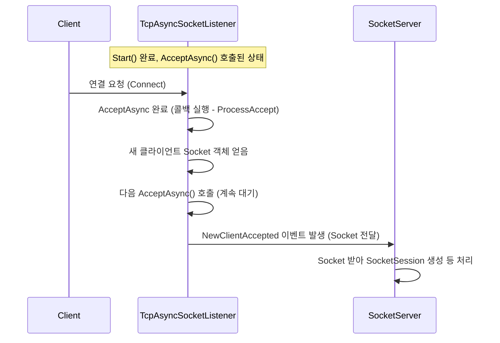

# Chapter 8: 소켓 리스너 (ISocketListener)


[이전 챕터 (소켓 세션 (SocketSession))](07_소켓_세션__socketsession__.md)에서는 실제 네트워크 데이터 배달부 역할을 하는 `SocketSession`에 대해 알아보았습니다. `SocketSession`은 개별 클라이언트와의 연결을 유지하고 데이터를 주고받는 실무를 담당했죠.

하지만 서버는 어떻게 맨 처음 클라이언트의 접속 요청을 알아차리고 그 연결을 받아들일 수 있을까요? 마치 레스토랑 문 앞에서 손님을 기다리는 사람이 있어야 손님을 맞이할 수 있는 것처럼, 서버에도 누군가가 지정된 네트워크 주소(IP 주소와 포트 번호)에서 귀 기울이며 연결 요청을 기다려야 합니다.

바로 이 "귀 기울이는 역할", 즉 문 앞에서 손님을 기다리는 호스트 역할을 하는 것이 이번 챕터에서 배울 **소켓 리스너 (ISocketListener)** 입니다.

## 왜 소켓 리스너가 필요할까요? (레스토랑 입구의 호스트)

여러분이 운영하는 레스토랑([애플리케이션 서버 (AppServer / AppServerBase)](02_애플리케이션_서버__appserver___appserverbase__.md))이 문을 열고 손님을 맞이할 준비를 마쳤다고 생각해 봅시다. 하지만 레스토랑 입구에 아무도 없다면, 손님이 와도 누가 알아차리고 안내할 수 있을까요?

**소켓 리스너 (ISocketListener)** 는 바로 이 **레스토랑 입구의 호스트**와 같습니다. 호스트는 정해진 입구(특정 IP 주소와 포트 번호)에서 계속 귀 기울이며 새로운 손님(클라이언트)이 오는지 지켜봅니다. 손님이 문을 두드리거나 들어오려고 하면(네트워크 연결 요청), 호스트는 이를 가장 먼저 알아차리고 손님을 맞이합니다(연결 수락). 그리고 나서 이 새로운 손님 정보를 매장 관리팀([소켓 서버 (SocketServer / SocketServerBase)](06_소켓_서버__socketserver___socketserverbase__.md))에게 전달하여 다음 단계(테이블 안내, 즉 [소켓 세션 (SocketSession)](07_소켓_세션__socketsession__.md) 생성)를 진행하도록 합니다.

만약 `ISocketListener`가 없다면, 서버는 어떤 주소에서 클라이언트의 접속을 기다려야 할지, 그리고 새로운 접속 요청이 왔을 때 어떻게 처리해야 할지 알 수 없습니다. `ISocketListener`는 서버가 외부 세계와 소통하는 첫 번째 관문인 셈입니다.

## `ISocketListener`란 무엇인가요?

`ISocketListener`는 SuperSocketLite에서 **특정 네트워크 엔드포인트(IP 주소와 포트 번호의 조합)에서 들어오는 클라이언트 연결 요청을 수신 대기(Listen)하고 수락(Accept)하는 역할**을 정의하는 **인터페이스(Interface)** 입니다.

주요 역할은 다음과 같습니다.

1.  **수신 대기 (Listening):** [서버 설정 (IServerConfig)](01_서버_설정__iserverconfig__.md)에 지정된 IP 주소와 포트 번호에 자신을 바인딩(binding, 연결)하고, 해당 주소로 들어오는 네트워크 연결 요청을 기다립니다.
2.  **연결 수락 (Accepting):** 새로운 클라이언트 연결 요청이 감지되면, 이를 수락하여 서버와 클라이언트 간의 통신 채널(기본적인 `System.Net.Sockets.Socket` 객체)을 만듭니다.
3.  **알림 (Notifying):** 성공적으로 연결이 수락되면, 생성된 클라이언트 소켓(Socket) 객체를 [소켓 서버 (SocketServer / SocketServerBase)](06_소켓_서버__socketserver___socketserverbase__.md)에게 `NewClientAccepted` 이벤트를 통해 알립니다.

SuperSocketLite는 통신 프로토콜에 따라 몇 가지 기본적인 `ISocketListener` 구현체를 제공합니다.

*   **`TcpAsyncSocketListener` ([SocketEngine/TcpAsyncSocketListener.cs](SocketEngine/TcpAsyncSocketListener.cs))**: 가장 일반적인 **TCP** 연결 요청을 비동기 방식으로 처리하는 리스너입니다. 우리가 만드는 대부분의 서버가 이 리스너를 사용합니다.
*   **`UdpSocketListener` ([SocketEngine/UdpSocketListener.cs](SocketEngine/UdpSocketListener.cs))**: **UDP** 패킷 수신을 처리하는 리스너입니다. UDP는 연결 기반이 아니므로 '연결 수락' 개념은 조금 다르지만, 특정 포트에서 UDP 데이터를 수신하는 역할을 합니다.

일반적으로 개발자는 이 `ISocketListener` 객체를 직접 생성하거나 관리할 필요가 없습니다. [소켓 서버 (SocketServer / SocketServerBase)](06_소켓_서버__socketserver___socketserverbase__.md)가 시작될 때([서버 설정 (IServerConfig)](01_서버_설정__iserverconfig__.md)에 정의된 `Listeners` 정보나 기본 IP/Port 설정을 바탕으로) 필요한 리스너 객체들을 **자동으로 생성하고 시작**시키기 때문입니다.

## `ISocketListener`는 어떻게 사용되나요? (SocketServer 내부)

우리가 직접 `ISocketListener`를 다루지는 않지만, 서버가 시작될 때 어떤 일이 일어나는지 알면 이해에 도움이 됩니다. [소켓 서버 (SocketServer / SocketServerBase)](06_소켓_서버__socketserver___socketserverbase__.md)의 `Start()` 메서드가 호출될 때의 내부 과정을 다시 떠올려 봅시다.

1.  [AppServer](02_애플리케이션_서버__appserver___appserverbase__.md)의 `Start()` 메서드가 호출되면, 내부적으로 [SocketServer](06_소켓_서버__socketserver___socketserverbase__.md)의 `Start()` 메서드가 호출됩니다.
2.  `SocketServer`는 [서버 설정 (IServerConfig)](01_서버_설정__iserverconfig__.md)에 정의된 리스너 정보(`ListenerInfo`)들을 확인합니다.
3.  각 리스너 정보에 대해, `SocketServer`는 해당 프로토콜(TCP 또는 UDP)에 맞는 `ISocketListener` 구현체(예: `TcpAsyncSocketListener`)의 인스턴스를 생성합니다 (`CreateListener` 메서드 호출).
4.  생성된 각 `ISocketListener` 객체의 `Start()` 메서드를 호출합니다.
5.  `ISocketListener`의 `Start()` 메서드는 다음 작업을 수행합니다.
    *   내부적으로 `System.Net.Sockets.Socket` 객체를 생성합니다.
    *   이 소켓을 설정된 IP 주소와 포트 번호에 바인딩합니다 (`Bind()`).
    *   TCP의 경우, 연결 요청을 받기 시작합니다 (`Listen()`).
    *   비동기적으로 연결 요청을 수락할 준비를 합니다 (`AcceptAsync()` 호출). UDP의 경우, 비동기적으로 데이터를 받을 준비를 합니다 (`ReceiveFromAsync()` 호출).
6.  모든 리스너가 성공적으로 시작되면, `SocketServer`는 '실행 중' 상태가 되고 클라이언트 연결을 받아들일 준비를 마칩니다.

이처럼 `ISocketListener`는 `SocketServer`의 지시에 따라 실제 네트워크 포트를 열고 외부의 연결 요청을 기다리는 '귀' 역할을 수행합니다.

## `ISocketListener`의 주요 책임

`ISocketListener`의 핵심 책임은 다음과 같습니다.

1.  **네트워크 포트 열기 및 대기:** 지정된 IP 주소와 포트 번호에서 서버 소켓을 열고 들어오는 연결 시도를 감지할 준비를 합니다.
2.  **새 연결 수락:** TCP의 경우, 새로운 연결 요청이 오면 `Socket.AcceptAsync()`와 같은 비동기 작업을 통해 이를 수락하고, 클라이언트와 통신할 새로운 소켓(`Socket`) 객체를 얻습니다.
3.  **소켓 서버에게 알림:** 성공적으로 클라이언트 소켓을 얻으면, `NewClientAccepted` 이벤트를 발생시켜 [소켓 서버 (SocketServer / SocketServerBase)](06_소켓_서버__socketserver___socketserverbase__.md)에게 이 소켓 객체를 전달합니다. `SocketServer`는 이 소켓을 받아 [소켓 세션 (SocketSession)](07_소켓_세션__socketsession__.md)을 만드는 등의 후속 처리를 합니다.
4.  **오류 처리:** 리스닝 과정이나 연결 수락 과정에서 발생하는 네트워크 관련 오류(예: 포트가 이미 사용 중)를 감지하고 `Error` 이벤트를 통해 알립니다.

## 내부 동작 방식 (간단히 엿보기)

클라이언트가 서버에 접속하려고 할 때 `ISocketListener`가 어떻게 작동하는지 TCP(`TcpAsyncSocketListener`)를 예로 들어 살펴보겠습니다.

1.  **`Listener.Start()` 호출:** [SocketServer](06_소켓_서버__socketserver___socketserverbase__.md)가 리스너의 `Start()`를 호출합니다.
2.  **소켓 준비:** `TcpAsyncSocketListener`는 내부적으로 `Socket` 객체를 생성하고, 지정된 IP/포트에 `Bind()`하고, `Listen()`을 호출하여 연결 대기 상태로 만듭니다.
3.  **비동기 수락 대기:** `AcceptAsync()`를 호출하여 운영체제에게 "이 주소로 새로운 연결 요청이 오면 알려줘"라고 등록합니다. 이 호출은 즉시 반환되고, 리스너는 다른 작업을 할 수 있습니다.
4.  **클라이언트 연결 시도:** 클라이언트가 서버의 IP/포트로 접속을 시도합니다.
5.  **운영체제 알림:** 운영체제는 새로운 연결 요청을 감지하고, 3단계에서 등록한 `AcceptAsync` 작업이 완료되었음을 리스너에게 알립니다 (비동기 콜백 호출).
6.  **콜백 처리 (`ProcessAccept`):** 리스너의 콜백 메서드(`ProcessAccept`)가 실행됩니다.
    *   `AcceptAsync` 작업의 결과를 확인하여 오류가 없는지 검사합니다.
    *   성공했다면, 연결된 클라이언트와 통신할 새로운 `Socket` 객체를 얻습니다 (`e.AcceptSocket`).
    *   다시 `AcceptAsync()`를 호출하여 다음 연결 요청을 기다리도록 준비합니다. (계속해서 손님을 받을 준비)
    *   얻어낸 클라이언트 `Socket` 객체를 가지고 `OnNewClientAccepted` 메서드를 호출합니다.
7.  **`NewClientAccepted` 이벤트 발생:** `OnNewClientAccepted` 메서드는 `NewClientAccepted` 이벤트를 발생시키고, 이 이벤트에 등록된 [SocketServer](06_소켓_서버__socketserver___socketserverbase__.md)의 핸들러(`OnNewClientAccepted`)가 호출됩니다.
8.  **SocketServer 처리:** `SocketServer`는 전달받은 클라이언트 `Socket` 객체를 사용하여 [소켓 세션 (SocketSession)](07_소켓_세션__socketsession__.md)을 생성하는 등 다음 단계를 진행합니다.

아래는 이 과정을 보여주는 간단한 순서 다이어그램입니다.



### 관련 코드 엿보기

`ISocketListener` 인터페이스는 리스너가 가져야 할 기본적인 기능들을 정의합니다.

```csharp
// 파일: SocketEngine/ISocketListener.cs
using System;
using SuperSocketLite.SocketBase.Config;
using System.Net.Sockets;
using System.Net;

namespace SuperSocketLite.SocketEngine;

// 오류 발생 시 호출될 델리게이트 정의
delegate void ErrorHandler(ISocketListener listener, Exception e);
// 새 클라이언트 수락 시 호출될 델리게이트 정의
delegate void NewClientAcceptHandler(ISocketListener listener, Socket client, object state);

/// <summary>
/// 소켓 리스너 인터페이스
/// </summary>
interface ISocketListener
{
    /// <summary>
    /// 리스너 설정 정보 가져오기
    /// </summary>
    ListenerInfo Info { get; }

    /// <summary>
    /// 리스너가 동작하는 엔드포인트 가져오기
    /// </summary>
    IPEndPoint EndPoint { get; }

    /// <summary>
    /// 리스닝 시작
    /// </summary>
    /// <param name="config">서버 설정.</param>
    /// <returns>시작 성공 여부.</returns>
    bool Start(IServerConfig config);

    /// <summary>
    /// 리스닝 중지
    /// </summary>
    void Stop();

    /// <summary>
    /// 새 클라이언트가 수락되었을 때 발생하는 이벤트
    /// </summary>
    event NewClientAcceptHandler NewClientAccepted;

    /// <summary>
    /// 오류 발생 시 발생하는 이벤트
    /// </summary>
    event ErrorHandler Error;

    /// <summary>
    /// 리스너가 중지되었을 때 발생하는 이벤트
    /// </summary>
    event EventHandler Stopped;
}
```

모든 리스너 구현체는 `SocketListenerBase` 추상 클래스를 상속받는 경우가 많습니다. 이 클래스는 기본적인 속성 관리와 이벤트 발생 로직 등을 제공합니다.

```csharp
// 파일: SocketEngine/SocketListenerBase.cs (일부 발췌)
using System;
using System.Net;
using System.Net.Sockets;
using SuperSocketLite.SocketBase.Config;

namespace SuperSocketLite.SocketEngine;

// 모든 리스너의 기반이 되는 추상 클래스
abstract class SocketListenerBase : ISocketListener
{
    // 리스너 설정 정보
    public ListenerInfo Info { get; private set; }
    // 리스너의 IP 주소와 포트
    public IPEndPoint EndPoint => Info.EndPoint;

    // 생성자
    protected SocketListenerBase(ListenerInfo info) { Info = info; }

    // 자식 클래스에서 반드시 구현해야 할 시작 메서드
    public abstract bool Start(IServerConfig config);
    // 자식 클래스에서 반드시 구현해야 할 중지 메서드
    public abstract void Stop();

    // 이벤트 정의
    public event NewClientAcceptHandler NewClientAccepted;
    public event ErrorHandler Error;
    public event EventHandler Stopped;

    // 오류 이벤트 발생시키는 도우미 메서드
    protected void OnError(Exception e)
    {
        Error?.Invoke(this, e); // 이벤트 구독자가 있으면 호출
    }

    // 새 클라이언트 수락 이벤트 발생시키는 도우미 메서드
    protected virtual void OnNewClientAccepted(Socket socket, object state)
    {
        NewClientAccepted?.Invoke(this, socket, state); // 이벤트 구독자가 있으면 호출
    }

    // 중지 이벤트 발생시키는 도우미 메서드
    protected void OnStopped()
    {
        Stopped?.Invoke(this, EventArgs.Empty); // 이벤트 구독자가 있으면 호출
    }
}
```

`TcpAsyncSocketListener`는 `SocketListenerBase`를 상속받아 TCP 리스닝과 비동기 연결 수락을 구현합니다.

```csharp
// 파일: SocketEngine/TcpAsyncSocketListener.cs (Start 및 ProcessAccept 간략화)
using System;
using System.Net.Sockets;
using SuperSocketLite.SocketBase.Config;

namespace SuperSocketLite.SocketEngine;

class TcpAsyncSocketListener : SocketListenerBase
{
    private Socket m_ListenSocket; // 리스닝 소켓
    private SocketAsyncEventArgs m_AcceptSAE; // 비동기 수락 작업용 객체

    // 생성자
    public TcpAsyncSocketListener(ListenerInfo info) : base(info) { /* ... */ }

    // 리스닝 시작 메서드
    public override bool Start(IServerConfig config)
    {
        m_ListenSocket = new Socket(this.Info.EndPoint.AddressFamily, SocketType.Stream, ProtocolType.Tcp);
        try
        {
            m_ListenSocket.Bind(this.Info.EndPoint); // IP/포트에 바인딩
            m_ListenSocket.Listen(Info.BackLog); // 연결 대기 시작

            // 비동기 Accept 준비
            m_AcceptSAE = new SocketAsyncEventArgs();
            m_AcceptSAE.Completed += acceptEventArg_Completed; // 완료 콜백 연결

            // 첫 비동기 Accept 시작
            if (!m_ListenSocket.AcceptAsync(m_AcceptSAE))
                ProcessAccept(m_AcceptSAE); // 동기적으로 완료되면 즉시 처리

            return true;
        }
        catch (Exception e) { OnError(e); return false; }
    }

    // AcceptAsync 완료 시 호출되는 콜백 핸들러
    void acceptEventArg_Completed(object sender, SocketAsyncEventArgs e)
    {
        ProcessAccept(e);
    }

    // 실제 Accept 처리 로직
    void ProcessAccept(SocketAsyncEventArgs e)
    {
        Socket clientSocket = null; // 연결된 클라이언트 소켓

        if (e.SocketError == SocketError.Success) // 성공 시
        {
            clientSocket = e.AcceptSocket; // 결과 소켓 가져오기
        }
        else { /* ... 오류 처리 ... */ return; }

        e.AcceptSocket = null; // 다음 Accept 위해 비워두기

        // 다음 Accept 준비 (try-catch로 중지 시 예외 처리)
        bool willRaiseEvent = false;
        try { willRaiseEvent = m_ListenSocket.AcceptAsync(e); }
        catch { /* ... 리스너 중지됨 ... */ willRaiseEvent = true; }

        // 성공적으로 얻은 클라이언트 소켓 알림
        if (clientSocket != null)
            OnNewClientAccepted(clientSocket, null); // 이벤트 발생!

        // 만약 다음 Accept가 동기적으로 완료되었다면 다시 처리
        if (!willRaiseEvent)
            ProcessAccept(e);
    }

    // 리스닝 중지 메서드 (리소스 정리)
    public override void Stop() { /* ... m_ListenSocket.Close(), m_AcceptSAE.Dispose() 등 ... */ }
}
```

이 코드는 `TcpAsyncSocketListener`가 어떻게 `SocketAsyncEventArgs`를 사용하여 효율적으로 비동기 연결 수락을 처리하고, 새로운 클라이언트가 접속할 때마다 `SocketServer`에게 알리는지를 보여줍니다.

## 정리 및 다음 단계

이번 챕터에서는 SuperSocketLite 서버의 '귀' 역할을 하는 **소켓 리스너 (ISocketListener)** 에 대해 알아보았습니다. `ISocketListener`는 [서버 설정 (IServerConfig)](01_서버_설정__iserverconfig__.md)에 지정된 IP 주소와 포트에서 클라이언트의 연결 요청을 기다리고, 새로운 연결이 감지되면 이를 수락하여 [소켓 서버 (SocketServer / SocketServerBase)](06_소켓_서버__socketserver___socketserverbase__.md)에게 알려주는 중요한 첫 관문임을 배웠습니다. TCP 통신을 위한 `TcpAsyncSocketListener`와 UDP 통신을 위한 `UdpSocketListener`가 있으며, 이들은 `SocketServer`에 의해 내부적으로 관리됩니다.

이제 우리는 서버가 어떻게 시작되고, 외부의 연결 요청을 어떻게 받아들이는지까지 알게 되었습니다. `TcpAsyncSocketListener`나 `AsyncSocketSession` 같은 비동기 컴포넌트들은 내부적으로 `SocketAsyncEventArgs` 라는 .NET 객체를 사용하여 효율적인 비동기 작업을 수행합니다. 이 객체는 버퍼 관리나 상태 추적 등 다소 복잡한 면이 있는데, SuperSocketLite는 이를 좀 더 편리하게 사용하기 위한 래퍼(Wrapper)를 제공합니다.

다음, 마지막 챕터에서는 이러한 비동기 소켓 작업을 돕는 도우미 객체인 **비동기 소켓 이벤트 인자 프록시 (SocketAsyncEventArgsProxy)** 에 대해 자세히 알아볼 것입니다.

**다음 챕터:** [제 9장: 비동기 소켓 이벤트 인자 프록시 (SocketAsyncEventArgsProxy)](09_비동기_소켓_이벤트_인자_프록시__socketasynceventargsproxy__.md)

---

Generated by [AI Codebase Knowledge Builder](https://github.com/The-Pocket/Tutorial-Codebase-Knowledge)