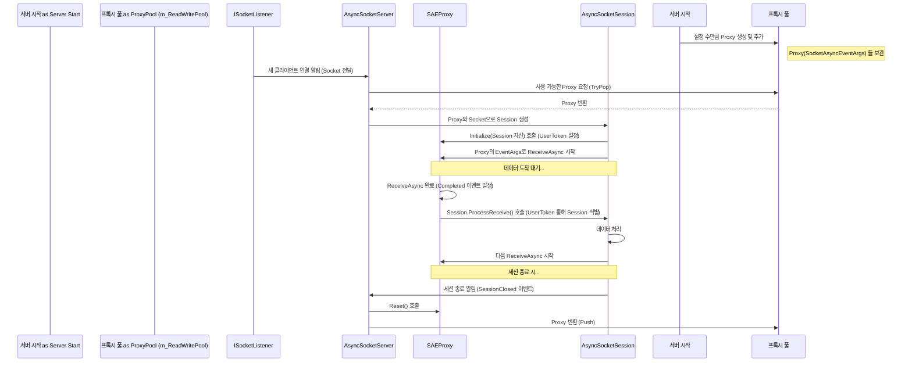

# Chapter 9: 비동기 소켓 이벤트 인자 프록시 (SocketAsyncEventArgsProxy)


[이전 챕터 (소켓 리스너 (ISocketListener))](08_소켓_리스너__isocketlistener__.md)에서는 서버의 '귀' 역할을 하는 `ISocketListener`가 어떻게 클라이언트의 첫 연결 요청을 받아들이는지 알아보았습니다. 이제 우리는 클라이언트가 접속하는 순간부터 데이터가 요청 정보([IRequestInfo](05_요청_정보__irequestinfo__.md))로 변환되어 처리되는 전체 흐름을 이해하게 되었습니다.

이 과정에서 [소켓 서버 (SocketServer / SocketServerBase)](06_소켓_서버__socketserver___socketserverbase__.md) (특히 `AsyncSocketServer`) 와 [소켓 세션 (SocketSession)](07_소켓_세션__socketsession__.md) (특히 `AsyncSocketSession`) 같은 컴포넌트들이 효율적인 비동기(asynchronous) 네트워크 통신을 위해 .NET의 `SocketAsyncEventArgs`라는 객체를 사용한다고 언급했습니다. 이 `SocketAsyncEventArgs` 객체는 강력하지만, 직접 사용하고 관리하기에는 다소 복잡할 수 있습니다. 특히, 고성능 서버에서는 이 객체를 매번 새로 만들기보다 재사용하는 것이 성능 향상에 매우 중요합니다.

이번 마지막 챕터에서는 SuperSocketLite가 이 `SocketAsyncEventArgs` 객체를 어떻게 더 효율적이고 편리하게 관리하는지, 그 비밀 병기인 **비동기 소켓 이벤트 인자 프록시 (SocketAsyncEventArgsProxy)** 에 대해 알아보겠습니다.

## 왜 프록시가 필요할까요? (재사용 가능한 조리 도구 준비하기)

고성능 네트워크 서버를 만드는 것은 마치 아주 바쁜 레스토랑의 주방을 운영하는 것과 비슷합니다. 수많은 손님(클라이언트)들이 동시에 몰려와 주문(데이터 요청)을 쏟아냅니다. 주방에서는 각 주문을 처리하기 위해 다양한 조리 도구(국자, 프라이팬, 칼 등)가 필요합니다.

.NET의 `SocketAsyncEventArgs` 객체는 이런 **조리 도구**와 같습니다. 데이터를 받거나 보낼 때 필요한 정보(예: 데이터를 담을 버퍼, 작업 완료 후 실행할 내용 등)를 담고 있는 중요한 도구입니다. 하지만 만약 손님이 올 때마다 매번 새 국자, 새 프라이팬을 만들어서 사용하고 버린다면 어떻게 될까요? 금방 자원이 낭비되고 주방은 혼란스러워질 것입니다.

훨씬 효율적인 방법은 자주 사용하는 조리 도구들을 미리 여러 개 준비해두고(객체 풀링, Object Pooling), 사용한 도구는 깨끗이 씻어 다시 사용할 수 있도록 정리해두는 것입니다. 이렇게 하면 새 도구를 만드는 시간과 비용을 절약하고, 주방(서버)은 더 빠르고 효율적으로 돌아갈 수 있습니다.

**비동기 소켓 이벤트 인자 프록시 (SocketAsyncEventArgsProxy)** 는 바로 이 `SocketAsyncEventArgs`라는 '조리 도구'를 **재사용 가능한 풀(pool)에서 관리**하고, 비동기 작업이 완료되었을 때 필요한 후속 처리(예: 어떤 [소켓 세션 (SocketSession)](07_소켓_세션__socketsession__.md)의 작업이었는지 알려주기)를 쉽게 할 수 있도록 도와주는 **'도구 관리자' 또는 '정리 도우미'** 역할을 합니다.

## `SocketAsyncEventArgsProxy`란 무엇인가요?

`SocketAsyncEventArgsProxy`는 이름 그대로 `.NET`의 `SocketAsyncEventArgs` 객체를 **감싸는(Wrapping)** **프록시(Proxy)** 객체입니다. 프록시는 '대리인'이라는 뜻으로, 실제 `SocketAsyncEventArgs` 객체를 직접 다루는 대신 이 프록시 객체를 통해 좀 더 편리하게 상호작용할 수 있게 해줍니다.

주요 역할은 다음과 같습니다.

1.  **`SocketAsyncEventArgs` 감싸기:** 실제 비동기 소켓 작업을 위한 `SocketAsyncEventArgs` 객체를 내부에 가지고 있습니다.
2.  **풀링(Pooling) 지원:** `SocketAsyncEventArgsProxy` 객체 자체를 미리 여러 개 만들어 풀에 저장해두고, 필요할 때마다 꺼내 쓰고 반납하여 `SocketAsyncEventArgs` 객체의 반복적인 생성 및 소멸 비용을 줄입니다. ([AsyncSocketServer](SocketEngine/AsyncSocketServer.cs)의 `m_ReadWritePool`이 이 역할을 합니다.)
3.  **콜백 처리 연결:** 비동기 작업(예: 데이터 수신)이 완료되면 `SocketAsyncEventArgs`의 `Completed` 이벤트가 발생합니다. `SocketAsyncEventArgsProxy`는 이 이벤트가 발생했을 때, 해당 작업이 어떤 [소켓 세션 (SocketSession)](07_소켓_세션__socketsession__.md)과 관련있는지를 쉽게 파악하고, 해당 세션의 처리 메서드(예: `AsyncSocketSession.ProcessReceive`)를 호출하도록 연결해주는 역할을 합니다.

간단히 말해, `SocketAsyncEventArgsProxy`는 `SocketAsyncEventArgs` 객체를 재활용 통에 넣어두고, 필요할 때 꺼내서 어떤 작업에 쓰였는지 태그(tag)를 붙여 사용한 뒤, 작업이 끝나면 다시 깨끗하게 정리해서 통에 넣는 과정을 도와주는 편리한 도구 관리 시스템입니다.

## `SocketAsyncEventArgsProxy`는 어떻게 사용되나요? (주로 내부적으로)

SuperSocketLite를 사용하는 일반적인 개발자는 `SocketAsyncEventArgsProxy`를 직접 코드에서 생성하거나 사용할 일이 거의 없습니다. 이 객체는 주로 SuperSocketLite 내부의 저수준 컴포넌트들, 특히 `AsyncSocketServer`와 `AsyncSocketSession`에서 비동기 TCP 통신을 효율적으로 처리하기 위해 사용됩니다.

어떻게 사용되는지 흐름을 따라가 봅시다.

*   **서버 시작 시 ([AsyncSocketServer](SocketEngine/AsyncSocketServer.cs))**:
    1.  `AsyncSocketServer`가 시작될 때, 설정된 최대 연결 수(`MaxConnectionNumber`)만큼 `SocketAsyncEventArgs` 객체를 미리 생성합니다.
    2.  각 `SocketAsyncEventArgs` 객체에 필요한 메모리 버퍼를 할당합니다 (`BufferManager` 사용).
    3.  각 `SocketAsyncEventArgs` 객체를 `SocketAsyncEventArgsProxy`로 감싸서 프록시 객체 풀(`m_ReadWritePool`)에 넣어둡니다. 마치 깨끗한 조리 도구들을 선반에 정리해두는 것과 같습니다.

*   **새 클라이언트 연결 시 ([AsyncSocketServer](SocketEngine/AsyncSocketServer.cs))**:
    1.  새로운 클라이언트 연결 요청이 수락되면, `AsyncSocketServer`는 프록시 풀(`m_ReadWritePool`)에서 사용 가능한 `SocketAsyncEventArgsProxy` 객체를 하나 꺼내옵니다.
    2.  이 프록시 객체와 새로 생성된 클라이언트 소켓(Socket)을 사용하여 [AsyncSocketSession](SocketEngine/AsyncSocketSession.cs) 객체를 만듭니다.
    3.  `AsyncSocketSession`이 시작되면, 이 프록시 객체에 담긴 `SocketAsyncEventArgs`를 사용하여 첫 번째 비동기 데이터 수신(`ReceiveAsync`)을 시작합니다. 이때 `SocketAsyncEventArgs.UserToken` 속성에 `AsyncSocketSession` 자기 자신을 설정하여, 나중에 콜백이 발생했을 때 어떤 세션의 작업인지 알 수 있도록 합니다.

*   **데이터 수신 완료 시 ([AsyncSocketSession](SocketEngine/AsyncSocketSession.cs))**:
    1.  클라이언트로부터 데이터가 도착하여 `ReceiveAsync` 작업이 완료되면, `SocketAsyncEventArgs`의 `Completed` 이벤트가 발생합니다.
    2.  `SocketAsyncEventArgsProxy`에 연결된 이벤트 핸들러(`SocketEventArgs_Completed`)가 호출됩니다.
    3.  이 핸들러는 `SocketAsyncEventArgs.UserToken`을 통해 이 작업이 어떤 `AsyncSocketSession`에 속하는지 알아냅니다.
    4.  해당 `AsyncSocketSession`의 `ProcessReceive()` 메서드를 호출하여 실제 데이터 처리 로직을 실행하도록 합니다.
    5.  `ProcessReceive()` 메서드 안에서는 데이터를 처리한 후, 다시 이 프록시 객체를 사용하여 다음 데이터 수신(`ReceiveAsync`)을 시작합니다.

*   **세션 종료 시 ([AsyncSocketServer](SocketEngine/AsyncSocketServer.cs))**:
    1.  클라이언트 연결이 종료되면, 해당 세션에서 사용하던 `SocketAsyncEventArgsProxy` 객체의 상태를 초기화(`Reset()`)합니다.
    2.  이 프록시 객체를 다시 프록시 풀(`m_ReadWritePool`)에 반납하여 다른 새로운 연결에서 재사용할 수 있도록 합니다. 사용한 조리 도구를 깨끗이 씻어 다시 선반에 두는 것과 같습니다.

이처럼 `SocketAsyncEventArgsProxy`는 SuperSocketLite의 비동기 통신 엔진 내부에서 `SocketAsyncEventArgs` 객체의 생명주기를 관리하고 재사용성을 높이는 핵심적인 역할을 조용히 수행하고 있습니다.

## 내부 동작 방식 (간단히 엿보기)

`SocketAsyncEventArgsProxy`가 어떻게 풀에서 관리되고 콜백을 처리하는지 간단한 시퀀스 다이어그램으로 살펴보겠습니다.



### 관련 코드 엿보기

`SocketAsyncEventArgsProxy` 클래스의 정의를 살펴보면 그 구조를 더 잘 이해할 수 있습니다.

**`SocketAsyncEventArgsProxy.cs` ([SocketEngine/SocketAsyncEventArgsProxy.cs](SocketEngine/SocketAsyncEventArgsProxy.cs))**

```csharp
using System;
using System.Net.Sockets;
using SuperSocketLite.SocketBase;

namespace SuperSocketLite.SocketEngine;

// SocketAsyncEventArgs를 감싸는 프록시 클래스
class SocketAsyncEventArgsProxy
{
    // 실제 SocketAsyncEventArgs 객체
    public SocketAsyncEventArgs SocketEventArgs { get; private set; }

    // 버퍼의 원래 시작 오프셋 (버퍼 재사용 시 필요)
    public int OrigOffset { get; private set; }

    // 이 프록시 객체를 풀에 반환하여 재사용할 수 있는지 여부
    public bool IsRecyclable { get; private set; }

    // 기본 생성자 (사용되지 않음)
    private SocketAsyncEventArgsProxy() { }

    // 생성자: SocketAsyncEventArgs 객체를 받아 초기화
    public SocketAsyncEventArgsProxy(SocketAsyncEventArgs socketEventArgs)
        : this(socketEventArgs, true) // 기본적으로 재사용 가능
    { }

    // 생성자: 재사용 가능 여부 지정 가능
    public SocketAsyncEventArgsProxy(SocketAsyncEventArgs socketEventArgs, bool isRecyclable)
    {
        SocketEventArgs = socketEventArgs;
        OrigOffset = socketEventArgs.Offset; // 초기 오프셋 저장
        // 비동기 작업 완료 시 호출될 이벤트 핸들러 연결
        SocketEventArgs.Completed += new EventHandler<SocketAsyncEventArgs>(SocketEventArgs_Completed);
        IsRecyclable = isRecyclable;
    }

    // SocketAsyncEventArgs.Completed 이벤트 발생 시 호출되는 정적 메서드
    static void SocketEventArgs_Completed(object sender, SocketAsyncEventArgs e)
    {
        // UserToken에 저장된 SocketSession 객체 가져오기
        var socketSession = e.UserToken as IAsyncSocketSession;

        if (socketSession == null) // SocketSession 정보가 없으면 무시
            return;

        // 마지막 작업이 데이터 수신(Receive)이었는지 확인
        if (e.LastOperation == SocketAsyncOperation.Receive)
        {
            // SocketSession의 스레드에서 ProcessReceive 실행하도록 비동기 요청
            // (AppServer의 스레드 풀을 사용할 수 있음)
            socketSession.AsyncRun(() => socketSession.ProcessReceive(e));
        }
        else
        {
            // 수신 작업 외의 완료는 여기서 처리하지 않음 (예외 발생)
            throw new ArgumentException("The last operation completed on the socket was not a receive");
        }
    }

    // SocketSession과 연결될 때 호출 (UserToken 설정)
    public void Initialize(IAsyncSocketSession socketSession)
    {
        SocketEventArgs.UserToken = socketSession;
    }

    // 풀에 반환되기 전에 호출 (UserToken 초기화)
    public void Reset()
    {
        SocketEventArgs.UserToken = null;
    }
}
```

*   **`SocketEventArgs` 속성:** 실제 `SocketAsyncEventArgs` 객체를 가지고 있습니다.
*   **`OrigOffset` 속성:** `SocketAsyncEventArgs`에 할당된 버퍼 내에서 이 프록시가 사용하는 원래 시작 위치를 기억합니다. 버퍼를 여러 세션이 공유할 때 중요합니다.
*   **`IsRecyclable` 속성:** 이 프록시 객체가 풀에 반환되어 재사용될 수 있는지를 나타냅니다.
*   **생성자:** `SocketAsyncEventArgs` 객체를 받고, 완료 이벤트 핸들러(`SocketEventArgs_Completed`)를 연결합니다.
*   **`SocketEventArgs_Completed` 핸들러:** 비동기 작업이 완료되면 호출됩니다. `UserToken`을 통해 관련 `SocketSession`을 찾고, 해당 세션의 데이터 처리 메서드(`ProcessReceive`)를 호출합니다.
*   **`Initialize()` / `Reset()`:** 프록시가 특정 세션에 할당되거나 풀에 반환될 때 `UserToken`을 설정하거나 초기화하는 역할을 합니다.

`AsyncSocketServer` 클래스에서는 이 프록시 객체들을 담는 풀(`m_ReadWritePool`)을 관리하고, 세션이 시작되고 끝날 때 프록시를 가져오거나 반환하는 로직을 볼 수 있습니다.

```csharp
// 파일: SocketEngine/AsyncSocketServer.cs (일부 발췌)
class AsyncSocketServer : TcpSocketServerBase, IActiveConnector
{
    // SocketAsyncEventArgsProxy 객체들을 저장하는 동시성 지원 스택 (풀)
    private ConcurrentStack<SocketAsyncEventArgsProxy> m_ReadWritePool;
    // ...

    public override bool Start()
    {
        // ... 버퍼 관리자(m_BufferManager) 초기화 ...

        var socketArgsProxyList = new List<SocketAsyncEventArgsProxy>(AppServer.Config.MaxConnectionNumber);

        // 설정된 최대 연결 수만큼 프록시 객체 미리 생성
        for (int i = 0; i < AppServer.Config.MaxConnectionNumber; i++)
        {
            var socketEventArg = new SocketAsyncEventArgs();
            m_BufferManager.SetBuffer(socketEventArg); // 버퍼 할당
            socketArgsProxyList.Add(new SocketAsyncEventArgsProxy(socketEventArg)); // 프록시 생성 및 리스트 추가
        }

        // 생성된 프록시 리스트로 풀 초기화
        m_ReadWritePool = new ConcurrentStack<SocketAsyncEventArgsProxy>(socketArgsProxyList);

        // ... 리스너 시작 등 ...
        return true;
    }

    private IAppSession ProcessNewClient(Socket client, SslProtocols security)
    {
        SocketAsyncEventArgsProxy socketEventArgsProxy;
        // 풀에서 프록시 꺼내오기 시도
        if (!m_ReadWritePool.TryPop(out socketEventArgsProxy))
        {
            // 실패 시 (풀이 비었음 = 최대 연결 수 도달) 연결 거부
            AppServer.Logger.Error($"Max connection number {AppServer.Config.MaxConnectionNumber} was reached!");
            client.SafeClose();
            return null;
        }

        // 프록시를 사용하여 SocketSession 생성
        ISocketSession socketSession = (security == SslProtocols.None)
            ? new AsyncSocketSession(client, socketEventArgsProxy)
            : new AsyncStreamSocketSession(client, security, socketEventArgsProxy);

        // ... AppSession 생성 및 등록 ...

        // 세션이 닫혔을 때 호출될 이벤트 핸들러 연결 (프록시 반환 위함)
        socketSession.Closed += SessionClosed;

        // ... 세션 시작 ...
        return session; // 또는 null
    }

    // 세션이 닫혔을 때 호출되는 이벤트 핸들러
    void SessionClosed(ISocketSession session, CloseReason reason)
    {
        var socketSession = session as IAsyncSocketSessionBase;
        if (socketSession == null) return;

        var proxy = socketSession.SocketAsyncProxy;
        proxy.Reset(); // 프록시 상태 리셋

        // ... 버퍼 오프셋 복원 로직 ...

        // 서버가 정상 상태이고 프록시가 재활용 가능하면 풀에 반환
        if (!IsStopped && proxy.IsRecyclable && m_ReadWritePool != null)
            m_ReadWritePool.Push(proxy);
        else // 아니면 프록시가 가진 리소스 해제
            proxy.SocketEventArgs.Dispose();
    }

    // ...
}
```

이처럼 `SocketAsyncEventArgsProxy`는 SuperSocketLite의 고성능 비동기 네트워킹을 가능하게 하는 중요한 내부 최적화 기법입니다.

## 정리 및 다음 단계

이번 챕터에서는 SuperSocketLite가 .NET의 `SocketAsyncEventArgs` 객체를 효율적으로 관리하기 위해 사용하는 **비동기 소켓 이벤트 인자 프록시 (SocketAsyncEventArgsProxy)** 에 대해 배웠습니다. 이 프록시는 `SocketAsyncEventArgs` 객체를 감싸서 **객체 풀링(재사용)** 을 가능하게 하고, 비동기 작업 완료 시 적절한 **콜백 처리**를 쉽게 연결해주는 '도우미' 역할을 한다는 것을 알게 되었습니다. 이를 통해 SuperSocketLite는 높은 성능과 안정성을 달성할 수 있습니다. 비록 개발자가 직접 다룰 일은 거의 없지만, 내부적으로 어떻게 동작하는지 이해하는 것은 SuperSocketLite의 성능 특성을 파악하는 데 도움이 됩니다.

이것으로 SuperSocketLite의 주요 구성 요소들에 대한 소개를 마칩니다. 우리는 서버 설정([IServerConfig](01_서버_설정__iserverconfig__.md))부터 시작하여, 서버의 전반적인 운영([AppServer](02_애플리케이션_서버__appserver___appserverbase__.md)), 개별 클라이언트 관리([AppSession](03_애플리케이션_세션__appsession__.md)), 데이터 해석([IReceiveFilter](04_수신_필터__ireceivefilter__.md))과 요청 표현([IRequestInfo](05_요청_정보__irequestinfo__.md)), 그리고 저수준 네트워크 통신 처리([SocketServer](06_소켓_서버__socketserver___socketserverbase__.md), [SocketSession](07_소켓_세션__socketsession__.md), [ISocketListener](08_소켓_리스너__isocketlistener__.md)) 및 내부 최적화 기법(`SocketAsyncEventArgsProxy`)까지 살펴보았습니다.

이제 여러분은 SuperSocketLite의 핵심 개념들을 이해하고, 이를 바탕으로 자신만의 네트워크 애플리케이션 개발을 시작할 준비가 되었습니다! 제공된 예제 프로젝트들을 살펴보고, 직접 코드를 작성하며 배운 내용들을 활용해 보세요.

SuperSocketLite와 함께 즐거운 개발 여정이 되시기를 바랍니다!

---

Generated by [AI Codebase Knowledge Builder](https://github.com/The-Pocket/Tutorial-Codebase-Knowledge)