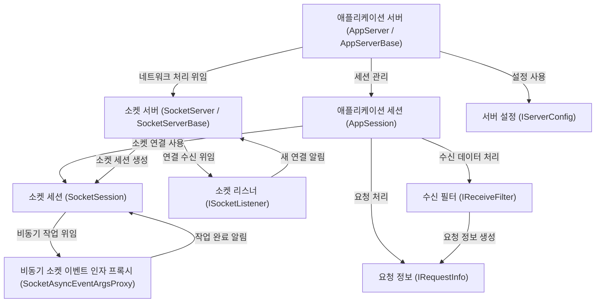

# Tutorial: SuperSocketLite

**SuperSocketLite**는 개발자가 네트워크 통신을 처리하는 서버 애플리케이션을 *쉽고 빠르게* 만들 수 있도록 도와주는 프레임워크입니다.
복잡한 소켓 프로그래밍 대신, 클라이언트 연결 관리, 데이터 수신 및 해석, 요청 처리 등 서버 개발에 필요한 핵심 기능들을 **추상화된** 형태로 제공하여 비즈니스 로직에 집중할 수 있게 해줍니다.

**Source Repository:** [None](None)

## Chapters

1. [서버 설정 (IServerConfig)
](01_서버_설정__iserverconfig__.md)
2. [애플리케이션 서버 (AppServer / AppServerBase)
](02_애플리케이션_서버__appserver___appserverbase__.md)
3. [애플리케이션 세션 (AppSession)
](03_애플리케이션_세션__appsession__.md)
4. [수신 필터 (IReceiveFilter)
](04_수신_필터__ireceivefilter__.md)
5. [요청 정보 (IRequestInfo)
](05_요청_정보__irequestinfo__.md)
6. [소켓 서버 (SocketServer / SocketServerBase)
](06_소켓_서버__socketserver___socketserverbase__.md)
7. [소켓 세션 (SocketSession)
](07_소켓_세션__socketsession__.md)
8. [소켓 리스너 (ISocketListener)
](08_소켓_리스너__isocketlistener__.md)
9. [비동기 소켓 이벤트 인자 프록시 (SocketAsyncEventArgsProxy)
](09_비동기_소켓_이벤트_인자_프록시__socketasynceventargsproxy__.md)

---

Generated by [AI Codebase Knowledge Builder](https://github.com/The-Pocket/Tutorial-Codebase-Knowledge)