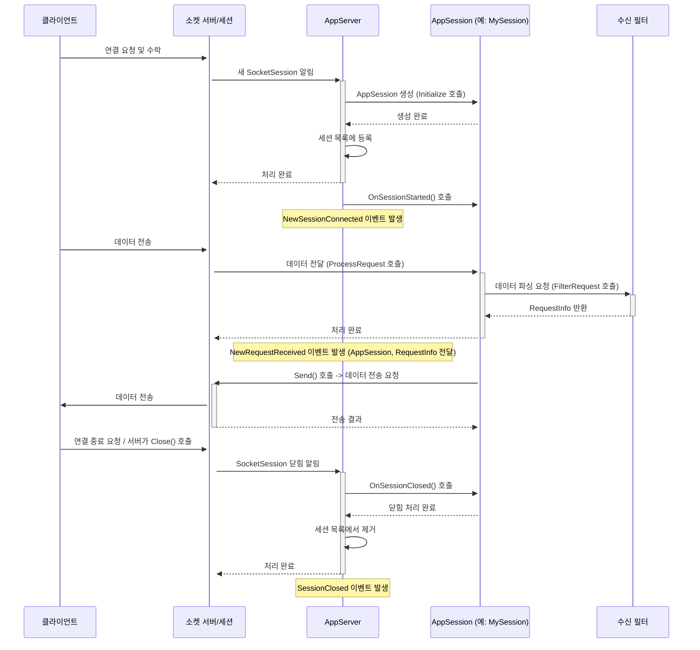

# Chapter 2: 애플리케이션 세션 (AppSession)

지난 [제1장: 애플리케이션 서버 (AppServer)](01_애플리케이션_서버__appserver_.md)에서는 SuperSocketLite 애플리케이션의 전체 운영을 담당하는 '총지배인', AppServer에 대해 배웠습니다. AppServer는 클라이언트 연결을 수락하고 기본적인 서버 관리를 수행했죠. 하지만 서버에 연결된 *개별* 클라이언트는 어떻게 관리하고 상호작용할까요? 마치 레스토랑 총지배인이 각 테이블을 직접 서빙하지 않고 담당 웨이터에게 맡기는 것처럼, AppServer도 개별 클라이언트와의 소통은 '애플리케이션 세션 (AppSession)'에게 맡깁니다.

이번 장에서는 서버에 연결된 각 클라이언트를 대표하는 객체인 **애플리케이션 세션 (AppSession)**에 대해 자세히 알아보겠습니다.

## AppSession은 왜 필요할까요?

레스토랑에 여러 손님이 동시에 방문한다고 생각해 보세요. 각 손님(클라이언트)은 자신만의 테이블에 앉아 주문하고 식사를 합니다. 레스토랑은 각 테이블마다 어떤 손님이 앉아 있는지, 무엇을 주문했는지, 식사는 어디까지 진행되었는지 등의 정보를 개별적으로 관리해야 합니다. 모든 손님의 주문을 한 곳에서 뒤섞어 관리할 수는 없겠죠?

네트워크 서버도 마찬가지입니다. 여러 클라이언트가 동시에 서버에 접속하면, 서버는 각 클라이언트를 개별적으로 식별하고 관리해야 합니다.
*   어떤 클라이언트가 연결을 요청했는지 (누가 테이블에 앉았는지)
*   해당 클라이언트의 네트워크 주소는 무엇인지 (어느 테이블인지)
*   클라이언트가 마지막으로 메시지를 보낸 시간은 언제인지 (마지막 주문/요청 시간)
*   해당 클라이언트에게만 특정 메시지를 보내려면 어떻게 해야 하는지 (특정 테이블에 음식 서빙하기)

이러한 '클라이언트별' 정보와 상태를 관리하고, 해당 클라이언트와 데이터를 주고받는 역할을 하는 것이 바로 `AppSession`입니다. `AppSession` 객체 하나가 서버에 연결된 클라이언트 하나를 의미합니다. AppServer가 새로운 클라이언트 연결을 감지하면, 해당 클라이언트를 위한 `AppSession` 객체를 생성하여 관리를 시작합니다.

## AppSession 사용하기

`AppSession`은 보통 직접 사용하기보다는, 이를 상속받아 우리 애플리케이션에 맞는 세션 클래스를 만들어 사용합니다. 지난 장의 에코 서버 예제에서도 이미 `MySession`이라는 이름으로 간단히 사용했었습니다.

```csharp
// 네임스페이스 추가
using SuperSocketLite.SocketBase;
using SuperSocketLite.SocketBase.Protocol;

// AppSession을 상속받는 사용자 정의 세션 클래스
// TAppSession: 자기 자신의 타입을 지정 (MySession)
// TRequestInfo: 이 세션이 처리할 요청 정보의 타입 (여기서는 StringRequestInfo)
public class MySession : AppSession<MySession, StringRequestInfo>
{
    // 이 세션에 특화된 데이터를 저장할 수 있습니다.
    // 예: 로그인한 사용자의 ID
    public string UserId { get; set; }

    // 클라이언트가 연결되었을 때 AppServer에 의해 호출될 수 있는 메서드 (오버라이드)
    protected override void OnSessionStarted()
    {
        Console.WriteLine($"세션 {this.SessionID} 시작됨. 클라이언트: {this.RemoteEndPoint}");
        // 연결된 클라이언트에게 환영 메시지 보내기
        this.Send("에코 서버에 오신 것을 환영합니다!");
        base.OnSessionStarted(); // 기본 구현 호출
    }

    // 클라이언트 연결이 닫혔을 때 AppServer에 의해 호출될 수 있는 메서드 (오버라이드)
    protected override void OnSessionClosed(CloseReason reason)
    {
        Console.WriteLine($"세션 {this.SessionID} 닫힘. 이유: {reason}");
        base.OnSessionClosed(reason); // 기본 구현 호출
    }

    // 알 수 없는 요청이나 처리되지 않은 요청을 받았을 때 호출될 수 있는 메서드 (오버라이드)
    protected override void HandleUnknownRequest(StringRequestInfo requestInfo)
    {
        Console.WriteLine($"세션 {this.SessionID}로부터 알 수 없는 요청 받음: {requestInfo.Key}");
        this.Send("알 수 없는 명령어입니다.");
    }

    // 예외 처리 메서드 (오버라이드)
    protected override void HandleException(Exception e)
    {
        Console.WriteLine($"세션 {this.SessionID}에서 오류 발생: {e.Message}");
        // 오류 발생 시 연결 종료
        this.Close(CloseReason.ApplicationError);
    }
}
```

위 코드에서 `MySession`은 `AppSession<MySession, StringRequestInfo>`를 상속받습니다.
*   `AppSession<TAppSession, TRequestInfo>`: 제네릭 클래스로, `TAppSession`에는 자기 자신의 타입(여기서는 `MySession`)을, `TRequestInfo`에는 이 세션이 처리할 요청 정보의 타입([제3장: 요청 정보 (RequestInfo)](03_요청_정보__requestinfo_.md)에서 자세히 다룹니다)을 지정합니다.
*   `OnSessionStarted()`: 클라이언트와의 연결이 성공적으로 수립되고 세션이 시작될 때 호출됩니다. 이 메서드를 오버라이드하여 세션 초기화 로직(예: 환영 메시지 전송)을 넣을 수 있습니다.
*   `OnSessionClosed(CloseReason reason)`: 세션이 닫힐 때 호출됩니다. `reason` 매개변수를 통해 연결 종료 이유를 알 수 있습니다.
*   `HandleUnknownRequest(TRequestInfo requestInfo)`: 정의되지 않은 명령어나 요청을 받았을 때 처리 로직을 넣을 수 있습니다.
*   `HandleException(Exception e)`: 세션 처리 중 발생하는 예외를 처리할 수 있습니다. 기본적으로는 오류를 로깅하고 세션을 닫습니다.
*   `this.Send(...)`: 현재 `AppSession` 객체에 연결된 클라이언트에게 데이터를 보냅니다.
*   `this.Close(...)`: 현재 `AppSession` 객체에 연결된 클라이언트와의 연결을 닫습니다.

이제 `AppServer`에서 이 `MySession`을 어떻게 사용하는지 다시 살펴보겠습니다.

```csharp
// AppServer를 상속받는 메인 서버 클래스
public class MyServer : AppServer<MySession, StringRequestInfo> // 세션 타입으로 MySession 지정
{
    public MyServer() : base(new DefaultReceiveFilterFactory<CommandLineReceiveFilter, StringRequestInfo>())
    {
        // AppServer의 이벤트 핸들러 등록
        // 각 이벤트 핸들러는 해당 이벤트가 발생한 세션 객체(MySession 인스턴스)를 파라미터로 받습니다.
        this.NewSessionConnected += MyServer_NewSessionConnected;
        this.SessionClosed += MyServer_SessionClosed;
        this.NewRequestReceived += MyServer_NewRequestReceived;
    }

    // 새 클라이언트가 연결되었을 때 (MySession 객체가 생성된 후)
    void MyServer_NewSessionConnected(MySession session) // 파라미터 타입이 MySession
    {
        Console.WriteLine($"클라이언트 {session.RemoteEndPoint} 연결됨 (세션 ID: {session.SessionID})");
        // 이제 session 객체를 통해 해당 클라이언트와 상호작용할 수 있습니다.
        // OnSessionStarted 에서 이미 환영 메시지를 보내므로 여기서는 생략 가능
        // session.Send("환영합니다!");

        // 세션별 데이터 저장 예시 (예: 초기 상태 설정)
        session.UserId = null; // 아직 로그인 안 함
    }

    // 클라이언트 연결이 종료되었을 때 (MySession 객체가 닫힌 후)
    void MyServer_SessionClosed(MySession session, CloseReason reason) // 파라미터 타입이 MySession
    {
        Console.WriteLine($"클라이언트 {session.RemoteEndPoint} 연결 종료됨 (이유: {reason})");
        // 필요하다면 세션 종료 관련 정리 작업 수행
    }

    // 클라이언트로부터 새로운 요청을 받았을 때
    void MyServer_NewRequestReceived(MySession session, StringRequestInfo requestInfo) // 파라미터 타입이 MySession
    {
        Console.WriteLine($"클라이언트 {session.RemoteEndPoint}로부터 요청 받음: Key={requestInfo.Key}, Body={requestInfo.Body}");

        // 에코 기능: 받은 메시지 앞에 "Echo: "를 붙여서 돌려줌
        // session.Send() 를 호출하면 이 요청을 보낸 특정 클라이언트에게만 응답이 갑니다.
        session.Send($"Echo: {requestInfo.Key} {requestInfo.Body}");

        // 세션 데이터 사용 예시 (예: 로그인 처리)
        if (requestInfo.Key.Equals("LOGIN", StringComparison.OrdinalIgnoreCase) && session.UserId == null)
        {
            session.UserId = requestInfo.Body; // 간단한 예시: Body를 UserId로 사용
            session.Send($"로그인 성공: 사용자 ID = {session.UserId}");
        }
    }
}
```

`AppServer<MySession, StringRequestInfo>`와 같이 `AppServer`를 정의할 때 우리가 만든 `MySession` 타입을 지정하면, SuperSocketLite는 새로운 클라이언트 연결이 들어올 때마다 자동으로 `MySession`의 인스턴스를 생성해줍니다. 그리고 `NewSessionConnected`, `SessionClosed`, `NewRequestReceived`와 같은 `AppServer`의 이벤트 핸들러들은 해당 이벤트와 관련된 `MySession` 객체를 파라미터로 전달받습니다.

따라서 이벤트 핸들러 내에서 `session` 파라미터를 사용하면, 특정 클라이언트의 정보를 얻거나(`session.RemoteEndPoint`, `session.SessionID`), 해당 클라이언트에게만 메시지를 보내거나(`session.Send()`), 연결을 끊는(`session.Close()`) 등의 작업을 수행할 수 있습니다. 또한, `MySession` 클래스에 `UserId`와 같은 커스텀 속성을 추가하여 클라이언트별 상태 정보(로그인 여부, 닉네임 등)를 저장하고 관리할 수도 있습니다.

## AppSession의 주요 속성 및 메서드

`AppSession` 클래스와 이를 상속받은 사용자 정의 세션 클래스는 다음과 같은 유용한 속성과 메서드를 제공합니다.

*   **`SessionID` (string):** 각 세션을 구분하는 고유한 ID입니다. SuperSocketLite가 자동으로 생성합니다.
*   **`RemoteEndPoint` (IPEndPoint):** 연결된 클라이언트의 IP 주소와 포트 번호 정보입니다.
*   **`LocalEndPoint` (IPEndPoint):** 서버가 클라이언트 연결을 수신 대기하는 로컬 IP 주소와 포트 번호 정보입니다.
*   **`AppServer`:** 이 세션을 관리하는 `AppServer` 인스턴스에 대한 참조입니다.
*   **`SocketSession` ([ISocketSession](06_소켓_세션__socketsession_.md)):** 내부적으로 실제 소켓 통신을 담당하는 객체에 대한 참조입니다.
*   **`LastActiveTime` (DateTime):** 세션에서 마지막으로 데이터 송수신 활동이 있었던 시간입니다. 오랫동안 활동이 없는 클라이언트(좀비 클라이언트)를 감지하고 연결을 종료하는 데 사용할 수 있습니다.
*   **`StartTime` (DateTime):** 세션이 시작된 시간입니다.
*   **`Connected` (bool):** 현재 세션이 연결되어 있는지 여부를 나타냅니다.
*   **`Items` (IDictionary<object, object>):** 세션과 관련된 임시 데이터를 저장할 수 있는 딕셔너리입니다. 간단한 상태 정보 등을 저장하기에 편리합니다.
*   **`Send(string message)` / `Send(byte[] data, int offset, int length)` / `Send(ArraySegment<byte> segment)` / `Send(IList<ArraySegment<byte>> segments)`:** 연결된 클라이언트에게 데이터를 전송합니다. 문자열, 바이트 배열 등 다양한 형태로 보낼 수 있습니다.
*   **`TrySend(...)`:** `Send`와 유사하지만, 보내기 작업이 즉시 성공하지 않을 경우(예: 보내기 버퍼가 가득 참) false를 반환하고 대기하지 않습니다. 비동기 처리나 성능 최적화에 유용할 수 있습니다.
*   **`Close()` / `Close(CloseReason reason)`:** 현재 세션과의 연결을 종료합니다. 종료 이유를 지정할 수 있습니다.
*   **`Charset` (Encoding):** 문자열 데이터를 주고받을 때 사용할 인코딩 방식 (기본값은 AppServer 설정 따름).

## AppSession 내부 동작 방식 (간략히)

AppServer가 클라이언트 연결을 받고 AppSession을 통해 어떻게 상호작용하는지 내부 흐름을 좀 더 살펴보겠습니다.

1.  **연결 수락:** 클라이언트가 서버에 연결하면, [소켓 리스너 (SocketListener)](07_소켓_리스너__socketlistener_.md)가 연결을 감지하고 [소켓 서버 (SocketServer)](05_소켓_서버__socketserver_.md)가 이를 수락합니다.
2.  **SocketSession 생성:** `SocketServer`는 수락된 연결에 대한 저수준 소켓 통신을 담당하는 [소켓 세션 (SocketSession)](06_소켓_세션__socketsession_.md) 객체를 생성합니다.
3.  **AppSession 생성 및 초기화:** `AppServer`는 `SocketSession` 정보를 받아서, 우리가 `AppServer`에 지정한 사용자 정의 `AppSession` 타입(예: `MySession`)의 인스턴스를 생성합니다. 이 때 `AppSession`의 `Initialize` 메서드가 호출되어 `AppServer` 참조, `SocketSession` 참조, `SessionID` 등이 설정됩니다. (`SuperSocketLite\SocketBase\AppSession.cs`의 `Initialize` 메서드 참고)
4.  **세션 등록 및 이벤트 발생:** 생성된 `AppSession` 객체는 `AppServer` 내부의 세션 목록에 등록됩니다. (`AppServer.RegisterSession` 참고) 이후 `AppServer`는 `NewSessionConnected` 이벤트를 발생시키고, `AppSession`의 `OnSessionStarted` 메서드를 호출합니다.
5.  **데이터 수신 및 처리:** 클라이언트가 데이터를 보내면, `SocketSession`이 데이터를 수신합니다. 이 데이터는 `AppServer` 설정에 따라 [수신 필터 (ReceiveFilter)](04_수신_필터__receivefilter_.md)로 전달되어 파싱되고, [요청 정보 (RequestInfo)](03_요청_정보__requestinfo_.md) 객체로 변환됩니다. 이 과정은 `AppSession`의 `ProcessRequest` 메서드 내에서 `FilterRequest`를 호출하며 이루어집니다 (`SuperSocketLite\SocketBase\AppSession.cs`의 `ProcessRequest`, `FilterRequest` 메서드 참고).
6.  **요청 처리 이벤트 발생:** 완전한 `RequestInfo`가 만들어지면, `AppServer`는 `NewRequestReceived` 이벤트를 발생시켜 우리가 등록한 핸들러(예: `MyServer_NewRequestReceived`)를 호출합니다. 이 때 해당 `AppSession` 객체와 `RequestInfo` 객체가 함께 전달됩니다.
7.  **데이터 전송:** `AppSession`의 `Send` 메서드를 호출하면, 내부적으로 연결된 `SocketSession`의 `Send` 또는 `TrySend` 메서드를 호출하여 실제 데이터를 클라이언트에게 전송합니다. (`SuperSocketLite\SocketBase\AppSession.cs`의 `Send`, `InternalSend`, `TrySend` 메서드 참고)
8.  **연결 종료:** 클라이언트가 연결을 끊거나 서버에서 `Close` 메서드를 호출하면, `SocketSession`이 닫히고, 관련된 `AppSession`은 `OnSessionClosed` 메서드가 호출된 후 `AppServer`의 세션 목록에서 제거됩니다. `AppServer`는 `SessionClosed` 이벤트를 발생시킵니다.

간단한 순서도로 표현하면 다음과 같습니다.



**`AppSession.Initialize()` (SuperSocketLite\\SocketBase\\AppSession.cs)**

```csharp
// AppSession<TAppSession, TRequestInfo> 클래스 내 Initialize 메서드
public virtual void Initialize(IAppServer<TAppSession, TRequestInfo> appServer, ISocketSession socketSession)
{
    // AppServer 와 SocketSession 참조 설정
    var castedAppServer = (AppServerBase<TAppSession, TRequestInfo>)appServer;
    AppServer = castedAppServer;
    Charset = castedAppServer.TextEncoding; // AppServer 설정에서 인코딩 가져오기
    SocketSession = socketSession;
    SessionID = socketSession.SessionID; // SocketSession 으로부터 SessionID 가져오기
    m_Connected = true; // 연결 상태로 설정

    // 이 세션에서 사용할 ReceiveFilter 생성 및 초기화
    m_ReceiveFilter = castedAppServer.ReceiveFilterFactory.CreateFilter(appServer, this, socketSession.RemoteEndPoint);
    var filterInitializer = m_ReceiveFilter as IReceiveFilterInitializer;
    if (filterInitializer != null)
        filterInitializer.Initialize(castedAppServer, this);

    // SocketSession에도 AppSession 참조 설정 (상호 참조)
    socketSession.Initialize(this);

    // 사용자 정의 초기화 로직 호출 (오버라이드 가능)
    OnInit();
}
```
`Initialize` 메서드는 `AppSession`이 처음 생성될 때 호출되며, `AppServer`, `SocketSession`과의 연결고리를 만들고, 필요한 초기 설정을 수행합니다.

**`AppSession.Send()` (SuperSocketLite\\SocketBase\\AppSession.cs)**

```csharp
// AppSession<TAppSession, TRequestInfo> 클래스 내 Send 메서드 (문자열 버전 예시)
public virtual void Send(string message)
{
    // 문자열을 바이트 배열로 변환 (설정된 Charset 사용)
    var data = this.Charset.GetBytes(message);
    // 내부 Send 메서드 호출 (ArraySegment 사용)
    InternalSend(new ArraySegment<byte>(data, 0, data.Length));
}

// AppSession<TAppSession, TRequestInfo> 클래스 내 InternalSend 메서드
private void InternalSend(ArraySegment<byte> segment)
{
    if (!m_Connected) // 연결되어 있지 않으면 보내지 않음
        return;

    // 먼저 TrySend 를 시도 (즉시 보낼 수 있는지 확인)
    if (InternalTrySend(segment))
        return; // 성공하면 종료

    // 즉시 보내기 실패 시, 설정된 타임아웃 값 확인
    var sendTimeOut = Config.SendTimeOut;

    // 타임아웃이 음수면 재시도 없이 즉시 타임아웃 예외 발생
    if (sendTimeOut < 0)
    {
        throw new TimeoutException("The sending attempt timed out");
    }

    // 타임아웃 시간 계산 (0이면 무한 대기)
    var timeOutTime = sendTimeOut > 0 ? DateTime.Now.AddMilliseconds(sendTimeOut) : DateTime.Now;

    var spinWait = new SpinWait(); // CPU를 효율적으로 사용하며 잠시 대기

    // 연결되어 있는 동안 재시도
    while (m_Connected)
    {
        spinWait.SpinOnce(); // 잠시 대기

        // 다시 TrySend 시도
        if (InternalTrySend(segment))
            return; // 성공하면 종료

        // 타임아웃 시간이 설정되어 있고, 현재 시간이 타임아웃 시간을 넘었으면 예외 발생
        if (sendTimeOut > 0 && DateTime.Now >= timeOutTime)
        {
            throw new TimeoutException("The sending attempt timed out");
        }
    }
}

// AppSession<TAppSession, TRequestInfo> 클래스 내 InternalTrySend 메서드
private bool InternalTrySend(ArraySegment<byte> segment)
{
    // 실제 전송은 SocketSession 에게 위임
    if (!SocketSession.TrySend(segment))
        return false; // SocketSession 전송 실패 시 false 반환

    LastActiveTime = DateTime.Now; // 마지막 활동 시간 갱신
    return true; // 성공
}
```
`Send` 메서드는 데이터를 내부적으로 `SocketSession`으로 전달하여 실제 네트워크 전송을 시도합니다. 전송 버퍼 상태에 따라 즉시 전송되거나, 타임아웃 설정에 따라 잠시 대기 후 재시도할 수 있습니다.

이처럼 `AppSession`은 클라이언트와의 상호작용을 위한 편리한 인터페이스를 제공하며, 실제 네트워크 통신은 내부적으로 [SocketSession](06_소켓_세션__socketsession_.md)과 [ReceiveFilter](04_수신_필터__receivefilter_.md) 등 다른 컴포넌트와의 협력을 통해 이루어집니다.

## 결론

이번 장에서는 SuperSocketLite에서 개별 클라이언트 연결을 나타내는 **애플리케이션 세션 (AppSession)**에 대해 배웠습니다. AppSession은 마치 레스토랑의 '테이블 담당 웨이터'처럼, 각 클라이언트의 상태(연결 정보, 마지막 활동 시간 등)를 관리하고 해당 클라이언트와 데이터를 주고받는 역할을 합니다. 우리는 `AppSession`을 상속받아 사용자 정의 세션 클래스를 만들고, 여기에 클라이언트별 데이터를 저장하거나 `OnSessionStarted`, `OnSessionClosed` 같은 메서드를 오버라이드하여 연결/종료 시 특정 로직을 수행할 수 있습니다. 또한 `AppServer`의 이벤트 핸들러 내에서 `AppSession` 객체를 통해 특정 클라이언트에게 데이터를 보내거나(`Send`) 연결을 닫는(`Close`) 방법을 확인했습니다.

`AppSession`을 통해 클라이언트로부터 데이터를 받는다는 것을 알았는데, 이 데이터는 보통 의미있는 명령이나 정보 단위로 구성됩니다. 예를 들어 "LOGIN user123 password456" 과 같은 형태일 수 있습니다. 다음 장에서는 이렇게 수신된 데이터를 구조화된 형태로 표현하는 **[제3장: 요청 정보 (RequestInfo)](03_요청_정보__requestinfo_.md)**에 대해 자세히 알아보겠습니다. RequestInfo는 클라이언트의 요청을 쉽게 이해하고 처리할 수 있도록 도와줍니다.

---

Generated by [AI Codebase Knowledge Builder](https://github.com/The-Pocket/Tutorial-Codebase-Knowledge)