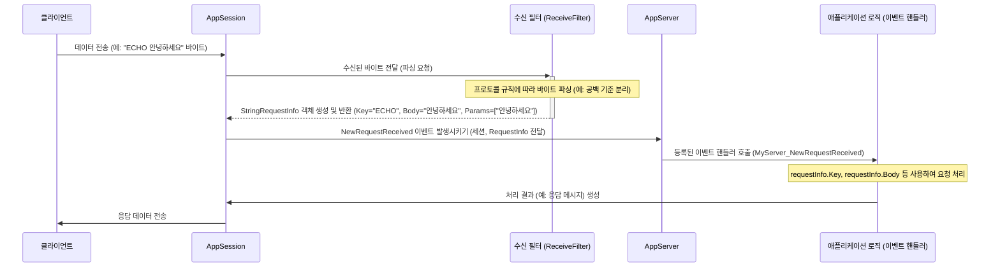

# Chapter 3: 요청 정보 (RequestInfo)

[제2장: 애플리케이션 세션 (AppSession)](02_애플리케이션_세션__appsession_.md)에서는 서버에 연결된 각 클라이언트를 대표하는 '웨이터', 즉 `AppSession`에 대해 배웠습니다. `AppSession`은 특정 클라이언트와의 통신 채널 역할을 하며 데이터를 주고받는다고 했죠. 그런데 클라이언트가 보낸 데이터는 보통 어떤 '요청'을 의미합니다. 예를 들어 "로그인 해줘", "이 메시지를 다른 사람에게 전달해줘", "현재 시간을 알려줘" 같은 것들입니다.

서버는 클라이언트가 보낸 데이터(보통 바이트 덩어리)를 받아서, "이 클라이언트가 도대체 무엇을 원하는 거지?"를 파악해야 합니다. 마치 웨이터가 손님의 말을 듣고 주문서에 깔끔하게 정리하는 것처럼요. SuperSocketLite에서는 이렇게 파싱되고 구조화된 클라이언트의 요청을 **요청 정보 (RequestInfo)** 객체에 담습니다.

이번 장에서는 이 `RequestInfo`가 무엇이고, 왜 필요하며, 어떻게 사용하는지에 대해 알아보겠습니다.

## RequestInfo는 왜 필요할까요?

클라이언트가 서버에 "ECHO 안녕하세요"라는 메시지를 보냈다고 가정해 봅시다. 네트워크를 통해 서버에 도착하는 것은 단순히 이 문자열을 나타내는 바이트 배열(`byte[]`)일 뿐입니다. 서버 애플리케이션은 이 바이트 배열을 보고 이것이 "ECHO"라는 명령과 "안녕하세요"라는 데이터를 의미한다는 것을 해석해야 합니다.

만약 모든 요청 처리를 바이트 배열을 직접 다루면서 시작한다면, 매번 다음과 같은 작업을 반복해야 할 것입니다.
1. 바이트 배열을 문자열로 변환 (어떤 인코딩을 사용할지 결정해야 함)
2. 문자열을 공백이나 특정 구분자를 기준으로 분리하여 명령(Key)과 데이터(Body)로 나눔
3. 각 부분의 유효성 검사

이런 작업은 번거롭고 오류가 발생하기 쉬우며, 프로토콜(클라이언트와 서버 간의 통신 규칙)이 복잡해질수록 코드는 더욱 지저분해집니다.

`RequestInfo`는 이러한 문제를 해결하기 위해 등장했습니다. [수신 필터 (ReceiveFilter)](04_수신_필터__receivefilter_.md)(다음 장에서 배울 내용입니다)가 클라이언트로부터 받은 원시 데이터를 미리 정해진 프로토콜에 따라 파싱하고, 그 결과를 `RequestInfo` 객체에 담아줍니다. `RequestInfo`는 일반적으로 다음과 같은 정보를 포함합니다.

*   **Key:** 요청의 종류나 명령어를 나타내는 문자열 (예: "ECHO", "LOGIN", "MSG")
*   **Body:** 요청에 포함된 실제 데이터 (예: "안녕하세요", 사용자 ID/비밀번호, 메시지 내용)
*   (선택적) 추가 파라미터나 헤더 정보

**레스토랑 비유:**

`RequestInfo`는 레스토랑 주방에서 사용하는 표준화된 **주문서**와 같습니다.
*   손님(클라이언트)이 말로 주문한 내용 (원시 데이터)은 웨이터([ReceiveFilter](04_수신_필터__receivefilter_.md))에 의해 주문서(`RequestInfo`)에 명확하게 기입됩니다.
*   주문서에는 어떤 테이블([AppSession](02_애플리케이션_세션__appsession_.md))에서 주문했는지, 어떤 메뉴(Key)를 원하는지, 특별 요청 사항(Body, Parameters)은 무엇인지 등이 깔끔하게 정리되어 있습니다.
*   요리사(애플리케이션 로직, 예: `NewRequestReceived` 핸들러)는 이 표준화된 주문서를 보고 쉽게 요리를 시작할 수 있습니다.

덕분에 서버의 핵심 로직은 복잡한 데이터 파싱 과정에 신경 쓸 필요 없이, 잘 정리된 `RequestInfo` 객체를 받아 요청의 내용을 즉시 파악하고 비즈니스 로직 처리에만 집중할 수 있습니다.

## RequestInfo 사용하기

SuperSocketLite는 몇 가지 기본적인 `RequestInfo` 구현을 제공하며, 필요에 따라 사용자 정의 `RequestInfo`를 만들 수도 있습니다.

### 기본 RequestInfo 인터페이스와 클래스

모든 요청 정보 객체의 기본은 `IRequestInfo` 인터페이스입니다. 이 인터페이스는 요청의 핵심 식별자인 `Key` 속성만을 정의합니다.

```csharp
// 파일: SuperSocketLite\SocketBase\Protocol\IRequestInfo.cs (일부)

namespace SuperSocketLite.SocketBase.Protocol;

/// <summary>
/// 요청 정보 인터페이스
/// </summary>
public interface IRequestInfo
{
    /// <summary>
    /// 이 요청의 키(Key)를 가져옵니다.
    /// </summary>
    string Key { get; }
}
```

이 인터페이스를 구현하는 가장 기본적인 제네릭 클래스는 `RequestInfo<TRequestBody>`입니다. 여기에는 `Key`와 함께 실제 데이터를 담는 `Body` 속성이 추가됩니다. `TRequestBody`는 Body 데이터의 타입을 지정합니다 (예: `string`, `byte[]`, 사용자 정의 객체).

```csharp
// 파일: SuperSocketLite\SocketBase\Protocol\RequestInfo.cs (일부)

namespace SuperSocketLite.SocketBase.Protocol;

/// <summary>
/// RequestInfo 기본 클래스
/// </summary>
/// <typeparam name="TRequestBody">요청 본문의 타입</typeparam>
public class RequestInfo<TRequestBody> : IRequestInfo<TRequestBody> // IRequestInfo<T>는 IRequestInfo 를 상속합니다.
{
    // 생성자 ...

    /// <summary>
    /// 이 요청의 키(Key)를 가져옵니다.
    /// </summary>
    public string Key { get; private set; }

    /// <summary>
    /// 본문(Body)을 가져옵니다.
    /// </summary>
    public TRequestBody Body { get; private set; }

    /// <summary>
    /// 키와 본문을 사용하여 초기화합니다. (ReceiveFilter가 호출)
    /// </summary>
    protected void Initialize(string key, TRequestBody body)
    {
        Key = key;
        Body = body;
    }
}
```

### 자주 사용되는 RequestInfo 구현

SuperSocketLite는 일반적인 시나리오를 위해 몇 가지 `RequestInfo<T>`의 구체적인 구현을 제공합니다.

1.  **`StringRequestInfo`**: 텍스트 기반 프로토콜에 사용됩니다. (예: 명령어 기반 서버)
    *   `Key`: 보통 명령어 문자열 (예: "ECHO")
    *   `Body`: 명령어 뒤에 오는 전체 문자열 (예: "안녕하세요 여러분")
    *   `Parameters`: Body 문자열을 공백으로 구분한 배열 (예: `["안녕하세요", "여러분"]`)

    ```csharp
    // 파일: SuperSocketLite\SocketBase\Protocol\StringRequestInfo.cs (일부)

    namespace SuperSocketLite.SocketBase.Protocol;

    /// <summary>
    /// 문자열 타입 요청 정보
    /// </summary>
    public class StringRequestInfo : RequestInfo<string>
    {
        /// <summary>
        /// 생성자 (보통 ReceiveFilter에서 호출)
        /// </summary>
        public StringRequestInfo(string key, string body, string[] parameters)
            : base(key, body) // 부모 클래스 생성자 호출
        {
            Parameters = parameters;
        }

        /// <summary>
        /// 파라미터들을 가져옵니다.
        /// </summary>
        public string[] Parameters { get; private set; }

        // Parameters 배열에 쉽게 접근하기 위한 인덱서 등...
    }
    ```

2.  **`BinaryRequestInfo`**: 바이너리(이진) 데이터 프로토콜에 사용됩니다.
    *   `Key`: 프로토콜에 따라 정의되거나 없을 수도 있습니다 (`null`).
    *   `Body`: 원시 바이트 배열 (`byte[]`). 애플리케이션 로직에서 이 바이트 배열을 해석해야 합니다.

    ```csharp
    // 파일: SuperSocketLite\SocketBase\Protocol\BinaryRequestInfo.cs

    namespace SuperSocketLite.SocketBase.Protocol;

    /// <summary>
    /// 바이너리 타입 요청 정보
    /// </summary>
    public class BinaryRequestInfo :  RequestInfo<byte[]>
    {
        /// <summary>
        /// 생성자
        /// </summary>
        public BinaryRequestInfo(string key, byte[] body)
            : base(key, body)
        {
            // 특별한 로직 없음
        }
    }
    ```

### 사용자 정의 RequestInfo 만들기

만약 여러분의 프로토콜이 더 복잡하다면 (예: 고정 길이 헤더 + 가변 길이 바디), `RequestInfo<T>`를 상속받아 필요한 속성(예: 패킷 ID, 헤더 필드 값 등)을 추가하여 사용자 정의 `RequestInfo` 클래스를 만들 수 있습니다.

```csharp
// 예시: 게임 패킷을 위한 사용자 정의 RequestInfo
// (실제 사용 예는 Tutorials\EchoServer\ReceiveFilter.cs 등 참고)
using SuperSocketLite.SocketBase.Protocol;

public class GamePacketRequestInfo : BinaryRequestInfo // BinaryRequestInfo 상속
{
    // 패킷 헤더에서 파싱된 추가 정보
    public short PacketID { get; private set; }
    public short OptionFlags { get; private set; }

    // 생성자: 기본 Key, Body 외에 추가 정보도 받음
    public GamePacketRequestInfo(string key, short packetId, short flags, byte[] body)
        : base(key, body) // 부모 생성자 호출
    {
        this.PacketID = packetId;
        this.OptionFlags = flags;
    }
}
```
이 `GamePacketRequestInfo`는 [수신 필터 (ReceiveFilter)](04_수신_필터__receivefilter_.md)가 패킷 헤더와 바디를 파싱한 후 생성하게 됩니다.

### AppServer에서 RequestInfo 사용하기

`RequestInfo` 객체는 주로 `AppServer`의 `NewRequestReceived` 이벤트 핸들러에서 사용됩니다. 이 이벤트 핸들러는 파라미터로 요청을 보낸 클라이언트의 `AppSession`과 파싱된 `RequestInfo` 객체를 받습니다.

```csharp
// 이전 장의 에코 서버 예제 (MyServer.cs)
using SuperSocketLite.SocketBase;
using SuperSocketLite.SocketBase.Protocol; // StringRequestInfo 사용 위해 추가

public class MyServer : AppServer<MySession, StringRequestInfo> // RequestInfo 타입을 StringRequestInfo 로 지정!
{
    public MyServer() : base(new DefaultReceiveFilterFactory<CommandLineReceiveFilter, StringRequestInfo>())
    {
        // ... (생략) ...
        this.NewRequestReceived += MyServer_NewRequestReceived;
    }

    // ... (NewSessionConnected, SessionClosed 생략) ...

    // 클라이언트로부터 새로운 요청을 받았을 때 호출될 메서드
    // 파라미터로 MySession과 StringRequestInfo 객체를 받습니다.
    void MyServer_NewRequestReceived(MySession session, StringRequestInfo requestInfo)
    {
        // requestInfo 객체를 통해 파싱된 요청 내용을 쉽게 접근 가능
        Console.WriteLine($"세션 {session.SessionID}로부터 요청 받음:");
        Console.WriteLine($"  - Key (명령어): {requestInfo.Key}");
        Console.WriteLine($"  - Body (데이터): {requestInfo.Body}");
        Console.WriteLine($"  - Parameters (파라미터): {string.Join(", ", requestInfo.Parameters)}"); // 파라미터 배열 출력

        // 예시: LOGIN 명령어 처리
        if (requestInfo.Key.Equals("LOGIN", StringComparison.OrdinalIgnoreCase))
        {
            if (requestInfo.Parameters.Length >= 2)
            {
                string username = requestInfo.Parameters[0];
                string password = requestInfo.Parameters[1];
                Console.WriteLine($"  -> 로그인 시도: 사용자명={username}, 비밀번호={password}");
                // 여기에 실제 로그인 로직 추가...
                session.Send("로그인 처리중...");
            }
            else
            {
                session.Send("오류: LOGIN 명령어 형식이 잘못되었습니다. (예: LOGIN user pass)");
            }
        }
        // 예시: ECHO 명령어 처리 (기존 로직)
        else if (requestInfo.Key.Equals("ECHO", StringComparison.OrdinalIgnoreCase))
        {
            session.Send($"Echo: {requestInfo.Body}");
        }
        else
        {
            // 정의되지 않은 명령어 처리
            session.Send($"알 수 없는 명령어: {requestInfo.Key}");
        }
    }
}
```

위 코드에서 `MyServer_NewRequestReceived` 메서드는 두 번째 파라미터로 `StringRequestInfo` 타입의 `requestInfo` 객체를 받습니다. (이 타입은 `AppServer<MySession, StringRequestInfo>`를 정의할 때 지정한 타입과 일치해야 합니다).
메서드 안에서는 `requestInfo.Key`, `requestInfo.Body`, `requestInfo.Parameters` 속성을 사용하여 클라이언트 요청의 각 부분을 쉽게 얻을 수 있습니다. 이를 통해 if/else 문으로 명령어에 따른 분기 처리를 깔끔하게 구현할 수 있습니다.

## RequestInfo 내부 동작 방식 (간략히)

그렇다면 클라이언트가 보낸 원시 데이터(바이트 배열)가 어떻게 이렇게 깔끔한 `RequestInfo` 객체로 변환되는 걸까요? 이 마법은 바로 **[수신 필터 (ReceiveFilter)](04_수신_필터__receivefilter_.md)** 가 담당합니다.

1.  **데이터 수신:** 클라이언트가 데이터를 보내면, 해당 클라이언트와 연결된 [AppSession](02_애플리케이션_세션__appsession_.md)이 내부적으로 [SocketSession](06_소켓_세션__socketsession_.md)을 통해 원시 바이트 데이터를 수신합니다.
2.  **ReceiveFilter 호출:** `AppSession`은 수신된 바이트 데이터를 `AppServer` 설정 시 지정된 [수신 필터 (ReceiveFilter)](04_수신_필터__receivefilter_.md)에게 전달합니다.
3.  **데이터 파싱:** `ReceiveFilter`는 자신에게 설정된 프로토콜 규칙에 따라 바이트 데이터를 분석합니다. 예를 들어, `CommandLineReceiveFilter`는 텍스트 데이터를 공백 기준으로 나누어 Key, Body, Parameters를 추출합니다. `FixedHeaderReceiveFilter`는 고정된 크기의 헤더를 먼저 읽고, 헤더 안의 정보(예: 바디 길이)를 이용해 나머지 바디 데이터를 읽습니다.
4.  **RequestInfo 생성:** `ReceiveFilter`는 파싱 결과를 바탕으로 적절한 `RequestInfo` 객체(예: `StringRequestInfo`, `BinaryRequestInfo`, 또는 사용자 정의 `RequestInfo`)를 생성하고, 파싱된 데이터를 (`Key`, `Body` 등) 속성에 채워 넣습니다.
5.  **RequestInfo 반환:** `ReceiveFilter`는 생성된 `RequestInfo` 객체를 `AppSession`에게 반환합니다.
6.  **이벤트 발생:** `AppSession`은 `RequestInfo` 객체를 받으면, `AppServer`의 `NewRequestReceived` 이벤트를 발생시킵니다. 이때 `AppSession` 자신과 방금 생성된 `RequestInfo` 객체를 이벤트 데이터로 함께 전달합니다.
7.  **애플리케이션 로직 처리:** `AppServer`에 등록된 `NewRequestReceived` 이벤트 핸들러(예: `MyServer_NewRequestReceived`)가 호출되고, 핸들러는 전달받은 `RequestInfo` 객체를 사용하여 클라이언트의 요청을 처리합니다.

이 과정을 간단한 순서도로 나타내면 다음과 같습니다.



실제로 `ReceiveFilter`가 `RequestInfo`를 만드는 부분은 어떻게 생겼을까요? `CommandLineReceiveFilter` (SuperSocketLite에서 기본 제공)의 일부를 살펴보며 `StringRequestInfo`가 어떻게 생성되는지 엿볼 수 있습니다. (자세한 내용은 다음 장에서 다룹니다.)

```csharp
// 파일: SuperSocketLite\SocketBase\Protocol\CommandLineReceiveFilter.cs (간략화된 개념)

// CommandLineReceiveFilter 는 특정 구분자(예: 줄바꿈)를 기준으로 데이터를 받습니다.
// Filter 메서드는 한 줄의 완전한 데이터를 받았을 때 호출됩니다.
public override StringRequestInfo Filter(byte[] readBuffer, int offset, int length, bool toBeCopied, out int rest)
{
    // ... (readBuffer 에서 한 줄의 텍스트 데이터 추출) ...
    string line = Encoding.UTF8.GetString(readBuffer, offset, lineLength); // 바이트를 문자열로 변환

    // 문자열을 공백으로 분리
    string[] parts = line.Split(m_Spliter, StringSplitOptions.RemoveEmptyEntries); // m_Spliter는 보통 공백 문자 배열

    if (parts == null || parts.Length == 0)
    {
        // 빈 줄 등 처리.. null 반환
        return null;
    }

    string key = parts[0]; // 첫 번째 부분을 Key로 사용
    string body = string.Empty;
    string[] parameters;

    if (parts.Length > 1) // 파라미터가 있는 경우
    {
        // Key를 제외한 나머지 부분을 Body 및 Parameters 로 설정
        body = line.Substring(parts[0].Length + m_Spliter[0].Length); // Key 다음부터 끝까지 Body
        parameters = parts.Skip(1).ToArray(); // Key 제외한 나머지 부분을 Parameters 배열로
    }
    else // 파라미터 없는 경우
    {
        parameters = new string[0]; // 빈 배열
    }

    // 파싱된 결과를 사용하여 StringRequestInfo 객체 생성 및 반환
    return new StringRequestInfo(key, body, parameters);
}
```
이처럼 `ReceiveFilter`는 프로토콜에 맞춰 데이터를 해석하고, 그 결과를 표준화된 `RequestInfo` 객체에 담아 애플리케이션 로직으로 전달하는 중요한 역할을 합니다.

## 결론

이번 장에서는 클라이언트의 요청을 서버가 이해하기 쉬운 형태로 표현하는 **요청 정보 (RequestInfo)**에 대해 배웠습니다. `RequestInfo`는 일반적으로 요청의 종류를 나타내는 `Key`와 실제 데이터를 담는 `Body`로 구성되며, 마치 레스토랑의 표준 주문서처럼 서버 로직이 클라이언트의 의도를 명확하게 파악하도록 돕습니다. `StringRequestInfo`, `BinaryRequestInfo`와 같은 기본 구현을 사용하거나, 필요에 따라 사용자 정의 `RequestInfo`를 만들어 복잡한 프로토콜을 처리할 수도 있습니다.

`AppServer`의 `NewRequestReceived` 이벤트 핸들러에서 이 `RequestInfo` 객체를 받아 실제 요청 처리 로직을 구현한다는 것을 확인했습니다.

하지만 클라이언트로부터 받은 원시 바이트 데이터가 어떻게 마법처럼 `RequestInfo` 객체로 변환되는지에 대한 구체적인 과정은 아직 자세히 다루지 않았습니다. 이 중요한 변환 작업은 바로 '프로토콜 전문가'인 **[제4장: 수신 필터 (ReceiveFilter)](04_수신_필터__receivefilter_.md)** 가 담당합니다. 다음 장에서는 이 `ReceiveFilter`가 어떻게 동작하고, 다양한 프로토콜을 처리하기 위해 어떻게 구현하거나 선택하는지 자세히 알아보겠습니다.

---

Generated by [AI Codebase Knowledge Builder](https://github.com/The-Pocket/Tutorial-Codebase-Knowledge)