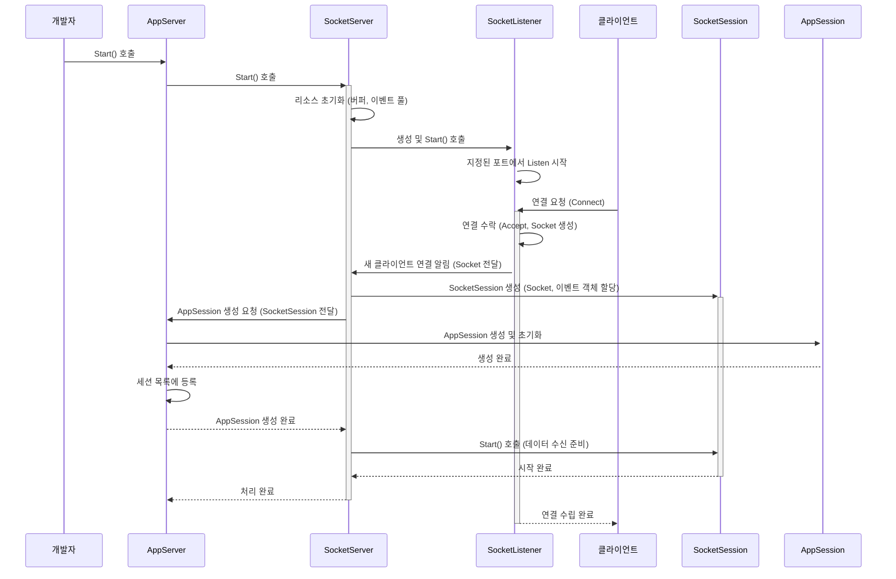

# Chapter 5: 소켓 서버 (SocketServer)

이전 [제4장: 수신 필터 (ReceiveFilter)](04_수신_필터__receivefilter_.md)에서는 클라이언트가 보낸 원시 바이트 데이터를 서버가 이해할 수 있는 [요청 정보 (RequestInfo)](03_요청_정보__requestinfo_.md)로 변환하는 '프로토콜 전문가' ReceiveFilter에 대해 배웠습니다. ReceiveFilter 덕분에 우리는 복잡한 바이트 스트림 대신 깔끔하게 정리된 요청 정보를 다룰 수 있게 되었죠.

하지만 서버 애플리케이션의 가장 기본적인 역할, 즉 네트워크 세상에 문을 열고 클라이언트의 방문(연결 요청)을 기다리는 것은 누가 할까요? 우리가 만든 [애플리케이션 서버 (AppServer)](01_애플리케이션_서버__appserver_.md)나 [애플리케이션 세션 (AppSession)](02_애플리케이션_세션__appsession_.md)은 실제 네트워크 장비와 직접 대화하지 않습니다. 그 아래에는 더 낮은 수준에서 묵묵히 실제 통신 작업을 처리하는 엔진이 필요합니다. 바로 **소켓 서버 (SocketServer)**입니다.

이번 장에서는 SuperSocketLite 애플리케이션의 보이지 않는 곳에서 네트워크 통신의 기초를 다지는 `SocketServer`에 대해 알아보겠습니다.

## SocketServer는 왜 필요할까요?

우리가 [애플리케이션 서버 (AppServer)](01_애플리케이션_서버__appserver_.md)를 만들고 `Start()` 메서드를 호출하면, 서버는 지정된 IP 주소와 포트 번호에서 클라이언트의 연결 요청을 받기 시작합니다. 예를 들어, IP 주소 `127.0.0.1`의 `2024`번 포트에서 기다리도록 설정했다면, 클라이언트는 이 주소로 접속을 시도할 것입니다.

이 과정은 생각보다 복잡합니다.
1.  운영체제에게 "이 IP와 포트를 사용해서 들어오는 TCP/IP 연결을 받고 싶습니다."라고 알려줘야 합니다. (소켓 생성 및 바인딩)
2.  실제로 연결 요청이 오는지 귀 기울여 들어야 합니다. (Listen)
3.  연결 요청이 도착하면, 이를 수락하고 클라이언트와 데이터를 주고받을 수 있는 통신 채널(소켓)을 만들어야 합니다. (Accept)
4.  이 모든 과정을 효율적으로 처리해야 합니다. 특히 수많은 클라이언트가 동시에 접속하는 상황에서는 더욱 중요합니다. (비동기 처리, 리소스 관리 등)

이러한 저수준(low-level) 네트워크 작업들은 매우 기술적이고 운영체제와 밀접하게 관련되어 있습니다. 만약 모든 SuperSocketLite 개발자가 이 과정을 직접 구현해야 한다면 매우 어렵고 불편할 것입니다.

`SocketServer`는 바로 이 복잡하고 어려운 저수준 네트워크 통신 작업을 전담하는 엔진입니다. 마치 레스토랑의 주방 시설이나 통신 시스템과 같습니다.
*   주방 시설은 외부에서 재료를 받고(데이터 수신), 요리를 만들고(데이터 처리 준비), 배달을 보낼 수 있는(데이터 전송) 기본적인 인프라를 제공합니다.
*   통신 시스템은 외부로부터 주문 전화를 받고(연결 요청 수신), 주문 내용을 접수하는(연결 수락) 역할을 합니다.

`SocketServer`는 다음과 같은 핵심 역할을 수행합니다.
*   **수신 대기 (Listen):** 지정된 IP 주소와 포트에서 클라이언트의 연결 요청을 기다립니다.
*   **연결 수락 (Accept):** 새로운 클라이언트 연결 요청이 들어오면 이를 수락하여 기본적인 소켓 통신 채널을 설정합니다.
*   **전송 방식 관리 (TCP/UDP):** 서버 설정에 따라 TCP 또는 UDP 통신 방식을 결정하고 관리합니다. (SuperSocketLite는 주로 TCP 기반 예제를 다루지만, UDP도 지원합니다.)
*   **리소스 관리:** 소켓 통신에 필요한 버퍼, 비동기 이벤트 객체 등을 효율적으로 관리합니다.

[애플리케이션 서버 (AppServer)](01_애플리케이션_서버__appserver_.md)는 이러한 `SocketServer` 위에 구축됩니다. `AppServer`는 `SocketServer`가 제공하는 기본적인 통신 기능을 이용하여, 우리가 정의한 `AppSession` 관리, `ReceiveFilter`를 통한 데이터 처리, `RequestInfo` 기반의 로직 실행 등 더 높은 수준의 애플리케이션 로직을 수행합니다.

## SocketServer 사용하기 (직접 사용하지 않음)

SuperSocketLite를 사용하는 개발자는 일반적으로 `SocketServer`를 직접 생성하거나 제어할 필요가 **없습니다**. `SocketServer`는 `AppServer` 내부에 포함되어 있으며, `AppServer`의 생명 주기에 따라 자동으로 관리됩니다.

우리가 [제1장: 애플리케이션 서버 (AppServer)](01_애플리케이션_서버__appserver_.md)에서 작성했던 코드를 다시 살펴봅시다.

```csharp
// Program.cs (Main 메서드 일부)

public static void Main(string[] args)
{
    // ... AppServer 인스턴스 생성 (myServer) ...
    // ... ServerConfig 설정 (serverConfig) ...

    // 서버 설정 적용
    if (!myServer.Setup(serverConfig))
    {
        // ... 설정 실패 처리 ...
        return;
    }

    // 서버 시작!
    if (!myServer.Start()) // <--- 바로 여기!
    {
        // ... 시작 실패 처리 ...
        return;
    }

    Console.WriteLine("서버 시작 성공!");
    // ... 서버 실행 유지 및 종료 로직 ...
}
```

우리가 `myServer.Start()`를 호출하면, `AppServer`는 내부적으로 자신의 `SocketServer` 인스턴스를 찾아 `Start()` 메서드를 호출합니다. 즉, `AppServer`를 시작하는 것만으로 내부의 `SocketServer`가 자동으로 동작을 시작하여 네트워크 포트를 열고 클라이언트 연결을 기다리게 됩니다.

마찬가지로 `myServer.Stop()`을 호출하면, `AppServer`는 내부 `SocketServer`의 `Stop()` 메서드를 호출하여 리스닝을 중단하고 관련 리소스를 정리합니다.

따라서 `SocketServer`는 SuperSocketLite 프레임워크가 제공하는 '보이지 않는 손'과 같으며, 개발자는 `AppServer`라는 더 편리한 인터페이스를 통해 간접적으로 `SocketServer`의 기능을 활용하게 됩니다.

## SocketServer 내부 동작 방식 (간략히)

비록 우리가 직접 사용하지는 않지만, `SocketServer`가 내부적으로 어떻게 동작하는지 이해하면 SuperSocketLite 전체 구조를 파악하는 데 도움이 됩니다. `AppServer.Start()`가 호출된 후 어떤 일이 벌어지는지 단계별로 살펴보겠습니다. (TCP 기반의 `AsyncSocketServer`를 예시로 설명합니다.)

1.  **`AppServer.Start()` 호출:** 개발자가 `AppServer`의 `Start()` 메서드를 호출합니다.
2.  **`SocketServer.Start()` 호출:** `AppServer`는 내부적으로 가지고 있는 `SocketServer` 인스턴스(예: `AsyncSocketServer`)의 `Start()` 메서드를 호출합니다. (코드 예시: `SuperSocketLite\SocketBase\AppServerBase.cs`의 `Start` 메서드 참고)
3.  **리소스 초기화:** `SocketServer`는 클라이언트와의 비동기 통신에 필요한 리소스들을 준비합니다. 예를 들어, 데이터를 읽고 쓸 때 사용할 메모리 버퍼 풀(`BufferManager`)과 비동기 소켓 작업에 사용될 `SocketAsyncEventArgs` 객체 풀(`m_ReadWritePool`)을 생성하고 초기화합니다. (코드 예시: `SuperSocketLite\AsyncSocketServer.cs`의 `Start` 메서드 참고)
4.  **[소켓 리스너 (SocketListener)](07_소켓_리스너__socketlistener_.md) 생성 및 시작:** `SocketServer`는 서버 설정(`ServerConfig`)에 지정된 각 리스너 정보(IP 주소, 포트, 보안 설정 등)에 대해 [소켓 리스너 (SocketListener)](07_소켓_리스너__socketlistener_.md) 객체(예: `TcpAsyncSocketListener`)를 생성합니다. 그리고 각 리스너의 `Start()` 메서드를 호출합니다. (코드 예시: `SuperSocketLite\SocketServerBase.cs`의 `Start` 메서드 참고)
5.  **Listen 시작:** 각 `SocketListener`는 지정된 IP 주소와 포트에서 실제 네트워크 연결 요청을 기다리기 시작합니다(Listen). 운영체제에게 해당 포트로 들어오는 연결을 알려달라고 요청하는 단계입니다.
6.  **클라이언트 연결 요청:** 클라이언트가 서버의 IP 주소와 포트로 연결을 시도합니다.
7.  **연결 수락 (Accept):** `SocketListener`는 들어온 연결 요청을 감지하고 수락(Accept)합니다. 이 과정에서 클라이언트와 직접 통신할 수 있는 새로운 `Socket` 객체가 생성됩니다.
8.  **`SocketServer`에게 알림:** `SocketListener`는 새로운 클라이언트가 연결되었다는 사실과 함께 생성된 `Socket` 객체를 `SocketServer`에게 알립니다. 보통 이벤트 방식(`NewClientAccepted`)으로 전달됩니다. (코드 예시: `SuperSocketLite\TcpAsyncSocketListener.cs`의 `ProcessAccept` 메서드 참고)
9.  **[소켓 세션 (SocketSession)](06_소켓_세션__socketsession_.md) 생성:** `SocketServer`(예: `AsyncSocketServer`)는 전달받은 `Socket` 객체를 기반으로 저수준 소켓 통신을 캡슐화하는 [소켓 세션 (SocketSession)](06_소켓_세션__socketsession_.md) 객체(예: `AsyncSocketSession`)를 생성합니다. 이때, 3단계에서 준비한 `SocketAsyncEventArgs` 객체 풀에서 하나를 가져와 이 세션에 할당합니다. 이 `SocketSession`은 실제 데이터 읽기/쓰기를 담당합니다. (코드 예시: `SuperSocketLite\AsyncSocketServer.cs`의 `ProcessNewClient` 메서드 참고)
10. **[애플리케이션 세션 (AppSession)](02_애플리케이션_세션__appsession_.md) 생성 요청:** `SocketServer`는 생성된 `SocketSession` 정보를 가지고 `AppServer`에게 상위 레벨의 [애플리케이션 세션 (AppSession)](02_애플리케이션_세션__appsession_.md)을 만들어달라고 요청합니다. (코드 예시: `SuperSocketLite\AsyncSocketServer.cs`의 `CreateSession` 내부에서 `AppServer.CreateAppSession` 호출 참고)
11. **`AppSession` 생성 및 등록:** `AppServer`는 우리가 정의한 `AppSession` 타입(예: `MySession`)의 인스턴스를 생성하고, 이 `AppSession`과 9단계에서 만들어진 `SocketSession`을 서로 연결합니다. 그리고 생성된 `AppSession`을 내부 세션 목록에 등록합니다. (코드 예시: `SuperSocketLite\SocketBase\AppServer.cs`의 `CreateAppSession` 및 `RegisterSession` 메서드 참고)
12. **세션 시작:** `AppSession`과 `SocketSession`의 준비가 완료되면, `SocketSession`의 `Start()` 메서드가 호출되어 클라이언트로부터 데이터를 수신할 준비를 마칩니다. (코드 예시: `SuperSocketLite\AsyncSocketServer.cs`의 `ProcessNewClient` 또는 `OnSocketSessionNegotiateCompleted` 참고)

이 복잡한 과정을 간단한 순서도로 표현하면 다음과 같습니다.



이제 실제 코드 조각들을 통해 몇 가지 단계를 더 자세히 살펴보겠습니다.

**`AppServerBase.Start()` - `SocketServer` 시작 호출**
([제1장: 애플리케이션 서버 (AppServer)](01_애플리케이션_서버__appserver_.md) 에서 이미 살펴봤습니다)

```csharp
// 파일: SuperSocketLite\SocketBase\AppServerBase.cs (일부)
public virtual bool Start()
{
    // ... 상태 확인 ...

    // 내부 SocketServer (m_SocketServer)의 Start() 호출
    if (!m_SocketServer.Start()) // <--- SocketServer 시작!
    {
        // ... 실패 처리 ...
        return false;
    }

    // ... 타이머 시작 등 ...
    m_StateCode = ServerStateConst.Running;
    return true;
}
```
`AppServer`의 `Start`는 내부 멤버인 `m_SocketServer`의 `Start`를 호출하여 실제 네트워크 리스닝 준비를 시작합니다. `m_SocketServer`는 `AppServer` 설정(`config.Mode`)에 따라 `AsyncSocketServer` (TCP) 또는 `UdpSocketServer` (UDP)의 인스턴스일 수 있습니다. (`SocketServerFactory.cs` 참고)

**`SocketServerBase.Start()` - 리스너 생성 및 시작**

```csharp
// 파일: SuperSocketLite\SocketServerBase.cs (Start 메서드 일부)
public virtual bool Start()
{
    IsStopped = false;
    // ... 로그, 설정 로드, SendingQueuePool 초기화 ...

    // 설정된 리스너 정보(ListenerInfos) 만큼 반복
    for (var i = 0; i < ListenerInfos.Length; i++)
    {
        // 각 리스너 정보로 ISocketListener 인스턴스 생성
        var listener = CreateListener(ListenerInfos[i]); // <--- 리스너 생성!
        // 이벤트 핸들러 연결 (오류, 중지, 새 클라이언트 연결)
        listener.Error += new ErrorHandler(OnListenerError);
        listener.Stopped += new EventHandler(OnListenerStopped);
        listener.NewClientAccepted += new NewClientAcceptHandler(OnNewClientAccepted); // <--- 중요!

        // 리스너 시작 시도
        if (listener.Start(AppServer.Config)) // <--- 리스너 시작! (Listen 시작)
        {
            Listeners.Add(listener); // 성공 시 리스트에 추가
            // ... 로그 기록 ...
        }
        else // 시작 실패 시
        {
            // ... 실패 로그 및 이미 시작된 다른 리스너들 중지 ...
            Listeners.Clear();
            return false;
        }
    }

    IsRunning = true;
    return true;
}
```
`SocketServerBase` (대부분의 `SocketServer` 구현의 부모 클래스)의 `Start` 메서드는 설정 파일에 정의된 각 리스너(예: 다른 포트 번호나 IP 주소)에 대해 `CreateListener`를 호출하여 `ISocketListener` 객체를 만듭니다. (`TcpSocketServerBase`의 `CreateListener`는 `TcpAsyncSocketListener`를 반환합니다). 그리고 각 리스너의 `Start`를 호출하여 실제 리스닝을 시작하고, `NewClientAccepted` 이벤트가 발생했을 때 `OnNewClientAccepted` 메서드가 호출되도록 연결합니다.

**`AsyncSocketServer.ProcessNewClient()` - 새 클라이언트 처리 및 세션 생성**

```csharp
// 파일: SuperSocketLite\AsyncSocketServer.cs (ProcessNewClient 메서드 일부)
private IAppSession ProcessNewClient(Socket client, SslProtocols security)
{
    // 1. 비동기 작업 풀(m_ReadWritePool)에서 SocketAsyncEventArgsProxy 가져오기
    SocketAsyncEventArgsProxy socketEventArgsProxy;
    if (!m_ReadWritePool.TryPop(out socketEventArgsProxy))
    {
        // 풀이 비었으면 최대 연결 수 도달 -> 연결 거부
        // ... 오류 로그 및 소켓 닫기 ...
        return null;
    }

    // 2. 저수준 SocketSession 생성 (보안 설정에 따라 분기)
    ISocketSession socketSession;
    if (security == SslProtocols.None) // 보안 연결(SSL/TLS) 사용 안 함
        socketSession = new AsyncSocketSession(client, socketEventArgsProxy); // <--- AsyncSocketSession 생성!
    else // 보안 연결 사용
        socketSession = new AsyncStreamSocketSession(client, security, socketEventArgsProxy);

    // 3. AppServer에게 AppSession 생성을 요청
    var session = CreateSession(client, socketSession); // 내부적으로 AppServer.CreateAppSession 호출
                                                        // 여기서는 null 반환 시 실패
    if (session == null)
    {
        // ... 실패 처리 (가져왔던 이벤트 객체 풀에 반납, 소켓 닫기) ...
        return null;
    }

    // 4. SocketSession의 Closed 이벤트 핸들러 연결 (자원 반납 위함)
    socketSession.Closed += SessionClosed;

    // 5. (SSL/TLS 같은) 협상 과정이 필요한지 확인
    var negotiateSession = socketSession as INegotiateSocketSession;
    if (negotiateSession == null) // 협상 불필요 시
    {
        // 6a. AppServer에 AppSession 등록 시도
        if (RegisterSession(session)) // 내부적으로 AppServer.RegisterSession 호출
        {
            // 7a. 등록 성공 시 SocketSession 시작 (데이터 수신 준비)
            AppServer.AsyncRun(() => socketSession.Start());
        }
        return session; // 등록 실패 시 RegisterSession 내부에서 처리됨
    }
    else // 협상 필요 시
    {
        // 6b. 협상 완료 이벤트 핸들러 등록
        negotiateSession.NegotiateCompleted += OnSocketSessionNegotiateCompleted;
        // 7b. 협상 시작
        negotiateSession.Negotiate();
        // 협상이 완료된 후에 AppSession 등록 및 SocketSession 시작 진행됨 (OnSocketSessionNegotiateCompleted 내부)
        return null; // 아직 AppSession 준비 안 됨
    }
}
```
리스너로부터 새 클라이언트 `Socket` 객체를 받으면, `AsyncSocketServer`의 `ProcessNewClient` 메서드가 호출됩니다. 이 메서드는 비동기 통신에 필요한 `SocketAsyncEventArgsProxy`를 풀에서 가져오고, 이를 이용하여 저수준 `AsyncSocketSession`을 생성합니다. 그런 다음 `CreateSession` (내부적으로 `AppServer.CreateAppSession`)을 호출하여 상위 레벨의 `AppSession`을 만듭니다. 마지막으로 (필요한 협상 과정을 거친 후) `AppServer.RegisterSession`을 통해 세션을 등록하고, `socketSession.Start()`를 호출하여 실제 데이터 수신을 시작합니다.

이처럼 `SocketServer`는 `AppServer`와 긴밀하게 협력하며, 저수준 네트워크 처리와 고수준 애플리케이션 로직 사이의 다리 역할을 합니다.

## 결론

이번 장에서는 SuperSocketLite의 숨겨진 엔진, **소켓 서버 (SocketServer)**에 대해 알아보았습니다. `SocketServer`는 우리가 직접 다루지는 않지만, [애플리케이션 서버 (AppServer)](01_애플리케이션_서버__appserver_.md) 내부에서 실제 네트워크 통신(포트 열기, 연결 수락 등)을 담당하는 핵심 저수준 컴포넌트입니다. 마치 레스토랑의 주방 시설처럼, `SocketServer`는 `AppServer`가 클라이언트와 안전하고 효율적으로 소통할 수 있는 기반을 제공합니다.

`AppServer`를 시작하면 내부적으로 `SocketServer`가 활성화되어 [소켓 리스너 (SocketListener)](07_소켓_리스너__socketlistener_.md)를 통해 클라이언트 연결을 기다리고, 연결이 수락되면 저수준 통신을 위한 [소켓 세션 (SocketSession)](06_소켓_세션__socketsession_.md)을 생성하여 `AppServer`에게 전달하는 과정을 살펴보았습니다.

`SocketServer`가 클라이언트 연결을 수락하면, 각 연결마다 실제 데이터 읽기/쓰기를 담당하는 객체가 필요하다고 했습니다. 바로 이 역할을 하는 것이 다음 장에서 배울 **[제6장: 소켓 세션 (SocketSession)](06_소켓_세션__socketsession_.md)**입니다. `SocketSession`은 개별 클라이언트 소켓과의 직접적인 통신 채널을 나타내며, 우리가 만든 `AppSession`의 통신 파트너 역할을 합니다.

---

Generated by [AI Codebase Knowledge Builder](https://github.com/The-Pocket/Tutorial-Codebase-Knowledge)