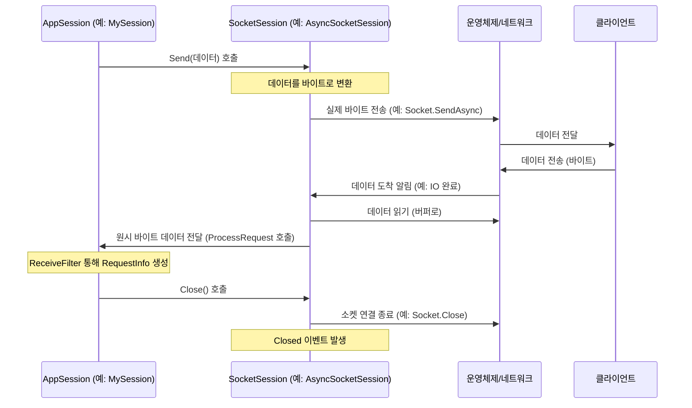

# Chapter 6: 소켓 세션 (SocketSession)

이전 [제5장: 소켓 서버 (SocketServer)](05_소켓_서버__socketserver_.md)에서는 SuperSocketLite 애플리케이션의 숨겨진 엔진인 `SocketServer`에 대해 알아보았습니다. `SocketServer`는 네트워크 문을 열고 클라이언트의 연결 요청을 받아들이는 중요한 역할을 했죠. 그런데 일단 연결이 수락되면, 개별 클라이언트와 실제로 데이터를 주고받는 저수준 통신은 누가 담당할까요? 마치 레스토랑에 전화가 연결된 후 실제 통화를 하는 전화선처럼, 각 클라이언트와의 실질적인 네트워크 연결을 관리하는 객체가 필요합니다. 이것이 바로 **소켓 세션 (SocketSession)**입니다.

이번 장에서는 개별 클라이언트와의 실제 네트워크 연결 그 자체를 나타내는 `SocketSession`에 대해 자세히 살펴보겠습니다.

## SocketSession은 무엇이고 왜 필요할까요?

[제2장: 애플리케이션 세션 (AppSession)](02_애플리케이션_세션__appsession_.md)에서 우리는 서버에 연결된 각 클라이언트를 논리적으로 대표하는 `AppSession`에 대해 배웠습니다. `AppSession`은 클라이언트별 상태를 저장하고, 애플리케이션 수준에서 데이터를 주고받는 편리한 인터페이스(`Send`, `Close` 등)를 제공했죠.

하지만 `AppSession`이 "데이터를 보내라!" 또는 "연결을 끊어라!"라고 명령할 때, 실제로 운영체제의 네트워크 기능을 호출하고, 바이트 데이터를 네트워크 선으로 흘려보내거나, 소켓 연결을 종료하는 등의 **저수준(low-level) 작업**은 누가 처리할까요? 바로 이 역할을 `SocketSession`이 담당합니다.

`SocketSession`은 다음과 같은 이유로 필요합니다:

1.  **실제 연결 표현:** `SocketSession` 객체 하나는 클라이언트 하나와의 실제 TCP/IP 소켓 연결 하나를 직접적으로 나타냅니다. 운영체제가 관리하는 소켓 핸들(socket handle)과 직접적으로 연결되어 있습니다.
2.  **저수준 I/O 처리:** 클라이언트로부터 바이트 데이터를 읽고, 클라이언트에게 바이트 데이터를 쓰는 기본적인 네트워크 입출력(I/O) 작업을 수행합니다. 비동기 I/O 모델(예: .NET의 `SocketAsyncEventArgs`)을 사용하여 효율적으로 데이터를 주고받습니다.
3.  **네트워크 이벤트 처리:** 데이터 수신 완료, 전송 완료, 연결 끊김 감지 등 네트워크 수준에서 발생하는 이벤트를 처리하고, 이를 상위 계층(`AppSession`과 `AppServer`)에 알립니다.

**레스토랑 비유:**

`SocketSession`은 레스토랑 손님과 직접 연결된 **개별 전화선**과 같습니다.
*   **실제 통신 채널:** 목소리(데이터 바이트)가 오고 가는 실제 통신 라인입니다.
*   **기본 통신 기능:** 전화 연결 유지, 전화 끊기(연결 종료), 목소리 송수신(데이터 읽기/쓰기) 등 가장 기본적인 통신 기능을 담당합니다.
*   **웨이터(AppSession)의 도구:** 웨이터([AppSession](02_애플리케이션_세션__appsession_.md))는 이 전화선을 사용하여 손님과 대화(데이터 전송)하고 주문(데이터 수신)을 받지만, 전화선 자체의 전기 신호나 통신 규격 같은 복잡한 기술은 신경 쓰지 않습니다.

즉, `AppSession`이 애플리케이션 개발자가 클라이언트와 소통하기 위한 편리한 '창구'라면, `SocketSession`은 그 창구 뒤에서 실제로 네트워크와 대화하는 '실무 담당자'입니다.

## SocketSession 사용하기 (간접적으로)

다행히도 SuperSocketLite 개발자는 일반적으로 `SocketSession`을 직접 생성하거나 복잡한 메서드를 호출할 필요가 거의 **없습니다**. `SocketSession`은 SuperSocketLite 프레임워크 내부에서 자동으로 관리됩니다.

우리는 주로 [애플리케이션 세션 (AppSession)](02_애플리케이션_세션__appsession_.md)이 제공하는 메서드를 사용합니다. 예를 들어, `AppSession`의 `Send` 메서드를 호출하면 어떤 일이 벌어질까요?

```csharp
// MySession.cs (AppSession 상속)
public class MySession : AppSession<MySession, StringRequestInfo>
{
    public void SendMessageToClient(string message)
    {
        // AppSession의 Send 메서드를 호출합니다.
        this.Send(message);
    }

    // ... 기타 메서드 ...
}
```

`MySession`에서 `Send("안녕하세요")`를 호출하면, `AppSession` 클래스 내부에서는 다음과 같은 일이 일어납니다 (개념적으로):

1.  `AppSession`은 자신이 내부적으로 가지고 있는 `SocketSession` 참조를 찾습니다.
2.  `AppSession`은 전달받은 문자열 "안녕하세요"를 네트워크로 보낼 수 있는 바이트 배열로 변환합니다 (설정된 인코딩 사용).
3.  변환된 바이트 배열을 `SocketSession`의 `TrySend` 와 같은 메서드에 전달합니다.
4.  `SocketSession`은 전달받은 바이트 배열을 실제 운영체제 소켓 API(예: `Socket.SendAsync`)를 사용하여 클라이언트에게 전송합니다.

마찬가지로 `AppSession`의 `Close()` 메서드를 호출하면, 내부적으로 `SocketSession`의 `Close()` 메서드가 호출되어 실제 소켓 연결을 종료하는 작업이 수행됩니다.

따라서 우리는 `AppSession`이라는 더 추상화되고 사용하기 쉬운 인터페이스를 통해 `SocketSession`의 강력한 저수준 네트워킹 기능을 간접적으로 활용하는 것입니다.

## SocketSession 내부 동작 방식 (간략히)

`SocketSession`이 어떻게 생성되고 `AppSession`과 상호작용하며 실제 네트워크 통신을 처리하는지 그 흐름을 좀 더 자세히 살펴보겠습니다.

1.  **연결 수락 및 Socket 생성:** [소켓 서버 (SocketServer)](05_소켓_서버__socketserver_.md)가 [소켓 리스너 (SocketListener)](07_소켓_리스너__socketlistener_.md)를 통해 클라이언트 연결을 수락하면, 운영체제로부터 해당 클라이언트와 연결된 `System.Net.Sockets.Socket` 객체를 얻습니다.
2.  **SocketSession 생성:** `SocketServer`(예: `AsyncSocketServer`)는 이 `Socket` 객체와 비동기 I/O 처리에 필요한 리소스(예: `SocketAsyncEventArgs`)를 사용하여 `SocketSession` 인스턴스(예: `AsyncSocketSession`)를 생성합니다. 이 `SocketSession`은 이제 해당 클라이언트와의 저수준 통신을 전담합니다.
3.  **AppSession 생성 및 연결:** `SocketServer`는 생성된 `SocketSession`을 [애플리케이션 서버 (AppServer)](01_애플리케이션_서버__appserver_.md)에게 전달하여, 우리가 정의한 [애플리케이션 세션 (AppSession)](02_애플리케이션_세션__appsession_.md)(예: `MySession`) 객체를 생성하도록 요청합니다. `AppSession`이 생성될 때(`Initialize` 메서드 호출 시) 이 `SocketSession` 인스턴스가 전달되어 `AppSession` 내부에 저장됩니다. 이제 `AppSession`과 `SocketSession`은 서로를 알고 있습니다.
4.  **데이터 수신:** 클라이언트가 데이터를 보내면, 운영체제는 해당 `Socket`으로 데이터가 도착했음을 알립니다. `SocketSession`(특히 `AsyncSocketSession`)은 `SocketAsyncEventArgs`와 같은 메커니즘을 통해 이 알림을 받고, 네트워크 버퍼에서 도착한 바이트 데이터를 읽습니다.
5.  **데이터 처리 요청:** `SocketSession`은 읽어들인 원시 바이트 데이터를 `AppSession`에게 전달합니다. 보통 `AppSession`의 `ProcessRequest`와 같은 메서드를 호출하며, 이 메서드 내부에서 [수신 필터 (ReceiveFilter)](04_수신_필터__receivefilter_.md)가 호출되어 바이트 데이터가 의미 있는 [요청 정보 (RequestInfo)](03_요청_정보__requestinfo_.md)로 파싱됩니다.
6.  **데이터 전송:** `AppSession`의 `Send` 메서드가 호출되면, `AppSession`은 내부의 `SocketSession` 참조를 통해 `SocketSession`의 `TrySend`와 같은 메서드를 호출합니다.
7.  **실제 전송:** `SocketSession`은 전달받은 데이터를 운영체제의 소켓 전송 API(예: `Socket.SendAsync`)를 사용하여 네트워크로 보냅니다. 전송이 완료되면 완료 이벤트를 처리합니다.
8.  **연결 종료:** 클라이언트 연결이 끊기거나(`Socket` 오류 발생), 서버에서 `AppSession.Close()`를 호출하면, `SocketSession`은 내부적으로 `Socket.Shutdown()` 및 `Socket.Close()`를 호출하여 실제 소켓 리소스를 정리합니다. 또한 `Closed` 이벤트를 발생시켜 `AppSession`과 `AppServer`에게 연결 종료 사실을 알립니다.

이 상호작용을 간단한 순서도로 표현하면 다음과 같습니다.



### 코드 레벨에서 살펴보기

이제 실제 SuperSocketLite 코드에서 `AppSession`과 `SocketSession`이 어떻게 연결되고 상호작용하는지 몇 가지 예시를 통해 살펴보겠습니다.

**1. `AppSession` 초기화 시 `SocketSession` 연결 (`AppSession.Initialize`)**

[제2장: 애플리케이션 세션 (AppSession)](02_애플리케이션_세션__appsession_.md)에서 봤듯이, `AppSession`이 처음 생성될 때 `Initialize` 메서드가 호출됩니다. 이때 `SocketSession` 인스턴스가 전달되어 멤버 변수(`SocketSession`)에 저장됩니다.

```csharp
// 파일: SuperSocketLite\SocketBase\AppSession.cs (Initialize 메서드 일부)

public virtual void Initialize(IAppServer<TAppSession, TRequestInfo> appServer, ISocketSession socketSession)
{
    // ... AppServer 참조 설정 ...

    // 전달받은 ISocketSession 인스턴스를 멤버 변수에 저장합니다.
    SocketSession = socketSession; // <--- 여기서 연결!
    SessionID = socketSession.SessionID; // SocketSession의 ID를 사용
    m_Connected = true;

    // ... ReceiveFilter 생성 및 초기화 ...

    // SocketSession에게도 AppSession 참조를 설정 (상호 참조)
    socketSession.Initialize(this);

    OnInit(); // 사용자 정의 초기화 로직 호출
}

// AppSession 클래스 내 SocketSession 속성 정의
/// <summary>
/// Gets the socket session.
/// </summary>
public ISocketSession SocketSession { get; private set; }
```
이 코드를 통해 `AppSession` 객체는 자신과 연결된 `SocketSession` 객체를 `SocketSession` 속성을 통해 언제든지 참조할 수 있게 됩니다.

**2. `AppSession.Send` 내부에서 `SocketSession.TrySend` 호출**

[제2장: 애플리케이션 세션 (AppSession)](02_애플리케이션_세션__appsession_.md)에서 `AppSession.Send` 메서드의 내부 구현을 간단히 살펴봤습니다. `InternalTrySend` 메서드 부분을 보면 `SocketSession`의 메서드를 호출하는 것을 확인할 수 있습니다.

```csharp
// 파일: SuperSocketLite\SocketBase\AppSession.cs (InternalTrySend 메서드)

// 이 메서드는 문자열이나 바이트 배열을 받아 최종적으로 SocketSession으로 보냅니다.
private bool InternalTrySend(ArraySegment<byte> segment)
{
    // 실제 전송은 SocketSession 에게 위임합니다!
    if (!SocketSession.TrySend(segment)) // <--- SocketSession의 TrySend 호출!
        return false; // SocketSession 전송 실패 시 false 반환

    LastActiveTime = DateTime.Now; // 마지막 활동 시간 갱신
    return true; // 성공
}
```
`AppSession`은 데이터 전송 요청을 받으면, 실제 네트워크 전송 작업은 `SocketSession.TrySend`에게 넘깁니다.

**3. `SocketSession.TrySend` 구현 (예: `SocketSession.cs`)**

`SocketSession` 추상 클래스 (및 이를 상속받는 `AsyncSocketSession` 등)는 `TrySend`와 같은 메서드를 구현하여 실제 소켓 통신을 처리합니다.

```csharp
// 파일: SuperSocketLite\SocketSession.cs (TrySend 메서드 일부)

/// <summary>
/// 세그먼트 전송을 시도합니다.
/// </summary>
/// <param name="segment">전송할 세그먼트.</param>
/// <returns>성공 여부.</returns>
public bool TrySend(ArraySegment<byte> segment)
{
    if (IsClosed) // 이미 닫힌 세션이면 실패
        return false;

    var queue = m_SendingQueue; // 현재 세션의 보내기 큐

    if (queue == null) // 큐가 없으면 (초기화 오류 등) 실패
        return false;

    var trackID = queue.TrackID; // 큐의 현재 작업 ID

    // 데이터를 보내기 큐에 추가 시도
    if (!queue.Enqueue(segment, trackID))
        return false; // 큐에 넣기 실패 (예: 큐가 꽉 참)

    // 큐에 성공적으로 넣었으면 실제 전송 시작
    StartSend(queue, trackID, true); // StartSend는 내부적으로 SendAsync/SendSync 호출
    return true;
}

// StartSend는 최종적으로 SendAsync 또는 SendSync를 호출합니다.
// SendAsync 예시 (실제 구현은 AsyncSocketSession 등 구체 클래스에 있음)
protected abstract void SendAsync(SendingQueue queue);
```
`SocketSession`은 전송할 데이터를 내부 큐(`SendingQueue`)에 넣고, `StartSend` 메서드를 호출하여 비동기(`SendAsync`) 또는 동기(`SendSync`) 방식으로 실제 소켓 전송을 시작합니다.

**4. 데이터 수신 시 `AppSession.ProcessRequest` 호출 (예: `AsyncSocketSession.cs`)**

`AsyncSocketSession`은 비동기적으로 데이터 수신이 완료되면 `ProcessReceive` 메서드가 호출됩니다. 여기서 수신된 데이터를 `AppSession`으로 넘깁니다.

```csharp
// 파일: SuperSocketLite\AsyncSocketSession.cs (ProcessReceive 메서드 일부)

public void ProcessReceive(SocketAsyncEventArgs e)
{
    // 수신 성공 및 데이터 유효성 검사 (ProcessCompleted)
    if (!ProcessCompleted(e))
    {
        OnReceiveTerminated(...); // 오류 처리 및 연결 종료
        return;
    }

    OnReceiveEnded(); // 수신 완료 상태 업데이트

    int offsetDelta;

    try
    {
        // 수신된 데이터를 AppSession에게 전달하여 처리 요청!
        offsetDelta = this.AppSession.ProcessRequest(e.Buffer, e.Offset, e.BytesTransferred, true);
        // AppSession.ProcessRequest 내부에서 ReceiveFilter.Filter 가 호출됩니다.
    }
    catch (Exception exc)
    {
        LogError("프로토콜 오류", exc);
        this.Close(CloseReason.ProtocolError); // 오류 시 연결 종료
        return;
    }

    // 다음 데이터 수신 시작 (버퍼 오프셋 조정)
    StartReceive(e, offsetDelta);
}
```
`AsyncSocketSession`은 네트워크로부터 바이트 데이터를 받으면, `AppSession.ProcessRequest`를 호출하여 상위 계층으로 데이터를 전달합니다. 이후 `AppSession`은 `ReceiveFilter`를 사용하여 이 바이트 데이터를 파싱하게 됩니다.

이처럼 `SocketSession`은 `AppSession`과 긴밀하게 협력하며, 애플리케이션 로직과 실제 네트워크 통신 사이의 중요한 다리 역할을 수행합니다.

## 결론

이번 장에서는 개별 클라이언트와의 실제 네트워크 연결을 담당하는 저수준 컴포넌트인 **소켓 세션 (SocketSession)**에 대해 배웠습니다. `SocketSession`은 우리가 직접 많이 다루지는 않지만, [애플리케이션 세션 (AppSession)](02_애플리케이션_세션__appsession_.md)의 뒤에서 묵묵히 실제 소켓 I/O 작업을 처리하는 중요한 존재입니다. 마치 레스토랑의 전화선처럼, 실제 데이터 바이트가 오고 가는 통로이며 연결의 생명 주기를 관리합니다.

[소켓 서버 (SocketServer)](05_소켓_서버__socketserver_.md)가 클라이언트 연결을 수락하면 각 연결마다 `SocketSession` 인스턴스가 생성되고, 이는 해당 `AppSession`과 연결되어 실제 통신을 수행한다는 것을 이해했습니다.

그렇다면 `SocketServer`는 어떻게 특정 네트워크 주소(IP와 포트)에서 클라이언트의 연결 요청 자체를 "듣고" 있을 수 있을까요? 즉, 레스토랑 비유에서 누가 외부에서 걸려오는 전화를 처음으로 받아서 "레스토랑입니다!"라고 응답하는 역할을 할까요? 이 역할을 하는 것이 바로 다음 장에서 배울 **[제7장: 소켓 리스너 (SocketListener)](07_소켓_리스너__socketlistener_.md)**입니다. `SocketListener`는 특정 네트워크 인터페이스와 포트에서 귀를 기울이며 새로운 연결 요청을 감지하는 역할을 합니다.

---

Generated by [AI Codebase Knowledge Builder](https://github.com/The-Pocket/Tutorial-Codebase-Knowledge)