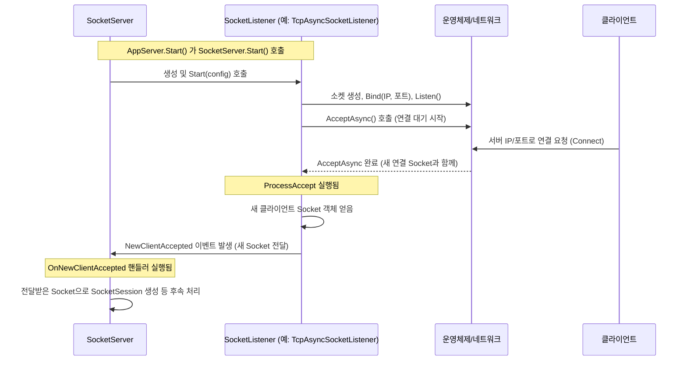

# Chapter 7: 소켓 리스너 (SocketListener)

이전 [제6장: 소켓 세션 (SocketSession)](06_소켓_세션__socketsession_.md)에서는 각 클라이언트와의 실제 네트워크 통신을 담당하는 저수준 연결 객체인 `SocketSession`에 대해 알아보았습니다. `AppSession`의 지시에 따라 실제로 데이터를 주고받는 역할을 했죠.

하지만 이 모든 통신이 시작되려면, 서버는 먼저 특정 네트워크 주소(IP 주소와 포트 번호)에서 "문을 열고" 클라이언트가 찾아오기를 기다려야 합니다. 마치 레스토랑이 영업을 시작하려면 정문에서 손님을 맞이할 준비를 해야 하는 것과 같습니다. 과연 누가 이 "문지기" 역할을 수행하여 들어오는 연결 요청을 가장 먼저 감지할까요? 이 중요한 임무를 수행하는 것이 바로 **소켓 리스너 (SocketListener)**입니다.

이번 장에서는 SuperSocketLite 서버의 "귀" 역할을 하며 특정 네트워크 지점에서 새로운 연결을 감지하는 `SocketListener`에 대해 자세히 알아보겠습니다.

## SocketListener는 왜 필요할까요?

우리가 만든 서버 애플리케이션이 인터넷 세상과 소통하려면, 특정 "주소"를 가지고 있어야 합니다. 이 주소는 보통 IP 주소와 포트 번호의 조합으로 이루어집니다 (예: `127.0.0.1:2024`). 클라이언트는 이 주소를 통해 서버에 접속을 시도합니다.

서버는 이 특정 주소로 들어오는 연결 요청이 있는지 계속 주시하고 있어야 합니다. 마치 레스토랑 입구의 호스트가 문 앞에 서서 들어오는 손님이 있는지 계속 지켜보는 것과 같습니다.

**SocketListener**는 바로 이 역할을 수행합니다.
*   **지정된 주소에서 대기:** 서버 설정에 명시된 특정 IP 주소와 포트 번호에서 "귀를 기울이며" 클라이언트의 연결 요청을 기다립니다 (Listen).
*   **연결 요청 감지 및 수락:** 새로운 클라이언트가 연결을 시도하면 이를 감지하고 수락(Accept)합니다. 연결이 성공적으로 수락되면, 해당 클라이언트와 통신할 수 있는 기본적인 통신 채널(운영체제 수준의 `Socket` 객체)이 만들어집니다.
*   **새 연결 알림:** 수락된 연결 정보(생성된 `Socket` 객체)를 상위 관리자인 [소켓 서버 (SocketServer)](05_소켓_서버__socketserver_.md)에게 전달합니다. 마치 호스트가 새로 도착한 손님을 확인하고 빈 테이블로 안내할 준비가 되었음을 매니저에게 알리는 것과 같습니다.

만약 `SocketListener`가 없다면, 서버는 어떤 주소에서 클라이언트를 기다려야 할지, 또 어떻게 새로운 연결 요청을 받아들여야 할지 알 수 없습니다. `SocketListener`는 서버가 네트워크 세상에 자신을 알리고 상호작용을 시작하는 첫 번째 관문인 셈입니다.

**레스토랑 비유:**

`SocketListener`는 **레스토랑 입구에서 손님을 맞이하는 호스트**와 같습니다.
*   **정해진 위치:** 레스토랑 입구라는 특정 위치(IP 주소와 포트)에서 기다립니다.
*   **손님 확인 및 맞이:** 문을 열고 들어오는 손님(연결 요청)을 확인하고 맞이합니다(Accept).
*   **매니저에게 안내 요청:** 맞이한 손님 정보를 매니저([SocketServer](05_소켓_서버__socketserver_.md))에게 전달하여 다음 단계(테이블 안내 - [SocketSession](06_소켓_세션__socketsession_.md) 생성)를 진행하도록 합니다.

흥미로운 점은, 하나의 서버가 여러 개의 `SocketListener`를 가질 수 있다는 것입니다. 이는 마치 레스토랑이 정문 외에 후문이나 VIP 전용 입구를 따로 운영하는 것과 같습니다. 각각의 리스너는 다른 포트 번호나 다른 IP 주소에서 동시에 연결 요청을 받을 수 있습니다. 예를 들어, 하나는 일반 TCP 연결을 받고 다른 하나는 보안(SSL/TLS) 연결을 받는 리스너를 둘 수 있습니다.

## SocketListener 사용하기 (간접적인 설정)

SuperSocketLite를 사용하는 개발자가 `SocketListener` 객체를 직접 코드에서 생성하거나 관리하는 경우는 거의 없습니다. `SocketListener`는 내부적으로 [소켓 서버 (SocketServer)](05_소켓_서버__socketserver_.md)에 의해 관리되며, 우리는 서버 설정을 통해 어떤 리스너를 사용할지를 지정합니다.

[제1장: 애플리케이션 서버 (AppServer)](01_애플리케이션_서버__appserver_.md)에서 봤던 서버 설정 코드를 다시 떠올려 봅시다.

```csharp
// Program.cs (Main 메서드 일부)
using SuperSocketLite.SocketBase.Config; // 설정 관련 네임스페이스

// ...

// 서버 설정 생성
var serverConfig = new ServerConfig
{
    Port = 2024, // <<< 기본 리스너 포트
    Ip = "Any",   // <<< 기본 리스너 IP
    MaxConnectionNumber = 100,
    Name = "MyEchoServer",
    // 만약 여러 리스너를 사용하고 싶다면 Listeners 속성을 설정합니다.
    // Listeners = new List<ListenerConfig>
    // {
    //     new ListenerConfig { Ip = "Any", Port = 2024, Security = SslProtocols.None },
    //     new ListenerConfig { Ip = "Any", Port = 2025, Security = SslProtocols.Tls12 } // 예: 보안 리스너 추가
    // }
};

// ... AppServer 생성 (myServer) ...

// 서버 설정 적용
if (!myServer.Setup(serverConfig)) // <--- 설정이 AppServer에 전달됩니다.
{
    // ... 설정 실패 처리 ...
}

// 서버 시작
if (!myServer.Start()) // <--- AppServer는 내부 SocketServer를 통해 Listener들을 시작시킵니다.
{
    // ... 시작 실패 처리 ...
}

// ...
```

*   `ServerConfig` 객체에는 `Port`와 `Ip` 속성이 있습니다. 이것이 가장 기본적인 리스너 설정을 정의합니다. `Ip = "Any"`는 사용 가능한 모든 네트워크 인터페이스(IP 주소)에서 연결을 받겠다는 의미입니다.
*   만약 더 많은 리스너가 필요하다면 `Listeners` 속성(리스트)에 `ListenerConfig` 객체를 추가하여 설정할 수 있습니다. 각 `ListenerConfig`는 자신만의 IP, 포트, 보안 설정 등을 가질 수 있습니다.
*   이렇게 정의된 설정은 `myServer.Setup(serverConfig)`를 통해 [애플리케이션 서버 (AppServer)](01_애플리케이션_서버__appserver_.md)에 전달됩니다.
*   `myServer.Start()`가 호출되면, `AppServer`는 내부의 [소켓 서버 (SocketServer)](05_소켓_서버__socketserver_.md)에게 시작 명령을 내리고, `SocketServer`는 설정된 리스너 정보들을 바탕으로 실제 `SocketListener` 객체들을 생성하고 각각의 리스닝 작업을 시작시킵니다.

따라서 개발자는 `ServerConfig`를 통해 '어디서', '어떻게' 클라이언트를 기다릴지를 선언적으로 정의하기만 하면, 실제 `SocketListener`의 생성과 관리는 SuperSocketLite 프레임워크가 알아서 처리해줍니다.

## SocketListener 내부 동작 방식 (간략히)

`SocketListener`가 어떻게 생성되고, 네트워크에서 귀를 기울이며, 새로운 연결을 받아 `SocketServer`에게 전달하는지 그 내부 과정을 살펴보겠습니다. ([제5장: 소켓 서버 (SocketServer)](05_소켓_서버__socketserver_.md)에서 이미 일부 흐름을 보았습니다.)

1.  **`AppServer.Start()` -> `SocketServer.Start()`:** 서버 시작 시, `AppServer`는 내부 `SocketServer`의 `Start()` 메서드를 호출합니다.
2.  **`SocketServer`가 리스너 생성 및 시작:** `SocketServer`는 `ServerConfig`의 리스너 설정들(기본 `Port`/`Ip` 또는 `Listeners` 목록)을 읽습니다. 각 설정마다 적절한 `SocketListener` 인스턴스(예: TCP 통신이면 `TcpAsyncSocketListener`)를 생성합니다. (`SocketServerBase.cs`의 `Start` 메서드, `CreateListener` 메서드 참고)
3.  **`Listener.Start()` 호출:** `SocketServer`는 생성된 각 `SocketListener` 객체의 `Start()` 메서드를 호출합니다.
4.  **소켓 생성 및 바인딩:** `SocketListener`의 `Start()` 메서드 내부에서는 운영체제 수준의 소켓(`System.Net.Sockets.Socket` 객체)을 생성합니다. 그리고 이 소켓을 설정된 IP 주소와 포트 번호에 "연결"합니다(Bind). 이제 이 소켓은 해당 주소로 들어오는 트래픽을 받을 준비가 됩니다. (`TcpAsyncSocketListener.cs`의 `Start` 메서드 참고)
5.  **수신 대기 시작 (Listen):** 소켓을 바인딩한 후, `Listen()` 메서드를 호출하여 운영체제에게 이 소켓으로 들어오는 연결 요청을 받아들이기 시작하라고 알립니다. 동시에 얼마나 많은 연결 요청을 대기열에 쌓아둘지(Backlog) 설정합니다.
6.  **비동기 연결 수락 준비 (AcceptAsync):** 효율적인 처리를 위해, `SocketListener`(특히 `TcpAsyncSocketListener`)는 비동기 방식으로 연결 요청을 받아들일 준비를 합니다. `AcceptAsync` 메서드를 호출하면, SuperSocketLite는 새로운 연결 요청이 들어올 때까지 기다리지 않고 다른 작업을 계속할 수 있습니다. 연결 요청이 실제로 들어오면 운영체제가 이를 감지하고 완료 이벤트를 발생시킵니다. (`TcpAsyncSocketListener.cs`의 `Start` 메서드 끝부분 및 `acceptEventArg_Completed` 메서드 참고)
7.  **클라이언트 연결 요청:** 클라이언트가 `SocketListener`가 대기 중인 IP 주소와 포트로 연결을 시도합니다.
8.  **연결 수락 및 새 소켓 생성:** 운영체제가 연결 요청을 감지하고, `AcceptAsync` 작업이 완료됩니다. 이때 `SocketListener`는 연결을 수락하고, 해당 클라이언트와 전용으로 통신할 새로운 `Socket` 객체를 얻게 됩니다. (`TcpAsyncSocketListener.cs`의 `ProcessAccept` 메서드 참고)
9.  **`NewClientAccepted` 이벤트 발생:** `SocketListener`는 새로 생성된 클라이언트 `Socket` 객체를 포함하여 `NewClientAccepted` 이벤트를 발생시킵니다.
10. **`SocketServer`가 이벤트 수신:** `SocketServer`는 이 `NewClientAccepted` 이벤트에 대한 핸들러(`OnNewClientAccepted`)를 등록해 두었기 때문에, 이 알림을 받게 됩니다.
11. **이후 처리:** `SocketServer`는 전달받은 `Socket` 객체를 사용하여 [소켓 세션 (SocketSession)](06_소켓_세션__socketsession_.md)을 생성하고, [애플리케이션 세션 (AppSession)](02_애플리케이션_세션__appsession_.md)을 만드는 등 다음 단계를 진행합니다. ([제5장: 소켓 서버 (SocketServer)](05_소켓_서버__socketserver_.md) 내용 참고)

이 과정을 간단한 시퀀스 다이어그램으로 나타내면 다음과 같습니다.



### 코드 레벨에서 살펴보기

이제 실제 SuperSocketLite 코드에서 `SocketListener`가 어떻게 동작하는지 좀 더 자세히 살펴보겠습니다.

**1. `SocketServerBase.Start()` - 리스너 생성 및 시작**

[제5장: 소켓 서버 (SocketServer)](05_소켓_서버__socketserver_.md)에서 이미 살펴본 코드입니다. `SocketServer`가 설정된 리스너 정보들을 기반으로 `ISocketListener` 인스턴스를 만들고 `Start()`를 호출하며, `NewClientAccepted` 이벤트 핸들러를 연결하는 부분입니다.

```csharp
// 파일: SuperSocketLite\SocketServerBase.cs (Start 메서드 일부)
public virtual bool Start()
{
    // ...
    for (var i = 0; i < ListenerInfos.Length; i++)
    {
        // 설정 정보로 리스너 생성 (예: TcpAsyncSocketListener)
        var listener = CreateListener(ListenerInfos[i]);
        // 이벤트 핸들러 연결
        listener.NewClientAccepted += new NewClientAcceptHandler(OnNewClientAccepted); // 중요!

        // 리스너 시작 시도 (내부적으로 Bind, Listen 호출)
        if (listener.Start(AppServer.Config))
        {
            Listeners.Add(listener);
        }
        else
        {
            // ... 실패 처리 ...
            return false;
        }
    }
    // ...
    return true;
}

// NewClientAccepted 이벤트 발생 시 호출될 메서드
protected void OnNewClientAccepted(ISocketListener listener, Socket client, object state)
{
    // 전달받은 Socket(client) 객체를 이용하여 후속 처리
    ProcessNewClient(listener, client, state); // 예: SocketSession 생성 등
}
```

**2. `TcpAsyncSocketListener.Start()` - 바인딩 및 리스닝 시작**

TCP 연결을 처리하는 `TcpAsyncSocketListener`의 `Start` 메서드에서는 실제 네트워크 작업을 준비합니다.

```csharp
// 파일: SuperSocketLite\TcpAsyncSocketListener.cs (Start 메서드 일부)
public override bool Start(IServerConfig config)
{
    // 1. TCP 소켓 생성 (IPv4 또는 IPv6)
    m_ListenSocket = new Socket(this.Info.EndPoint.AddressFamily, SocketType.Stream, ProtocolType.Tcp);

    try
    {
        // 2. 소켓을 설정된 IP 주소와 포트에 바인딩
        m_ListenSocket.Bind(this.Info.EndPoint);
        // 3. 연결 요청 대기 시작 (Backlog 크기 지정)
        m_ListenSocket.Listen(m_ListenBackLog);

        // 4. 비동기 연결 수락 준비
        SocketAsyncEventArgs acceptEventArg = new SocketAsyncEventArgs();
        m_AcceptSAE = acceptEventArg;
        // 비동기 작업 완료 시 호출될 콜백 메서드 등록
        acceptEventArg.Completed += new EventHandler<SocketAsyncEventArgs>(acceptEventArg_Completed);

        // 5. 비동기 연결 수락 시작 (즉시 완료될 수도 있음)
        if (!m_ListenSocket.AcceptAsync(acceptEventArg))
            ProcessAccept(acceptEventArg); // 즉시 완료된 경우 바로 처리

        return true;
    }
    catch (Exception e)
    {
        OnError(e); // 오류 발생 시 처리
        return false;
    }
}
```
이 코드는 소켓을 생성하고, 특정 주소(`this.Info.EndPoint`)에 바인딩한 후, `Listen`을 호출하여 들어오는 연결을 받을 준비를 합니다. 마지막으로 `AcceptAsync`를 호출하여 비동기적으로 클라이언트 연결을 기다리기 시작합니다.

**3. `TcpAsyncSocketListener.ProcessAccept()` - 연결 수락 및 이벤트 발생**

`AcceptAsync` 작업이 완료되면 (즉, 클라이언트가 연결을 시도하면) `acceptEventArg_Completed` 콜백이 호출되고, 이 콜백은 `ProcessAccept` 메서드를 호출합니다.

```csharp
// 파일: SuperSocketLite\TcpAsyncSocketListener.cs (ProcessAccept 메서드 일부)
void ProcessAccept(SocketAsyncEventArgs e)
{
    Socket socket = null; // 새로 연결된 클라이언트 소켓

    // 1. 비동기 작업 결과 확인
    if (e.SocketError != SocketError.Success)
    {
        // 오류 처리 (리스너 중지 등 특정 오류 제외)
        // ... (오류 로그 및 처리) ...
    }
    else
    {
        // 2. 성공 시, 연결된 클라이언트 소켓 가져오기
        socket = e.AcceptSocket;
    }

    // 3. 다음 연결 요청을 받을 준비 (다시 AcceptAsync 호출 준비)
    e.AcceptSocket = null; // 이전 소켓 참조 정리
    bool willRaiseEvent = false;
    try
    {
        // 다시 비동기 연결 수락 시작
        willRaiseEvent = m_ListenSocket.AcceptAsync(e);
    }
    catch // (리스너 중지 등으로 인한 예외 처리)
    {
        // ... (예외 처리) ...
        willRaiseEvent = true; // ProcessAccept 재호출 방지
    }

    // 4. 성공적으로 얻은 클라이언트 소켓이 있다면 이벤트 발생!
    if (socket != null)
        OnNewClientAccepted(socket, null); // <--- 여기서 NewClientAccepted 이벤트 발생!

    // 5. AcceptAsync가 동기적으로 완료되었다면 ProcessAccept 다시 호출
    if (!willRaiseEvent)
        ProcessAccept(e);
}

// OnNewClientAccepted 메서드는 최종적으로 SocketServer의 핸들러를 호출합니다.
protected virtual void OnNewClientAccepted(Socket socket, object state)
{
    var handler = NewClientAccepted; // 등록된 이벤트 핸들러 가져오기

    if (handler != null)
        handler(this, socket, state); // 핸들러 호출 (SocketServer의 OnNewClientAccepted)
}
```
`ProcessAccept` 메서드는 비동기 연결 수락 작업의 결과를 처리합니다. 성공하면 `e.AcceptSocket`에서 새로 연결된 클라이언트 `Socket` 객체를 얻습니다. 중요한 것은, **다음 연결 요청을 받기 위해 즉시 다시 `AcceptAsync`를 호출**한다는 점입니다. 이렇게 루프를 돌면서 계속해서 새로운 연결을 받아들일 준비를 합니다. 그리고 성공적으로 얻은 `socket` 객체는 `OnNewClientAccepted`를 통해 `SocketServer`로 전달됩니다.

## 결론

이번 장에서는 SuperSocketLite 서버의 "귀" 역할을 하는 **소켓 리스너 (SocketListener)**에 대해 배웠습니다. `SocketListener`는 서버 설정 파일에 정의된 특정 IP 주소와 포트 번호에서 묵묵히 클라이언트의 연결 요청을 기다리고, 새로운 연결이 감지되면 이를 수락하여 실제 통신을 위한 `Socket` 객체를 만들어 [소켓 서버 (SocketServer)](05_소켓_서버__socketserver_.md)에게 전달하는 중요한 첫 관문 역할을 합니다.

개발자는 `ServerConfig`를 통해 리스너를 간접적으로 설정하며, 실제 리스너의 생성, 시작, 연결 수락 과정은 SuperSocketLite 프레임워크 내부에서 자동으로 처리된다는 것을 확인했습니다. 여러 개의 리스너를 설정하여 다양한 주소나 프로토콜(예: 보안 연결)을 동시에 처리할 수도 있습니다.

이것으로 SuperSocketLite의 주요 구성 요소인 [AppServer](01_애플리케이션_서버__appserver_.md), [AppSession](02_애플리케이션_세션__appsession_.md), [RequestInfo](03_요청_정보__requestinfo_.md), [ReceiveFilter](04_수신_필터__receivefilter_.md), [SocketServer](05_소켓_서버__socketserver_.md), [SocketSession](06_소켓_세션__socketsession_.md), 그리고 `SocketListener`까지 모두 살펴보았습니다. 각 컴포넌트가 어떻게 유기적으로 협력하여 클라이언트의 연결부터 요청 처리, 응답까지 전체 과정을 처리하는지 이해하셨기를 바랍니다.

SuperSocketLite는 이처럼 잘 설계된 구성 요소들을 통해 개발자가 복잡한 네트워크 저수준 처리보다는 애플리케이션의 핵심 비즈니스 로직에 더 집중할 수 있도록 도와줍니다. 이 튜토리얼이 여러분의 네트워크 애플리케이션 개발 여정에 든든한 첫걸음이 되었기를 바랍니다!

---

Generated by [AI Codebase Knowledge Builder](https://github.com/The-Pocket/Tutorial-Codebase-Knowledge)