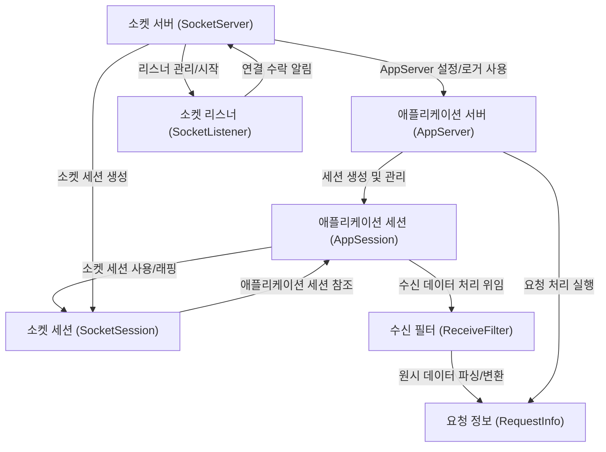

# Tutorial: SuperSocketLite

SuperSocketLite는 **네트워크 통신**을 위한 *경량* 프레임워크입니다.
클라이언트 연결(**세션**)을 관리하고, 들어오는 데이터를 **프로토콜**에 맞게 해석(**수신 필터**)하여 의미 있는 **요청 정보**로 변환합니다.
개발자는 이 요청 정보를 받아 비즈니스 로직을 처리하는 데 집중할 수 있습니다. TCP 및 UDP 통신을 모두 지원합니다.

**Source Repository:** [None](None)

## Chapters

1. [애플리케이션 서버 (AppServer)](01_애플리케이션_서버__appserver_.md)
2. [애플리케이션 세션 (AppSession)](02_애플리케이션_세션__appsession_.md)
3. [요청 정보 (RequestInfo)](03_요청_정보__requestinfo_.md)
4. [수신 필터 (ReceiveFilter)](04_수신_필터__receivefilter_.md)
5. [소켓 서버 (SocketServer)](05_소켓_서버__socketserver_.md)
6. [소켓 세션 (SocketSession)](06_소켓_세션__socketsession_.md)
7. [소켓 리스너 (SocketListener)](07_소켓_리스너__socketlistener_.md)

---

Generated by [AI Codebase Knowledge Builder](https://github.com/The-Pocket/Tutorial-Codebase-Knowledge)