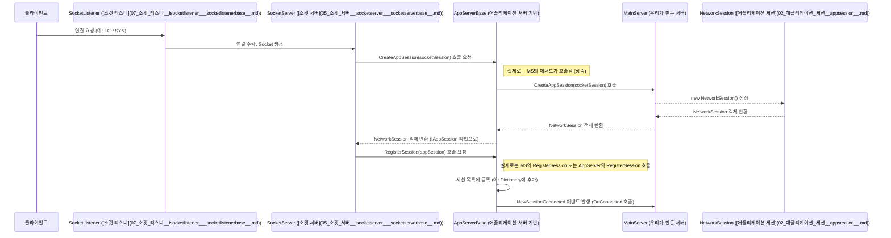
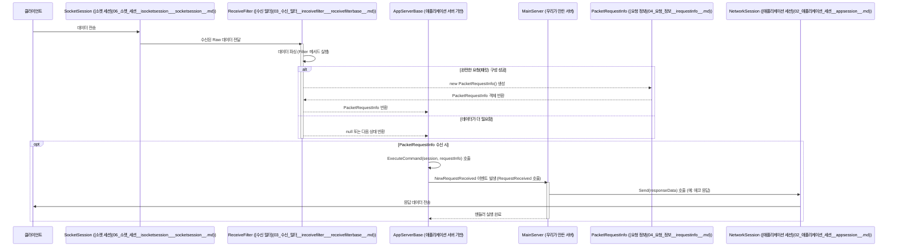

# Chapter 1: 애플리케이션 서버 (AppServer/AppServerBase)


SuperSocketLite를 사용한 서버 개발 여정에 오신 것을 환영합니다! 첫 번째 장에서는 서버 애플리케이션의 핵심 두뇌 역할을 하는 `애플리케이션 서버(AppServer)`에 대해 알아보겠습니다.

## 왜 애플리케이션 서버가 필요할까요?

네트워크 프로그래밍은 복잡할 수 있습니다. 클라이언트 연결을 수락하고, 데이터를 안정적으로 주고받고, 여러 클라이언트를 동시에 관리하는 등 신경 써야 할 부분이 많습니다. 만약 이런 기반 작업을 매번 직접 구현해야 한다면, 실제 서비스 로직 개발에 집중하기 어려울 것입니다.

**`AppServer`는 바로 이 문제를 해결합니다.** 마치 잘 설계된 레스토랑의 총괄 매니저처럼, 서버 운영의 기본적인 틀과 관리 기능을 제공합니다. 개발자는 `AppServer`가 제공하는 구조 위에서 실제 서비스 내용(예: 채팅 메시지 처리, 게임 상태 업데이트 등)을 채워 넣기만 하면 됩니다.

예를 들어, 간단한 "에코(Echo) 서버"를 만든다고 상상해 보세요. 클라이언트가 보낸 메시지를 그대로 돌려주는 서버입니다. `AppServer`를 사용하면, 우리는 클라이언트 연결 관리나 데이터 수신 방법 같은 저수준(low-level)의 복잡한 부분은 신경 쓰지 않고, "메시지를 받으면 그대로 돌려준다"는 핵심 로직에만 집중할 수 있습니다.

이 장에서는 `AppServer`가 무엇이고 어떻게 사용하는지 단계별로 알아보겠습니다.

## 핵심 개념: AppServer의 구조

`AppServer`는 실제로 여러 클래스로 구성되어 있지만, 초보자에게 가장 중요한 두 가지는 다음과 같습니다.

1.  **`AppServerBase<TAppSession, TRequestInfo>` (추상 클래스):**
    *   모든 SuperSocketLite 서버의 가장 기본적인 뼈대입니다. '추상 클래스'라는 것은 직접 사용할 수는 없고, 반드시 이를 *상속*받아서 필요한 부분을 구현해야 한다는 의미입니다.
    *   서버 시작/중지, 설정 관리, 클라이언트 연결 관리, 로깅 등 서버의 핵심 기능을 정의하고 있습니다.
    *   `<>` 안에 있는 `TAppSession`과 `TRequestInfo`는 '제네릭 타입 매개변수'라고 부릅니다.
        *   `TAppSession`: 개별 클라이언트 연결을 나타내는 객체의 타입을 지정합니다. 자세한 내용은 [제 2장: 애플리케이션 세션 (AppSession)](02_애플리케이션_세션__appsession__.md)에서 다룹니다.
        *   `TRequestInfo`: 클라이언트로부터 받은 데이터를 어떤 형태로 가공할지 지정합니다. 자세한 내용은 [제 4장: 요청 정보 (IRequestInfo)](04_요청_정보__irequestinfo__.md)에서 다룹니다.
    *   이 클래스는 서버의 '설계도'와 같아서, 개발자는 이 설계도를 바탕으로 자신만의 구체적인 서버를 만듭니다.

2.  **`AppServer<TAppSession>` 및 `AppServer` (구현 클래스):**
    *   `AppServerBase`를 상속받아 미리 구현된 클래스들입니다. 복잡한 설정 없이 기본적인 서버를 빠르게 만들 때 유용합니다.
    *   `AppServer<TAppSession>`: `TRequestInfo`로 `StringRequestInfo`(문자열 기반 요청 정보)를 기본으로 사용합니다. 간단한 텍스트 명령어를 처리하는 서버에 적합합니다.
    *   `AppServer`: `AppServer<AppSession>`을 상속받아, `TAppSession`으로 기본 `AppSession`을 사용하고 `TRequestInfo`로는 `StringRequestInfo`를 사용합니다. 가장 간단한 형태입니다.

대부분의 경우, 우리는 `AppServerBase`를 직접 상속받기보다는, `AppServer<TAppSession, TRequestInfo>` 형태를 상속받아 우리만의 `AppSession`과 `TRequestInfo` 타입을 지정하여 사용하게 됩니다.

## AppServer 사용하기: 간단한 에코 서버 만들기

이제 배운 내용을 바탕으로 간단한 에코 서버를 만들어 보겠습니다. 클라이언트가 보낸 데이터를 그대로 돌려주는 서버입니다.

**1단계: 우리만의 세션과 요청 정보 정의하기**

먼저, 클라이언트 연결(`NetworkSession`)과 요청 데이터(`PacketRequestInfo`)를 나타낼 클래스를 정의합니다. 지금은 간단하게 선언만 하고, 자세한 내용은 각 해당 챕터에서 다룰 것입니다.

```csharp
// 네임스페이스 및 using 문은 생략
using SuperSocketLite.SocketBase;
using SuperSocketLite.SocketBase.Protocol;

// 클라이언트 연결을 나타낼 클래스 (2장에서 자세히 설명)
public class NetworkSession : AppSession<NetworkSession, PacketRequestInfo> 
{ 
    // 이 클래스에 사용자별 데이터 등을 저장할 수 있습니다.
} 

// 클라이언트 요청을 나타낼 클래스 (4장에서 자세히 설명)
public class PacketRequestInfo : IRequestInfo 
{ 
    public string Key => PacketID.ToString(); // 요청을 구분할 키 (예: 패킷 ID)
    public short PacketID { get; set; } // 패킷 종류를 나타내는 ID
    public byte[] Body { get; set; } // 실제 데이터 내용
    // 패킷 헤더 크기 정보 등 추가될 수 있음
    public const int HeaderSize = 5; // 예시: 헤더 크기 정의
}
```

*   `NetworkSession`은 `AppSession`을 상속받습니다. 클라이언트와의 연결 상태를 관리합니다.
*   `PacketRequestInfo`는 `IRequestInfo` 인터페이스를 구현합니다. 클라이언트로부터 받은 데이터를 구조화된 형태로 표현합니다. 여기서는 패킷 ID와 실제 데이터(Body)를 가집니다.

**2단계: 메인 서버 클래스 만들기**

이제 `AppServer`를 상속받아 우리만의 서버 클래스 `MainServer`를 만듭니다.

```csharp
// GameServer_01/MainServer.cs (일부)
using SuperSocketLite.SocketBase;
using SuperSocketLite.SocketBase.Protocol;
using System; // Console 사용을 위해 추가

class MainServer : AppServer<NetworkSession, PacketRequestInfo>
{
    // 생성자: 서버가 시작될 때 호출됩니다.
    public MainServer()
        // 부모 생성자 호출: 데이터를 어떻게 해석할지(수신 필터) 알려줍니다.
        : base(new DefaultReceiveFilterFactory<PacketReceiveFilter, PacketRequestInfo>()) 
        // PacketReceiveFilter는 3장에서 설명합니다.
    {
        Console.WriteLine("MainServer 생성자 호출됨.");
        // 중요한 이벤트들에 대한 처리 함수(핸들러)를 등록합니다.
        NewSessionConnected += OnConnected;     // 새 클라이언트가 접속했을 때
        SessionClosed += OnClosed;           // 클라이언트 접속이 끊어졌을 때
        NewRequestReceived += RequestReceived; // 클라이언트로부터 완전한 요청을 받았을 때
    }

    // 새 클라이언트가 접속했을 때 실행될 함수
    private void OnConnected(NetworkSession session)
    {
        Console.WriteLine($"클라이언트 [{session.SessionID}] 접속!"); 
        // 여기에 환영 메시지 보내는 로직 등을 추가할 수 있습니다.
    }

    // 클라이언트 접속이 끊어졌을 때 실행될 함수
    private void OnClosed(NetworkSession session, CloseReason reason)
    {
        Console.WriteLine($"클라이언트 [{session.SessionID}] 접속 종료 (이유: {reason})");
        // 여기에 사용자 정보 정리 등의 로직을 추가할 수 있습니다.
    }

    // 클라이언트로부터 요청을 받았을 때 실행될 함수 (에코 로직)
    private void RequestReceived(NetworkSession session, PacketRequestInfo reqInfo)
    {
        Console.WriteLine($"클라이언트 [{session.SessionID}] 로부터 메시지 수신 (PacketID: {reqInfo.PacketID})");
        
        // 받은 데이터를 그대로 클라이언트에게 다시 보냅니다 (에코).
        // 실제 패킷 구성은 간단하게 표현합니다.
        // reqInfo에서 받은 Body 데이터를 그대로 Send 메서드로 전달합니다.
        session.Send(reqInfo.Body); 
        Console.WriteLine($"클라이언트 [{session.SessionID}] 에게 에코 응답 전송 완료.");
    }

    // 서버 설정 및 시작/중지 메서드는 아래에서 추가됩니다.
    // ... InitConfig, CreateServer ... (CreateServer는 실제 사용 예제에 포함)
}
```

*   **생성자:** `base(...)`를 통해 부모 클래스(`AppServer`)의 생성자를 호출합니다. 여기서 `DefaultReceiveFilterFactory`는 클라이언트로부터 데이터를 받을 때 어떤 규칙(프로토콜)으로 해석할지를 지정하는 [수신 필터(ReceiveFilter)](03_수신_필터__ireceivefilter___receivefilterbase__.md)를 만드는 방법을 알려줍니다.
*   **이벤트 핸들러 등록:** `+=` 연산자를 사용하여 특정 이벤트가 발생했을 때 호출될 함수를 연결합니다.
    *   `NewSessionConnected`: 새 클라이언트가 연결되면 `OnConnected` 함수 실행.
    *   `SessionClosed`: 클라이언트 연결이 끊어지면 `OnClosed` 함수 실행.
    *   `NewRequestReceived`: 클라이언트로부터 완전한 요청 데이터(`PacketRequestInfo`)가 수신되면 `RequestReceived` 함수 실행. 이 핸들러가 실제 요청 처리 로직의 핵심입니다.
*   **`RequestReceived`:** 이 함수에서 `session.Send(reqInfo.Body)`를 호출하여 클라이언트가 보낸 데이터(`reqInfo.Body`)를 그대로 다시 클라이언트에게(`session`) 보냅니다. 이것이 에코 기능의 전부입니다!

**3단계: 서버 설정하기**

서버를 실행하려면 포트 번호, 최대 동시 접속자 수 등 몇 가지 설정이 필요합니다. `IServerConfig` 인터페이스와 이를 구현한 `ServerConfig` 클래스를 사용합니다.

```csharp
// GameServer_01/MainServer.cs (일부)
using SuperSocketLite.SocketBase.Config; // ServerConfig 사용을 위해 추가

class MainServer : AppServer<NetworkSession, PacketRequestInfo>
{
    // 서버 설정을 저장할 멤버 변수
    public IServerConfig Config { get; private set; } // public으로 변경하여 외부 접근 허용

    // 서버 설정을 초기화하는 메서드
    public void InitConfig(int port, int maxConnections, string name)
    {
        Config = new ServerConfig
        {
            Port = port,                      // 클라이언트 연결을 기다릴 포트 번호
            Ip = "Any",                       // 어떤 IP 주소의 요청이든 수락 ("0.0.0.0")
            MaxConnectionNumber = maxConnections, // 동시에 접속할 수 있는 최대 클라이언트 수
            Mode = SocketMode.Tcp,            // 통신 방식 (TCP)
            Name = name,                      // 서버의 이름 (로그 등에 사용)
            ReceiveBufferSize = 4096,         // 데이터 수신 버퍼 크기 (기본값 사용 예시)
            SendBufferSize = 2048,            // 데이터 송신 버퍼 크기 (기본값 사용 예시)
        };
        Console.WriteLine($"[{name}] 서버 설정 완료 (Port: {port}, MaxConn: {maxConnections})");
    }
    
    // ... 생성자, 이벤트 핸들러 등 ...
}
```

*   `InitConfig` 메서드는 서버 실행에 필요한 기본 설정값들을 받아 `ServerConfig` 객체를 생성하고 멤버 변수 `Config`에 저장합니다. 주요 설정 항목들의 의미는 주석을 참고하세요.

**4단계: 서버 설정 적용 및 시작/중지**

이제 `MainServer` 객체를 만들고, 설정을 초기화한 후, 서버를 시작하고 종료하는 코드를 작성합니다. 일반적으로 별도의 `Program.cs` 파일에서 이 작업을 수행합니다.

```csharp
// 가상의 Program.cs 파일 내용
using SuperSocketLite.SocketBase; // RootConfig, ServerState 사용
using SuperSocketLite.SocketBase.Config; // IServerConfig, RootConfig 사용
using SuperSocketLite.SocketBase.Logging; // ConsoleLogFactory 사용
using System;

class Program
{
    static void Main(string[] args)
    {
        Console.WriteLine("에코 서버 시작 중...");
        
        // 1. 우리만의 서버 객체 생성
        var server = new MainServer(); 

        // 2. 서버 설정 초기화 (포트 2020, 최대 접속 100명)
        server.InitConfig(port: 2020, maxConnections: 100, name: "MyEchoServer");

        // 3. 서버 설정 적용 (Setup)
        // Setup 메서드는 서버 내부 구성 요소를 초기화합니다.
        // RootConfig()는 기본적인 루트 설정을 사용한다는 의미입니다.
        // server.Config는 InitConfig에서 만든 설정을 전달합니다.
        // logFactory는 로그를 어떻게 남길지 지정합니다 (여기서는 콘솔에 출력).
        if (!server.Setup(new RootConfig(), server.Config, logFactory: new ConsoleLogFactory()))
        {
            Console.WriteLine("[오류] 서버 설정(Setup) 실패!");
            return;
        }
        Console.WriteLine("서버 설정(Setup) 성공.");

        // 4. 서버 시작 (Start)
        // Start 메서드는 클라이언트 연결을 받기 시작합니다.
        if (!server.Start())
        {
            Console.WriteLine("[오류] 서버 시작(Start) 실패!");
            return;
        }
        Console.WriteLine("서버 시작(Start) 성공.");
        Console.WriteLine($"[{server.Name}] 서버가 포트 {server.Config.Port}에서 실행 중입니다.");
        Console.WriteLine("종료하려면 'exit'를 입력하고 Enter 키를 누르세요.");

        // 서버가 계속 실행되도록 콘솔 입력을 기다립니다.
        while (true)
        {
            string command = Console.ReadLine()?.ToLower();
            if (command == "exit")
            {
                break;
            }
        }

        // 5. 서버 중지 (Stop)
        Console.WriteLine("서버 중지 중...");
        server.Stop();
        Console.WriteLine("서버가 종료되었습니다.");
    }
}
```

*   **`Setup(rootConfig, serverConfig, logFactory)`:** 이 메서드는 `AppServer` 내부의 여러 구성 요소(예: 소켓 리스너, 세션 관리자 등)를 초기화하고 설정합니다. `server.Config`를 통해 우리가 `InitConfig`에서 정의한 설정을 전달합니다. `logFactory`는 로그 출력 방식을 지정합니다.
*   **`Start()`:** 이 메서드가 호출되면 서버는 설정된 포트(`2020`)에서 클라이언트의 연결 요청을 받기 시작합니다.
*   **`Stop()`:** 서버를 안전하게 종료합니다. 모든 클라이언트 연결을 닫고 사용 중인 리소스를 해제합니다.

이제 이 프로그램을 실행하면, 터미널이나 개발 도구(Telnet, NetCat 등)를 사용해 `localhost:2020`으로 접속하여 메시지를 보내면 서버가 그대로 돌려주는 것을 확인할 수 있습니다!

## AppServer 내부 동작 들여다보기

`AppServer`가 어떻게 마법처럼 동작하는지 간단히 살펴보겠습니다. 모든 세부 사항을 알 필요는 없지만, 기본적인 흐름을 이해하면 도움이 됩니다.

**1단계: 연결 수립 및 세션 생성**



1.  클라이언트가 서버의 특정 포트로 연결을 시도합니다.
2.  [소켓 리스너 (SocketListener)](07_소켓_리스너__isocketlistener___socketlistenerbase__.md)가 이 요청을 감지하고 연결을 수락합니다.
3.  [소켓 서버 (SocketServer)](05_소켓_서버__isocketserver___socketserverbase__.md)는 내부적으로 이 연결을 위한 [소켓 세션 (SocketSession)](06_소켓_세션__isocketsession___socketsession__.md)을 만듭니다.
4.  `SocketServer`는 `AppServerBase`에게 `CreateAppSession` 메서드를 호출하여 이 연결을 대표할 `AppSession` 객체(우리의 경우 `NetworkSession`)를 만들어 달라고 요청합니다.
5.  `AppServerBase`는 `RegisterSession` 메서드를 호출하여 생성된 `NetworkSession`을 내부 목록에 등록하고, `NewSessionConnected` 이벤트를 발생시켜 우리가 정의한 `OnConnected` 핸들러를 실행합니다.

**2단계: 데이터 수신 및 요청 처리**



1.  클라이언트가 데이터를 보냅니다.
2.  `SocketSession`이 이 데이터를 받습니다.
3.  데이터는 해당 세션에 연결된 [수신 필터 (ReceiveFilter)](03_수신_필터__ireceivefilter___receivefilterbase__.md)로 전달됩니다.
4.  `ReceiveFilter`는 미리 정의된 프로토콜 규칙에 따라 데이터를 분석합니다. 데이터가 충분히 모여 완전한 요청(우리의 경우 `PacketRequestInfo`)을 만들 수 있게 되면, `PacketRequestInfo` 객체를 생성하여 `AppServerBase`에 전달합니다.
5.  `AppServerBase`는 `ExecuteCommand` 메서드를 호출합니다. 이 메서드는 `NewRequestReceived` 이벤트를 발생시켜 우리가 정의한 `RequestReceived` 핸들러를 실행합니다.
6.  우리의 `RequestReceived` 핸들러가 실행되어 요청을 처리하고, 필요하다면 `session.Send()`를 통해 응답을 보냅니다.

**코드 레벨에서 살펴보기 (참고용)**

*   **서버 설정 (`AppServerBase.Setup`)**: `SuperSocketLite\SocketBase\AppServerBase.cs` 파일의 `Setup` 메서드를 보면 `SetupBasic`, `SetupMedium`, `SetupAdvanced`, `SetupFinal` 같은 내부 메서드들을 단계적으로 호출하여 서버 환경을 구성합니다. `SetupSocketServer` 메서드에서 실제로 [ISocketServer](05_소켓_서버__isocketserver___socketserverbase__.md) 인스턴스를 생성합니다.
*   **서버 시작/중지 (`AppServerBase.Start`/`Stop`)**: `Start` 메서드는 내부 `SocketServer`의 `Start`를 호출하여 리스닝을 시작하고, `Stop` 메서드는 `SocketServer`의 `Stop`을 호출하고 연결된 모든 세션을 정리합니다.
*   **세션 관리 (`AppServer.RegisterSession`/`OnSessionClosed`)**: `SuperSocketLite\SocketBase\AppServer.cs` 파일에서 `RegisterSession`은 `ConcurrentDictionary`인 `m_SessionDict`에 세션을 추가하고, `OnSessionClosed`는 여기서 세션을 제거합니다. `GetSessionByID` 메서드로 특정 세션을 찾을 수도 있습니다.
*   **요청 처리 (`AppServerBase.ExecuteCommand`)**: `AppServerBase.cs` 파일의 `ExecuteCommand` 메서드는 전달받은 `requestInfo`와 `session`을 사용하여 `m_RequestHandler` (우리가 `NewRequestReceived += RequestReceived;`로 등록한 핸들러)를 호출합니다.

## 결론

이번 장에서는 SuperSocketLite 애플리케이션의 심장부인 `AppServer`와 `AppServerBase`에 대해 배웠습니다. `AppServer`는 복잡한 네트워크 처리의 기반을 제공하여 우리가 실제 비즈니스 로직에 집중할 수 있도록 도와줍니다.

*   `AppServerBase`는 서버의 기본 구조와 기능을 정의하는 추상 클래스입니다.
*   우리는 `AppServer<TAppSession, TRequestInfo>`를 상속받아 우리만의 서버를 만듭니다.
*   `InitConfig`, `Setup`, `Start`, `Stop` 메서드를 사용하여 서버의 생명주기를 관리합니다.
*   `NewSessionConnected`, `SessionClosed`, `NewRequestReceived` 같은 이벤트를 사용하여 특정 시점에 우리만의 코드를 실행합니다.

간단한 에코 서버 예제를 통해 `AppServer`의 기본적인 사용법을 익혔습니다. `AppServer`가 제공하는 틀 안에서 핵심 로직(`RequestReceived` 핸들러)만 구현하면 서버가 동작하는 것을 확인했습니다.

다음 장에서는 클라이언트와의 개별 연결을 나타내고 관리하는 **[제 2장: 애플리케이션 세션 (AppSession)](02_애플리케이션_세션__appsession__.md)** 에 대해 더 자세히 알아보겠습니다. AppServer가 관리하는 '클라이언트 연결' 하나하나가 어떻게 표현되고 사용되는지 살펴볼 것입니다.

---

Generated by [AI Codebase Knowledge Builder](https://github.com/The-Pocket/Tutorial-Codebase-Knowledge)