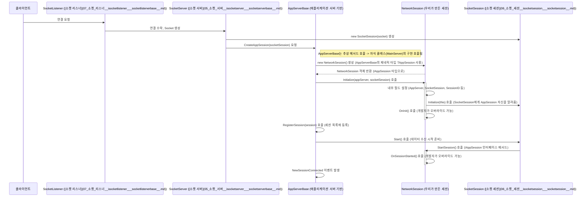
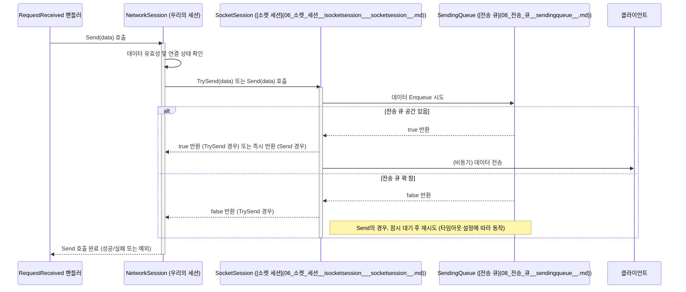

# Chapter 2: 애플리케이션 세션 (AppSession)


지난 [제 1장: 애플리케이션 서버 (AppServer/AppServerBase)](01_애플리케이션_서버__appserver_appserverbase__.md)에서는 서버의 전반적인 틀과 운영을 담당하는 `AppServer`에 대해 알아보았습니다. `AppServer`는 마치 호텔의 총지배인처럼 여러 클라이언트(손님)의 연결을 관리한다고 했죠.

이번 장에서는 **개별 클라이언트 연결**을 나타내는 `애플리케이션 세션(AppSession)`에 대해 자세히 알아볼 것입니다. 호텔에 손님이 오면 각자 방을 배정받는 것처럼, 서버에 클라이언트가 접속하면 각 클라이언트를 위한 `AppSession` 객체가 생성됩니다.

## AppSession은 왜 필요할까요?

서버는 동시에 여러 클라이언트와 통신해야 합니다. 만약 모든 클라이언트의 정보를 한 곳에서 뒤죽박죽 관리한다면 어떨까요? A 클라이언트에게 보내야 할 메시지를 B 클라이언트에게 보내거나, C 클라이언트의 로그인 상태를 D 클라이언트의 상태로 착각하는 등 끔찍한 혼란이 발생할 것입니다.

`AppSession`은 이러한 문제를 해결하기 위해 **각 클라이언트 연결을 독립적인 객체로 분리**합니다. 마치 호텔의 각 객실처럼, 모든 `AppSession`은 자신만의 고유한 정보(예: 연결 상태, 마지막 활동 시간)와 데이터를 가집니다. 이를 통해 개발자는 특정 클라이언트의 상태를 안전하게 관리하고, 해당 클라이언트에게만 정확하게 메시지를 보내는 등의 작업을 쉽게 할 수 있습니다.

예를 들어, 채팅 서버를 만든다고 생각해 봅시다. 여러 사용자가 동시에 접속해서 대화를 나눕니다.
*   Alice가 접속하면, Alice를 위한 `AppSession` 객체가 생성됩니다. 이 객체에는 Alice의 닉네임, 접속 시간 등의 정보가 저장될 수 있습니다.
*   Bob이 접속하면, Bob을 위한 별도의 `AppSession` 객체가 생성됩니다.
*   Alice가 메시지를 보내면, 서버는 Alice의 `AppSession`을 통해 메시지를 받고, 다른 사용자들의 `AppSession` 객체를 찾아 메시지를 전달합니다.

`AppSession` 덕분에 각 사용자를 개별적으로 관리하고 상호작용하는 것이 훨씬 명확하고 간편해집니다.

## 핵심 개념: AppSession의 구성 요소

`AppSession` 클래스(`SuperSocketLite.SocketBase.AppSession<TAppSession, TRequestInfo>`)는 각 클라이언트 연결을 나타내며 다음과 같은 중요한 특징과 멤버를 가집니다.

1.  **상속 기반 확장:** 우리는 보통 `AppSession`을 직접 사용하기보다는, 이 클래스를 *상속*받아 우리만의 세션 클래스를 만듭니다. 1장에서 봤던 `NetworkSession` 클래스가 그 예시입니다. 이를 통해 우리 애플리케이션에 필요한 사용자별 데이터나 로직을 추가할 수 있습니다.

    ```csharp
    // 지난 장에서 정의했던 NetworkSession
    // AppSession<NetworkSession, PacketRequestInfo>를 상속받습니다.
    public class NetworkSession : AppSession<NetworkSession, PacketRequestInfo>
    {
        // 여기에 이 세션(클라이언트)과 관련된 추가 정보나 메서드를 넣을 수 있습니다.
        public string? Nickname { get; set; } // 예: 사용자의 닉네임 저장
        public DateTime LoginTime { get; set; } // 예: 로그인 시간 저장

        // AppSession의 메서드를 오버라이드하여 특정 시점에 동작을 추가할 수도 있습니다.
        protected override void OnSessionStarted()
        {
            // 세션이 완전히 시작되었을 때 호출됩니다.
            // 여기에 초기화 로직이나 환영 메시지 전송 등을 넣을 수 있습니다.
            base.OnSessionStarted();
            Console.WriteLine($"세션 [{SessionID}] 시작됨! 환영 메시지를 보냅니다.");
            // Send("서버에 오신 것을 환영합니다!"); // 예시: 환영 메시지 전송
            LoginTime = DateTime.Now;
        }

        protected override void OnSessionClosed(CloseReason reason)
        {
            // 세션이 닫혔을 때 호출됩니다.
            // 여기에 리소스 정리, 로그아웃 처리 등을 넣을 수 있습니다.
            Console.WriteLine($"세션 [{SessionID}] 종료됨 (사유: {reason}). 로그인 시간: {LoginTime}");
            base.OnSessionClosed(reason);
        }
    }
    ```
    *   `AppSession<NetworkSession, PacketRequestInfo>`: 제네릭을 사용하여 이 세션 타입이 `NetworkSession` 자신이며, 처리할 요청 정보 타입은 `PacketRequestInfo`임을 명시합니다.
    *   `Nickname`, `LoginTime`: `NetworkSession` 클래스에 사용자 정의 속성을 추가한 예입니다. 각 클라이언트 세션마다 고유한 닉네임과 로그인 시간을 가질 수 있습니다.
    *   `OnSessionStarted()`: 세션이 성공적으로 시작되고 통신 준비가 되었을 때 호출되는 가상 메서드입니다. `override` 키워드를 사용하여 재정의하고, 초기화 코드나 환영 메시지 전송 로직을 넣을 수 있습니다.
    *   `OnSessionClosed(CloseReason reason)`: 세션 연결이 끊어졌을 때 호출되는 가상 메서드입니다. 연결 종료 사유(`reason`)를 받아 처리할 수 있으며, 사용자 데이터 정리 등의 후처리 로직을 넣기에 적합합니다.

2.  **고유 식별자 (`SessionID`):** 각 세션은 생성될 때마다 고유한 문자열 ID를 부여받습니다. 이를 통해 서버는 수많은 세션 중에서 특정 세션을 구분할 수 있습니다.

3.  **연결 정보 (`RemoteEndPoint`, `LocalEndPoint`):**
    *   `RemoteEndPoint`: 연결된 클라이언트의 IP 주소와 포트 번호를 알 수 있습니다.
    *   `LocalEndPoint`: 서버가 이 연결을 위해 사용하고 있는 로컬 IP 주소와 포트 번호를 알 수 있습니다.

4.  **상태 정보:**
    *   `Connected`: 현재 세션이 연결되어 있는지 여부를 나타내는 `bool` 값입니다.
    *   `LastActiveTime`: 세션이 마지막으로 활동한 시간(데이터를 보내거나 받은 시간)입니다. 오랫동안 활동이 없는 세션(좀비 세션)을 감지하고 연결을 종료하는 데 사용할 수 있습니다.
    *   `StartTime`: 세션이 시작된 시간입니다.

5.  **데이터 저장소 (`Items`):** 각 세션은 `IDictionary<object, object>` 타입의 `Items` 속성을 가집니다. 이곳에 해당 세션과 관련된 임시 데이터를 저장할 수 있습니다. 예를 들어, 사용자가 로그인하면 사용자 ID나 권한 정보를 `Items`에 저장해두고, 이후 요청 처리 시 해당 정보를 참조할 수 있습니다. 호텔 객실 안의 작은 금고와 같다고 생각할 수 있습니다.

    ```csharp
    // RequestReceived 핸들러 안에서 사용 예시
    private void RequestReceived(NetworkSession session, PacketRequestInfo reqInfo)
    {
        // 가상의 로그인 요청 처리
        if (reqInfo.PacketID == 100) // 100번 패킷이 로그인 요청이라고 가정
        {
            string requestedUsername = Encoding.UTF8.GetString(reqInfo.Body); // 요청 본문에서 사용자 이름 추출 (예시)
            bool loginSuccess = AuthenticateUser(requestedUsername); // 실제 인증 로직 (생략)

            if (loginSuccess)
            {
                // 로그인 성공 시, 세션의 Items 사전에 사용자 이름 저장
                session.Items["Username"] = requestedUsername;
                session.Send($"로그인 성공! 환영합니다, {requestedUsername}님."); // 응답 전송
                Console.WriteLine($"세션 [{session.SessionID}] 사용자 '{requestedUsername}' 로그인 성공");
            }
            else
            {
                session.Send("로그인 실패.");
            }
        }
        // 다른 요청 처리
        else if (reqInfo.PacketID == 200) // 200번 패킷이 메시지 전송이라고 가정
        {
            // Items 사전에 저장된 사용자 이름 읽기
            if (session.Items.TryGetValue("Username", out object? usernameObj) && usernameObj is string username)
            {
                string message = Encoding.UTF8.GetString(reqInfo.Body);
                Console.WriteLine($"[{username}]: {message}");
                // 여기에 다른 사용자에게 메시지 전파 로직 추가 가능
                session.Send("메시지 전송 완료.");
            }
            else
            {
                session.Send("로그인이 필요합니다.");
                session.Close(CloseReason.ApplicationError); // 로그인 안 된 사용자는 연결 종료
            }
        }
    }

    // 실제 인증 로직은 별도로 구현해야 합니다.
    private bool AuthenticateUser(string username) => !string.IsNullOrEmpty(username); // 임시 구현
    ```
    *   `session.Items["Username"] = requestedUsername;`: 로그인 성공 시, `Items` 딕셔너리에 `"Username"`이라는 키로 사용자 이름을 저장합니다. 이제 이 `session` 객체 어디서든 이 값을 다시 꺼내 쓸 수 있습니다.
    *   `session.Items.TryGetValue("Username", out object? usernameObj)`: 다른 요청을 처리할 때 `Items`에서 `"Username"` 키로 저장된 값을 안전하게 읽어옵니다. `TryGetValue`는 키가 없을 경우 `false`를 반환하여 오류를 방지합니다.

6.  **통신 메서드 (`Send`, `TrySend`):** 이 세션에 연결된 클라이언트에게 데이터를 보낼 때 사용합니다. 다양한 오버로드가 있어 문자열, 바이트 배열(`byte[]`), 또는 여러 데이터 조각(`IList<ArraySegment<byte>>`)을 보낼 수 있습니다.

    ```csharp
    // RequestReceived 핸들러 안에서 에코 응답 보내기 (1장 예제)
    private void RequestReceived(NetworkSession session, PacketRequestInfo reqInfo)
    {
        Console.WriteLine($"클라이언트 [{session.SessionID}] 로부터 메시지 수신 (PacketID: {reqInfo.PacketID})");

        // 받은 데이터를 그대로 클라이언트에게 다시 보냅니다 (에코).
        // Send 메서드는 byte[] 배열과 offset, length를 받습니다.
        // reqInfo.Body가 byte[] 이므로 그대로 사용합니다.
        session.Send(reqInfo.Body, 0, reqInfo.Body.Length);
        Console.WriteLine($"클라이언트 [{session.SessionID}] 에게 에코 응답 전송 완료.");
    }
    ```
    *   `session.Send(reqInfo.Body, 0, reqInfo.Body.Length);`: 현재 요청을 보낸 클라이언트(`session`)에게 `reqInfo.Body`에 담긴 바이트 데이터를 그대로 다시 전송합니다.

7.  **연결 종료 메서드 (`Close`):** 해당 세션의 연결을 종료합니다. 종료 이유(`CloseReason`)를 명시할 수 있습니다.

    ```csharp
    // 잘못된 요청을 보낸 클라이언트 강제 종료 예시
    private void RequestReceived(NetworkSession session, PacketRequestInfo reqInfo)
    {
        if (reqInfo.PacketID == 999) // 999번 패킷은 잘못된 요청이라고 가정
        {
            Console.WriteLine($"세션 [{session.SessionID}] 로부터 잘못된 요청 수신. 연결을 종료합니다.");
            session.Send("잘못된 요청입니다. 연결을 종료합니다.");
            // Close 메서드를 호출하여 연결을 끊습니다.
            session.Close(CloseReason.ProtocolError); // 종료 사유: 프로토콜 오류
        }
        // ... 다른 요청 처리 ...
    }
    ```
    *   `session.Close(CloseReason.ProtocolError);`: 현재 세션(`session`)과의 연결을 즉시 종료합니다. 종료 사유로 `ProtocolError`를 지정하여 로그나 `OnSessionClosed` 핸들러에서 원인을 파악할 수 있도록 합니다.

## AppSession 사용하기: 에코 서버 개선

1장에서 만든 간단한 에코 서버를 `AppSession`의 기능을 활용하여 조금 더 개선해 보겠습니다. 클라이언트가 접속하면 환영 메시지를 보내고, 접속 시간을 기록하며, 종료 시 로그를 남기도록 수정합니다.

**1단계: NetworkSession 클래스 수정**

`NetworkSession` 클래스에 로그인 시간 속성을 추가하고, `OnSessionStarted`와 `OnSessionClosed` 메서드를 오버라이드합니다.

```csharp
// GameServer_01/NetworkSession.cs (수정)
using SuperSocketLite.SocketBase;
using SuperSocketLite.SocketBase.Protocol;
using System; // DateTime, Console 사용

public class NetworkSession : AppSession<NetworkSession, PacketRequestInfo>
{
    // 로그인 시간을 저장할 속성
    public DateTime LoginTime { get; private set; }

    // 세션이 시작될 때 호출됨
    protected override void OnSessionStarted()
    {
        // 기본 AppSession의 시작 로직 실행
        base.OnSessionStarted();

        // 현재 시간을 LoginTime에 기록
        this.LoginTime = DateTime.Now;
        Console.WriteLine($"세션 [{SessionID}] 시작됨. 시간: {this.LoginTime}");

        // 환영 메시지 전송 (문자열을 UTF8 바이트 배열로 변환하여 전송)
        string welcomeMessage = $"환영합니다! 서버에 접속하셨습니다. (ID: {SessionID})";
        byte[] messageBytes = System.Text.Encoding.UTF8.GetBytes(welcomeMessage);

        // 중요: 실제 전송 시에는 프로토콜에 맞는 형태로 패킷을 만들어 보내야 합니다.
        //       여기서는 단순히 메시지 내용만 보내는 예시입니다.
        //       (실제 에코 서버 예제에서는 패킷 ID 등을 포함해야 함)
        // this.Send(messageBytes, 0, messageBytes.Length); // Send 메서드를 이용해 전송

        // 참고: 1장의 에코 서버 MainServer.RequestReceived 에서는 받은 패킷 구조 그대로 응답했으므로,
        //       여기서 임의의 문자열을 보내면 클라이언트가 해석하지 못할 수 있습니다.
        //       실제 구현 시에는 서버-클라이언트 간 약속된 패킷 포맷을 따라야 합니다.
        //       여기서는 개념 설명을 위해 Send 호출 가능성만 보여줍니다.
    }

    // 세션이 닫힐 때 호출됨
    protected override void OnSessionClosed(CloseReason reason)
    {
        Console.WriteLine($"세션 [{SessionID}] 종료됨. 사유: {reason}, 접속 시간: {this.LoginTime}");

        // 기본 AppSession의 종료 로직 실행
        base.OnSessionClosed(reason);

        // 여기에 필요한 정리 작업 추가 (예: Items 딕셔너리 정리 등)
    }

    // 필요하다면 여기에 추가적인 메서드나 속성을 정의할 수 있습니다.
    public void Kick(string reasonMessage)
    {
        Console.WriteLine($"세션 [{SessionID}] 강제 종료 시도. 사유: {reasonMessage}");
        this.Send($"서버에 의해 연결이 종료되었습니다. 사유: {reasonMessage}"); // 종료 사유 전송 (프로토콜 맞게)
        this.Close(CloseReason.ServerShutdown); // 연결 종료
    }
}

// PacketRequestInfo 클래스는 변경 없음 (1장과 동일)
public class PacketRequestInfo : IRequestInfo
{
    public string Key => PacketID.ToString();
    public short PacketID { get; set; }
    public byte[] Body { get; set; }
    public const int HeaderSize = 5; // 예시: 헤더 크기 정의
}
```

*   `LoginTime` 속성을 추가하여 각 세션이 시작된 시간을 기록합니다.
*   `OnSessionStarted`를 오버라이드하여 세션이 시작될 때 현재 시간을 `LoginTime`에 저장하고 로그를 출력합니다. (주석 처리된 `Send` 부분은 실제 프로토콜에 맞게 구현해야 함을 유의하세요.)
*   `OnSessionClosed`를 오버라이드하여 세션이 종료될 때 종료 사유와 함께 기록된 `LoginTime`을 로그로 출력합니다.
*   `Kick` 메서드 예시: 세션 클래스 내부에 특정 로직(여기서는 강제 퇴장)을 캡슐화할 수도 있습니다.

**2단계: MainServer 클래스 수정 (필요시)**

이 예제에서는 `MainServer` 클래스의 `OnConnected`나 `OnClosed` 핸들러는 `NetworkSession`의 `OnSessionStarted`, `OnSessionClosed`로 로직이 옮겨갔으므로, `MainServer`에서 해당 이벤트 핸들러 등록 부분을 제거하거나 내용을 비워도 됩니다. 또는 그대로 두어 `AppServer` 레벨의 로그와 `AppSession` 레벨의 로그를 모두 남길 수도 있습니다. `RequestReceived` 핸들러는 그대로 유지하여 에코 기능을 수행합니다.

```csharp
// GameServer_01/MainServer.cs (일부 수정 또는 유지)
class MainServer : AppServer<NetworkSession, PacketRequestInfo>
{
    public MainServer()
        : base(new DefaultReceiveFilterFactory<PacketReceiveFilter, PacketRequestInfo>())
    {
        // AppServer 레벨의 이벤트 핸들러 (선택적으로 유지 또는 제거)
        // NewSessionConnected += OnConnected;
        // SessionClosed += OnClosed;
        NewRequestReceived += RequestReceived; // 요청 처리 핸들러는 필수
    }

    // AppServer 레벨의 연결/종료 핸들러 (NetworkSession의 OnSessionStarted/Closed와 중복될 수 있음)
    // private void OnConnected(NetworkSession session) { ... }
    // private void OnClosed(NetworkSession session, CloseReason reason) { ... }

    // 요청 처리 핸들러 (기존 에코 로직 유지)
    private void RequestReceived(NetworkSession session, PacketRequestInfo reqInfo)
    {
        Console.WriteLine($"세션 [{session.SessionID}] 로부터 요청 수신 (PacketID: {reqInfo.PacketID})");
        // 에코 로직
        session.Send(reqInfo.Body, 0, reqInfo.Body.Length);
        Console.WriteLine($"세션 [{session.SessionID}] 에게 에코 응답 전송 완료.");
    }
    // ... InitConfig, CreateServer 등 나머지 코드는 동일 ...
}
```

이제 서버를 실행하고 클라이언트를 연결하면, `NetworkSession`의 `OnSessionStarted`가 호출되어 로그가 출력되고 `LoginTime`이 기록됩니다. 클라이언트 연결을 끊으면 `OnSessionClosed`가 호출되어 종료 로그와 함께 기록된 `LoginTime`이 출력되는 것을 확인할 수 있습니다.

## AppSession 내부 동작 들여다보기

`AppSession`이 `AppServer` 및 다른 구성 요소와 어떻게 상호작용하는지 조금 더 살펴보겠습니다.

**세션 생성 및 시작 과정 (복습 및 상세화)**



1.  클라이언트 연결 시, `SocketServer`는 `AppServerBase`의 `CreateAppSession`을 호출합니다.
2.  `AppServerBase`는 제네릭 타입 `TAppSession` (우리의 경우 `NetworkSession`)의 새 인스턴스를 생성합니다.
3.  생성된 `AppSession` 객체의 `Initialize` 메서드가 호출됩니다. 이 메서드는 `AppServer` 자신과 내부 `SocketSession`에 대한 참조를 `AppSession` 내부에 저장하고, `SessionID`를 설정하며, 연결된 `ReceiveFilter`를 생성/초기화합니다. 또한 개발자가 오버라이드할 수 있는 `OnInit()` 메서드를 호출합니다.
4.  `AppServerBase`는 이 세션을 내부 컬렉션(보통 Dictionary)에 등록합니다 (`RegisterSession`).
5.  데이터 수신 준비가 끝나면 `SocketSession`은 `AppSession`의 `StartSession()` 메서드를 호출합니다.
6.  `StartSession()` 내부에서는 개발자가 오버라이드할 수 있는 `OnSessionStarted()` 메서드를 호출합니다. 여기서 세션 시작 관련 로직(예: 환영 메시지 전송)을 수행할 수 있습니다.
7.  마지막으로 `AppServerBase`는 `NewSessionConnected` 이벤트를 발생시킵니다.

**데이터 송신 과정**



1.  우리가 작성한 코드(예: `RequestReceived` 핸들러)에서 `session.Send(data)`를 호출합니다.
2.  `AppSession`의 `Send` (또는 `TrySend`) 메서드는 내부적으로 연결 상태를 확인하고, 실제 데이터 전송은 자신이 참조하고 있는 `ISocketSession` 객체에게 위임합니다.
3.  `SocketSession`은 이 데이터를 내부의 [전송 큐 (SendingQueue)](08_전송_큐__sendingqueue__.md)에 넣으려고 시도합니다.
4.  `SendingQueue`에 성공적으로 데이터가 들어가면, 별도의 스레드 또는 비동기 작업이 큐에서 데이터를 꺼내 실제 소켓을 통해 클라이언트에게 전송합니다.
5.  `TrySend`는 큐에 넣기 성공 여부를 즉시 반환하고, `Send`는 큐가 꽉 찼을 경우 설정된 타임아웃 시간 동안 재시도할 수 있습니다.

**코드 레벨에서 살펴보기 (참고용)**

*   **AppSession 생성 및 초기화:** `SuperSocketLite\SocketBase\AppServerBase.cs`의 `CreateAppSession` 관련 로직과 `SuperSocketLite\SocketBase\AppSession.cs`의 `Initialize` 메서드를 살펴보세요. `Initialize`에서는 `AppServer`, `SocketSession`, `SessionID` 등을 설정하고 `ReceiveFilter`를 생성하며 `OnInit`을 호출합니다.
*   **세션 시작:** `SuperSocketLite\SocketBase\AppSession.cs`의 `StartSession` 메서드(실제로는 `IAppSession` 인터페이스 구현)를 보면 내부적으로 `OnSessionStarted`를 호출하는 것을 볼 수 있습니다.
*   **세션 종료:** `SocketSession`이 닫힐 때(`SuperSocketLite\SocketEngine\SocketSession.cs`의 `Close` 메서드 참고), 연결된 `AppSession`의 `OnSessionClosed` 메서드가 호출됩니다 (`AppServerBase` 또는 `AppServer`의 세션 관리 로직에서 처리). `AppSession.Close()` 메서드는 내부적으로 `SocketSession.Close()`를 호출합니다.
*   **데이터 저장 (`Items`):** `SuperSocketLite\SocketBase\AppSession.cs`에서 `Items` 속성은 필요할 때 `Dictionary<object, object>` 객체를 생성하여 사용하는 간단한 속성입니다. 스레드 안전성이 필요하다면 `ConcurrentDictionary`를 사용하거나 락(lock)을 직접 관리해야 할 수 있습니다 (기본 구현은 스레드 안전하지 않음).
*   **데이터 전송 (`Send`, `TrySend`):** `SuperSocketLite\SocketBase\AppSession.cs`의 `Send` 관련 메서드들을 보면, 최종적으로 `SocketSession.TrySend` 또는 `SocketSession.Send`를 호출하는 것을 확인할 수 있습니다. 타임아웃 처리 로직도 `Send` 메서드 내부에 구현되어 있습니다.

## 결론

이번 장에서는 서버에 연결된 각 클라이언트를 대표하는 `AppSession`에 대해 배웠습니다. `AppSession`은 마치 호텔 객실처럼 각 클라이언트의 고유한 상태와 데이터를 관리하고, 서버가 특정 클라이언트와 상호작용할 수 있는 통로를 제공합니다.

*   `AppSession`은 개별 클라이언트 연결을 추상화합니다.
*   우리는 `AppSession<TAppSession, TRequestInfo>`를 상속받아 우리만의 세션 클래스를 만들고, 필요한 속성이나 메서드를 추가할 수 있습니다.
*   `SessionID`, `RemoteEndPoint`, `LastActiveTime` 등 유용한 정보를 제공합니다.
*   `Items` 딕셔너리를 통해 세션별 데이터를 저장하고 관리할 수 있습니다.
*   `Send()`, `Close()` 메서드로 특정 클라이언트에게 데이터를 보내거나 연결을 종료할 수 있습니다.
*   `OnSessionStarted()`, `OnSessionClosed()` 등의 가상 메서드를 오버라이드하여 세션 생명주기의 특정 시점에 원하는 로직을 실행할 수 있습니다.

`AppSession`을 통해 우리는 복잡한 다중 클라이언트 환경에서도 각 클라이언트를 명확하게 구분하고 개별적으로 상태를 관리하며 통신할 수 있습니다.

다음 장에서는 클라이언트로부터 도착한 원시 바이트 데이터(raw byte data)를 어떻게 우리가 이해할 수 있는 의미 있는 요청 정보(`TRequestInfo`)로 변환하는지에 대해 알아볼 것입니다. 이 중요한 역할을 하는 **[제 3장: 수신 필터 (IReceiveFilter / ReceiveFilterBase)](03_수신_필터__ireceivefilter___receivefilterbase__.md)** 를 기대해주세요!

---

Generated by [AI Codebase Knowledge Builder](https://github.com/The-Pocket/Tutorial-Codebase-Knowledge)