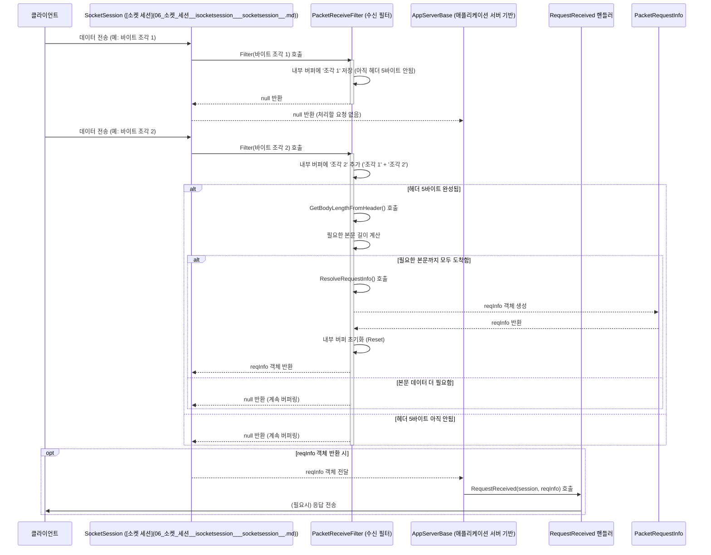

# Chapter 3: 수신 필터 (IReceiveFilter / ReceiveFilterBase)


이전 [제 2장: 애플리케이션 세션 (AppSession)](02_애플리케이션_세션__appsession__.md)에서는 각 클라이언트 연결을 나타내는 `AppSession`에 대해 배웠습니다. `AppSession`은 클라이언트와의 독립적인 통신 채널과 같다고 했죠.

이번 장에서는 서버가 클라이언트로부터 받은 데이터를 어떻게 이해할 수 있는 형태로 가공하는지에 대해 알아봅니다. 바로 **수신 필터(Receive Filter)**의 역할입니다. `IReceiveFilter<TRequestInfo>` 인터페이스와 이를 구현하는 데 도움을 주는 `ReceiveFilterBase<TRequestInfo>` 클래스가 이 작업의 핵심입니다.

## 왜 수신 필터가 필요할까요?

네트워크 통신, 특히 TCP/IP 통신은 데이터를 '스트림(stream)' 형태로 주고받습니다. 이는 마치 물이 흐르는 파이프와 같아서, 데이터가 연속적인 바이트 덩어리로 도착합니다. 여기에는 중요한 문제가 숨어 있습니다. 서버는 어디까지가 하나의 완전한 메시지(요청)이고 어디서 다음 메시지가 시작되는지 알 수 없습니다.

예를 들어, 클라이언트가 "안녕하세요"라는 메시지와 "반갑습니다"라는 메시지를 연달아 보낸다고 가정해 봅시다. TCP 스트림 상에서는 이 데이터가 `[안녕][하세요][반][갑습니][다]` 와 같이 여러 조각으로 나뉘어 도착하거나, `[안녕하세요반갑습니다]` 처럼 한 덩어리로 합쳐져 도착할 수 있습니다. 서버는 이 바이트 덩어리만 보고서는 의미 있는 메시지 단위("안녕하세요", "반갑습니다")를 구분할 수 없습니다.

**수신 필터는 바로 이 문제를 해결합니다.** 마치 외국어로 된 연속적인 문장을 의미 있는 문장 단위로 끊어 번역하는 번역가처럼, 수신 필터는 네트워크를 통해 들어온 원시 바이트 스트림을 서버 애플리케이션이 이해할 수 있는 요청 단위(`RequestInfo`)로 해석하고 분리하는 역할을 합니다.

개발자는 클라이언트와 서버 간의 통신 규칙(프로토콜)에 맞춰 적절한 수신 필터를 선택하거나 직접 구현해야 합니다. 이 규칙이 있어야만 서버는 끝없이 흘러 들어오는 데이터 속에서 메시지의 시작과 끝을 정확히 찾아낼 수 있습니다.

## 핵심 개념: 수신 필터의 구성 요소

SuperSocketLite에서 수신 필터는 주로 `IReceiveFilter<TRequestInfo>` 인터페이스와 `ReceiveFilterBase<TRequestInfo>` 추상 클래스를 통해 구현됩니다.

1.  **`IReceiveFilter<TRequestInfo>` (인터페이스):**
    *   모든 수신 필터가 구현해야 하는 기본 계약입니다.
    *   핵심 메서드는 `Filter`입니다. 이 메서드는 네트워크로부터 새로운 데이터 조각(`readBuffer`)을 받을 때마다 호출됩니다.
    *   `Filter` 메서드의 역할은 주어진 데이터 조각을 분석하여, 만약 완전한 요청 하나를 구성할 수 있다면 해당 요청을 나타내는 `TRequestInfo` 객체를 반환하는 것입니다.
    *   데이터가 아직 부족하여 완전한 요청을 만들 수 없다면, `Filter` 메서드는 받은 데이터를 내부 버퍼에 저장하고 `null`(또는 기본값)을 반환해야 합니다.
    *   `TRequestInfo`는 제네릭 타입 매개변수로, 필터가 최종적으로 만들어낼 요청 정보의 타입을 지정합니다. 이 타입은 [제 4장: 요청 정보 (IRequestInfo)](04_요청_정보__irequestinfo__.md)에서 자세히 다룹니다.

2.  **`ReceiveFilterBase<TRequestInfo>` (추상 클래스):**
    *   `IReceiveFilter<TRequestInfo>` 인터페이스를 구현하는 많은 필터들에게 공통적으로 필요한 기능을 미리 구현해 놓은 편리한 기반 클래스입니다.
    *   특히, 아직 완전한 요청을 구성하기에 데이터가 부족할 경우, 수신된 데이터 조각들을 임시로 저장하는 내부 버퍼(`BufferSegments`) 관리 기능을 제공합니다.
    *   대부분의 사용자 정의 필터는 직접 `IReceiveFilter`를 구현하기보다 `ReceiveFilterBase`를 상속받아 구현하는 것이 더 쉽습니다.

3.  **다양한 구현 방식:**
    *   통신 프로토콜은 매우 다양합니다. SuperSocketLite는 몇 가지 일반적인 프로토콜 패턴에 맞는 필터 구현체를 기본적으로 제공하거나 쉽게 구현할 수 있는 기반을 제공합니다.
        *   **`FixedHeaderReceiveFilter<TRequestInfo>`:** 모든 요청이 고정된 길이의 헤더(Header)를 가지고 있고, 이 헤더 안에 메시지 본문(Body)의 길이가 명시되는 프로토콜에 사용됩니다. (예: 헤더 4바이트에 전체 길이를 담는 방식) - 이번 장에서 주로 다룰 예제입니다.
        *   **`TerminatorReceiveFilter<TRequestInfo>`:** 각 요청이 특정 종료 문자열(Terminator)로 끝나는 텍스트 기반 프로토콜에 사용됩니다. (예: 각 메시지가 `\r\n`으로 끝나는 경우)
        *   **`BeginEndMarkReceiveFilter<TRequestInfo>`:** 각 요청이 특정 시작 표시(Begin Mark)와 종료 표시(End Mark)를 가지는 프로토콜에 사용됩니다. (예: 메시지가 `<START>`로 시작하고 `<END>`로 끝나는 경우)
        *   **사용자 정의 필터:** 만약 위 패턴에 맞지 않는 독자적인 프로토콜을 사용한다면, `IReceiveFilter`나 `ReceiveFilterBase`를 상속받아 직접 필터 로직을 구현해야 합니다.

## 수신 필터 사용하기: 고정 헤더 프로토콜 처리

[제 1장: 애플리케이션 서버 (AppServer/AppServerBase)](01_애플리케이션_서버__appserver_appserverbase__.md)에서 만들었던 에코 서버를 떠올려 봅시다. 당시에는 `PacketReceiveFilter`라는 클래스를 사용했는데, 이 클래스가 바로 고정 헤더 방식을 처리하는 수신 필터의 예입니다. 어떻게 구현되는지 자세히 살펴보겠습니다.

**가정하는 프로토콜:**

클라이언트가 보내는 모든 메시지는 다음과 같은 구조를 가진다고 가정합니다.

*   **헤더 (Header):** 5 바이트 고정 길이
    *   전체 패킷 길이 (헤더 포함): 2 바이트 (short)
    *   패킷 ID: 2 바이트 (short)
    *   예약 필드: 1 바이트 (byte)
*   **본문 (Body):** 가변 길이. 길이는 헤더의 '전체 패킷 길이'에서 헤더 길이(5)를 뺀 값입니다.

**1단계: 요청 정보 클래스 정의 (PacketRequestInfo)**

먼저, 수신 필터가 성공적으로 데이터를 해석했을 때 반환할 결과물인 `PacketRequestInfo` 클래스를 정의합니다. (1장의 코드를 다시 가져옵니다.)

```csharp
// 네임스페이스 및 using 문은 생략
using SuperSocketLite.Common; // BinaryRequestInfo 사용을 위해 추가
using SuperSocketLite.SocketBase.Protocol; // IRequestInfo 사용을 위해 추가
using System; // BitConverter, Array 사용

// 클라이언트 요청을 나타낼 클래스 (4장에서 자세히 설명)
// BinaryRequestInfo는 Body 데이터를 byte[]로 가지는 기본 클래스입니다.
public class PacketRequestInfo : BinaryRequestInfo
{
    public string Key => PacketID.ToString(); // 요청을 구분할 키 (예: 패킷 ID)

    public short TotalSize { get; private set; } // 헤더에 포함된 전체 패킷 크기
    public short PacketID { get; private set; } // 패킷 종류를 나타내는 ID
    public byte Reserved { get; private set; } // 예약된 값
    // Body는 부모 클래스인 BinaryRequestInfo에 byte[] 형태로 정의되어 있습니다.

    // 헤더 크기 상수 정의
    public const int HeaderSize = 5;

    // 생성자: 해석된 헤더와 본문 데이터로 객체를 초기화합니다.
    public PacketRequestInfo(short totalSize, short packetID, byte reserved, byte[] body)
        : base(packetID.ToString(), body) // 부모 생성자 호출 (Key, Body 전달)
    {
        TotalSize = totalSize;
        PacketID = packetID;
        Reserved = reserved;
    }
}
```

*   `BinaryRequestInfo`를 상속받아 기본적인 `Key`와 `Body` 속성을 활용합니다.
*   프로토콜에 맞게 `TotalSize`, `PacketID`, `Reserved` 속성을 추가합니다.
*   `HeaderSize` 상수를 정의하여 헤더 크기를 명시합니다.
*   생성자에서는 헤더와 본문 데이터를 받아 객체를 초기화합니다.

**2단계: 수신 필터 구현 (PacketReceiveFilter)**

이제 `FixedHeaderReceiveFilter<PacketRequestInfo>`를 상속받아 실제 데이터 해석 로직을 구현합니다.

```csharp
// 네임스페이스 및 using 문은 생략
using SuperSocketLite.Common; // ArraySegmentList, CloneRange 사용
using SuperSocketLite.SocketBase.Protocol; // ReceiveFilterBase 등 사용
using SuperSocketLite.SocketEngine.Protocol; // FixedHeaderReceiveFilter 사용
using System; // ArraySegment, BitConverter 등 사용

// FixedHeaderReceiveFilter를 상속받아 PacketRequestInfo를 생성하는 필터
public class PacketReceiveFilter : FixedHeaderReceiveFilter<PacketRequestInfo>
{
    // 생성자: 부모 클래스 생성자를 호출하며 헤더 크기를 알려줍니다.
    public PacketReceiveFilter() : base(PacketRequestInfo.HeaderSize) // 헤더 크기는 5바이트
    {
    }

    // 헤더 데이터를 분석하여 본문의 길이를 계산하는 메서드 (반드시 구현해야 함)
    protected override int GetBodyLengthFromHeader(byte[] header, int offset, int length)
    {
        // header 배열의 offset 위치부터 2바이트를 읽어 전체 패킷 크기를 얻습니다.
        // (네트워크 바이트 순서(Big Endian)와 CPU 바이트 순서(Little Endian)가 다를 경우 변환 필요)
        if (!BitConverter.IsLittleEndian) // 시스템이 Big Endian이면 바이트 순서 뒤집기
            Array.Reverse(header, offset, 2);

        // 헤더의 첫 2바이트를 short 타입(TotalSize)으로 변환
        short totalSize = BitConverter.ToInt16(header, offset);

        // 본문 길이는 전체 크기에서 헤더 크기를 뺀 값입니다.
        int bodyLength = totalSize - PacketRequestInfo.HeaderSize;

        // 계산된 본문 길이가 음수면 잘못된 패킷이므로 0 반환 (오류 처리)
        if (bodyLength < 0)
        {
            // TODO: 오류 로깅 또는 처리
            return 0;
        }
        return bodyLength;
    }

    // 헤더와 본문 데이터를 받아 최종 PacketRequestInfo 객체를 생성하는 메서드 (반드시 구현해야 함)
    protected override PacketRequestInfo ResolveRequestInfo(ArraySegment<byte> header, byte[] bodyBuffer, int offset, int length)
    {
        // 헤더 데이터를 파싱하여 각 필드 값을 추출합니다.
        // (GetBodyLengthFromHeader와 마찬가지로 Endian 처리 필요할 수 있음)
        byte[] headerArray = header.Array;
        int headerOffset = header.Offset;

        if (!BitConverter.IsLittleEndian)
            Array.Reverse(headerArray, headerOffset, PacketRequestInfo.HeaderSize); // 필요시 전체 헤더 뒤집기

        short totalSize = BitConverter.ToInt16(headerArray, headerOffset);
        short packetID = BitConverter.ToInt16(headerArray, headerOffset + 2);
        byte reserved = headerArray[headerOffset + 4];

        // 본문 데이터(bodyBuffer)는 이미 필요한 만큼 준비되어 있습니다.
        // CloneRange를 사용하여 bodyBuffer의 해당 부분만 복사하여 새 byte 배열을 만듭니다.
        byte[] body = bodyBuffer.CloneRange(offset, length);

        // 추출된 정보와 본문 데이터로 PacketRequestInfo 객체를 생성하여 반환합니다.
        return new PacketRequestInfo(totalSize, packetID, reserved, body);
    }
}
```

*   **생성자 `PacketReceiveFilter()`:** `base(PacketRequestInfo.HeaderSize)`를 호출하여 부모 클래스인 `FixedHeaderReceiveFilter`에게 헤더의 길이가 5바이트임을 알려줍니다. `FixedHeaderReceiveFilter`는 이 정보를 바탕으로 먼저 5바이트의 헤더 데이터를 모읍니다.
*   **`GetBodyLengthFromHeader(byte[] header, int offset, int length)`:** 헤더 데이터(5바이트)가 완전히 수신되면 이 메서드가 호출됩니다. 입력으로 받은 `header` 배열(정확히 5바이트)에서 '전체 패킷 길이' 정보를 읽어옵니다 (여기서는 첫 2바이트). 이 값에서 헤더 크기(5)를 빼서 실제 받아야 할 '본문(Body)의 길이'를 계산하여 반환합니다. `FixedHeaderReceiveFilter`는 이 반환값을 보고 앞으로 얼마만큼의 데이터를 더 받아야 본문이 완성되는지 알게 됩니다. `BitConverter.IsLittleEndian` 체크는 다른 시스템 간 통신 시 바이트 순서(Endianness) 문제를 처리하기 위함입니다.
*   **`ResolveRequestInfo(ArraySegment<byte> header, byte[] bodyBuffer, int offset, int length)`:** `GetBodyLengthFromHeader`에서 반환한 길이만큼의 본문 데이터까지 모두 수신되면 이 메서드가 호출됩니다. 입력으로 헤더 데이터(`header`)와 본문 데이터(`bodyBuffer`의 `offset`부터 `length`만큼)를 받습니다. 이 메서드 안에서는 헤더의 각 필드(TotalSize, PacketID, Reserved)를 파싱하고, 주어진 본문 데이터(`bodyBuffer.CloneRange(offset, length)`)를 사용하여 최종 `PacketRequestInfo` 객체를 생성하여 반환합니다. 이 반환된 `PacketRequestInfo` 객체가 바로 `AppServer`의 `NewRequestReceived` 이벤트 핸들러로 전달됩니다. `CloneRange`는 버퍼 재사용 시 데이터 오염을 방지하기 위해 본문 데이터를 복사하는 안전한 방법입니다.

**3단계: AppServer에 필터 연결**

[제 1장: 애플리케이션 서버 (AppServer/AppServerBase)](01_애플리케이션_서버__appserver_appserverbase__.md)의 `MainServer` 생성자에서 `DefaultReceiveFilterFactory`를 사용하여 이 `PacketReceiveFilter`를 사용하도록 설정합니다.

```csharp
// GameServer_01/MainServer.cs (생성자 부분)
using SuperSocketLite.SocketBase;
using SuperSocketLite.SocketBase.Protocol; // DefaultReceiveFilterFactory 사용

class MainServer : AppServer<NetworkSession, PacketRequestInfo>
{
    // 생성자: 서버가 시작될 때 호출됩니다.
    public MainServer()
        // 부모 생성자 호출: PacketReceiveFilter를 생성하는 팩토리를 전달합니다.
        : base(new DefaultReceiveFilterFactory<PacketReceiveFilter, PacketRequestInfo>())
    {
        Console.WriteLine("MainServer 생성자 호출됨.");
        // 새 클라이언트가 접속할 때마다 AppServer는 이 팩토리를 이용해
        // 해당 클라이언트 세션 전용의 PacketReceiveFilter 인스턴스를 생성합니다.
        NewSessionConnected += OnConnected;
        SessionClosed += OnClosed;
        NewRequestReceived += RequestReceived; // 필터가 PacketRequestInfo를 반환하면 이 핸들러 호출
    }

    // ... 나머지 핸들러 및 메서드 ...
    private void OnConnected(NetworkSession session) { /* ... */ }
    private void OnClosed(NetworkSession session, CloseReason reason) { /* ... */ }
    private void RequestReceived(NetworkSession session, PacketRequestInfo reqInfo)
    {
        // PacketReceiveFilter가 성공적으로 파싱한 reqInfo 객체가 여기에 전달됩니다.
        Console.WriteLine($"클라이언트 [{session.SessionID}] 로부터 메시지 수신 (PacketID: {reqInfo.PacketID})");

        // 에코 로직: reqInfo.Body에 접근하여 클라이언트에게 다시 보냅니다.
        session.Send(reqInfo.Body);
        Console.WriteLine($"클라이언트 [{session.SessionID}] 에게 에코 응답 전송 완료.");
    }
}
```

*   `new DefaultReceiveFilterFactory<PacketReceiveFilter, PacketRequestInfo>()`: 이 코드는 "새로운 클라이언트 연결이 생길 때마다 `PacketReceiveFilter` 타입의 객체를 새로 만들어서 사용하라"고 `AppServer`에게 알려주는 역할을 합니다. `AppServer`는 내부적으로 이 팩토리를 사용하여 각 [애플리케이션 세션 (AppSession)](02_애플리케이션_세션__appsession__.md)마다 독립적인 `PacketReceiveFilter` 인스턴스를 생성하고 할당합니다.

이제 서버가 실행되면, 각 클라이언트로부터 오는 바이트 스트림은 해당 클라이언트의 `PacketReceiveFilter`에 의해 처리됩니다. 필터는 정의된 5바이트 헤더 프로토콜에 따라 데이터를 분석하고, 완전한 패킷(헤더+본문)이 도착하면 `PacketRequestInfo` 객체를 만들어 `MainServer`의 `RequestReceived` 핸들러로 전달합니다.

## 수신 필터 내부 동작 들여다보기

수신 필터가 실제로 어떻게 데이터를 처리하는지 내부 흐름을 살펴보겠습니다.

**데이터 처리 흐름:**



1.  클라이언트가 데이터를 보내면, 해당 연결을 관리하는 [소켓 세션 (SocketSession)](06_소켓_세션__isocketsession___socketsession__.md)이 데이터를 수신합니다.
2.  `SocketSession`은 이 데이터를 연결된 `IReceiveFilter` (우리의 경우 `PacketReceiveFilter`)의 `Filter` 메서드에 전달합니다.
3.  `Filter` 메서드는 수신된 데이터를 분석합니다.
    *   **`FixedHeaderReceiveFilter`의 경우:**
        *   아직 헤더(5바이트)를 다 받지 못했다면, 받은 데이터를 내부 버퍼(`BufferSegments`)에 추가하고 `null`을 반환합니다.
        *   헤더를 완성했다면, `GetBodyLengthFromHeader`를 호출하여 필요한 본문 길이를 알아냅니다.
        *   만약 필요한 본문 길이만큼의 데이터가 아직 도착하지 않았다면 (헤더만 있고 본문이 없거나 일부만 있는 경우), 받은 본문 데이터를 내부 버퍼에 추가하고 `null`을 반환합니다.
        *   헤더와 필요한 길이의 본문 데이터가 모두 도착했다면, `ResolveRequestInfo`를 호출하여 `PacketRequestInfo` 객체를 생성합니다.
        *   생성된 `PacketRequestInfo` 객체를 반환하고, 다음 요청 처리를 위해 내부 상태와 버퍼를 초기화(`Reset`)합니다.
4.  `Filter` 메서드가 `null`이 아닌 `PacketRequestInfo` 객체를 반환하면, `AppServerBase`는 이 객체와 해당 `AppSession`을 `NewRequestReceived` 이벤트 핸들러(우리의 `RequestReceived` 메서드)로 전달합니다.
5.  핸들러는 전달받은 `PacketRequestInfo`를 사용하여 요청을 처리합니다.

**코드 레벨에서 살펴보기 (참고용)**

*   **`IReceiveFilter<TRequestInfo>` 인터페이스 (`SuperSocketLite\SocketBase\Protocol\IReceiveFilter.cs`):**
    *   `Filter` 메서드의 시그니처를 확인하세요. `readBuffer`, `offset`, `length`로 현재 수신된 데이터 조각을 받고, 처리 후 남은 데이터의 양을 `rest` 출력 매개변수로 알려줍니다. 완전한 요청을 찾으면 `TRequestInfo`를, 아니면 `null` 또는 기본값을 반환합니다. `LeftBufferSize`는 현재 필터 내부에 버퍼링된 데이터 크기를, `NextReceiveFilter`는 필터 체이닝(고급 기능)을, `Reset`은 필터 상태 초기화를, `State`는 필터의 현재 상태(정상, 오류 등)를 나타냅니다.

    ```csharp
    // SuperSocketLite\SocketBase\Protocol\IReceiveFilter.cs (일부)
    public interface IReceiveFilter<TRequestInfo>
        where TRequestInfo : IRequestInfo
    {
        TRequestInfo Filter(byte[] readBuffer, int offset, int length, bool toBeCopied, out int rest);
        int LeftBufferSize { get; }
        IReceiveFilter<TRequestInfo> NextReceiveFilter { get; }
        void Reset();
        FilterState State { get; }
    }
    ```

*   **`ReceiveFilterBase<TRequestInfo>` 클래스 (`SuperSocketLite\SocketBase\Protocol\ReceiveFilterBase.cs`):**
    *   `BufferSegments` 속성을 주목하세요. `ArraySegmentList` 타입으로, 여러 번 나뉘어 도착한 데이터 조각들을 효율적으로 관리합니다. `AddArraySegment` 메서드로 새 데이터 조각을 추가하고, `ClearBufferSegments`로 버퍼를 비웁니다. `Reset` 메서드는 이 버퍼를 비우는 기본적인 초기화 로직을 포함합니다. 많은 필터 구현체는 이 클래스를 상속받아 `BufferSegments` 관리를 직접 구현하는 수고를 덜 수 있습니다.

    ```csharp
    // SuperSocketLite\SocketBase\Protocol\ReceiveFilterBase.cs (일부)
    public abstract class ReceiveFilterBase<TRequestInfo> : IReceiveFilter<TRequestInfo>
        where TRequestInfo : IRequestInfo
    {
        private ArraySegmentList m_BufferSegments; // 데이터 조각들을 저장하는 리스트

        protected ArraySegmentList BufferSegments => m_BufferSegments;

        protected ReceiveFilterBase()
        {
            m_BufferSegments = new ArraySegmentList();
        }

        // 데이터를 버퍼에 추가하는 헬퍼 메서드
        protected void AddArraySegment(byte[] buffer, int offset, int length, bool toBeCopied)
        {
            m_BufferSegments.AddSegment(buffer, offset, length, toBeCopied);
        }

        // 버퍼를 비우는 헬퍼 메서드
        protected void ClearBufferSegments()
        {
            m_BufferSegments.ClearSegements();
        }

        // Filter 메서드는 추상 메서드로, 자식 클래스에서 구현해야 함
        public abstract TRequestInfo Filter(byte[] readBuffer, int offset, int length, bool toBeCopied, out int rest);

        public int LeftBufferSize => m_BufferSegments.Count; // 현재 버퍼링된 총 바이트 수

        public virtual void Reset() // 상태 초기화 시 버퍼 비우기
        {
            if(m_BufferSegments != null && m_BufferSegments.Count > 0)
                m_BufferSegments.ClearSegements();
        }
        // ... NextReceiveFilter, State 등 ...
    }
    ```

*   **`FixedHeaderReceiveFilter<TRequestInfo>` 클래스 (`SuperSocketLite\Protocol\FixedHeaderReceiveFilter.cs`):**
    *   이 클래스는 `FixedSizeReceiveFilter`를 상속하며, 고정 크기 헤더 처리에 특화되어 있습니다.
    *   `m_FoundHeader` (헤더를 찾았는지 여부), `m_BodyLength` (계산된 본문 길이), `m_Header` (수신된 헤더 데이터 저장), `m_BodyBuffer` (본문 데이터 조각 저장) 등의 내부 상태 변수를 사용하여 헤더와 본문을 순차적으로 처리하는 로직을 구현합니다.
    *   `Filter` 메서드 내부 로직을 보면, 먼저 헤더를 수집하고(`base.Filter` 호출 부분), 헤더가 완성되면 `GetBodyLengthFromHeader`를 호출하여 `m_BodyLength`를 설정합니다. 그 후, `m_BodyLength`만큼의 본문 데이터를 수집합니다. 본문까지 모두 수집되면 `ResolveRequestInfo`를 호출하여 최종 결과를 만들고 상태를 초기화합니다.

## 결론

이번 장에서는 클라이언트로부터 오는 연속적인 바이트 스트림을 의미 있는 요청 단위로 해석하는 **수신 필터(Receive Filter)**의 중요성과 역할에 대해 배웠습니다.

*   수신 필터는 TCP/IP 통신의 스트림 특성으로 인해 발생하는 메시지 경계 문제를 해결합니다.
*   `IReceiveFilter<TRequestInfo>` 인터페이스는 필터의 기본 계약을 정의하며, `Filter` 메서드가 핵심입니다.
*   `ReceiveFilterBase<TRequestInfo>`는 데이터 버퍼링 등 공통 기능을 제공하는 유용한 기반 클래스입니다.
*   `FixedHeaderReceiveFilter`, `TerminatorReceiveFilter` 등 다양한 프로토콜 패턴에 맞는 필터 기반을 활용하거나 직접 구현할 수 있습니다.
*   `FixedHeaderReceiveFilter` 예제를 통해 헤더에서 본문 길이를 읽고, 헤더와 본문을 조합하여 최종 요청 정보(`PacketRequestInfo`)를 만드는 과정을 살펴보았습니다.
*   수신 필터는 `AppServer` 설정 시 `ReceiveFilterFactory`를 통해 각 `AppSession`에 연결됩니다.

수신 필터는 SuperSocketLite 서버가 다양한 클라이언트 및 프로토콜과 효과적으로 통신하기 위한 필수적인 구성 요소입니다. 프로토콜 규칙에 맞는 필터를 정확하게 구현하는 것이 안정적인 서버 개발의 핵심입니다.

다음 장에서는 수신 필터가 성공적으로 데이터를 해석한 결과물인 **[제 4장: 요청 정보 (IRequestInfo)](04_요청_정보__irequestinfo__.md)** 에 대해 더 자세히 알아보겠습니다. 서버 애플리케이션이 실제로 처리하게 될 데이터 구조인 `IRequestInfo`가 무엇이고 어떻게 활용하는지 살펴볼 것입니다.

---

Generated by [AI Codebase Knowledge Builder](https://github.com/The-Pocket/Tutorial-Codebase-Knowledge)