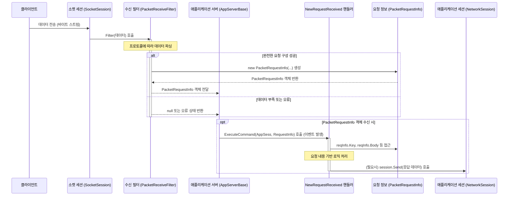

# Chapter 4: 요청 정보 (IRequestInfo)


이전 [제 3장: 수신 필터 (IReceiveFilter / ReceiveFilterBase)](03_수신_필터__ireceivefilter___receivefilterbase__.md)에서는 클라이언트로부터 들어오는 연속적인 바이트 데이터를 어떻게 의미 있는 단위로 해석하는지 배웠습니다. 수신 필터는 마치 우편물을 분류하는 집배원처럼, 뒤죽박죽 섞인 데이터 스트림에서 완전한 메시지(패킷)를 찾아내는 역할을 했죠.

이번 장에서는 수신 필터가 성공적으로 메시지를 해석한 결과물, 즉 **요청 정보(IRequestInfo)** 에 대해 자세히 알아봅니다. 수신 필터가 열심히 분류한 우편물의 내용물이 바로 이 요청 정보라고 할 수 있습니다. 서버 애플리케이션은 이 정보를 보고 클라이언트가 무엇을 원하는지 파악하고 처리하게 됩니다.

## 왜 요청 정보가 필요할까요?

수신 필터가 바이트 데이터를 성공적으로 파싱했다고 해도, 서버 애플리케이션 입장에서는 여전히 "그래서 클라이언트가 뭘 하려는 거지?" 라는 질문이 남습니다. 파싱된 데이터는 보통 여러 부분으로 구성됩니다. 예를 들어, 채팅 메시지 전송 요청이라면 '어떤 종류의 요청인지(채팅 전송)'와 '실제 채팅 내용'이 분리되어야 합니다.

**요청 정보(IRequestInfo)**는 바로 이 문제를 해결합니다. 마치 식당에서 고객이 작성한 주문서와 같습니다. 주문서에는 어떤 메뉴("요청의 종류", 예: "CHAT")를 원하는지, 그리고 특별한 요청사항("요청 내용", 예: "안녕하세요!")이 명확하게 적혀있죠. 서버는 이 `IRequestInfo` 객체를 받아서 클라이언트의 요청 내용을 체계적으로 이해하고, 어떤 작업을 수행해야 할지 결정할 수 있습니다.

개발자는 통신 프로토콜에 맞춰 이 `IRequestInfo` 인터페이스를 구현하는 클래스를 만듭니다. 이 클래스 안에는 요청을 구분하는 정보(예: 키 또는 패킷 ID)와 실제 데이터(본문) 등이 구조화되어 담기게 됩니다.

## 핵심 개념: IRequestInfo의 구성 요소

SuperSocketLite에서 요청 정보는 주로 `IRequestInfo` 인터페이스와 이를 구현한 클래스들을 통해 다루어집니다.

1.  **`IRequestInfo` 인터페이스:**
    *   모든 요청 정보 객체가 따라야 하는 가장 기본적인 약속(규약)입니다.
    *   가장 중요한 멤버는 `Key` 속성입니다. 이 `Key`는 문자열 형태로, 해당 요청이 어떤 종류의 요청인지를 식별하는 데 사용됩니다. 마치 주문서 상단의 "메뉴 이름"과 같습니다. 서버는 이 `Key` 값을 보고 요청을 처리할 적절한 로직(핸들러)으로 연결할 수 있습니다. (예: `Key`가 "LOGIN"이면 로그인 처리 로직 실행)

    ```csharp
    // SuperSocketLite\SocketBase\Protocol\IRequestInfo.cs (일부)
    namespace SuperSocketLite.SocketBase.Protocol
    {
        /// <summary>
        /// 요청 정보 인터페이스
        /// </summary>
        public interface IRequestInfo
        {
            /// <summary>
            /// 이 요청의 키를 가져옵니다.
            /// </summary>
            string Key { get; }
        }
    }
    ```
    *   모든 요청 정보는 최소한 `Key` 속성을 가져야 함을 명시합니다.

2.  **`IRequestInfo<TRequestBody>` 인터페이스:**
    *   `IRequestInfo`를 확장하여 요청의 본문(Body) 데이터를 담을 수 있도록 합니다.
    *   `Body` 속성을 추가로 정의합니다. `TRequestBody`는 제네릭 타입 매개변수로, 본문 데이터의 타입을 지정합니다. 예를 들어, 텍스트 기반 프로토콜이면 `string`이 될 수 있고, 바이너리 프로토콜이면 `byte[]` 배열이 될 수 있습니다. 마치 주문서의 "특별 요청사항" 란과 같습니다.

    ```csharp
    // SuperSocketLite\SocketBase\Protocol\IRequestInfo.cs (일부)
    namespace SuperSocketLite.SocketBase.Protocol
    {
        // ... IRequestInfo 인터페이스 정의 ...

        /// <summary>
        /// 요청 본문을 가지는 요청 정보 인터페이스
        /// </summary>
        /// <typeparam name="TRequestBody">요청 본문의 타입</typeparam>
        public interface IRequestInfo<TRequestBody> : IRequestInfo
        {
            /// <summary>
            /// 이 요청의 본문을 가져옵니다.
            /// </summary>
            TRequestBody Body { get; }
        }
    }
    ```
    *   `Key` 속성 외에 `Body` 속성도 가져야 함을 명시합니다. `Body`의 타입은 `TRequestBody`로 지정됩니다.

3.  **`RequestInfo<TRequestBody>` 클래스:**
    *   `IRequestInfo<TRequestBody>` 인터페이스를 구현하는 편리한 기본 클래스입니다.
    *   `Key`와 `Body` 속성을 실제로 구현해 놓았기 때문에, 개발자는 이 클래스를 상속받아 자신만의 요청 정보 클래스를 더 쉽게 만들 수 있습니다.

    ```csharp
    // SuperSocketLite\SocketBase\Protocol\RequestInfo.cs (일부)
    namespace SuperSocketLite.SocketBase.Protocol
    {
        /// <summary>
        /// RequestInfo 기본 클래스
        /// </summary>
        /// <typeparam name="TRequestBody">요청 본문의 타입</typeparam>
        public class RequestInfo<TRequestBody> : IRequestInfo<TRequestBody>
        {
            // 생성자 등...

            /// <summary>
            /// 이 요청의 키를 가져옵니다.
            /// </summary>
            public string Key { get; private set; }

            /// <summary>
            /// 본문을 가져옵니다.
            /// </summary>
            public TRequestBody Body { get; private set; }

            // 초기화 메서드 등...
            protected void Initialize(string key, TRequestBody body)
            {
                Key = key;
                Body = body;
            }
        }
    }
    ```
    *   `Key`와 `Body`를 실제로 가지고 있으며, 생성자나 `Initialize` 메서드를 통해 값을 설정합니다.

4.  **`BinaryRequestInfo` 클래스:**
    *   `RequestInfo<byte[]>`를 상속받는 구체적인 클래스입니다. 즉, 요청 본문(`Body`)이 `byte[]` 타입인 요청 정보를 나타냅니다.
    *   바이너리 기반 프로토콜(이미지 전송, 게임 데이터 교환 등)에서 매우 유용하게 사용됩니다. 본문 데이터를 별도의 변환 없이 원시 바이트 배열 그대로 다룰 수 있습니다.

    ```csharp
    // SuperSocketLite\SocketBase\Protocol\BinaryRequestInfo.cs
    namespace SuperSocketLite.SocketBase.Protocol
    {
        /// <summary>
        /// 바이너리 타입 요청 정보
        /// </summary>
        public class BinaryRequestInfo : RequestInfo<byte[]>
        {
            /// <summary>
            /// BinaryRequestInfo 클래스의 새 인스턴스를 초기화합니다.
            /// </summary>
            /// <param name="key">키.</param>
            /// <param name="body">본문 (바이트 배열).</param>
            public BinaryRequestInfo(string key, byte[] body)
                : base(key, body) // 부모 클래스의 생성자 호출
            {

            }
        }
    }
    ```
    *   생성자에서 `key`와 `byte[]` 타입의 `body`를 받습니다.

5.  **`StringRequestInfo` 클래스:**
    *   `RequestInfo<string>`를 상속받는 구체적인 클래스입니다. 즉, 요청 본문(`Body`)이 `string` 타입인 요청 정보를 나타냅니다.
    *   텍스트 기반 프로토콜(명령어 기반 서버, 간단한 채팅 등)에 주로 사용됩니다.
    *   일반적으로 `Key`(명령어), `Body`(원본 문자열), 그리고 `Parameters`(명령어 뒤에 오는 인자들을 파싱한 문자열 배열)를 가집니다.

    ```csharp
    // SuperSocketLite\SocketBase\Protocol\StringRequestInfo.cs (일부)
    namespace SuperSocketLite.SocketBase.Protocol
    {
        /// <summary>
        /// 문자열 타입 요청 정보
        /// </summary>
        public class StringRequestInfo : RequestInfo<string>
        {
            /// <summary>
            /// StringRequestInfo 클래스의 새 인스턴스를 초기화합니다.
            /// </summary>
            /// <param name="key">키 (명령어).</param>
            /// <param name="body">본문 (원본 문자열).</param>
            /// <param name="parameters">파라미터 배열.</param>
            public StringRequestInfo(string key, string body, string[] parameters)
                : base(key, body)
            {
                Parameters = parameters;
            }

            /// <summary>
            /// 파라미터들을 가져옵니다.
            /// </summary>
            public string[] Parameters { get; private set; }

            // 파라미터 관련 헬퍼 메서드들...
        }
    }
    ```
    *   `Key`, `Body` 외에 명령어 인자들을 담는 `Parameters` 배열을 추가로 가집니다.

6.  **사용자 정의 `IRequestInfo` 구현:**
    *   가장 흔한 방식은 우리가 사용하는 통신 프로토콜의 구조에 딱 맞게 `IRequestInfo`를 구현한 클래스를 직접 만드는 것입니다.
    *   보통 `RequestInfo`나 `BinaryRequestInfo` 같은 기본 클래스를 상속받아 필요한 속성(예: 패킷 ID, 헤더 정보 등)을 추가합니다.
    *   우리가 이전 장들에서 사용했던 `PacketRequestInfo`가 바로 좋은 예시입니다.

## 요청 정보 사용하기: 에코 서버 예제 복습

이전 장들에서 사용했던 `PacketRequestInfo` 클래스를 다시 살펴보며 `IRequestInfo`가 실제로 어떻게 사용되는지 보겠습니다.

**1단계: 사용자 정의 요청 정보 클래스 (PacketRequestInfo)**

우리의 에코 서버는 5바이트 헤더(전체 길이, 패킷 ID, 예약 값)와 가변 길이 본문을 가지는 프로토콜을 사용했습니다. 이를 반영한 `PacketRequestInfo` 클래스는 다음과 같습니다. (3장의 코드를 다시 가져옵니다.)

```csharp
// 네임스페이스 및 using 문은 생략
using SuperSocketLite.Common; // BinaryRequestInfo 사용을 위해 추가
using SuperSocketLite.SocketBase.Protocol; // IRequestInfo 사용을 위해 추가
using System; // BitConverter, Array 사용

// BinaryRequestInfo를 상속받아 byte[] 본문을 가지도록 함
public class PacketRequestInfo : BinaryRequestInfo
{
    // IRequestInfo의 Key 속성 구현: 패킷 ID를 문자열로 사용
    public new string Key => PacketID.ToString(); // 'new' 키워드로 부모의 Key 숨김

    // 프로토콜 헤더 정보
    public short TotalSize { get; private set; }
    public short PacketID { get; private set; }
    public byte Reserved { get; private set; }
    // Body는 부모 BinaryRequestInfo에 byte[] 타입으로 이미 존재함

    // 헤더 크기 상수
    public const int HeaderSize = 5;

    // 생성자: 수신 필터에서 파싱된 정보를 받아 객체 초기화
    public PacketRequestInfo(short totalSize, short packetID, byte reserved, byte[] body)
        : base(packetID.ToString(), body) // 부모 생성자 호출 (Key, Body 전달)
    {
        TotalSize = totalSize;
        PacketID = packetID;
        Reserved = reserved;
    }
}
```

*   `BinaryRequestInfo`를 상속받아 `Body`를 `byte[]` 타입으로 사용합니다.
*   `IRequestInfo`의 `Key` 속성을 `PacketID`를 문자열로 변환하여 구현했습니다. 이렇게 하면 요청 종류를 패킷 ID로 쉽게 식별할 수 있습니다. (`new` 키워드는 부모 클래스의 `Key` 속성을 의도적으로 숨기고 새로 정의한다는 의미입니다.)
*   프로토콜에 필요한 `TotalSize`, `PacketID`, `Reserved` 속성을 추가했습니다.
*   생성자는 [수신 필터 (IReceiveFilter / ReceiveFilterBase)](03_수신_필터__ireceivefilter___receivefilterbase__.md)가 파싱한 헤더 정보와 본문 데이터를 받아 객체를 초기화합니다.

**2단계: AppServer에서 요청 정보 사용하기**

[애플리케이션 서버 (AppServer/AppServerBase)](01_애플리케이션_서버__appserver_appserverbase__.md)의 `NewRequestReceived` 이벤트 핸들러는 수신 필터가 성공적으로 생성한 `PacketRequestInfo` 객체를 전달받습니다. 이 핸들러 안에서 이 객체의 속성들을 사용하여 실제 로직을 처리합니다.

```csharp
// GameServer_01/MainServer.cs (RequestReceived 핸들러 부분)
using SuperSocketLite.SocketBase; // AppServer, AppSession 등 사용
using SuperSocketLite.SocketBase.Protocol; // IRequestInfo, CloseReason 등 사용
using System; // Console 사용

class MainServer : AppServer<NetworkSession, PacketRequestInfo>
{
    // ... (생성자, 다른 핸들러 등) ...

    // 클라이언트로부터 완전한 요청을 받았을 때 실행될 함수
    private void RequestReceived(NetworkSession session, PacketRequestInfo reqInfo)
    {
        // 전달받은 reqInfo 객체를 사용합니다.
        Console.WriteLine($"세션 [{session.SessionID}] 로부터 요청 수신:");
        Console.WriteLine($"  - Key (PacketID): {reqInfo.Key}"); // 요청 종류 식별
        Console.WriteLine($"  - TotalSize: {reqInfo.TotalSize}");
        Console.WriteLine($"  - Body 길이: {reqInfo.Body.Length} 바이트");

        // 요청 종류(Key 또는 PacketID)에 따라 분기 처리 가능
        // 예를 들어, 패킷 ID가 101이면 로그인 처리, 201이면 메시지 전송 처리 등
        switch (reqInfo.PacketID)
        {
            case 1: // 에코 요청이라고 가정
                Console.WriteLine("  - 에코 요청 처리 중...");
                // 받은 본문(Body) 데이터를 그대로 클라이언트에게 다시 보냅니다.
                session.Send(reqInfo.Body);
                Console.WriteLine($"세션 [{session.SessionID}] 에게 에코 응답 전송 완료.");
                break;

            case 2: // 가상의 종료 요청이라고 가정
                Console.WriteLine("  - 종료 요청 수신. 연결을 닫습니다.");
                session.Close(CloseReason.ServerShutdown); // 클라이언트 연결 종료
                break;

            default:
                Console.WriteLine("  - 알 수 없는 요청(PacketID) 입니다.");
                // 필요하다면 오류 응답 전송
                break;
        }
    }
}
```

*   `RequestReceived` 핸들러는 두 개의 파라미터, 즉 요청을 보낸 클라이언트를 나타내는 `NetworkSession` 객체와 요청 내용을 담은 `PacketRequestInfo` 객체를 받습니다.
*   핸들러 내부에서는 `reqInfo.Key` (또는 여기서는 `reqInfo.PacketID`) 값을 확인하여 어떤 종류의 요청인지 판단하고, 그에 맞는 로직을 수행합니다.
*   `reqInfo.Body`를 통해 요청의 실제 내용(데이터)에 접근하여 처리하거나 응답을 생성하는 데 사용합니다.

이처럼 `IRequestInfo`는 수신 필터가 해석한 데이터를 서버 애플리케이션 로직에 전달하는 표준화된 "주문서" 역할을 하여, 코드를 명확하고 구조적으로 만듭니다.

## 요청 정보(IRequestInfo)의 여정

`IRequestInfo` 객체가 어떻게 생성되고 사용되는지 전체적인 흐름을 살펴보겠습니다.



1.  클라이언트가 서버로 데이터를 보냅니다.
2.  [소켓 세션 (ISocketSession / SocketSession)](06_소켓_세션__isocketsession___socketsession__.md)이 이 데이터를 받습니다.
3.  데이터는 해당 세션에 연결된 [수신 필터 (IReceiveFilter / ReceiveFilterBase)](03_수신_필터__ireceivefilter___receivefilterbase__.md) (우리의 `PacketReceiveFilter`)로 전달됩니다.
4.  수신 필터는 정의된 프로토콜(5바이트 헤더 등)에 따라 데이터를 해석합니다.
5.  만약 데이터가 충분히 모여 완전한 요청 하나를 구성할 수 있다면, 수신 필터는 **`PacketRequestInfo` 객체를 생성**합니다. 이때 파싱한 헤더 정보와 본문 데이터를 생성자에 전달합니다.
6.  생성된 `PacketRequestInfo` 객체는 수신 필터에서 [애플리케이션 서버 (AppServer/AppServerBase)](01_애플리케이션_서버__appserver_appserverbase__.md)로 반환됩니다.
7.  `AppServerBase`는 이 `PacketRequestInfo` 객체와 해당 요청이 들어온 [애플리케이션 세션 (AppSession)](02_애플리케이션_세션__appsession__.md) (`NetworkSession`)을 함께 `NewRequestReceived` 이벤트 핸들러(우리가 정의한 `RequestReceived` 메서드)로 전달합니다.
8.  `RequestReceived` 핸들러는 전달받은 `PacketRequestInfo` 객체의 `Key`, `Body` 등을 사용하여 클라이언트의 요청을 처리합니다.

**코드 레벨에서 살펴보기 (참고용)**

SuperSocketLite 라이브러리 내의 관련 코드를 보면 `IRequestInfo`의 역할과 구현을 더 잘 이해할 수 있습니다.

*   **`SuperSocketLite\SocketBase\Protocol\IRequestInfo.cs`:** `IRequestInfo`, `IRequestInfo<TRequestBody>`, `IRequestInfo<TRequestHeader, TRequestBody>` 인터페이스 정의를 볼 수 있습니다. 기본적인 `Key` 속성부터 시작하여 `Body`, `Header` 속성을 추가하는 확장 구조를 확인할 수 있습니다.
*   **`SuperSocketLite\SocketBase\Protocol\RequestInfo.cs`:** `RequestInfo<TRequestBody>` 및 `RequestInfo<TRequestHeader, TRequestBody>` 기본 클래스의 구현을 볼 수 있습니다. `Initialize` 메서드를 통해 `Key`, `Body`, `Header` 속성을 설정하는 로직이 있습니다.
*   **`SuperSocketLite\SocketBase\Protocol\BinaryRequestInfo.cs`:** `RequestInfo<byte[]>`를 상속하여 `Body`가 `byte[]`인 경우를 간단히 구현한 예시입니다.
*   **`SuperSocketLite\SocketBase\Protocol\StringRequestInfo.cs`:** `RequestInfo<string>`를 상속하고 `Parameters` 배열을 추가하여 텍스트 기반 명령어를 처리하기 쉽게 만든 예시입니다.
*   **`SuperSocketLite\SocketBase\AppServerBase.cs`:** `ExecuteCommand` 메서드를 찾아보면, 수신 필터로부터 `requestInfo`를 받아 `NewRequestReceived` 이벤트 핸들러(`m_RequestHandler`)를 호출하는 부분을 확인할 수 있습니다. 이 과정에서 `requestInfo` 객체가 애플리케이션 로직으로 전달됩니다.

## 결론

이번 장에서는 수신 필터가 해석한 클라이언트 요청의 내용을 담는 표준화된 구조인 **요청 정보(IRequestInfo)** 에 대해 배웠습니다.

*   `IRequestInfo`는 서버가 클라이언트의 요청을 이해하기 위한 "주문서"와 같습니다.
*   모든 요청 정보는 최소한 요청의 종류를 식별하는 `Key` 속성을 가져야 합니다 (`IRequestInfo` 인터페이스).
*   요청의 실제 내용을 담는 `Body` 속성을 포함할 수 있습니다 (`IRequestInfo<TRequestBody>` 인터페이스).
*   `RequestInfo<TRequestBody>`, `BinaryRequestInfo`, `StringRequestInfo` 등 기본 구현 클래스를 활용하거나, 직접 `IRequestInfo`를 구현하여 프로토콜에 맞는 사용자 정의 요청 정보 클래스를 만들 수 있습니다.
*   수신 필터는 파싱된 데이터를 사용하여 `IRequestInfo` 객체를 생성합니다.
*   `AppServer`는 생성된 `IRequestInfo` 객체를 `NewRequestReceived` 이벤트 핸들러로 전달하여, 애플리케이션 로직에서 요청 내용을 사용하고 처리할 수 있도록 합니다.

`IRequestInfo`는 SuperSocketLite에서 데이터 수신 파이프라인의 마지막 단계와 애플리케이션 로직 시작 지점을 연결하는 중요한 다리 역할을 합니다. 이를 통해 복잡한 네트워크 프로토콜 처리와 실제 비즈니스 로직을 깔끔하게 분리할 수 있습니다.

지금까지 우리는 서버의 전체 구조(`AppServer`), 개별 클라이언트 연결(`AppSession`), 데이터 해석 규칙(`ReceiveFilter`), 그리고 해석된 요청 내용(`RequestInfo`)에 대해 알아보았습니다. 다음 장에서는 이 모든 것의 기반이 되는, 실제 네트워크 연결을 관리하고 데이터를 주고받는 더 낮은 수준의 구성 요소인 **[제 5장: 소켓 서버 (ISocketServer / SocketServerBase)](05_소켓_서버__isocketserver___socketserverbase__.md)** 에 대해 자세히 살펴보겠습니다. 서버가 어떻게 네트워크 하단에서 동작하는지 그 내부를 들여다볼 차례입니다!

---

Generated by [AI Codebase Knowledge Builder](https://github.com/The-Pocket/Tutorial-Codebase-Knowledge)