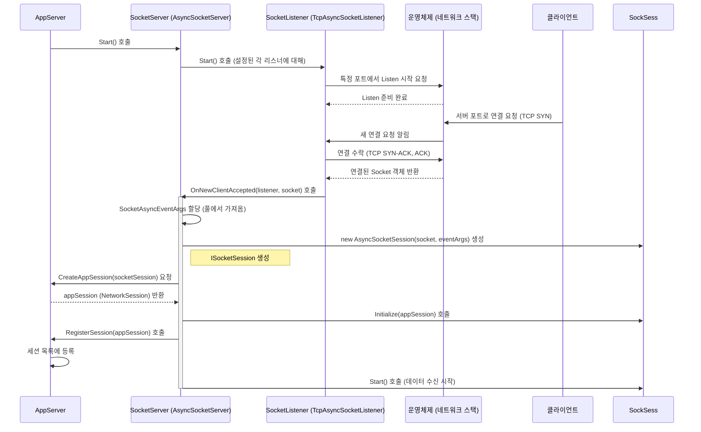

# Chapter 5: 소켓 서버 (ISocketServer / SocketServerBase)


이전 [제 4장: 요청 정보 (IRequestInfo)](04_요청_정보__irequestinfo__.md)에서는 수신 필터가 해석한 클라이언트의 요청 내용을 담는 `IRequestInfo` 객체에 대해 알아보았습니다. 잘 분류된 우편물의 내용물처럼, `IRequestInfo`는 서버 애플리케이션이 클라이언트의 의도를 파악하는 데 사용되었죠.

이번 장에서는 SuperSocketLite 구조의 더 깊은 곳으로 내려가 보겠습니다. 바로 실제 네트워크 연결을 수신하고 관리하는 핵심 엔진, **소켓 서버(Socket Server)** 입니다. `ISocketServer` 인터페이스와 `SocketServerBase` 추상 클래스를 통해 이 개념을 이해해 볼 것입니다.

## 왜 소켓 서버가 필요할까요?

우리가 지금까지 다룬 [애플리케이션 서버 (AppServer/AppServerBase)](01_애플리케이션_서버__appserver_appserverbase__.md), [애플리케이션 세션 (AppSession)](02_애플리케이션_세션__appsession__.md), [수신 필터 (IReceiveFilter / ReceiveFilterBase)](03_수신_필터__ireceivefilter___receivefilterbase__.md), [요청 정보 (IRequestInfo)](04_요청_정보__irequestinfo__.md) 등은 모두 애플리케이션 레벨의 추상화입니다. 즉, 실제 네트워크 통신의 복잡한 세부 사항을 감추고 우리가 비즈니스 로직에 집중할 수 있도록 도와주는 도구들이죠.

하지만 누군가는 실제로 네트워크 카드를 통해 데이터를 주고받고, 특정 포트에서 연결 요청을 기다리고, 새로운 클라이언트 연결을 수락하는 등 궂은일을 해야 합니다. **소켓 서버(`SocketServer`)**가 바로 이 역할을 담당하는 저수준(low-level) 네트워킹 엔진입니다.

마치 건물의 중앙 보안 시스템과 같습니다. 보안 시스템은 외부 출입문을 감시하고(포트 리스닝), 방문객이 도착하면(연결 요청) 기본적인 출입 절차를 처리하여(소켓 연결 수락) 내부로 안내할 준비를 합니다. `AppServer`는 이 보안 시스템(`SocketServer`)을 통해 외부 세계와 안전하고 효율적으로 통신할 수 있습니다.

개발자가 `SocketServer`를 직접 제어하거나 수정할 일은 거의 없습니다. 대부분의 설정은 `AppServer`를 통해 이루어지며, `AppServer`가 내부적으로 적절한 `SocketServer`를 생성하고 관리합니다. 하지만 서버가 어떤 방식으로 통신하는지(TCP/UDP, 동기/비동기) 이해하고, 문제 발생 시 원인을 파악하려면 `SocketServer`의 존재와 역할을 아는 것이 중요합니다.

## 핵심 개념: 소켓 서버의 구성 요소

`SocketServer`는 주로 다음 요소들로 구성됩니다.

1.  **`ISocketServer` (인터페이스):**
    *   모든 소켓 서버 구현체가 따라야 하는 기본 규약(contract)입니다.
    *   `Start()` (서버 시작), `Stop()` (서버 중지), `ResetSessionSecurity()` (세션 보안 설정 변경), `IsRunning` (실행 상태 확인), `SendingQueuePool` (데이터 발송 큐 관리) 등의 핵심 기능을 정의합니다.
    *   이 인터페이스는 어떤 종류의 소켓 서버든(TCP, UDP 등) 일관된 방식으로 제어할 수 있도록 해줍니다.

    ```csharp
    // SuperSocketLite\SocketBase\ISocketServer.cs (일부)
    namespace SuperSocketLite.SocketBase
    {
        public interface ISocketServer
        {
            // 서버를 시작합니다.
            bool Start();

            // 세션의 보안 프로토콜을 재설정합니다.
            void ResetSessionSecurity(IAppSession session, SslProtocols security);

            // 서버가 실행 중인지 여부를 가져옵니다.
            bool IsRunning { get; }

            // 전송 큐 풀 정보를 가져옵니다. (8장에서 설명)
            IPoolInfo SendingQueuePool { get; }

            // 서버를 중지합니다.
            void Stop();
        }
    }
    ```
    *   `ISocketServer`는 소켓 서버가 수행해야 할 기본적인 동작들을 명시합니다.

2.  **`SocketServerBase` (추상 클래스):**
    *   `ISocketServer` 인터페이스를 구현하며, 여러 소켓 서버 구현체에서 공통적으로 사용되는 기능들을 미리 구현해 놓은 기반 클래스입니다.
    *   리스너 관리(Listeners), 서버 설정(`AppServer.Config`) 접근, 시작/중지 로직의 기본 골격, [전송 큐 (SendingQueue)](08_전송_큐__sendingqueue__.md) 풀 초기화 등의 기능을 제공합니다.
    *   새로운 클라이언트 연결을 처리하는 `OnNewClientAccepted`나 리스너를 생성하는 `CreateListener`와 같은 추상 메서드를 포함하고 있어, 구체적인 소켓 서버 구현체(TCP, UDP 등)는 이 부분들을 자신에게 맞게 구현해야 합니다.

    ```csharp
    // SuperSocketLite\SocketEngine\SocketServerBase.cs (일부)
    namespace SuperSocketLite.SocketEngine
    {
        abstract class SocketServerBase : ISocketServer, IDisposable
        {
            public IAppServer AppServer { get; private set; }
            public bool IsRunning { get; protected set; }
            protected ListenerInfo[] ListenerInfos { get; private set; }
            protected List<ISocketListener> Listeners { get; private set; }
            // ... (다른 멤버 변수 및 생성자) ...

            public virtual bool Start()
            {
                // ... (전송 큐 풀 초기화 등) ...
                for (var i = 0; i < ListenerInfos.Length; i++)
                {
                    var listener = CreateListener(ListenerInfos[i]); // 자식 클래스에서 구현
                    // ... (이벤트 핸들러 등록 및 리스너 시작) ...
                    Listeners.Add(listener);
                }
                IsRunning = true;
                return true;
            }

            // 새 클라이언트 연결 처리 (자식 클래스에서 구현)
            protected abstract void OnNewClientAccepted(ISocketListener listener, Socket client, object state);

            // 리스너 생성 (자식 클래스에서 구현)
            protected abstract ISocketListener CreateListener(ListenerInfo listenerInfo);

            public virtual void Stop() { /* ... 리스너 중지 및 정리 ... */ }

            // ... (Dispose 등) ...
        }
    }
    ```
    *   `SocketServerBase`는 기본적인 구조와 공통 기능을 제공하여, 실제 TCP/UDP 서버 구현을 더 쉽게 만듭니다.

3.  **구체적인 구현체들 (Concrete Implementations):**
    *   SuperSocketLite는 `SocketServerBase`를 상속받아 실제 네트워킹 로직을 구현한 클래스들을 제공합니다.
        *   **`AsyncSocketServer` (TCP):** `System.Net.Sockets.SocketAsyncEventArgs`를 사용하여 고성능 비동기 TCP 통신을 처리하는 구현체입니다. 대부분의 TCP 기반 SuperSocketLite 서버는 내부적으로 이 클래스를 사용합니다.
        *   **`UdpSocketServer<TRequestInfo>` (UDP):** UDP 통신을 처리하는 구현체입니다. UDP는 비연결형 프로토콜이므로 TCP와는 다른 방식으로 세션과 데이터를 관리합니다.
    *   `AppServer`는 설정 파일(`IServerConfig`)의 `Mode` 속성(Tcp 또는 Udp)에 따라 적절한 `SocketServer` 구현체를 선택하여 사용합니다.

## 소켓 서버 사용하기 (AppServer를 통해)

앞서 언급했듯이, 개발자는 보통 `SocketServer`를 직접 다루지 않습니다. 대신 [애플리케이션 서버 (AppServer/AppServerBase)](01_애플리케이션_서버__appserver_appserverbase__.md)가 이 모든 것을 관리합니다. `AppServer`가 `SocketServer`를 어떻게 사용하는지 살펴보면 그 역할을 더 명확히 이해할 수 있습니다.

**1단계: AppServer 설정 (`Setup`)**

`AppServer`의 `Setup` 메서드가 호출될 때, 내부적으로 `ISocketServerFactory`를 사용하여 설정(`IServerConfig`)에 맞는 `ISocketServer` 인스턴스를 생성합니다.

```csharp
// Program.cs (1장에서 사용했던 예제 일부)
class Program
{
    static void Main(string[] args)
    {
        var server = new MainServer();
        server.InitConfig(port: 2020, maxConnections: 100, name: "MyEchoServer");

        // Setup 메서드 호출 시 내부적으로 SocketServer가 생성됩니다.
        // server.Config (IServerConfig)의 정보 (특히 Mode)를 기반으로 결정됩니다.
        if (!server.Setup(new RootConfig(), server.Config, logFactory: new ConsoleLogFactory()))
        {
            Console.WriteLine("[오류] 서버 설정(Setup) 실패!");
            return;
        }
        // ... 서버 시작 로직 ...
    }
}

// AppServerBase.Setup 내부 (개념적 코드)
// 실제 코드는 더 복잡합니다.
public virtual bool Setup(IRootConfig rootConfig, IServerConfig config, ISocketServerFactory socketServerFactory, ...)
{
    // ... (다른 설정 작업) ...

    // 설정(config.Mode)에 따라 적절한 SocketServerFactory를 사용하거나 기본 팩토리를 사용합니다.
    // 기본 SocketServerFactory는 config.Mode에 따라 AsyncSocketServer 또는 UdpSocketServer를 생성합니다.
    if(socketServerFactory == null)
        socketServerFactory = new SocketServerFactory(); // 기본 팩토리 사용

    // SocketServerFactory를 사용하여 ISocketServer 인스턴스 생성
    // 이 SocketServer 인스턴스가 AppServer 내부에 저장됩니다.
    m_SocketServer = socketServerFactory.CreateSocketServer(this, config.Listeners, config);

    // ... (로그 설정 등) ...
    return true;
}
```

*   `AppServer.Setup` 과정에서 `IServerConfig`에 정의된 `Mode` (예: `SocketMode.Tcp`)와 `Listeners` 정보가 사용됩니다.
*   `SocketServerFactory` (기본 구현은 `SuperSocketLite.SocketEngine.SocketServerFactory`)는 이 설정을 보고 적절한 `ISocketServer` 구현체(예: `AsyncSocketServer`)를 생성하여 `AppServer` 내부에 저장합니다.

**2단계: AppServer 시작 (`Start`)**

`AppServer.Start` 메서드가 호출되면, `AppServer`는 내부적으로 가지고 있는 `ISocketServer` 인스턴스의 `Start` 메서드를 호출합니다.

```csharp
// Program.cs (1장에서 사용했던 예제 일부)
class Program
{
    static void Main(string[] args)
    {
        // ... (서버 객체 생성 및 Setup) ...

        // 서버 시작 (Start)
        // 이 메서드는 내부적으로 SocketServer.Start()를 호출합니다.
        if (!server.Start())
        {
            Console.WriteLine("[오류] 서버 시작(Start) 실패!");
            return;
        }
        Console.WriteLine("서버 시작(Start) 성공.");
        // ...
    }
}

// AppServerBase.Start 내부 (개념적 코드)
public virtual bool Start()
{
    // ... (시작 전 상태 확인 등) ...

    if (m_SocketServer == null)
    {
        Logger.Error("소켓 서버가 초기화되지 않았습니다!");
        return false;
    }

    // 내부 SocketServer의 Start 메서드 호출
    if (!m_SocketServer.Start())
    {
        Logger.Error("소켓 서버 시작 실패!");
        return false;
    }

    // ... (서버 상태 업데이트 및 로그 기록) ...
    m_State = ServerState.Running;
    return true;
}
```

*   `AppServer.Start()`는 단순히 준비된 `ISocketServer`에게 "이제 일을 시작하라"고 명령하는 것과 같습니다.
*   `ISocketServer.Start()`가 호출되면, 해당 `SocketServer`는 설정된 리스너들을 시작하여 실제 클라이언트 연결 요청을 받기 시작합니다.

이처럼 `AppServer`는 `SocketServer`를 직접 생성하고 관리하며, 개발자는 `AppServer`의 `Setup`과 `Start` 메서드를 통해 간접적으로 `SocketServer`를 제어하게 됩니다.

## 소켓 서버 내부 동작 들여다보기

`SocketServer`가 실제로 어떻게 클라이언트 연결을 처리하는지 좀 더 자세히 살펴보겠습니다. (주로 TCP `AsyncSocketServer` 기준)

**연결 수립 과정:**



1.  `AppServer.Start()`가 `SocketServer.Start()`를 호출합니다.
2.  `SocketServer`는 설정된 각 [소켓 리스너 (ISocketListener / SocketListenerBase)](07_소켓_리스너__isocketlistener___socketlistenerbase__.md) (예: `TcpAsyncSocketListener`)의 `Start()`를 호출합니다.
3.  리스너는 운영체제에게 특정 IP와 포트에서 들어오는 연결을 감시하도록 요청합니다.
4.  클라이언트가 해당 포트로 연결을 시도하면, 운영체제는 TCP 핸드셰이크를 거쳐 연결을 수립하고, 리스너에게 연결된 `System.Net.Sockets.Socket` 객체를 전달합니다.
5.  리스너는 이 `Socket` 객체를 `SocketServer`의 `OnNewClientAccepted` 메서드로 전달합니다.
6.  `AsyncSocketServer`의 `OnNewClientAccepted` 메서드는:
    *   성능 향상을 위해 미리 준비된 `SocketAsyncEventArgs` 객체를 풀에서 가져옵니다.
    *   가져온 `Socket`과 `SocketAsyncEventArgs`를 사용하여 [소켓 세션 (ISocketSession / SocketSession)](06_소켓_세션__isocketsession___socketsession__.md) 객체(예: `AsyncSocketSession`)를 생성합니다. 이것은 실제 소켓 통신을 담당하는 저수준 래퍼(wrapper)입니다.
    *   `AppServer.CreateAppSession(socketSession)`을 호출하여 이 저수준 세션에 대응하는 고수준 [애플리케이션 세션 (AppSession)](02_애플리케이션_세션__appsession__.md) (우리의 `NetworkSession`)을 생성합니다.
    *   `AppServer.RegisterSession(appSession)`을 호출하여 생성된 `AppSession`을 관리 목록에 등록합니다.
    *   마지막으로 `socketSession.Start()`를 호출하여 이 세션이 클라이언트로부터 데이터를 비동기적으로 수신하도록 시작합니다.

**코드 레벨에서 살펴보기 (참고용)**

*   **`SuperSocketLite\SocketEngine\SocketServerFactory.cs`:** `CreateSocketServer` 메서드를 보면 `config.Mode`에 따라 `AsyncSocketServer` 또는 `UdpSocketServer`를 생성하는 로직을 확인할 수 있습니다.

    ```csharp
    // SocketServerFactory.cs (일부)
    public ISocketServer CreateSocketServer<TRequestInfo>(IAppServer appServer, ListenerInfo[] listeners, IServerConfig config)
        where TRequestInfo : IRequestInfo
    {
        // ... (null 체크) ...
        switch(config.Mode)
        {
            case(SocketMode.Tcp): // TCP 모드인 경우
                return new AsyncSocketServer(appServer, listeners); // AsyncSocketServer 생성
            case(SocketMode.Udp): // UDP 모드인 경우
                return new UdpSocketServer<TRequestInfo>(appServer, listeners); // UdpSocketServer 생성
            default:
                throw new NotSupportedException("지원되지 않는 소켓 모드: " + config.Mode);
        }
    }
    ```

*   **`SuperSocketLite\SocketEngine\SocketServerBase.cs`:** `Start()` 메서드에서 `CreateListener`를 호출하여 리스너를 만들고 `Listeners.Add(listener)`로 관리 목록에 추가한 뒤, 리스너의 `Start()`를 호출하는 부분을 볼 수 있습니다. 또한 `listener.NewClientAccepted += OnNewClientAccepted;`를 통해 리스너에서 새 클라이언트 연결 이벤트가 발생하면 `OnNewClientAccepted` 추상 메서드가 호출되도록 연결합니다.

*   **`SuperSocketLite\AsyncSocketServer.cs`:** `OnNewClientAccepted` 메서드를 살펴보세요. `m_ReadWritePool.TryPop(out socketEventArgsProxy)`로 비동기 IO 작업을 위한 `SocketAsyncEventArgs`를 가져오고, `new AsyncSocketSession(client, socketEventArgsProxy)`로 [소켓 세션 (ISocketSession / SocketSession)](06_소켓_세션__isocketsession___socketsession__.md)을 생성합니다. 그런 다음 `CreateSession` (내부적으로 `AppServer.CreateAppSession` 호출)으로 [애플리케이션 세션 (AppSession)](02_애플리케이션_세션__appsession__.md)을 만들고 `RegisterSession`으로 등록한 후 `socketSession.Start()`를 호출하여 데이터 수신을 시작하는 흐름을 볼 수 있습니다.

    ```csharp
    // AsyncSocketServer.cs - OnNewClientAccepted (논리적 흐름)
    protected override void OnNewClientAccepted(ISocketListener listener, Socket client, object state)
    {
        // 1. 비동기 IO 객체 풀에서 가져오기
        if (!m_ReadWritePool.TryPop(out socketEventArgsProxy)) { /* 오류 처리 */ return; }

        // 2. 저수준 소켓 세션 생성 (TCP)
        ISocketSession socketSession = new AsyncSocketSession(client, socketEventArgsProxy);
        // (만약 TLS/SSL 사용 시 new AsyncStreamSocketSession(...) 사용)

        // 3. AppServer에게 AppSession 생성 요청
        var session = CreateSession(client, socketSession); // 내부적으로 AppServer.CreateAppSession 호출
        if (session == null) { /* 오류 처리, eventArgs 반납 */ return; }

        // 4. 소켓 세션 닫힘 이벤트 핸들러 등록 (eventArgs 반납 로직 포함)
        socketSession.Closed += SessionClosed;

        // 5. AppServer에 AppSession 등록
        if (RegisterSession(session)) // 내부적으로 AppServer.RegisterSession 호출
        {
            // 6. 소켓 세션 시작 (데이터 수신 시작)
            AppServer.AsyncRun(() => socketSession.Start());
        }
        else
        {
            socketSession.Close(CloseReason.InternalError); // 등록 실패 시 종료
        }
    }
    ```

*   **`SuperSocketLite\UdpSocketServer.cs`:** `OnNewClientAccepted` 메서드를 보면 TCP와는 다르게 동작합니다. UDP는 연결 개념이 없으므로, 데이터그램(`receivedData`)이 도착할 때마다 호출됩니다. 여기서는 데이터그램의 출처(`remoteEndPoint`)와 내용을 기반으로 세션을 찾거나 새로 생성(`CreateNewSession`)하고, `UdpRequestInfo` 사용 여부에 따라 패킷을 처리하는 로직이 들어 있습니다.

## 결론

이번 장에서는 SuperSocketLite의 가장 낮은 레벨에서 실제 네트워크 통신을 담당하는 **소켓 서버(Socket Server)** 에 대해 알아보았습니다.

*   `SocketServer`(`ISocketServer`, `SocketServerBase`, `AsyncSocketServer`, `UdpSocketServer`)는 저수준 네트워킹 엔진으로, 연결 수신 및 기본 소켓 관리를 담당합니다.
*   건물의 보안 시스템처럼, 외부와의 통신 채널을 설정하고 관리하는 기반 역할을 합니다.
*   개발자는 보통 `SocketServer`를 직접 다루지 않으며, [애플리케이션 서버 (AppServer/AppServerBase)](01_애플리케이션_서버__appserver_appserverbase__.md)가 설정을 통해 내부적으로 생성하고 관리합니다.
*   `AppServer.Setup()` 시 생성되고, `AppServer.Start()` 시 내부적으로 `SocketServer.Start()`가 호출되어 리스닝을 시작합니다.
*   새 클라이언트가 연결되면, `SocketServer`는 해당 연결을 위한 저수준 [소켓 세션 (ISocketSession / SocketSession)](06_소켓_세션__isocketsession___socketsession__.md)을 만들고, `AppServer`에게 해당 [애플리케이션 세션 (AppSession)](02_애플리케이션_세션__appsession__.md) 생성을 요청합니다.

비록 직접 코드를 작성할 일은 적지만, `SocketServer`의 존재와 역할을 이해하는 것은 SuperSocketLite 서버의 전체적인 동작 방식을 파악하고, 특히 통신 방식(TCP/UDP)과 관련된 설정을 이해하는 데 큰 도움이 됩니다.

다음 장에서는 `SocketServer`가 생성하고 관리하는, 실제 소켓 연결 하나하나를 나타내는 저수준 객체인 **[제 6장: 소켓 세션 (ISocketSession / SocketSession)](06_소켓_세션__isocketsession___socketsession__.md)** 에 대해 자세히 알아보겠습니다. `AppSession`이 사용자 레벨의 연결이라면, `SocketSession`은 그 아래에서 실제 데이터 송수신을 담당하는 실무자라고 할 수 있습니다.

---

Generated by [AI Codebase Knowledge Builder](https://github.com/The-Pocket/Tutorial-Codebase-Knowledge)