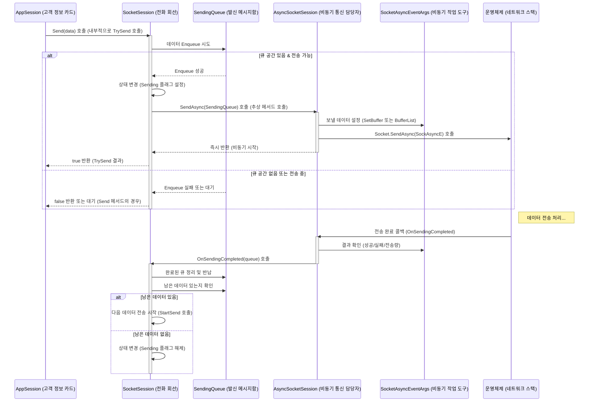
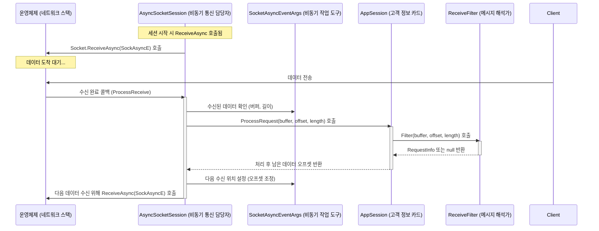

# Chapter 6: 소켓 세션 (ISocketSession / SocketSession)


이전 [제 5장: 소켓 서버 (ISocketServer / SocketServerBase)](05_소켓_서버__isocketserver___socketserverbase__.md)에서는 서버의 가장 낮은 레벨에서 네트워크 연결을 수락하고 관리하는 엔진인 `SocketServer`에 대해 알아보았습니다. `SocketServer`는 마치 건물의 중앙 관제 시스템처럼 전체적인 통신 기반을 담당했죠.

이번 장에서는 `SocketServer`가 실제 개별 클라이언트와의 통신을 위해 사용하는 **소켓 세션(Socket Session)** 에 대해 자세히 알아봅니다. `ISocketSession` 인터페이스와 `SocketSession` 추상 클래스를 중심으로, 이들이 어떻게 실제 데이터 송수신을 처리하는지 살펴보겠습니다.

## 왜 소켓 세션이 필요할까요?

[제 2장: 애플리케이션 세션 (AppSession)](02_애플리케이션_세션__appsession__.md)에서 우리는 `AppSession`이 각 클라이언트 연결을 애플리케이션 관점에서 나타내는 객체라고 배웠습니다. 마치 호텔의 '고객 정보 카드'처럼, 사용자별 상태나 데이터를 관리했죠.

하지만 실제 전화 통화는 '고객 정보 카드'가 직접 하는 것이 아니라, 각 방에 연결된 '전화 회선'이 담당합니다. **소켓 세션(`SocketSession`)**이 바로 이 '전화 회선'과 같은 역할을 합니다. `AppSession`이 애플리케이션 레벨의 추상화라면, `SocketSession`은 그 아래에서 **실제 네트워크 소켓을 감싸고(wrapping) 바이트 단위의 데이터 송수신, 소켓 연결 상태 관리, 비동기 작업 처리 등 저수준(low-level) 통신 작업**을 직접 수행하는 객체입니다.

`AppSession`은 "A 고객에게 '안녕하세요' 메시지를 보내줘"라고 지시하면, `SocketSession`은 이 메시지를 바이트 데이터로 변환하고 네트워크 상태를 확인하며, 운영체제의 비동기 기능을 사용하여 실제로 상대방에게 전송하는 복잡한 과정을 처리합니다. 마찬가지로 클라이언트로부터 바이트 데이터가 도착하면, `SocketSession`이 이를 수신하여 `AppSession`에게 전달하고, `AppSession`은 연결된 [수신 필터 (IReceiveFilter / ReceiveFilterBase)](03_수신_필터__ireceivefilter___receivefilterbase__.md)를 통해 의미 있는 데이터([요청 정보 (IRequestInfo)](04_요청_정보__irequestinfo__.md))로 해석합니다.

개발자가 직접 `SocketSession`을 사용할 일은 거의 없지만, `AppSession`의 요청이 내부적으로 어떻게 처리되는지, 비동기 통신이 어떻게 이루어지는지 이해하려면 `SocketSession`의 역할과 구조를 아는 것이 중요합니다.

## 핵심 개념: 소켓 세션의 구성 요소

`SocketSession`은 다음과 같은 주요 요소로 구성됩니다.

1.  **`ISocketSession` (인터페이스):**
    *   모든 저수준 소켓 세션 구현체가 따라야 하는 기본 규약(contract)입니다.
    *   `Initialize(IAppSession appSession)`: 이 소켓 세션과 연결될 `AppSession`을 설정합니다.
    *   `Start()`: 세션의 데이터 수신을 시작합니다.
    *   `Close(CloseReason reason)`: 세션 연결을 종료합니다.
    *   `TrySend(ArraySegment<byte> segment)` / `TrySend(IList<ArraySegment<byte>> segments)`: 데이터를 비동기적으로 전송 큐에 추가하고 전송을 시도합니다. 성공 여부를 즉시 반환합니다. (더 안전한 방법)
    *   `Client`: 내부적으로 관리하는 `System.Net.Sockets.Socket` 객체에 접근합니다.
    *   `LocalEndPoint`, `RemoteEndPoint`: 로컬 및 원격 IP 주소/포트 정보를 제공합니다.
    *   `Closed` 이벤트: 세션이 닫혔을 때 발생하는 이벤트입니다.

    ```csharp
    // SuperSocketLite\SocketBase\ISocketSession.cs (일부)
    public interface ISocketSession : ISessionBase
    {
        void Initialize(IAppSession appSession);
        void Start();
        void Close(CloseReason reason);
        bool TrySend(ArraySegment<byte> segment);
        bool TrySend(IList<ArraySegment<byte>> segments);
        Socket Client { get; }
        IPEndPoint LocalEndPoint { get; }
        IPEndPoint RemoteEndPoint { get; }
        Action<ISocketSession, CloseReason> Closed { get; set; }
        IAppSession AppSession { get; }
        // ... 기타 멤버 ...
    }
    ```
    *   `ISocketSession`은 저수준 통신 채널로서 필요한 핵심 동작과 정보를 정의합니다.

2.  **`SocketSession` (추상 클래스):**
    *   `ISocketSession` 인터페이스를 구현하며, 다양한 소켓 세션 구현체에 공통적인 기능을 제공하는 기반 클래스입니다.
    *   **상태 관리:** 세션의 현재 상태(예: 정상, 전송 중, 수신 중, 닫는 중, 닫힘)를 관리하는 로직(`m_State` 변수와 관련 메서드)을 포함합니다. 이를 통해 동시에 여러 작업(예: 보내는 중에 닫기 요청)이 발생했을 때 안전하게 처리할 수 있습니다.
    *   **전송 큐 관리:** 데이터를 보내기 전에 임시로 저장하는 [전송 큐 (SendingQueue)](08_전송_큐__sendingqueue__.md) (`m_SendingQueue`)를 관리하고, 데이터 전송 시작/완료 로직의 기본 골격을 제공합니다 (`StartSend`, `OnSendingCompleted`).
    *   **에러 처리 및 로깅:** 소켓 통신 중 발생하는 예외를 처리하고 로그를 남기는 기본적인 로직(`LogError` 등)을 포함합니다.
    *   `SendAsync`, `SendSync`, `Start` 등 일부 메서드는 추상(abstract) 메서드로 남겨두어, 구체적인 통신 방식(비동기 TCP, 스트림, UDP 등)에 따라 자식 클래스에서 구현하도록 합니다.

    ```csharp
    // SuperSocketLite\SocketSession.cs (일부 개념 코드)
    abstract partial class SocketSession : ISocketSession
    {
        public IAppSession AppSession { get; private set; }
        private int m_State = 0; // 세션 상태 플래그
        private SendingQueue m_SendingQueue; // 전송 큐
        private ISmartPool<SendingQueue> m_SendingQueuePool; // 전송 큐 풀 (8장에서 설명)
        public Socket Client { get; private set; } // 실제 소켓

        public virtual void Initialize(IAppSession appSession) { /* AppSession, Config 설정, 전송 큐 초기화 등 */ }
        public abstract void Start(); // 데이터 수신 시작 (구현 필요)
        protected abstract void SendAsync(SendingQueue queue); // 비동기 전송 (구현 필요)
        protected abstract void SendSync(SendingQueue queue); // 동기 전송 (구현 필요)

        public bool TrySend(ArraySegment<byte> segment)
        {
            // ... (큐에 데이터 추가 및 StartSend 호출) ...
            return true;
        }

        private void StartSend(SendingQueue queue, int sendingTrackID, bool initial)
        {
            // ... (상태 확인 및 전송 큐 교체, SendAsync/SendSync 호출) ...
        }

        protected virtual void OnSendingCompleted(SendingQueue queue)
        {
            // ... (사용한 큐 반납, 다음 전송 시작 또는 상태 정리) ...
        }

        public virtual void Close(CloseReason reason)
        {
            // ... (상태 변경, 소켓 닫기 시도, OnClosed 호출) ...
        }
        protected virtual void OnClosed(CloseReason reason) { /* Closed 이벤트 발생 */ }
        // ... (상태 플래그 관리 메서드, 에러 로깅 메서드 등) ...
    }
    ```
    *   `SocketSession`은 세션의 생명주기와 데이터 흐름을 관리하는 공통 로직을 제공합니다.

3.  **구체적인 구현체들:**
    *   SuperSocketLite는 `SocketSession`을 상속받아 특정 통신 시나리오에 맞게 구현된 클래스들을 제공합니다.
        *   **`AsyncSocketSession`:** 가장 일반적으로 사용되는 TCP 세션 구현체입니다. `System.Net.Sockets.SocketAsyncEventArgs`를 사용하여 고성능 비동기 소켓 I/O를 처리합니다. 우리가 만든 에코 서버도 내부적으로 이것을 사용했을 가능성이 높습니다.
        *   **`AsyncStreamSocketSession`:** `AsyncSocketSession`과 유사하지만, 내부적으로 `System.Net.Security.SslStream`과 같은 스트림(Stream)을 사용하여 통신합니다. 주로 TLS/SSL 암호화 통신에 사용됩니다.
        *   **`UdpSocketSession`:** UDP 통신을 위한 세션 구현체입니다. UDP는 비연결형이므로, 연결 상태 관리나 전송 완료 확인 방식이 TCP와 다릅니다.
    *   [소켓 서버 (ISocketServer / SocketServerBase)](05_소켓_서버__isocketserver___socketserverbase__.md)는 클라이언트 연결이 수락될 때 적절한 `SocketSession` 구현체를 생성하여 `AppSession`과 연결합니다.

## 소켓 세션 사용하기 (AppSession을 통해 간접적으로)

앞서 말했듯이, 개발자는 보통 `AppSession`을 통해 소켓 통신 기능을 사용합니다. `AppSession`의 메서드가 내부적으로 어떻게 `ISocketSession`을 사용하는지 보면 그 관계를 명확히 알 수 있습니다.

**`AppSession.Send`의 내부 흐름 (개념):**

```csharp
// AppSession 클래스 내부 (개념적인 코드)
public class MyAppSession : AppSession<MyAppSession, MyRequestInfo>
{
    // AppServer가 AppSession을 생성할 때 내부 ISocketSession을 설정해 줍니다.
    // internal ISocketSession SocketSession { get; set; }

    public override bool Send(byte[] data)
    {
        return Send(new ArraySegment<byte>(data));
    }

    public override bool Send(ArraySegment<byte> segment)
    {
        // 1. 내부적으로 가지고 있는 ISocketSession 참조를 가져옵니다.
        ISocketSession sockSession = this.SocketSession; // 실제로는 프로퍼티나 필드로 접근

        if (sockSession == null)
            return false; // 소켓 세션이 아직 준비되지 않음

        // 2. ISocketSession의 TrySend 메서드를 호출하여 데이터 전송을 시도합니다.
        // TrySend는 데이터를 즉시 보내는 것이 아니라, 내부 전송 큐에 넣고
        // 비동기 전송을 시작하는 역할을 합니다.
        return sockSession.TrySend(segment);
    }

    // ... 기타 AppSession 로직 ...
}
```

*   `AppSession`의 `Send` 메서드는 복잡한 네트워크 처리를 직접 하지 않습니다.
*   대신, 자신과 연결된 `ISocketSession` 객체의 `TrySend` 메서드를 호출하여 실제 데이터 전송 작업을 위임합니다.
*   `TrySend`는 데이터를 내부 [전송 큐 (SendingQueue)](08_전송_큐__sendingqueue__.md)에 추가하고, 가능한 경우 즉시 비동기 전송을 시작합니다. `TrySend`는 큐에 성공적으로 추가되었는지 여부를 반환합니다. (실제 전송 완료 여부가 아님)

이처럼 `AppSession`은 사용하기 쉬운 인터페이스를 제공하고, 실제 복잡한 저수준 통신은 `SocketSession`이 담당하는 방식으로 역할이 분담되어 있습니다.

## 소켓 세션 내부 동작 들여다보기

`SocketSession`이 데이터를 보내고 받는 실제 과정을 좀 더 자세히 살펴보겠습니다. (주로 `AsyncSocketSession` 기준)

**데이터 전송 과정 (`AppSession.Send` 호출 시):**



1.  `AppSession.Send()`가 호출되면 내부적으로 `SocketSession.TrySend()`가 실행됩니다.
2.  `TrySend`는 주어진 데이터를 내부 [전송 큐 (SendingQueue)](08_전송_큐__sendingqueue__.md)에 넣으려고 시도합니다.
3.  큐에 성공적으로 데이터가 추가되고 현재 전송 중이 아니라면, `SocketSession`은 자신의 상태를 '전송 중'으로 변경하고 `SendAsync` 메서드를 호출합니다. (`AsyncSocketSession`에서 구현됨)
4.  `AsyncSocketSession.SendAsync`는 `SocketAsyncEventArgs` 객체에 보낼 데이터를 설정하고, `Socket.SendAsync()`를 호출하여 운영체제에게 비동기 전송을 요청합니다. 이 호출은 즉시 반환됩니다.
5.  운영체제가 데이터 전송을 완료하면(성공이든 실패든), `SocketAsyncEventArgs`에 설정된 콜백 메서드(`AsyncSocketSession.OnSendingCompleted`)가 호출됩니다.
6.  `OnSendingCompleted`에서는 전송 결과를 확인하고, 성공적으로 보낸 만큼 큐에서 데이터를 제거합니다.
7.  만약 큐에 보낼 데이터가 더 남아있다면, 다시 `StartSend`를 호출하여 다음 데이터 조각의 전송을 시작합니다. 보낼 데이터가 없으면 '전송 중' 상태를 해제합니다.

**데이터 수신 과정 (TCP - `AsyncSocketSession`):**



1.  `SocketSession`이 시작되면(`Start()` 호출), `AsyncSocketSession`은 `Socket.ReceiveAsync()`를 호출하여 운영체제에게 비동기 데이터 수신을 요청하고 대기 상태에 들어갑니다. `SocketAsyncEventArgs` 객체가 이 작업에 사용됩니다.
2.  클라이언트로부터 데이터가 도착하면, 운영체제는 `SocketAsyncEventArgs` 콜백을 통해 `AsyncSocketSession`의 `ProcessReceive` 메서드를 호출합니다.
3.  `ProcessReceive`는 `SocketAsyncEventArgs` 버퍼에서 수신된 데이터(바이트 배열, 오프셋, 길이)를 가져옵니다.
4.  이 원시 바이트 데이터를 `AppSession.ProcessRequest()` 메서드로 전달합니다.
5.  `AppSession`은 연결된 [수신 필터 (IReceiveFilter / ReceiveFilterBase)](03_수신_필터__ireceivefilter___receivefilterbase__.md)를 사용하여 이 바이트 데이터를 파싱하고, 완전한 요청이 만들어지면 [요청 정보 (IRequestInfo)](04_요청_정보__irequestinfo__.md) 객체를 생성하여 `AppServer`로 전달합니다. 수신 필터는 처리하고 남은 데이터의 시작 위치(오프셋)를 반환합니다.
6.  `AsyncSocketSession`은 `AppSession`이 반환한 오프셋 정보를 바탕으로 `SocketAsyncEventArgs`의 버퍼 위치를 조정하고, 다시 `Socket.ReceiveAsync()`를 호출하여 다음 데이터 조각 수신을 준비합니다.

**코드 레벨에서 살펴보기 (참고용)**

*   **`SuperSocketLite\AsyncSocketSession.cs`:**
    *   `Start()`: `StartReceive`를 호출하여 첫 비동기 수신 시작.
    *   `StartReceive(SocketAsyncEventArgs e, int offsetDelta)`: `e.SetBuffer`로 수신 버퍼 위치 조정 후 `Client.ReceiveAsync(e)` 호출.
    *   `ProcessReceive(SocketAsyncEventArgs e)`: `e.BytesTransferred` 확인 후 `AppSession.ProcessRequest` 호출, 다음 `StartReceive` 호출.
    *   `SendAsync(SendingQueue queue)`: `m_SocketEventArgSend`에 데이터 설정 (`SetBuffer` 또는 `BufferList`) 후 `client.SendAsync(m_SocketEventArgSend)` 호출.
    *   `OnSendingCompleted(object sender, SocketAsyncEventArgs e)`: 전송 결과 처리, 큐 정리(`ClearPrevSendState`), `base.OnSendingCompleted(queue)` 호출.

*   **`SuperSocketLite\AsyncStreamSocketSession.cs`:**
    *   TCP 소켓 대신 스트림(`m_Stream`, 주로 `SslStream`)을 사용합니다.
    *   `Start()` -> `OnSessionStarting()` -> `m_Stream.BeginRead(...)` 호출.
    *   콜백 `OnStreamEndRead()`에서 `stream.EndRead()`로 데이터 받고 `AppSession.ProcessRequest` 호출 후 다시 `BeginRead` 호출.
    *   보내기: `SendAsync` -> `m_Stream.BeginWrite(...)`, 콜백 `OnEndWrite`에서 `stream.EndWrite()` 호출 및 다음 조각 전송.
    *   `BeginInitStream`: TLS/SSL 핸드셰이크(`BeginAuthenticateAsServer`)를 수행하여 스트림을 초기화하는 과정.

*   **`SuperSocketLite\SocketSession.cs`:**
    *   `m_State`: 세션 상태를 나타내는 정수형 플래그 비트 필드. `SocketState` 클래스에 정의된 값들(Normal, InClosing, Closed, InSending, InReceiving)의 조합으로 관리.
    *   `AddStateFlag`, `RemoveStateFlag`, `CheckState`: `Interlocked.CompareExchange`를 사용하여 스레드 안전하게 상태 플래그를 조작하는 메서드.
    *   `TrySend`: `m_SendingQueue.Enqueue` 호출 후 `StartSend` 호출.
    *   `StartSend`: `m_SendingQueuePool`에서 새 큐를 얻고 기존 큐와 교체(`Interlocked.CompareExchange`), `SendAsync` 또는 `SendSync` 호출.
    *   `OnSendingCompleted`: 큐 반납(`m_SendingQueuePool.Push`), `m_SendingQueue`에 남은 데이터 있으면 다시 `StartSend`.
    *   `Close`: `TryAddStateFlag(SocketState.InClosing)`으로 닫는 중 상태 설정. 전송 중(`InSending`)이면 즉시 닫지 않고 상태만 기록. 전송 중이 아니면 `InternalClose` 호출.
    *   `InternalClose`: `Interlocked.CompareExchange(ref m_Client, null, client)`로 소켓 참조 제거, `client.SafeClose()`, `OnClosed` 호출.

*   **`SuperSocketLite\SocketBase\ISocketSession.cs`:** 인터페이스 정의 확인. 특히 `TrySend`는 즉시 성공/실패를 반환하는 논블로킹(non-blocking) 시도 방식임을 유의. (전통적인 `Send` 메서드는 큐가 꽉 찼을 때 블로킹하거나 타임아웃될 수 있음)

## 결론

이번 장에서는 `AppSession` 아래에서 실제 네트워크 통신을 담당하는 **소켓 세션(`ISocketSession`, `SocketSession`)** 에 대해 배웠습니다.

*   `SocketSession`은 개별 클라이언트 소켓 연결에 대한 저수준 래퍼(wrapper)입니다.
*   실제 바이트 데이터의 비동기 송수신, 소켓 연결 상태 관리, 에러 처리 등을 담당합니다.
*   `AppSession`은 `SocketSession`을 통해 실제 통신 작업을 수행하며, 개발자는 주로 `AppSession` 인터페이스를 사용합니다.
*   `AsyncSocketSession` (비동기 TCP), `AsyncStreamSocketSession` (스트림 기반, SSL/TLS), `UdpSocketSession` 등 구체적인 구현체들이 존재합니다.
*   내부적으로 상태 플래그(`m_State`)와 [전송 큐 (SendingQueue)](08_전송_큐__sendingqueue__.md)를 사용하여 복잡한 비동기 환경에서도 안정적으로 동작하도록 설계되었습니다.

`SocketSession`은 SuperSocketLite의 네트워킹 엔진 깊숙한 곳에서 묵묵히 일하는 실무자와 같습니다. 비록 직접 다룰 일은 적지만, 이 계층의 동작 방식을 이해하면 SuperSocketLite 서버의 성능과 안정성을 높이는 데 도움이 될 것입니다.

지금까지 서버의 주요 구성 요소들을 살펴보았습니다. 다음 장에서는 [소켓 서버 (ISocketServer / SocketServerBase)](05_소켓_서버__isocketserver___socketserverbase__.md)가 클라이언트의 접속 요청을 처음으로 받아들이는 관문 역할을 하는 **[제 7장: 소켓 리스너 (ISocketListener / SocketListenerBase)](07_소켓_리스너__isocketlistener___socketlistenerbase__.md)** 에 대해 자세히 알아보겠습니다. 서버가 어떻게 특정 포트에서 귀 기울이고 새 연결을 맞이하는지 살펴볼 차례입니다!

---

Generated by [AI Codebase Knowledge Builder](https://github.com/The-Pocket/Tutorial-Codebase-Knowledge)