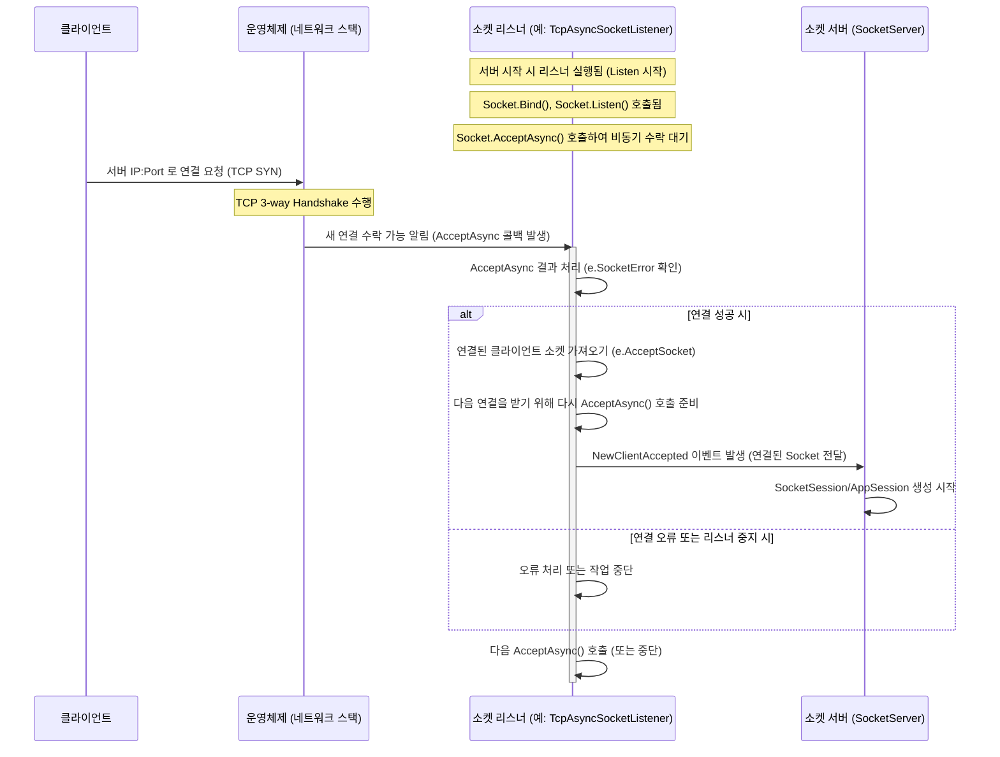

# Chapter 7: 소켓 리스너 (ISocketListener / SocketListenerBase)


이전 [제 6장: 소켓 세션 (ISocketSession / SocketSession)](06_소켓_세션__isocketsession___socketsession__.md)에서는 개별 클라이언트 연결의 저수준 통신을 담당하는 `SocketSession`에 대해 알아보았습니다. `SocketSession`은 실제 데이터를 주고받는 전화 회선과 같았죠.

이번 장에서는 서버 애플리케이션의 '문지기' 역할을 하는 **소켓 리스너(Socket Listener)** 에 대해 배웁니다. `ISocketListener` 인터페이스와 `SocketListenerBase` 추상 클래스를 통해, 서버가 어떻게 외부의 연결 요청을 감지하고 받아들이는지 알아보겠습니다.

## 왜 소켓 리스너가 필요할까요?

서버 애플리케이션은 특정 네트워크 주소(IP 주소와 포트 번호의 조합)에서 클라이언트가 연결해오기를 기다려야 합니다. 마치 건물의 정문에서 방문객을 기다리는 문지기처럼요. 아무나 들어오게 할 수는 없고, 정해진 출입구(포트)를 통해서만 접근을 허용해야 합니다.

**소켓 리스너**는 바로 이 '문지기' 역할을 수행합니다. 서버가 시작될 때, 설정 파일에 지정된 각 IP 주소와 포트 번호마다 리스너 객체가 생성되어 해당 주소를 '귀 기울여 듣기' 시작합니다. 외부에서 클라이언트가 이 주소로 연결을 시도하면, 리스너가 이를 가장 먼저 감지합니다.

리스너는 새로운 연결 시도를 인지하면, 이를 [소켓 서버 (ISocketServer / SocketServerBase)](05_소켓_서버__isocketserver___socketserverbase__.md)에게 알립니다. 그러면 `SocketServer`는 이 연결을 처리하기 위한 [소켓 세션 (ISocketSession / SocketSession)](06_소켓_세션__isocketsession___socketsession__.md)과 [애플리케이션 세션 (AppSession)](02_애플리케이션_세션__appsession__.md)을 생성하는 절차를 시작합니다.

만약 리스너가 없다면, 서버는 어떤 주소에서 클라이언트를 기다려야 할지, 새로운 연결 요청이 왔는지조차 알 수 없을 것입니다. 리스너는 서버가 외부 세계와 소통하는 첫 번째 관문인 셈입니다.

## 핵심 개념: 소켓 리스너의 구성 요소

SuperSocketLite에서 소켓 리스너는 다음과 같은 요소들로 구성됩니다.

1.  **`ISocketListener` (인터페이스):**
    *   모든 소켓 리스너 구현체가 지켜야 하는 약속(규약)입니다. 문지기의 기본 행동 지침과 같습니다.
    *   주요 멤버는 다음과 같습니다:
        *   `Info`: 리스너의 설정 정보(`ListenerInfo`)를 담고 있습니다 (IP, 포트, 백로그 등).
        *   `EndPoint`: 리스너가 실제로 귀 기울이고 있는 네트워크 주소(IPEndPoint)입니다.
        *   `Start(IServerConfig config)`: 리스너가 해당 주소에서 연결 요청을 받기 시작하도록 합니다.
        *   `Stop()`: 리스너의 작동을 중지합니다.
        *   `NewClientAccepted` 이벤트: 새로운 클라이언트 연결이 성공적으로 수락되었을 때 발생하는 이벤트입니다. 이 이벤트를 통해 `SocketServer`에게 알립니다.
        *   `Error` 이벤트: 리스닝 과정에서 오류가 발생했을 때 알려주는 이벤트입니다.

    ```csharp
    // SuperSocketLite\SocketEngine\ISocketListener.cs (일부)
    delegate void NewClientAcceptHandler(ISocketListener listener, Socket client, object state);

    interface ISocketListener
    {
        ListenerInfo Info { get; } // 리스너 설정 정보
        IPEndPoint EndPoint { get; } // 리스닝 중인 네트워크 주소

        bool Start(IServerConfig config); // 리스닝 시작
        void Stop(); // 리스닝 중지

        event NewClientAcceptHandler NewClientAccepted; // 새 클라이언트 연결 수락 시 발생
        event ErrorHandler Error; // 오류 발생 시
        event EventHandler Stopped; // 중지 시
    }
    ```
    *   `ISocketListener`는 리스너가 어떤 정보를 가지고 어떤 행동을 해야 하는지를 정의합니다.

2.  **`SocketListenerBase` (추상 클래스):**
    *   `ISocketListener` 인터페이스를 구현하며, 여러 종류의 리스너(TCP, UDP 등)에서 공통적으로 사용될 만한 기본적인 기능들을 미리 만들어 놓은 기반 클래스입니다. 문지기 교육 교재의 기초편과 같습니다.
    *   `ListenerInfo` 저장, 이벤트 발생을 위한 헬퍼 메서드(`OnNewClientAccepted`, `OnError`, `OnStopped`) 등을 제공합니다.
    *   실제로 리스닝을 시작하고(`Start`) 중지하는(`Stop`) 핵심 로직은 추상 메서드로 남겨두어, 구체적인 통신 방식(TCP/UDP)에 맞는 자식 클래스에서 구현하도록 합니다.

    ```csharp
    // SuperSocketLite\SocketEngine\SocketListenerBase.cs (일부)
    abstract class SocketListenerBase : ISocketListener
    {
        public ListenerInfo Info { get; private set; } // 설정 정보 저장
        public IPEndPoint EndPoint => Info.EndPoint; // 리스닝 주소

        protected SocketListenerBase(ListenerInfo info) { Info = info; }

        public abstract bool Start(IServerConfig config); // 시작 로직 (자식 클래스 구현)
        public abstract void Stop(); // 중지 로직 (자식 클래스 구현)

        public event NewClientAcceptHandler NewClientAccepted;
        public event ErrorHandler Error;
        public event EventHandler Stopped;

        // 이벤트 발생 헬퍼 메서드들
        protected virtual void OnNewClientAccepted(Socket socket, object state)
        {
            NewClientAccepted?.Invoke(this, socket, state);
        }
        protected void OnError(Exception e) { Error?.Invoke(this, e); }
        protected void OnStopped() { Stopped?.Invoke(this, EventArgs.Empty); }
        // ... (비동기 이벤트 발생 헬퍼 등) ...
    }
    ```
    *   `SocketListenerBase`는 리스너 구현의 반복적인 부분을 줄여줍니다.

3.  **구체적인 구현체들:**
    *   SuperSocketLite는 `SocketListenerBase`를 상속받아 특정 프로토콜의 리스닝 로직을 구현한 클래스들을 제공합니다.
        *   **`TcpAsyncSocketListener` (TCP):** TCP 프로토콜을 사용하여 클라이언트 연결을 비동기적으로 수락하는 리스너입니다. 우리가 만든 에코 서버처럼 일반적인 TCP 서버에서 사용됩니다. `Socket.AcceptAsync` 메서드를 활용하여 효율적으로 작동합니다.
        *   **`UdpSocketListener` (UDP):** UDP 프로토콜을 처리하는 리스너입니다. UDP는 비연결형이므로 TCP 리스너와는 다르게, 특정 포트로 들어오는 데이터그램(패킷)을 감지하여 처리합니다. `Socket.ReceiveFromAsync` 메서드를 주로 사용합니다.
    *   [소켓 서버 (ISocketServer / SocketServerBase)](05_소켓_서버__isocketserver___socketserverbase__.md)는 서버 설정(`IServerConfig`)에 지정된 통신 방식(`Mode`)과 리스너 정보(`Listeners`)를 보고 적절한 리스너 구현체를 생성하여 사용합니다.

## 소켓 리스너 사용하기 (SocketServer를 통해)

개발자가 직접 `ISocketListener` 객체를 생성하거나 관리할 일은 거의 없습니다. 이 역할은 [소켓 서버 (ISocketServer / SocketServerBase)](05_소켓_서버__isocketserver___socketserverbase__.md)가 담당합니다. `SocketServer`가 어떻게 리스너를 사용하는지 이해하면 리스너의 역할을 파악하는 데 도움이 됩니다.

**1단계: 서버 설정과 리스너 정보**

[애플리케이션 서버 (AppServer/AppServerBase)](01_애플리케이션_서버__appserver_appserverbase__.md)를 설정할 때, `IServerConfig` 객체에 어떤 IP 주소와 포트에서 리스닝할지를 `Listeners` 속성을 통해 지정합니다.

```csharp
// MainServer.InitConfig (1장 예제) - 개념적 확장
public void InitConfig(int port, int maxConnections, string name)
{
    Config = new ServerConfig
    {
        // ... (다른 설정) ...
        Mode = SocketMode.Tcp, // 통신 방식 (TCP)

        // 어떤 주소에서 리스닝할지 설정
        Listeners = new List<ListenerConfig>
        {
            new ListenerConfig
            {
                Ip = "Any", // 모든 IP 주소에서 ("0.0.0.0")
                Port = port, // 지정된 포트 번호 (예: 2020)
                Backlog = 100 // 동시에 대기 가능한 연결 요청 수 (TCP 전용)
                // Security = SslProtocols.None // 보안 설정 (필요시)
            }
            // 필요하다면 여러 개의 ListenerConfig를 추가하여 여러 포트에서 리스닝 가능
        }
    };
    Console.WriteLine($"[{name}] 서버 설정 완료 (Port: {port})");
}
```

*   `ServerConfig` (IServerConfig 구현체)의 `Listeners` 속성에 리스닝할 주소 정보를 `ListenerConfig` 객체 리스트로 담습니다.
*   `ListenerConfig`는 IP, 포트, 백로그(Backlog, TCP 연결 대기열 크기), 보안 설정 등을 포함합니다.

**2단계: SocketServer 시작 시 리스너 생성 및 시작**

`AppServer.Start()`가 호출되면 내부적으로 `SocketServer.Start()`가 실행됩니다. 이 메서드 안에서 설정된 `ListenerInfo`들을 바탕으로 실제 `ISocketListener` 객체들을 생성하고 시작시킵니다.

```csharp
// SocketServerBase.Start 내부 (개념적 코드)
public virtual bool Start()
{
    // ... (전송 큐 풀 초기화 등) ...

    // 설정된 ListenerInfos 배열을 순회합니다.
    for (var i = 0; i < ListenerInfos.Length; i++)
    {
        // 각 ListenerInfo에 맞는 ISocketListener 객체를 생성합니다.
        // CreateListener는 자식 클래스(예: AsyncSocketServer)에서 구현됩니다.
        var listener = CreateListener(ListenerInfos[i]);

        // 리스너 이벤트 핸들러 등록 (오류, 중지, 새 클라이언트 수락)
        listener.Error += new ErrorHandler(OnListenerError);
        listener.Stopped += new EventHandler(OnListenerStopped);
        listener.NewClientAccepted += new NewClientAcceptHandler(OnNewClientAccepted);

        // 리스너 시작! (실제 리스닝 시작)
        if (listener.Start(AppServer.Config))
        {
            Listeners.Add(listener); // 성공하면 관리 목록에 추가
            // 로그 기록...
        }
        else
        {
            // 리스너 시작 실패 시, 이미 시작된 다른 리스너들도 중지하고 실패 반환
            // 로그 기록...
            // ... (실패 처리) ...
            return false;
        }
    }

    IsRunning = true;
    return true;
}

// AsyncSocketServer.CreateListener (TCP 서버 구현)
protected override ISocketListener CreateListener(ListenerInfo listenerInfo)
{
    // TCP 모드이므로 TcpAsyncSocketListener를 생성하여 반환
    return new TcpAsyncSocketListener(listenerInfo);
}

// UdpSocketServer.CreateListener (UDP 서버 구현)
// protected override ISocketListener CreateListener(ListenerInfo listenerInfo)
// {
//     // UDP 모드이므로 UdpSocketListener를 생성하여 반환
//     return new UdpSocketListener(listenerInfo);
// }
```

*   `SocketServerBase.Start()`는 설정된 `ListenerInfos` 배열을 순회합니다.
*   각 `ListenerInfo`마다 `CreateListener` 추상 메서드를 호출합니다. 이 메서드는 구체적인 `SocketServer` 구현체(예: `AsyncSocketServer`, `UdpSocketServer`)에서 구현되어, 서버의 `Mode`에 맞는 `ISocketListener` 구현체(예: `TcpAsyncSocketListener`, `UdpSocketListener`)를 생성하여 반환합니다.
*   생성된 리스너의 `Start()` 메서드를 호출하여 실제 네트워크 리스닝을 시작합니다.
*   `listener.NewClientAccepted += OnNewClientAccepted;` 코드를 통해, 리스너가 새로운 클라이언트 연결을 감지하면 `SocketServer`의 `OnNewClientAccepted` 메서드가 호출되도록 연결합니다. 이 `OnNewClientAccepted` 메서드 안에서 [소켓 세션 (ISocketSession / SocketSession)](06_소켓_세션__isocketsession___socketsession__.md)과 [애플리케이션 세션 (AppSession)](02_애플리케이션_세션__appsession__.md) 생성 절차가 시작됩니다.

이처럼 리스너는 `SocketServer`에 의해 생성되고 관리되며, 개발자는 서버 설정을 통해 간접적으로 리스너의 동작을 제어합니다.

## 소켓 리스너 내부 동작 들여다보기

클라이언트가 서버에 접속할 때 리스너가 내부적으로 어떻게 작동하는지 좀 더 자세히 살펴보겠습니다. (주로 `TcpAsyncSocketListener` 기준)

**연결 수락 과정:**



1.  `TcpAsyncSocketListener.Start()`가 호출되면, 내부적으로 `System.Net.Sockets.Socket` 객체를 생성하고, 설정된 IP 주소와 포트로 `Bind()` 합니다.
2.  그 다음 `Listen()` 메서드를 호출하여 운영체제에게 이 주소로 들어오는 연결 요청을 받아들일 준비를 하라고 알립니다. `Backlog` 값은 동시에 대기할 수 있는 최대 연결 요청 수를 지정합니다.
3.  `Socket.AcceptAsync()` 메서드를 호출하여 비동기적으로 클라이언트 연결 수락을 시작합니다. 이 호출은 즉시 반환되고, 리스너는 실제 연결 요청이 올 때까지 기다립니다. `SocketAsyncEventArgs` 객체가 이 비동기 작업에 사용됩니다.
4.  클라이언트가 해당 IP와 포트로 연결을 시도하고 운영체제가 TCP 핸드셰이크를 완료하면, 운영체제는 `AcceptAsync` 작업이 완료되었음을 리스너에게 알립니다 (콜백 메서드 `acceptEventArg_Completed` 호출).
5.  `acceptEventArg_Completed` 메서드 (내부적으로 `ProcessAccept` 호출)에서는 `SocketAsyncEventArgs` 객체를 확인합니다.
    *   오류가 없다면(`e.SocketError == SocketError.Success`), `e.AcceptSocket` 속성에 연결된 클라이언트를 나타내는 새로운 `Socket` 객체가 담겨 있습니다.
    *   오류가 있다면, 오류를 처리합니다 (예: 리스너가 닫힌 경우 무시).
6.  성공적으로 연결된 클라이언트 `Socket` 객체를 얻었다면, 리스너는 `OnNewClientAccepted(socket, null)` 메서드를 호출하여 `NewClientAccepted` 이벤트를 발생시킵니다. 이 이벤트는 [소켓 서버 (ISocketServer / SocketServerBase)](05_소켓_서버__isocketserver___socketserverbase__.md)로 전달되어 후속 처리(세션 생성 등)가 이루어지게 합니다.
7.  동시에, 리스너는 다음 클라이언트 연결 요청을 받아들일 준비를 하기 위해 `e.AcceptSocket = null;`로 이전 소켓 참조를 제거하고 다시 `m_ListenSocket.AcceptAsync(e)`를 호출합니다.

**코드 레벨에서 살펴보기 (참고용)**

*   **`SuperSocketLite\TcpAsyncSocketListener.cs`:**
    *   `Start(IServerConfig config)`: `m_ListenSocket = new Socket(...)`, `m_ListenSocket.Bind(...)`, `m_ListenSocket.Listen(...)` 호출. `SocketAsyncEventArgs` (`m_AcceptSAE`) 생성 및 `Completed` 이벤트 핸들러(`acceptEventArg_Completed`) 연결. `m_ListenSocket.AcceptAsync(m_AcceptSAE)` 호출로 비동기 수락 시작.
    *   `acceptEventArg_Completed(object sender, SocketAsyncEventArgs e)`: 단순히 `ProcessAccept(e)` 호출.
    *   `ProcessAccept(SocketAsyncEventArgs e)`: `e.SocketError` 확인. 성공 시 `socket = e.AcceptSocket`으로 클라이언트 소켓 확보. `e.AcceptSocket = null`로 다음 Accept 준비. `m_ListenSocket.AcceptAsync(e)` 재호출 시도. `OnNewClientAccepted(socket, null)` 호출하여 이벤트 발생. 오류 처리 로직 포함.
    *   `Stop()`: `m_AcceptSAE` 정리 및 `m_ListenSocket.Close()` 호출.

*   **`SuperSocketLite\UdpSocketListener.cs`:**
    *   `Start(IServerConfig config)`: `Socket` 생성 (UDP), `Bind` 호출. `SocketAsyncEventArgs` (`m_ReceiveSAE`) 생성 및 `Completed` 핸들러 연결. 버퍼 설정 후 `m_ListenSocket.ReceiveFromAsync(m_ReceiveSAE)` 호출하여 데이터 수신 대기 (UDP는 연결 수락이 아닌 데이터 수신).
    *   `eventArgs_Completed(object sender, SocketAsyncEventArgs e)`: `e.LastOperation == SocketAsyncOperation.ReceiveFrom` 확인. 수신된 데이터(`e.Buffer`, `e.BytesTransferred`)와 발신지 정보(`e.RemoteEndPoint`)를 이용하여 `OnNewClientAcceptedAsync` 호출 (주의: UDP는 연결 개념이 없으므로 'accepted'는 관례적 표현). 다시 `ReceiveFromAsync` 호출하여 다음 데이터 수신 대기.

*   **`SuperSocketLite\SocketBase\ListenerInfo.cs`:** `IPEndPoint`, `BackLog`, `Security` 등 리스너 설정을 담는 간단한 클래스 정의 확인. (실제로는 `ServerConfig`의 `ListenerConfig`가 사용됨)

## 결론

이번 장에서는 서버의 '문지기' 역할을 하는 **소켓 리스너(`ISocketListener`, `SocketListenerBase`)** 에 대해 배웠습니다.

*   소켓 리스너는 지정된 네트워크 주소(IP와 포트)에서 클라이언트의 연결 요청을 기다리는 역할을 합니다.
*   `ISocketListener` 인터페이스는 리스너의 기본 동작을 정의하고, `SocketListenerBase`는 공통 구현을 제공합니다.
*   `TcpAsyncSocketListener` (TCP)와 `UdpSocketListener` (UDP) 같이 실제 통신 프로토콜에 맞는 구현체들이 있습니다.
*   개발자는 직접 리스너를 관리하지 않고, [소켓 서버 (ISocketServer / SocketServerBase)](05_소켓_서버__isocketserver___socketserverbase__.md)가 서버 설정을 기반으로 리스너를 생성하고 시작/중지합니다.
*   리스너는 새로운 클라이언트 연결을 감지하면 `NewClientAccepted` 이벤트를 발생시켜 `SocketServer`에게 알리고, 이후 세션 생성 과정이 시작됩니다.

소켓 리스너는 SuperSocketLite 서버가 외부 세계와 처음 만나는 지점이며, 안정적인 서비스 제공의 첫 단추를 담당하는 중요한 구성 요소입니다.

지금까지 서버의 주요 구성 요소들을 거의 다 살펴보았습니다. 다음 장에서는 데이터를 클라이언트에게 보낼 때, 특히 많은 데이터를 동시에 보내야 할 때 효율적인 전송을 돕는 **[제 8장: 전송 큐 (SendingQueue)](08_전송_큐__sendingqueue__.md)** 에 대해 알아보겠습니다. 데이터가 어떻게 잠시 대기했다가 순차적으로, 그리고 안전하게 네트워크로 나가는지 그 내부 메커니즘을 살펴볼 차례입니다!

---

Generated by [AI Codebase Knowledge Builder](https://github.com/The-Pocket/Tutorial-Codebase-Knowledge)