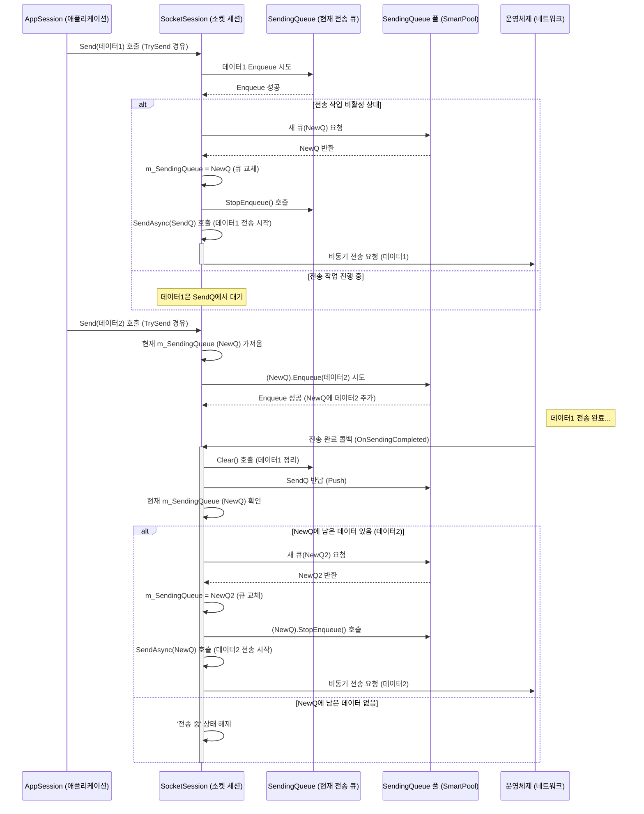

# Chapter 8: 전송 큐 (SendingQueue)


이전 [제 7장: 소켓 리스너 (ISocketListener / SocketListenerBase)](07_소켓_리스너__isocketlistener___socketlistenerbase__.md)에서는 서버가 클라이언트의 접속 요청을 처음 받아들이는 '문지기', 소켓 리스너에 대해 알아보았습니다. 리스너 덕분에 서버는 외부 세계와 연결될 수 있었죠.

이번 장에서는 서버가 클라이언트에게 데이터를 보낼 때, 특히 여러 데이터를 빠르고 효율적으로 보내야 할 때 중요한 역할을 하는 **전송 큐(SendingQueue)** 에 대해 알아봅니다. 데이터를 보내는 과정을 어떻게 매끄럽게 관리하는지 그 비밀을 파헤쳐 봅시다.

## 왜 전송 큐가 필요할까요?

서버 애플리케이션은 종종 클라이언트에게 데이터를 보내야 합니다. 간단한 응답 하나를 보낼 수도 있지만, 때로는 아주 짧은 시간 안에 여러 개의 메시지를 보내거나, 하나의 큰 데이터를 여러 조각으로 나누어 보내야 할 때도 있습니다.

만약 데이터를 보낼 때마다 네트워크 전송이 완료될 때까지 기다려야 한다면 어떨까요? 서버는 다음 작업을 하지 못하고 멈춰있게 될 것이고, 특히 여러 클라이언트를 동시에 처리해야 하는 상황에서는 성능이 크게 저하될 것입니다. 이는 마치 우체국 창구에서 한 사람이 보낼 편지 하나하나마다 발송 완료 확인을 기다리는 것과 같습니다. 매우 비효율적이죠.

**전송 큐(SendingQueue)**는 바로 이 문제를 해결하기 위해 등장했습니다. 우체국의 발송 시스템처럼, 보내야 할 데이터(편지)들을 순서대로 쌓아두는 임시 보관소 역할을 합니다. 애플리케이션은 보내야 할 데이터가 생길 때마다 일단 전송 큐에 넣어두기만 하면 됩니다. 그러면 내부의 전송 담당자([소켓 세션 (ISocketSession / SocketSession)](06_소켓_세션__isocketsession___socketsession__.md))가 네트워크 상황에 맞춰 큐에서 데이터를 꺼내 비동기적으로(다른 작업을 방해하지 않고) 발송 작업을 처리합니다.

이를 통해 서버 애플리케이션은 데이터 전송 작업이 완료될 때까지 기다릴 필요 없이 즉시 다음 작업을 수행할 수 있어 응답성이 향상됩니다. 또한, 여러 번의 작은 데이터 전송 요청을 모아서 한 번의 네트워크 작업으로 처리(일괄 처리, Batching)할 수도 있어 네트워크 효율성도 높일 수 있습니다.

## 핵심 개념: 전송 큐의 역할

`SendingQueue`는 SuperSocketLite 내부에서 데이터 전송을 효율적으로 관리하기 위한 핵심 요소이며, 다음과 같은 특징을 가집니다.

1.  **큐(Queue) 구조:** 이름에서 알 수 있듯이, 큐는 먼저 들어온 데이터가 먼저 나가는 FIFO(First-In, First-Out) 방식의 자료구조입니다. 보내기로 한 데이터들이 순서대로 큐에 쌓이고, 순서대로 처리됩니다.

2.  **세션별 독립 큐:** 각 [소켓 세션 (ISocketSession / SocketSession)](06_소켓_세션__isocketsession___socketsession__.md)은 자신만의 전송 큐를 가집니다. 이를 통해 A 클라이언트에게 보내는 데이터와 B 클라이언트에게 보내는 데이터가 섞이지 않고 독립적으로 관리됩니다.

3.  **비동기 전송 관리:** 애플리케이션에서 `Send` 요청을 하면 데이터는 즉시 네트워크로 전송되는 것이 아니라 전송 큐에 추가됩니다. 실제 전송은 `SocketSession` 내부의 비동기 메커니즘에 의해 처리됩니다. 이는 애플리케이션 스레드가 네트워크 I/O 작업에 묶이지 않도록 해줍니다.

4.  **데이터 조각(`ArraySegment<byte>`) 관리:** `SendingQueue`는 바이트 배열의 일부를 나타내는 `ArraySegment<byte>` 여러 개를 담을 수 있습니다. 이를 통해 큰 데이터를 조각내어 보내거나, 여러 개의 작은 데이터 조각을 하나의 논리적인 전송 단위로 묶어 처리하는 것이 용이합니다.

5.  **성능 향상:** 여러 번의 `Send` 호출을 모아서 처리하거나, 여러 데이터 조각을 한 번에 보내는 등의 최적화를 통해 실제 네트워크 I/O 호출 횟수를 줄여 성능을 향상시킵니다.

6.  **메모리 효율성 (SmartPool 연동):** `SendingQueue` 객체 자체는 내부적으로 `SmartPool`이라는 메모리 풀 기술을 사용하여 관리됩니다. 새로운 전송이 필요할 때마다 큐 객체를 새로 생성하고 파괴하는 대신, 미리 만들어둔 큐 객체를 재사용함으로써 가비지 컬렉션(GC) 부담을 줄이고 메모리 사용 효율을 높입니다.

## 전송 큐 사용하기 (간접적으로 AppSession을 통해)

놀랍게도, 개발자는 대부분의 경우 `SendingQueue`를 직접 생성하거나 조작할 필요가 없습니다. SuperSocketLite는 이 복잡한 과정을 내부적으로 알아서 처리해줍니다. 우리는 그저 [애플리케이션 세션 (AppSession)](02_애플리케이션_세션__appsession__.md)의 `Send` 또는 `TrySend` 메서드를 호출하기만 하면 됩니다.

**`AppSession.Send` 호출 시 내부 동작:**

여러 번 `Send`를 호출하는 간단한 예제를 살펴봅시다.

```csharp
// RequestReceived 핸들러 또는 다른 메서드 내에서
private void SendMultipleMessages(NetworkSession session)
{
    Console.WriteLine($"세션 [{session.SessionID}]에게 여러 메시지 전송 시도...");

    // 첫 번째 메시지 전송 요청
    byte[] message1 = System.Text.Encoding.UTF8.GetBytes("첫 번째 메시지입니다.");
    bool success1 = session.Send(message1); // 내부적으로 SendingQueue에 추가됨
    Console.WriteLine($" - 메시지 1 전송 요청 결과: {success1}");

    // 아주 짧은 시간 후에 두 번째 메시지 전송 요청
    System.Threading.Thread.Sleep(10); // 실제로는 비동기 작업 중간에 호출될 수 있음
    byte[] message2 = System.Text.Encoding.UTF8.GetBytes("두 번째 메시지!");
    bool success2 = session.Send(message2); // 내부적으로 SendingQueue에 추가됨
    Console.WriteLine($" - 메시지 2 전송 요청 결과: {success2}");

    // 세 번째 메시지 (데이터 조각 사용 예시)
    var segment = new ArraySegment<byte>(System.Text.Encoding.UTF8.GetBytes("세 번째 조각 메시지"));
    bool success3 = session.Send(segment); // ArraySegment도 가능
    Console.WriteLine($" - 메시지 3 전송 요청 결과: {success3}");

    // Send 메서드는 전송 큐에 성공적으로 추가되었는지 여부를 빠르게 반환합니다.
    // 실제 네트워크 전송은 백그라운드에서 비동기적으로 처리됩니다.
}
```

*   위 코드에서 `session.Send()`를 여러 번 호출합니다.
*   각 `Send` 호출은 데이터를 즉시 네트워크로 보내는 것이 아니라, 해당 `session` 내부의 [소켓 세션 (ISocketSession / SocketSession)](06_소켓_세션__isocketsession___socketsession__.md)이 관리하는 `SendingQueue`에 데이터를 추가합니다.
*   `Send` 메서드는 큐에 데이터가 성공적으로 추가되었는지 여부를 (보통 `true`) 빠르게 반환하고, 애플리케이션 스레드는 다음 코드를 계속 실행할 수 있습니다. (네트워크 전송 완료를 기다리지 않습니다.)
*   내부적으로 `SocketSession`은 큐에 데이터가 들어오면 비동기 전송 메커니즘을 통해 순서대로 네트워크로 데이터를 보냅니다.

**`AppSession.TrySend` 사용:**

`Send` 메서드는 내부 큐가 가득 차거나 하는 예외적인 상황에서 블로킹(대기)하거나 실패할 수 있습니다. 반면, `TrySend` 메서드는 큐에 데이터를 넣으려고 시도하고, 성공하면 `true`, 큐가 가득 차는 등의 이유로 즉시 넣을 수 없으면 `false`를 반환합니다. 이는 큐 상태를 확인하며 더 안전하게 데이터를 보내고 싶을 때 유용합니다.

```csharp
byte[] urgentMessage = System.Text.Encoding.UTF8.GetBytes("긴급 메시지!");
if (session.TrySend(urgentMessage))
{
    Console.WriteLine("긴급 메시지가 전송 큐에 추가되었습니다.");
}
else
{
    // 큐가 꽉 찼거나 다른 이유로 즉시 추가 실패
    // 잠시 후 재시도하거나, 다른 처리 방안을 강구할 수 있습니다.
    Console.WriteLine("전송 큐가 바빠서 긴급 메시지를 즉시 추가하지 못했습니다.");
}
```

결론적으로, 우리는 `AppSession`의 `Send` 또는 `TrySend`만 사용하면 되고, `SendingQueue`는 보이지 않는 곳에서 데이터 전송을 매끄럽게 처리해주는 역할을 합니다.

## 전송 큐 내부 동작 들여다보기

`AppSession.Send`를 호출했을 때 내부적으로 `SendingQueue`가 어떻게 사용되는지 그 과정을 좀 더 자세히 살펴보겠습니다.

**데이터 전송 흐름:**

1.  **요청 접수:** 애플리케이션 코드가 `AppSession.Send(data)`를 호출합니다.
2.  **위임:** `AppSession`은 이 요청을 내부적으로 연결된 `ISocketSession`에게 전달합니다. (`SocketSession.TrySend(data)` 호출)
3.  **큐 추가 시도:** `SocketSession.TrySend()`는 현재 활성화된 `SendingQueue` (`m_SendingQueue`)에 데이터를 추가(`Enqueue`)하려고 시도합니다.
4.  **전송 시작/대기:**
    *   만약 현재 진행 중인 전송 작업이 없고 큐에 데이터가 성공적으로 추가되었다면, `SocketSession`은 상태를 '전송 중'으로 변경하고, `SendingQueue`에 담긴 데이터를 이용해 실제 비동기 네트워크 전송(`SendAsync` 또는 `SendSync` 호출)을 시작합니다.
    *   만약 이미 다른 전송 작업이 진행 중이라면, 데이터는 큐에 추가된 상태로 자신의 차례를 기다립니다.
5.  **전송 완료 처리:** 비동기 전송 작업이 완료되면(성공 또는 실패), `SocketSession`의 콜백 메서드(`OnSendingCompleted`)가 호출됩니다.
6.  **큐 확인 및 다음 전송:** `OnSendingCompleted`에서는 완료된 데이터를 큐에서 정리하고, 큐에 아직 보낼 데이터가 남아있는지 확인합니다. 만약 남아있다면, 즉시 다음 데이터 조각에 대한 비동기 전송을 시작합니다. 보낼 데이터가 없다면 '전송 중' 상태를 해제합니다.
7.  **큐 교체 및 재사용:** `StartSend` 과정에서 현재 큐(`queue`)의 데이터 전송을 시작하기 전에, `m_SendingQueuePool`에서 새로운 빈 큐(`newQueue`)를 가져와 `m_SendingQueue` 참조를 이 새 큐로 교체합니다. 이렇게 함으로써 진행 중인 전송 작업(`queue` 사용)과 새로 들어오는 `Send` 요청(`newQueue` 사용)이 서로 간섭하지 않도록 합니다. 전송이 완료된 이전 큐(`queue`)는 정리된 후 다시 풀(`m_SendingQueuePool.Push`)에 반납되어 재사용됩니다.

**시퀀스 다이어그램:**



**코드 레벨에서 살펴보기 (참고용)**

*   **`SuperSocketLite\Common\SendingQueue.cs`:**
    *   `SendingQueue` 클래스는 `IList<ArraySegment<byte>>` 인터페이스를 구현합니다. 즉, 내부적으로는 `ArraySegment<byte>` 객체들을 저장하는 리스트처럼 동작합니다.
    *   `Enqueue(item, trackID)` / `Enqueue(items, trackID)`: 스레드 안전하게 데이터를 큐의 끝에 추가합니다. `trackID`는 큐가 교체되었는지 확인하는 데 사용됩니다. `Interlocked.CompareExchange` 등을 사용하여 여러 스레드에서 동시에 접근해도 데이터가 깨지지 않도록 합니다.
    *   `StopEnqueue()` / `StartEnqueue()`: `m_ReadOnly` 플래그를 사용하여 큐 교체 시점에 더 이상 데이터가 추가되지 않도록 제어합니다. `StopEnqueue`는 현재 진행 중인 모든 `Enqueue` 작업이 완료될 때까지 기다립니다 (`SpinWait`).
    *   `Clear()`: 큐를 비우고 내부 상태(`m_CurrentCount`, `m_InnerOffset`, `Position`)를 초기화하며, 다음 재사용을 위해 `m_TrackID`를 증가시킵니다.
    *   `InternalTrim(offset)`: 전송이 부분적으로 완료되었을 때, 큐의 앞부분에서 전송된 만큼 데이터를 제거(하는 것처럼 보이도록 내부 오프셋 조정)하는 데 사용됩니다.

*   **`SuperSocketLite\SocketSession.cs`:**
    *   `m_SendingQueue`: 현재 활성화된 `SendingQueue` 인스턴스를 참조합니다.
    *   `m_SendingQueuePool`: `SendingQueue` 객체들을 관리하는 `ISmartPool<SendingQueue>` 인스턴스입니다.
    *   `TrySend(segment)` / `TrySend(segments)`: `m_SendingQueue.Enqueue`를 호출하여 데이터를 추가하고, 성공하면 `StartSend`를 호출합니다.
    *   `StartSend(queue, sendingTrackID, initial)`:
        *   `TryAddStateFlag(SocketState.InSending)`으로 '전송 중' 상태를 설정합니다.
        *   `m_SendingQueuePool.TryGet(out newQueue)`로 풀에서 새 큐를 가져옵니다.
        *   `Interlocked.CompareExchange(ref m_SendingQueue, newQueue, queue)`를 통해 현재 `m_SendingQueue` 참조를 새 큐(`newQueue`)로 안전하게 교체합니다.
        *   `queue.StopEnqueue()`를 호출하여 이전 큐에 더 이상 데이터가 추가되지 않도록 막습니다.
        *   `SendAsync(queue)` 또는 `SendSync(queue)`를 호출하여 실제 전송을 시작합니다.
    *   `OnSendingCompleted(queue)`:
        *   `queue.Clear()`로 완료된 큐를 정리합니다.
        *   `m_SendingQueuePool.Push(queue)`로 큐를 풀에 반납합니다.
        *   `var newQueue = m_SendingQueue;`로 현재 활성화된 큐(데이터가 새로 추가되었을 수 있는 큐)를 가져옵니다.
        *   `if (newQueue.Count > 0)`: 만약 현재 큐에 보낼 데이터가 남아있다면, `StartSend(newQueue, newQueue.TrackID, false)`를 호출하여 다음 전송을 시작합니다.
        *   `else`: 보낼 데이터가 없으면 `OnSendEnd()`를 호출하여 '전송 중' 상태를 해제합니다.

*   **`SuperSocketLite\Common\SmartPool.cs`:**
    *   `SmartPool<T>` 클래스는 객체 풀링을 구현합니다. `SendingQueue` 같은 객체를 미리 생성해두고 필요할 때마다 빌려주고(`TryGet`), 사용이 끝나면 반납받아(`Push`) 재사용합니다.
    *   `Initialize`: 지정된 최소/최대 크기에 맞춰 객체 소스(`ISmartPoolSourceCreator`)를 사용하여 초기 객체들을 생성하고 내부 스택(`m_GlobalStack`)에 저장합니다.
    *   `TryGet`: 스택에서 객체를 꺼내려고 시도합니다. 만약 풀이 비어있고 최대 크기에 도달하지 않았다면, 내부적으로 풀 크기를 늘리고(`IncreaseCapacity`) 새 객체를 생성하여 반환할 수도 있습니다.
    *   `Push`: 사용이 끝난 객체를 다시 스택에 넣어 재사용을 위해 보관합니다.

## 결론

이번 장에서는 SuperSocketLite 내부에서 비동기 데이터 전송을 효율적으로 관리하는 **전송 큐(SendingQueue)** 에 대해 배웠습니다.

*   `SendingQueue`는 보내야 할 데이터(`ArraySegment<byte>`)를 순서대로 저장하는 임시 보관소입니다.
*   각 [소켓 세션 (ISocketSession / SocketSession)](06_소켓_세션__isocketsession___socketsession__.md)은 자신만의 전송 큐를 가집니다.
*   애플리케이션은 `AppSession.Send()` 또는 `TrySend()`를 호출하여 데이터를 큐에 추가하며, 실제 전송은 내부 비동기 메커니즘에 의해 처리됩니다.
*   이를 통해 애플리케이션의 응답성이 향상되고, 네트워크 I/O 호출을 최적화하여 성능을 높일 수 있습니다.
*   `SendingQueue` 객체는 `SmartPool`을 통해 효율적으로 재사용되어 메모리 관리 부담을 줄입니다.

비록 우리가 직접 `SendingQueue` 코드를 작성할 일은 거의 없지만, 이 내부 메커니즘을 이해함으로써 SuperSocketLite가 어떻게 안정적이고 효율적으로 데이터를 전송하는지 알 수 있습니다.

이것으로 SuperSocketLite의 핵심 구성 요소들에 대한 여정을 마무리합니다. 우리는 [애플리케이션 서버](01_애플리케이션_서버__appserver_appserverbase__.md)부터 시작하여 [세션](02_애플리케이션_세션__appsession__.md), [수신 필터](03_수신_필터__ireceivefilter___receivefilterbase__.md), [요청 정보](04_요청_정보__irequestinfo__.md), [소켓 서버](05_소켓_서버__isocketserver___socketserverbase__.md), [소켓 세션](06_소켓_세션__isocketsession___socketsession__.md), [리스너](07_소켓_리스너__isocketlistener___socketlistenerbase__.md), 그리고 방금 배운 [전송 큐](08_전송_큐__sendingqueue__.md)까지, 서버 애플리케이션을 구성하는 주요 벽돌들을 하나씩 살펴보았습니다. 이 지식을 바탕으로 여러분만의 강력하고 효율적인 네트워크 애플리케이션을 만들어 보시길 바랍니다!

---

Generated by [AI Codebase Knowledge Builder](https://github.com/The-Pocket/Tutorial-Codebase-Knowledge)