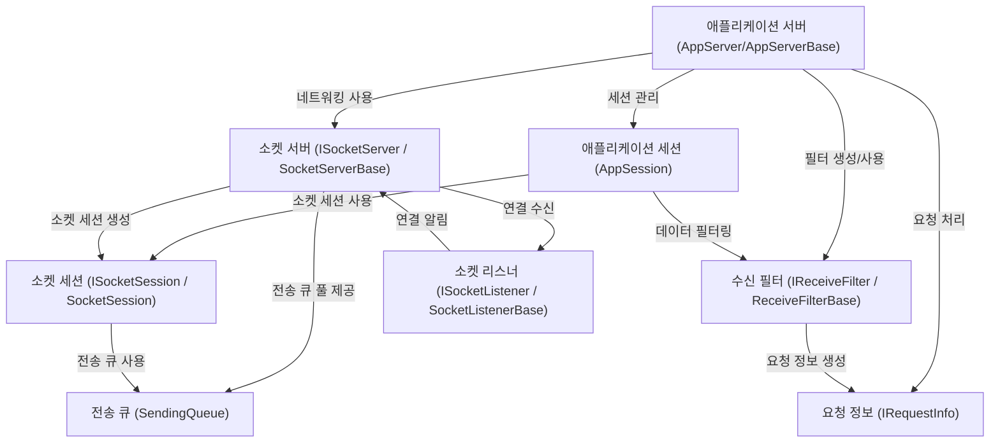

# Tutorial: SuperSocketLite

SuperSocketLite는 **네트워크 애플리케이션 서버**를 *쉽게 개발*할 수 있도록 도와주는 프레임워크입니다.
복잡한 **소켓 통신** 부분을 추상화하여 개발자가 *비즈니스 로직*에 집중할 수 있게 해줍니다.
TCP/UDP 통신, 다양한 프로토콜 처리, 세션 관리 등을 지원합니다.

**Source Repository:** [None](None)

## Chapters

1. [애플리케이션 서버 (AppServer/AppServerBase)
](01_애플리케이션_서버__appserver_appserverbase__.md)
2. [애플리케이션 세션 (AppSession)
](02_애플리케이션_세션__appsession__.md)
3. [수신 필터 (IReceiveFilter / ReceiveFilterBase)
](03_수신_필터__ireceivefilter___receivefilterbase__.md)
4. [요청 정보 (IRequestInfo)
](04_요청_정보__irequestinfo__.md)
5. [소켓 서버 (ISocketServer / SocketServerBase)
](05_소켓_서버__isocketserver___socketserverbase__.md)
6. [소켓 세션 (ISocketSession / SocketSession)
](06_소켓_세션__isocketsession___socketsession__.md)
7. [소켓 리스너 (ISocketListener / SocketListenerBase)
](07_소켓_리스너__isocketlistener___socketlistenerbase__.md)
8. [전송 큐 (SendingQueue)
](08_전송_큐__sendingqueue__.md)

---

Generated by [AI Codebase Knowledge Builder](https://github.com/The-Pocket/Tutorial-Codebase-Knowledge)