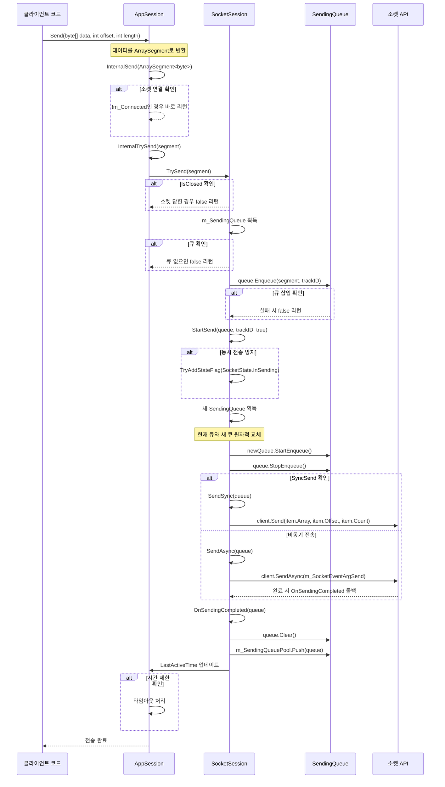
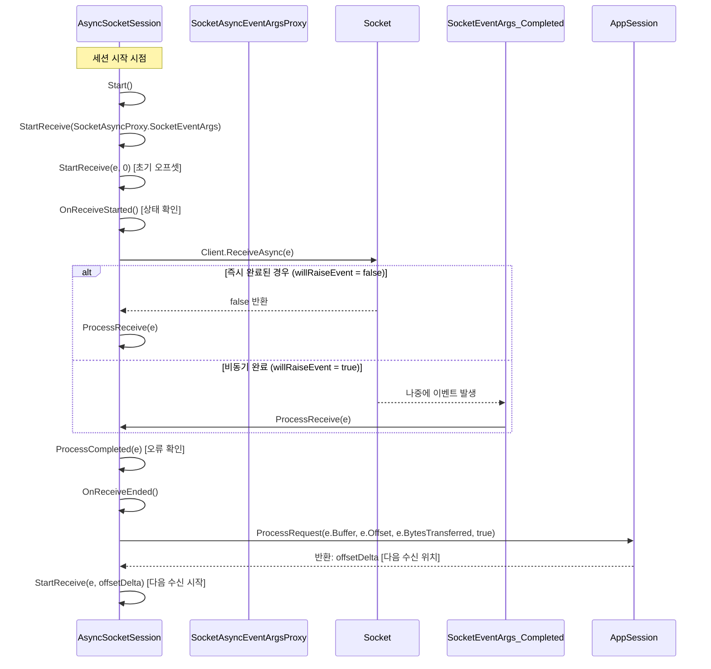

# SuperSocket Core 분석
  
SuperSocketLite는 .NET Core로 포팅된 네트워크 애플리케이션 프레임워크로, TCP/UDP 기반 서버 개발을 위한 핵심 구조를 제공한다. 주요 계층 구조는 다음과 같다.  
  
## 핵심 계층 구조
  
### 1. 서버 계층
- **AppServerBase**: 모든 서버의 기본 클래스
- **AppServer**: 일반적인 세션 관리 기능 구현
- **AsyncSocketServer**: 비동기 소켓 통신 구현
- **UdpSocketServer**: UDP 프로토콜 지원

```csharp
// 서버 생성 및 시작 예시
var server = new AppServer();
server.Setup(2012); // 포트 설정
server.Start();
```

### 2. 세션 계층
- **SocketSession**: 클라이언트 연결 상태 관리
- **AsyncSocketSession**: 비동기 통신 세션 관리
- **UdpSocketSession**: UDP 통신용 세션
  

### 3. 프로토콜 계층
- **IReceiveFilter**: 데이터 수신 및 파싱 인터페이스
- **ReceiveFilterBase**: 기본 필터 구현
- **TerminatorReceiveFilter**: 종료 문자 기반 필터
- **FixedSizeReceiveFilter**: 고정 크기 패킷 필터
- **BeginEndMarkReceiveFilter**: 시작/끝 표시가 있는 패킷 필터
  

### 4. 리스너 계층
- **SocketListenerBase**: 기본 리스너 구현
- **TcpAsyncSocketListener**: 비동기 TCP 리스너
- **UdpSocketListener**: UDP 통신용 리스너
  

## 작동 방식

1. **초기화**: 서버 구성(ServerConfig)으로 AppServer 인스턴스 생성
2. **리스닝**: 설정된 포트에서 TcpAsyncSocketListener가 연결 대기
3. **연결 수락**: 클라이언트 연결 시 AsyncSocketSession 생성
4. **데이터 수신**: ReceiveFilter를 통해 데이터 파싱
5. **요청 처리**: 파싱된 요청을 RequestHandler로 처리
6. **응답 전송**: Send() 메서드로 클라이언트에 응답
  

## 비동기 처리 구조

SuperSocketLite는 SocketAsyncEventArgs 기반 비동기 모델을 사용한다:

```csharp
private void StartReceive(SocketAsyncEventArgs e)
{
    bool willRaiseEvent = Client.ReceiveAsync(e);
    if (!willRaiseEvent)
        ProcessReceive(e);
}

public void ProcessReceive(SocketAsyncEventArgs e)
{
    // 데이터 처리 로직
    int offsetDelta = AppSession.ProcessRequest(e.Buffer, e.Offset, e.BytesTransferred, true);
    StartReceive(e, offsetDelta);
}
```
  

## 확장성

다양한 프로토콜 지원을 위해 IReceiveFilter 구현으로 쉽게 확장 가능하다:

1. **문자열 기반 프로토콜**: CommandLineReceiveFilter
2. **이진 프로토콜**: FixedHeaderReceiveFilter
3. **HTTP 프로토콜**: HttpReceiveFilter

## 주요 클래스 역할

- **AppServer**: 세션 생성 및 관리, 서버 설정
- **SocketSession**: 클라이언트 연결 상태 및 통신 관리
- **SendingQueue**: 비동기 송신 큐 관리
- **ReceiveFilter**: 바이트 스트림을 파싱하여 요청 객체로 변환

이러한 구조를 통해 SuperSocketLite는 고성능, 확장성 있는 네트워크 애플리케이션 개발 기반을 제공한다.    
  
<br>    
  
# AppServer 와 AppServerBase의 관계
  
## 1. 클래스 계층 구조

SuperSocketLite에서 AppServer와 AppServerBase는 계층적 상속 관계를 가지며, 다음과 같은 구조로 구성됩니다:

```
[인터페이스] IAppServer
      ↑
[추상클래스] AppServerBase<TAppSession, TRequestInfo> : IAppServer, ...
      ↑
[클래스] AppServer<TAppSession, TRequestInfo> : AppServerBase<TAppSession, TRequestInfo>
      ↑
[클래스] AppServer<TAppSession> : AppServer<TAppSession, StringRequestInfo>
      ↑
[클래스] AppServer : AppServer<AppSession>
```

## 2. 각 클래스의 역할과 책임

### AppServerBase<TAppSession, TRequestInfo>
- **역할**: 서버의 기본 인프라 제공, 가장 기본적인 추상 기능 정의
- **주요 책임**:
  - 소켓 서버 생성 및 관리 (`ISocketServer` 인스턴스)
  - 서버 시작/중지 기본 로직 구현
  - 세션 관리를 위한 추상 메서드 정의
  - 보안 설정 (SSL/TLS)
  - 리스너 설정
  - 로깅 시스템 초기화
  - 에러 처리 메커니즘

```csharp
public abstract partial class AppServerBase<TAppSession, TRequestInfo> : 
    IAppServer<TAppSession, TRequestInfo>, 
    IRawDataProcessor<TAppSession>, 
    IRequestHandler<TRequestInfo>,
    /* 기타 인터페이스 */
    where TRequestInfo : class, IRequestInfo
    where TAppSession : AppSession<TAppSession, TRequestInfo>, IAppSession, new()
{
    // 서버 상태 관리
    public ServerState State { get { return (ServerState)m_StateCode; } }
    
    // 설정, 로깅 등 기본 속성들
    public IServerConfig Config { get; private set; }
    public ILog Logger { get; private set; }
    
    // 서버 시작/중지 기본 구현
    public virtual bool Start() { /* 구현 */ }
    public virtual void Stop() { /* 구현 */ }
    
    // 세션 관리를 위한 추상 메서드들
    protected abstract bool RegisterSession(string sessionID, TAppSession appSession);
    public abstract TAppSession GetSessionByID(string sessionID);
    public abstract int SessionCount { get; }
    
    // 인증서 및 보안 관련
    protected virtual X509Certificate GetCertificate(ICertificateConfig certificate) { /* 구현 */ }
    
    // 기본 설정
    protected virtual bool Setup(IRootConfig rootConfig, IServerConfig config) { return true; }
}
```

### AppServer<TAppSession, TRequestInfo>
- **역할**: AppServerBase의 추상 메서드 구현 및 실제 세션 관리 로직 제공
- **주요 책임**:
  - 세션 등록, 조회, 관리 구현
  - 세션 스냅샷 기능 (`GetSessions`, `GetAllSessions` 메서드)
  - 유휴 세션 정리 타이머
  - 데이터 모아서 보내기 기능
  - 세션 이벤트 처리 (연결/종료)

```csharp
public abstract class AppServer<TAppSession, TRequestInfo> : AppServerBase<TAppSession, TRequestInfo>
    where TRequestInfo : class, IRequestInfo
    where TAppSession : AppSession<TAppSession, TRequestInfo>, IAppSession, new()
{
    // 세션 저장소
    private ConcurrentDictionary<string, TAppSession> m_SessionDict = new ConcurrentDictionary<string, TAppSession>();
    
    // 세션 등록 구현
    protected override bool RegisterSession(string sessionID, TAppSession appSession)
    {
        return m_SessionDict.TryAdd(sessionID, appSession);
    }
    
    // 세션 조회 구현
    public override TAppSession GetSessionByID(string sessionID)
    {
        TAppSession targetSession;
        m_SessionDict.TryGetValue(sessionID, out targetSession);
        return targetSession;
    }
    
    // 세션 스냅샷 관리
    private KeyValuePair<string, TAppSession>[] m_SessionsSnapshot = new KeyValuePair<string, TAppSession>[0];
    private System.Threading.Timer m_SessionSnapshotTimer = null;
    
    // 유휴 세션 정리 타이머
    private System.Threading.Timer m_ClearIdleSessionTimer = null;
    
    // 데이터 수집 전송 타이머
    private System.Threading.Timer m_CollectSendSessionTimer = null;
    
    // 세션 정리 로직
    private void ClearIdleSession(object state) { /* 구현 */ }
    
    // 데이터 모아서 보내기 로직
    private void CollectSendSession(object state) { /* 구현 */ }
}
```

### AppServer<TAppSession>
- **역할**: 문자열 기반 요청 처리에 특화된 서버 구현
- **주요 책임**:
  - `StringRequestInfo` 타입을 기본 요청 타입으로 고정
  - 기본 명령줄 필터 생성 (`CommandLineReceiveFilterFactory`)

```csharp
public class AppServer<TAppSession> : AppServer<TAppSession, StringRequestInfo>
    where TAppSession : AppSession<TAppSession, StringRequestInfo>, IAppSession, new()
{
    public AppServer() : base() { }
    
    public AppServer(IReceiveFilterFactory<StringRequestInfo> receiveFilterFactory)
        : base(receiveFilterFactory) { }
    
    // 기본 필터 팩토리 생성 구현
    internal override IReceiveFilterFactory<StringRequestInfo> CreateDefaultReceiveFilterFactory()
    {
        return new CommandLineReceiveFilterFactory(TextEncoding);
    }
}
```

### AppServer
- **역할**: 가장 간단한 사용을 위한 기본 구현 제공
- **주요 책임**:
  - 기본 `AppSession` 타입을 사용하는 가장 구체적인 구현
  - 사용하기 쉬운 인터페이스 제공

```csharp
public class AppServer : AppServer<AppSession>
{
    public AppServer() : base() { }
    
    public AppServer(IReceiveFilterFactory<StringRequestInfo> receiveFilterFactory)
        : base(receiveFilterFactory) { }
}
```

## 3. 계층 구조의 목적과 이점

### 점진적 추상화 레벨
- **AppServerBase**: 가장 추상적인 레벨, 서버의 핵심 인프라 정의
- **AppServer<T,R>**: 구체적인 세션 관리 구현
- **AppServer<T>**: 문자열 기반 요청 처리 특화
- **AppServer**: 즉시 사용 가능한 구체적 구현

### 유연성과 확장성
- 제네릭 타입 매개변수를 통해 다양한 세션 및 요청 타입 지원
- 필요한 단계에서만 상속하여 커스터마이징 가능
- 기본 구현은 재사용하면서 특정 부분만 변경 가능

```csharp
// 기본 사용 방법 (가장 간단함)
var server = new AppServer();
server.Setup(2012);
server.Start();

// 커스텀 세션 및 필터 사용
public class MySession : AppSession<MySession> { /* 구현 */ }
var server = new AppServer<MySession>(new MyFilterFactory());

// 완전 커스텀 구현
public class MyServer : AppServer<MySession, MyRequestInfo> { /* 구현 */ }
```

## 4. 실질적인 차이점

### AppServerBase vs AppServer<T,R>
- **AppServerBase**: 추상 메서드만 정의, 실제 세션 저장 방식 없음
- **AppServer<T,R>**: `ConcurrentDictionary`로 세션 저장, 스냅샷, 타이머 등 구현

### AppServer<T,R> vs AppServer<T>
- **AppServer<T,R>**: 어떤 요청 타입도 처리 가능
- **AppServer<T>**: `StringRequestInfo` 타입만 처리, 텍스트 기반 프로토콜 특화

### AppServer<T> vs AppServer
- **AppServer<T>**: 커스텀 세션 타입 사용 가능
- **AppServer**: 기본 `AppSession` 타입 사용, 최소 설정으로 바로 사용 가능

## 5. 설계 패턴 관점

이 계층 구조는 다음 패턴을 결합하여 구현되었습니다:

1. **템플릿 메서드 패턴**: 상위 클래스에서 알고리즘의 뼈대를 정의하고 세부 구현은 하위 클래스에 위임
2. **팩토리 메서드 패턴**: 객체 생성 로직을 하위 클래스에 위임 (예: `CreateDefaultReceiveFilterFactory`)
3. **전략 패턴**: 런타임에 알고리즘 변경 가능 (예: `ReceiveFilterFactory`)
4. **단일 책임 원칙**: 각 계층이 명확한 책임을 가짐

이러한 설계는 SuperSocketLite가 높은 유연성과 확장성을 제공하면서도 기본 사용은 매우 간단하게 유지할 수 있도록 합니다.  

   
<br>  
  
# SendingQueue를 중심으로 한 TCP Send 작업 분석

## 1. SendingQueue 클래스 구조

SendingQueue는 SuperSocketLite에서 네트워크 전송을 효율적으로 관리하기 위한 핵심 클래스다.

```csharp
public sealed class SendingQueue : IList<ArraySegment<byte>>
{
    private readonly int m_Offset;
    private readonly int m_Capacity;
    private int m_CurrentCount = 0;
    private ArraySegment<byte>[] m_GlobalQueue;
    private int m_InnerOffset = 0;
    private ushort m_TrackID = 1;
    
    // 트래킹 ID - 전송 상태 추적용
    public ushort TrackID { get { return m_TrackID; } }
    
    // 위치 정보
    public int Position { get; set; }
    
    // 큐 용량 
    public int Capacity { get { return m_Capacity; } }
}
```

## 2. 송신 큐 풀 관리 시스템

### 송신 큐 풀 초기화
```csharp
public override bool Start()
{
    // 서버 설정 기반으로 전송 큐 풀 크기 계산
    var sendingQueuePool = new SmartPool<SendingQueue>();
    sendingQueuePool.Initialize(
        Math.Max(config.MaxConnectionNumber / 6, 256),  // 최소 풀 크기
        Math.Max(config.MaxConnectionNumber * 2, 256),  // 최대 풀 크기
        new SendingQueueSourceCreator(config.SendingQueueSize));

    SendingQueuePool = sendingQueuePool;
    // ...
}
```

### 송신 큐 생성 팩토리
```csharp
public class SendingQueueSourceCreator : ISmartPoolSourceCreator<SendingQueue>
{
    public ISmartPoolSource Create(int size, out SendingQueue[] poolItems)
    {
        // 전체 버퍼 배열 생성
        var source = new ArraySegment<byte>[size * m_SendingQueueSize];
        poolItems = new SendingQueue[size];

        // 송신 큐 풀 채우기
        for (var i = 0; i < size; i++)
        {
            poolItems[i] = new SendingQueue(source, i * m_SendingQueueSize, m_SendingQueueSize);
        }
        
        return new SmartPoolSource(source, size);
    }
}
```

## 3. TCP 전송 프로세스

### 소켓 세션 초기화 시 SendingQueue 설정
```csharp
public virtual void Initialize(IAppSession appSession)
{
    // ...
    // 송신 큐 풀에서 큐 하나 가져오기
    if (m_SendingQueuePool == null)
        m_SendingQueuePool = ((SocketServerBase)((ISocketServerAccessor)appSession.AppServer).SocketServer).SendingQueuePool;

    SendingQueue queue;
    if (m_SendingQueuePool.TryGet(out queue))
    {
        m_SendingQueue = queue;
        queue.StartEnqueue(); // 큐 활성화
    }
    
    // 데이터 모아서 보내기 옵션일 경우
    if (Config.CollectSendIntervalMillSec > 0)
    {
        CollectSendBuffer = new ReuseLockBaseBuffer(Config.ReceiveBufferSize);
        SyncSend = true; // 동기 전송으로 설정
    }
}
```

### 데이터 전송 과정 (TrySend)
```csharp
public bool TrySend(ArraySegment<byte> segment)
{
    if (IsClosed)
        return false;

    var queue = m_SendingQueue;
    if (queue == null)
        return false;

    var trackID = queue.TrackID;
    
    // 큐에 데이터 추가 시도
    if (!queue.Enqueue(segment, trackID))
        return false;

    // 전송 시작
    StartSend(queue, trackID, true);
    return true;
}
```

### 전송 시작 로직
```csharp
private void StartSend(SendingQueue queue, int sendingTrackID, bool initial)
{
    // 초기 전송 시작일 경우 상태 플래그 설정
    if (initial)
    {
        // 이미 전송 중이면 리턴
        if (!TryAddStateFlag(SocketState.InSending))
            return;
        
        // 큐가 바뀌었거나 TrackID가 다르면 취소
        var currentQueue = m_SendingQueue;
        if (currentQueue != queue || sendingTrackID != currentQueue.TrackID)
        {
            OnSendEnd();
            return;
        }
    }

    // 새 송신 큐 준비
    SendingQueue newQueue;
    if (!m_SendingQueuePool.TryGet(out newQueue))
    {
        OnSendEnd(CloseReason.InternalError, true);
        AppSession.Logger.Error("There is no enougth sending queue can be used.");
        return;
    }

    // 큐 교체 (thread-safe)
    var oldQueue = Interlocked.CompareExchange(ref m_SendingQueue, newQueue, queue);
    
    // 새 큐 활성화, 이전 큐 비활성화
    newQueue.StartEnqueue();
    queue.StopEnqueue();
    
    // 실제 전송 시작
    Send(queue);
}
```

## 4. 동기/비동기 전송 방식

### 전송 방식 선택
```csharp
private void Send(SendingQueue queue)
{
    if (SyncSend)
        SendSync(queue);
    else
        SendAsync(queue);
}
```

### 동기식 전송 (AsyncSocketSession)
```csharp
protected override void SendSync(SendingQueue queue)
{
    try
    {
        for (var i = 0; i < queue.Count; i++)
        {
            var item = queue[i];
            var client = Client;
            
            if (client == null)
                return;

            // Socket.Send() 메서드로 직접 전송
            client.Send(item.Array, item.Offset, item.Count, SocketFlags.None);
        }

        OnSendingCompleted(queue);
    }
    catch (Exception e)
    {
        LogError(e);
        OnSendError(queue, CloseReason.SocketError);
    }
}
```

### 비동기식 전송 (AsyncSocketSession)
```csharp
protected override void SendAsync(SendingQueue queue)
{
    try
    {
        m_SocketEventArgSend.UserToken = queue;

        // 큐에 여러 항목이 있으면 BufferList로 설정
        if (queue.Count > 1)
            m_SocketEventArgSend.BufferList = queue;
        else
        {
            var item = queue[0];
            m_SocketEventArgSend.SetBuffer(item.Array, item.Offset, item.Count);
        }

        var client = Client;
        if (client == null)
        {
            OnSendError(queue, CloseReason.SocketError);
            return;
        }

        // 비동기 전송 시작
        if (!client.SendAsync(m_SocketEventArgSend))
            OnSendingCompleted(client, m_SocketEventArgSend);
    }
    catch (Exception e)
    {
        LogError(e);
        ClearPrevSendState(m_SocketEventArgSend);
        OnSendError(queue, CloseReason.SocketError);
    }
}
```
  

## 5. 데이터 모아서 보내기 기능

CollectSend는 SuperSocketLite에서 제공하는 최적화 기능으로, **여러 작은 데이터 패킷을 일정 시간 동안 모았다가 한 번에 전송**하는 메커니즘입니다. 이는 네트워크 효율성을 높이고 패킷 오버헤드를 줄이는 데 유용합니다.

### 언제 사용되는가?

#### 1. 작은 패킷이 자주 발생하는 경우
- 게임 서버에서 위치 업데이트, 상태 변경 등 잦은 소량 데이터 전송 시
- 채팅 메시지, 알림, 로그 등을 많은 클라이언트에게 보낼 때
- 센서 데이터나 실시간 모니터링 정보 전송 시

#### 2. 네트워크 효율성이 중요한 경우
- 대규모 동시 접속자 환경에서 네트워크 부하 감소 필요 시
- 모바일 환경 등 대역폭이 제한된 환경에서
- 패킷 헤더 오버헤드가 실제 데이터보다 클 수 있는 소량 데이터 전송 시

### 어떻게 설정하는가?

#### 서버 설정에서 활성화
```csharp
var config = new ServerConfig
{
    Port = 2012,
    // 수집 간격 (밀리초) - 0보다 크게 설정하면 활성화됨
    CollectSendIntervalMillSec = 100,
    // 기타 설정...
};

var server = new AppServer();
server.Setup(config);
```

#### 중요 설정 매개변수
- **CollectSendIntervalMillSec**: 0보다 큰 값으로 설정 시 활성화 (밀리초 단위)
  - 값이 작을수록 지연은 적지만 최적화 효과 감소
  - 값이 클수록 최적화 효과는 커지지만 지연 증가

### 어떻게 동작하는가?

#### 1. 초기화 단계
```csharp
public virtual void Initialize(IAppSession appSession)
{
    // ...
    // CollectSendIntervalMillSec > 0이면 버퍼 생성
    if (Config.CollectSendIntervalMillSec > 0)
    {
        CollectSendBuffer = new ReuseLockBaseBuffer(Config.ReceiveBufferSize);
        SyncSend = true; // 동기 전송 방식으로 설정
    }
    // ...
}
```

#### 2. 타이머 시작
```csharp
private void StartCollectSendSessionTimer()
{
    int interval = Config.CollectSendIntervalMillSec;
    m_CollectSendSessionTimer = new System.Threading.Timer(
        CollectSendSession, new object(), interval, interval);
}
```

#### 3. 데이터 수집 과정
클라이언트 코드:
```csharp
// 일반 Send 대신 CollectSend 사용
session.CollectSend(dataBytes, 0, dataBytes.Length);
```

내부 동작:
```csharp
public bool CollectSend(byte[] source, int pos, int count)
{
    // 스레드 안전하게 버퍼에 데이터 추가
    return CollectSendBuffer.Copy(source, pos, count);
}
```

#### 4. 주기적 데이터 송신
```csharp
private void CollectSendSession(object state)
{
    // 모든 세션 병렬 처리
    System.Threading.Tasks.Parallel.ForEach(sessionSource, s =>
    {
        var session = s.Value;
        
        // 1. 수집된 데이터 가져오기
        var sendData = session.GetCollectSendData();
        
        // 2. 데이터가 있으면 한 번에 전송
        if (sendData.Count > 0)
        {
            session.Send(sendData);
        }
        
        // 3. 버퍼 정리
        session.CommitCollectSend(sendData.Count);
    });
}
```

#### 5. 버퍼 관리
```csharp
// 데이터 가져오기
public ArraySegment<byte> GetData()
{
    lock (mBuffer)
    {
        var size = WritePos - ReadPos;
        return new ArraySegment<byte>(mBuffer, ReadPos, size);
    }
}

// 버퍼 정리
public void Commit(int size)
{
    lock (mBuffer)
    {
        // 전송 완료된 데이터 처리
        // 버퍼 최적화 로직 수행
    }
}
```

### 실제 사용 예시

#### 게임 서버에서의 사용
```csharp
// 플레이어 위치 업데이트 처리
public void UpdatePlayerPositions()
{
    foreach (var player in activePlayers)
    {
        // 위치 데이터 생성
        byte[] positionData = PreparePositionPacket(player);
        
        // 일반 전송 대신 수집 전송 사용
        foreach (var observer in player.Observers)
        {
            observer.Session.CollectSend(positionData, 0, positionData.Length);
        }
    }
    
    // 타이머에 의해 주기적으로 일괄 전송됨
}
```

#### 채팅 서버에서의 사용
```csharp
// 채팅방 메시지 브로드캐스트
public void BroadcastToRoom(string roomId, string message)
{
    byte[] messageData = Encoding.UTF8.GetBytes(message);
    
    foreach (var user in roomUsers[roomId])
    {
        // 개별 Send 대신 CollectSend 사용
        user.Session.CollectSend(messageData, 0, messageData.Length);
    }
}
```

### 주의사항 및 고려사항

1. **지연 시간(Latency) 증가**
   - 데이터가 바로 전송되지 않고 타이머 간격만큼 지연됨
   - 실시간성이 매우 중요한 경우 적합하지 않을 수 있음

2. **메모리 사용량**
   - 각 세션마다 버퍼 메모리가 할당됨
   - 접속자 수가 많은 경우 메모리 사용량 고려 필요

3. **버퍼 크기 제한**
   - 기본적으로 ReceiveBufferSize로 버퍼 크기 결정
   - 대용량 데이터는 일반 Send 사용 권장

4. **동기화**
   - ReuseLockBaseBuffer는 스레드 안전하게 구현되어 있음
   - CollectSendSession 처리 시 병렬로 실행되므로 성능 이점

CollectSend는 네트워크 효율성과 지연 시간 사이의 균형을 조정할 수 있는 강력한 도구로, 특히 소량의 데이터를 자주 보내는 실시간 애플리케이션에서 큰 이점을 제공합니다. 
  


### 주기적 데이터 전송 타이머
```csharp
private void StartCollectSendSessionTimer()
{
    int interval = Config.CollectSendIntervalMillSec;
    m_CollectSendSessionTimer = new System.Threading.Timer(
        CollectSendSession, new object(), interval, interval);
}

private void CollectSendSession(object state)
{
    // 모든 세션 순회하며 모아진 데이터 전송
    System.Threading.Tasks.Parallel.ForEach(sessionSource, s =>
    {
        var session = s.Value;
        var sendData = session.GetCollectSendData();
        
        if (sendData.Count > 0)
        {
            session.Send(sendData);
        }
        
        session.CommitCollectSend(sendData.Count);
    });
}
```

## 6. 전송 완료 처리

```csharp
protected virtual void OnSendingCompleted(SendingQueue queue)
{
    // 큐 정리 및 풀에 반환
    queue.Clear();
    m_SendingQueuePool.Push(queue);

    var newQueue = m_SendingQueue;
    
    // 상태에 따라 다음 전송 처리
    if (newQueue.Count == 0)
    {
        OnSendEnd();  // 전송 끝
        
        // 새 데이터가 들어왔으면 다시 시작
        if (newQueue.Count > 0)
            StartSend(newQueue, newQueue.TrackID, true);
    }
    else
    {
        // 남은 데이터 계속 전송
        StartSend(newQueue, newQueue.TrackID, false);
    }
}
```
  
## 핵심 특징 요약

1. **객체 풀링**: SendingQueue는 객체 풀을 통해 재사용되어 메모리 할당/해제 오버헤드 최소화

2. **두 개의 큐 교체 방식**: 데이터 전송 중에도 새 데이터 추가 가능
   - 현재 전송 중인 큐와 새 데이터를 받는 큐를 분리

3. **상태 추적**: TrackID로 큐 상태 추적해 잘못된 데이터 전송 방지

4. **배치 전송**: CollectSendIntervalMillSec 옵션으로 여러 작은 메시지를 모아서 전송 가능

5. **비동기 전송 최적화**: SocketAsyncEventArgs 사용한 효율적인 비동기 전송

이 구조는 높은 동시성 환경에서 최적화된 TCP 데이터 전송을 가능하게 한다.
  

## m_SendingQueuePool의 생성과 세션 전달 프로세스

### 1. SendingQueuePool의 생성 위치

SendingQueuePool은 **SocketServerBase** 클래스에서 생성됩니다. 이 클래스는 모든 소켓 서버(AsyncSocketServer, UdpSocketServer 등)의 기본 클래스입니다.

```csharp
// SocketServerBase.cs의 Start() 메서드에서
public virtual bool Start()
{
    try
    {
        IsStopped = false;
        
        var config = AppServer.Config;
        
        // 여기서 SendingQueuePool 생성 및 초기화
        var sendingQueuePool = new SmartPool<SendingQueue>();
        
        // 풀 크기 계산 - 최소 크기와 최대 크기 설정
        sendingQueuePool.Initialize(
            Math.Max(config.MaxConnectionNumber / 6, 256),  // 최소 풀 크기
            Math.Max(config.MaxConnectionNumber * 2, 256),  // 최대 풀 크기
            new SendingQueueSourceCreator(config.SendingQueueSize));  // 각 큐의 크기

        // 생성된 풀을 인스턴스 변수에 할당
        SendingQueuePool = sendingQueuePool;
        
        // 나머지 초기화 작업...
    }
    // ...
}
```

### 2. 참조 경로와 전달 과정

SendingQueuePool의 참조가 세션에 전달되는 과정은 다음과 같은 경로를 따릅니다:

```
SocketServerBase (생성) → ISocketServer (인터페이스) → AppServer (접근) → SocketSession (사용)
```

#### 구체적인 전달 과정:

1. **SocketServerBase에서 생성**
   ```csharp
   // SocketServerBase.cs
   internal ISmartPool<SendingQueue> SendingQueuePool { get; private set; }
   
   // ISocketServer 인터페이스 구현
   IPoolInfo ISocketServer.SendingQueuePool
   {
       get { return this.SendingQueuePool; }
   }
   ```

2. **ISocketServerAccessor 인터페이스 통해 접근**
   ```csharp
   // ISocketServerAccessor.cs
   public interface ISocketServerAccessor
   {
       ISocketServer SocketServer { get; }
   }
   ```

3. **AppServerBase에서 ISocketServerAccessor 구현**
   ```csharp
   // AppServerBase.cs
   private ISocketServer m_SocketServer;
   
   ISocketServer ISocketServerAccessor.SocketServer
   {
       get { return m_SocketServer; }
   }
   ```

4. **SocketSession의 Initialize 메서드에서 참조 획득**
   ```csharp
   // SocketSession.cs
   public virtual void Initialize(IAppSession appSession)
   {
       AppSession = appSession;
       Config = appSession.Config;
       SyncSend = Config.SyncSend;
       
       // 핵심: 여기서 SendingQueuePool 참조 획득
       if (m_SendingQueuePool == null)
       {
           // 타입 캐스팅을 통한 접근
           m_SendingQueuePool = ((SocketServerBase)((ISocketServerAccessor)appSession.AppServer).SocketServer).SendingQueuePool;
       }
       
       // 풀에서 큐 하나 가져오기
       SendingQueue queue;
       if (m_SendingQueuePool.TryGet(out queue))
       {
           m_SendingQueue = queue;
           queue.StartEnqueue();
       }
       
       // 기타 초기화...
   }
   ```

### 3. 참조 관계 다이어그램

```
+-------------------+         +-------------------+
| SocketServerBase  |<------- | AsyncSocketServer |
+-------------------+         +-------------------+
        |  creates
        v
+-------------------+
| SendingQueuePool  |
+-------------------+
        ^  referenced by
        |
+-------------------+         +-------------------+
|  AppServerBase    |<------- |    AppServer     |
+-------------------+         +-------------------+
        |  contains
        v
+-------------------+
|   SocketServer    |
+-------------------+
        ^  accessed via ISocketServerAccessor
        |
+-------------------+         +-------------------+
|  SocketSession    |<------- | AsyncSocketSession|
+-------------------+         +-------------------+
```

### 4. 기술적 상세 설명

#### SendingQueuePool 생성 파라미터

```csharp
sendingQueuePool.Initialize(
    minPoolSize,   // 최소 풀 크기 (MaxConnectionNumber/6 또는 256 중 큰 값)
    maxPoolSize,   // 최대 풀 크기 (MaxConnectionNumber*2 또는 256 중 큰 값)
    new SendingQueueSourceCreator(sendingQueueSize)  // 각 큐의 버퍼 크기
);
```

- **minPoolSize**: 초기에 생성되는 SendingQueue 객체 수
- **maxPoolSize**: 필요시 최대로 확장할 수 있는 객체 수
- **sendingQueueSize**: 각 SendingQueue가 보유할 수 있는 데이터 항목 수

#### SmartPool 작동 방식

1. SendingQueueSourceCreator는 일괄 메모리 할당을 통해 송신 큐 생성
2. SmartPool은 이 객체들을 관리하며 필요에 따라 확장
3. 세션이 초기화될 때 풀에서 SendingQueue 하나를 가져와 사용
4. 전송이 완료되면 큐를 비우고 다시 풀에 반환 (`m_SendingQueuePool.Push(queue)`)

#### 이점

1. **메모리 효율성**: 객체 생성/소멸 오버헤드 감소
2. **성능 최적화**: 미리 할당된 버퍼로 GC 압력 감소
3. **리소스 관리**: 최대 사용량 제한으로 메모리 안정성 확보
4. **재사용**: SendingQueue를 재사용하여 메모리 단편화 방지

이러한 풀링 메커니즘을 통해 SuperSocketLite는 높은 동시성 환경에서도 효율적인 메모리 관리와 네트워크 성능을 제공합니다.     
  
  
<br>  
  
# AppSession Send 함수의 흐름 다이어그램

## 전송 흐름 상세 설명

1. **클라이언트 코드가 AppSession.Send() 호출**
   - 바이트 배열, 오프셋, 길이로 데이터 전송 요청

2. **AppSession이 ArraySegment 생성 및 InternalSend 호출**
   ```csharp
   public virtual void Send(byte[] data, int offset, int length)
   {
       InternalSend(new ArraySegment<byte>(data, offset, length));
   }
   ```

3. **InternalSend에서 연결 상태 확인 및 전송 시도**
   ```csharp
   private void InternalSend(ArraySegment<byte> segment)
   {
       if (!m_Connected)
           return;
           
       if (InternalTrySend(segment))
           return;
           
       // 시간 제한 설정 및 재시도 로직...
   }
   ```

4. **SocketSession.TrySend로 전송 요청 전달**
   ```csharp
   public virtual bool TrySend(ArraySegment<byte> segment)
   {
       if (IsClosed)
           return false;
           
       var queue = m_SendingQueue;
       if (queue == null)
           return false;
           
       var trackID = queue.TrackID;
       if (!queue.Enqueue(segment, trackID))
           return false;
           
       StartSend(queue, trackID, true);
       return true;
   }
   ```

5. **SendingQueue에 데이터 추가 및 전송 시작**
   - 큐에 데이터 추가 후 전송 상태로 전환
   - 동시에 여러 스레드가 전송 요청해도 상태 플래그로 보호

6. **전송 방식(Sync/Async) 선택 및 데이터 전송**
   ```csharp
   private void Send(SendingQueue queue)
   {
       if (SyncSend)
           SendSync(queue);
       else
           SendAsync(queue);
   }
   ```

7. **전송 완료 후 처리**
   - 큐 정리 및 풀에 반환
   - 후속 데이터 있으면 다음 전송 스케줄링
   - 세션 LastActiveTime 업데이트

이 과정을 통해 SuperSocketLite의 Send 메서드는 동시성 보장, 메모리 효율성, 그리고 비동기 전송 최적화를 실현합니다.   

   
# FixedSizeReceiveFilter 상세 분석

## 1. FixedSizeReceiveFilter란?

FixedSizeReceiveFilter는 SuperSocketLite에서 제공하는 수신 필터 클래스로, **고정된 크기의 데이터 패킷을 처리**하는 데 특화되어 있습니다. 네트워크 통신에서 각 메시지가 정확히 동일한 크기를 가질 때 사용하는 필터입니다.

```csharp
public abstract class FixedSizeReceiveFilter<TRequestInfo> : 
    IReceiveFilter<TRequestInfo>, 
    IOffsetAdapter, 
    IReceiveFilterInitializer
    where TRequestInfo : IRequestInfo
{
    // 필터가 처리할 고정 크기
    private int m_Size;
    
    // 생성자에서 고정 크기 지정
    protected FixedSizeReceiveFilter(int size)
    {
        m_Size = size;
    }
    
    // ...
}
```

## 2. 주요 용도

1. **고정 크기 패킷 프로토콜**
   - 각 메시지가 항상 동일한 바이트 수를 가지는 프로토콜
   - 예: 일부 산업용 프로토콜, 레거시 시스템 인터페이스

2. **헤더 파싱**
   - 가변 길이 프로토콜에서 고정 크기 헤더 처리
   - `FixedHeaderReceiveFilter`의 기초 클래스로 활용

3. **단순한 명령 패킷**
   - 간단한 제어 명령이나 상태 업데이트 메시지
   - 크기가 항상 일정한 이벤트 알림

4. **바이너리 프로토콜 구현**
   - 바이너리 수준의 프로토콜에서 데이터 파싱
   - 특정 크기의 구조체를 그대로 주고받는 경우

## 3. 작동 원리

### 데이터 수집 메커니즘

```csharp
public virtual TRequestInfo Filter(byte[] readBuffer, int offset, int length, bool toBeCopied, out int rest)
{
    // 현재까지 파싱된 길이 + 새로 받은 데이터의 길이 - 필요한 고정 크기
    rest = m_ParsedLength + length - m_Size;
    
    // 충분한 데이터를 받았을 경우
    if (rest >= 0)
    {
        // 요청 처리하고 내부 상태 초기화
        var requestInfo = ProcessMatchedRequest(readBuffer, offset - m_ParsedLength, m_Size, toBeCopied);
        InternalReset();
        return requestInfo;
    }
    else
    {
        // 아직 데이터가 부족한 경우, 버퍼에 추가하고 계속 대기
        m_ParsedLength += length;
        m_OffsetDelta = m_ParsedLength;
        rest = 0;
        
        // 버퍼 유지를 위한 메모리 복사 (필요한 경우)
        var expectedOffset = offset + length;
        var newOffset = m_OrigOffset + m_OffsetDelta;
        
        if (newOffset < expectedOffset)
        {
            Buffer.BlockCopy(readBuffer, offset - m_ParsedLength + length, readBuffer, m_OrigOffset, m_ParsedLength);
        }
        
        return NullRequestInfo;
    }
}
```

### 주요 프로세스

1. **데이터 수집**: 지정된 크기에 도달할 때까지 데이터 축적
2. **크기 검증**: 충분한 데이터가 모이면 처리 진행
3. **데이터 처리**: 하위 클래스의 구현에 따라 처리
4. **상태 초기화**: 다음 패킷 처리를 위한 상태 리셋

## 4. 사용 방법

### 기본 구현 단계

1. **FixedSizeReceiveFilter를 상속한 클래스 정의**
   ```csharp
   public class MyFixedSizeFilter : FixedSizeReceiveFilter<StringRequestInfo>
   {
       private readonly Encoding m_Encoding;
       
       public MyFixedSizeFilter(int size)
           : base(size)
       {
           m_Encoding = Encoding.UTF8;
       }
       
       // 필수 구현 메서드
       protected override StringRequestInfo ProcessMatchedRequest(byte[] buffer, int offset, int length, bool toBeCopied)
       {
           // 고정 크기 버퍼를 처리하는 로직
           string content = m_Encoding.GetString(buffer, offset, length);
           
           // 예: 첫 4바이트는 명령 코드, 나머지는 데이터
           string cmdCode = content.Substring(0, 4);
           string data = content.Substring(4);
           
           return new StringRequestInfo(cmdCode, data, new string[] { data });
       }
   }
   ```

2. **필터 팩토리 정의**
   ```csharp
   public class MyFixedSizeFilterFactory : IReceiveFilterFactory<StringRequestInfo>
   {
       private int m_Size;
       
       public MyFixedSizeFilterFactory(int size)
       {
           m_Size = size;
       }
       
       public IReceiveFilter<StringRequestInfo> CreateFilter(IAppServer appServer, IAppSession appSession, IPEndPoint remoteEndPoint)
       {
           return new MyFixedSizeFilter(m_Size);
       }
   }
   ```

3. **서버에 필터 등록**
   ```csharp
   var server = new AppServer();
   // 모든 패킷이 20바이트 고정 크기를 가진다고 가정
   server.Setup(new ServerConfig
   {
       Port = 2012,
       // 기타 설정...
   }, 
   socketServerFactory: null,
   receiveFilterFactory: new MyFixedSizeFilterFactory(20));
   ```

### 고급 활용 예시

#### 바이너리 구조체 데이터 처리

```csharp
[StructLayout(LayoutKind.Sequential, Pack = 1)]
public struct SensorData
{
    public int SensorId;     // 4바이트
    public float Temperature; // 4바이트
    public float Humidity;    // 4바이트
    public long Timestamp;    // 8바이트
}                            // 총 20바이트

public class SensorDataRequestInfo : IRequestInfo
{
    public string Key { get; set; }
    public SensorData Data { get; set; }
}

public class SensorDataFilter : FixedSizeReceiveFilter<SensorDataRequestInfo>
{
    public SensorDataFilter()
        : base(Marshal.SizeOf(typeof(SensorData)))
    {
    }
    
    protected override SensorDataRequestInfo ProcessMatchedRequest(byte[] buffer, int offset, int length, bool toBeCopied)
    {
        // 바이너리 데이터를 구조체로 변환
        GCHandle handle = GCHandle.Alloc(buffer, GCHandleType.Pinned);
        try
        {
            IntPtr rawPtr = new IntPtr(handle.AddrOfPinnedObject().ToInt64() + offset);
            SensorData data = (SensorData)Marshal.PtrToStructure(rawPtr, typeof(SensorData));
            
            return new SensorDataRequestInfo
            {
                Key = "SENSOR",
                Data = data
            };
        }
        finally
        {
            handle.Free();
        }
    }
}
```

#### 커스텀 이진 프로토콜 구현

```csharp
public class BinaryCommandFilter : FixedSizeReceiveFilter<BinaryRequestInfo>
{
    // 모든 명령이 16바이트 고정 크기라고 가정
    private const int CommandSize = 16;
    
    public BinaryCommandFilter()
        : base(CommandSize)
    {
    }
    
    protected override BinaryRequestInfo ProcessMatchedRequest(byte[] buffer, int offset, int length, bool toBeCopied)
    {
        byte commandType = buffer[offset]; // 첫 바이트는 명령 유형
        
        // 데이터 복사 - toBeCopied가 true면 새 배열에 복사
        byte[] data;
        if (toBeCopied)
        {
            data = new byte[length];
            Buffer.BlockCopy(buffer, offset, data, 0, length);
        }
        else
        {
            data = new byte[length];
            Buffer.BlockCopy(buffer, offset, data, 0, length);
        }
        
        // 명령 유형을 문자열 키로 사용
        return new BinaryRequestInfo(commandType.ToString("X2"), data);
    }
}
```

## 5. 유의사항 및 모범 사례

### 성능 최적화

1. **메모리 복사 최소화**
   - `toBeCopied` 매개변수 활용하여 불필요한 복사 방지
   - 버퍼 재사용으로 GC 부하 감소

2. **크기 선택 주의**
   - 너무 큰 고정 크기는 메모리 낭비 초래
   - 너무 작은 크기는 처리 오버헤드 증가

### 에러 처리

1. **크기 검증**
   - 서버 설정의 `MaxRequestLength`보다 작은지 확인
   - 비정상적으로 큰 패킷 방지

2. **타임아웃 고려**
   - 패킷이 부분적으로만 도착하고 나머지가 오지 않는 경우 대비
   - 세션 타임아웃 설정 활용

### 구조체 작업 시 주의사항

1. **바이트 정렬 고려**
   - `[StructLayout(LayoutKind.Sequential, Pack = 1)]` 활용
   - 플랫폼 간 호환성 확보

2. **엔디안 이슈**
   - 필요시 `BitConverter.IsLittleEndian` 확인
   - 네트워크 바이트 순서(Big Endian) 변환 고려

## 6. 확장 및 응용

### 1. 헤더-바디 구조 구현 기반
FixedSizeReceiveFilter는 `FixedHeaderReceiveFilter`의 기반이 되어, 헤더 크기가 고정되고 바디 크기가 가변적인 프로토콜 구현에 활용됩니다.

```csharp
// FixedHeaderReceiveFilter는 내부적으로 FixedSizeReceiveFilter를 상속
public abstract class FixedHeaderReceiveFilter<TRequestInfo> : FixedSizeReceiveFilter<TRequestInfo>
    where TRequestInfo : IRequestInfo
{
    // 헤더 크기를 고정 크기로 사용
    protected FixedHeaderReceiveFilter(int headerSize)
        : base(headerSize)
    {
    }
    
    // 헤더에서 바디 길이 추출
    protected abstract int GetBodyLengthFromHeader(byte[] header, int offset, int length);
    
    // 헤더와 바디를 조합하여 요청 생성
    protected abstract TRequestInfo ResolveRequestInfo(ArraySegment<byte> header, byte[] bodyBuffer, int offset, int length);
}
```

### 2. 상태 머신과 결합
여러 고정 크기 메시지를 순차적으로 처리하는 프로토콜에서는 상태 머신 패턴과 결합할 수 있습니다.

```csharp
public class MultiPhaseFilter : FixedSizeReceiveFilter<CommandRequestInfo>
{
    private enum Phase { Header = 10, Body = 20, Trailer = 8 }
    private Phase m_CurrentPhase = Phase.Header;
    
    public MultiPhaseFilter()
        : base((int)Phase.Header)
    {
    }
    
    protected override CommandRequestInfo ProcessMatchedRequest(byte[] buffer, int offset, int length, bool toBeCopied)
    {
        switch (m_CurrentPhase)
        {
            case Phase.Header:
                // 헤더 처리...
                m_CurrentPhase = Phase.Body;
                Size = (int)Phase.Body; // 다음 단계 크기로 변경
                return NullRequestInfo;
                
            case Phase.Body:
                // 바디 처리...
                m_CurrentPhase = Phase.Trailer;
                Size = (int)Phase.Trailer; // 다음 단계 크기로 변경
                return NullRequestInfo;
                
            case Phase.Trailer:
                // 트레일러 처리...
                var result = CreateFinalRequest();
                Reset(); // 상태 초기화
                return result;
                
            default:
                throw new InvalidOperationException("Unknown phase");
        }
    }
    
    public override void Reset()
    {
        base.Reset();
        m_CurrentPhase = Phase.Header;
        Size = (int)Phase.Header;
    }
}
```

FixedSizeReceiveFilter는 단순하면서도 강력한 기능을 갖춘 필터로, 고정 크기 프로토콜을 효율적으로 처리할 수 있게 해줍니다. 특히 바이너리 통신이나 데이터 구조가 균일한 프로토콜에서 최적의 성능을 발휘합니다.  
  

## Header + Body 구조로 사용했을 때 
  
```
public class EFBinaryRequestInfo : BinaryRequestInfo
{
    public Int16 Size { get; private set; }
    public Int16 PacketID { get; private set; }
    public SByte Type { get; private set; }


    public EFBinaryRequestInfo(Int16 size, Int16 packetID,  SByte type, byte[] body)
        : base(null, body)
    {
        this.Size = size;
        this.PacketID = packetID;
        this.Type = type;
    }
}

public class ReceiveFilter : FixedHeaderReceiveFilter<EFBinaryRequestInfo>
{
    public ReceiveFilter() : base(CSBaseLib.PacketDef.HeaderSize)
    {
    }

    protected override int GetBodyLengthFromHeader(byte[] header, int offset, int length)
    {
        if (!BitConverter.IsLittleEndian)
        {
            Array.Reverse(header, offset, CSBaseLib.PacketDef.HeaderSize);
        }

        var packetSize = BitConverter.ToInt16(header, offset);
        var bodySize = packetSize - CSBaseLib.PacketDef.HeaderSize;
        return bodySize;
    }

    protected override EFBinaryRequestInfo ResolveRequestInfo(ArraySegment<byte> header, byte[] buffer, int offset, int length)
    {
        if (!BitConverter.IsLittleEndian)
            Array.Reverse(header.Array, 0, CSBaseLib.PacketDef.HeaderSize);

        return new EFBinaryRequestInfo(BitConverter.ToInt16(header.Array, 0),
                                       BitConverter.ToInt16(header.Array,  2),
                                       (SByte)header.Array[4],
                                       buffer.CloneRange(offset, length));
    }
}
```  

### ResolveRequestInfo 메서드 호출 과정

`ResolveRequestInfo` 메서드는 `FixedHeaderReceiveFilter` 내부에서 패킷의 헤더와 본문(바디)이 모두 수신되었을 때 호출됩니다. 이 메서드는 수집된 데이터를 처리하여 최종 요청 객체(여기서는 `EFBinaryRequestInfo`)로 변환하는 역할을 합니다.

### 호출 시점과 호출자

`FixedHeaderReceiveFilter` 클래스는 내부적으로 다음과 같은 순서로 동작합니다:

1. **헤더 수집 단계**: 
   - `FixedSizeReceiveFilter`의 `Filter` 메서드를 통해 지정된 고정 크기(여기서는 `PacketDef.HeaderSize`)만큼 데이터를 수집
   - 헤더가 완전히 수집되면 `ProcessMatchedRequest` 메서드 호출

2. **바디 길이 결정**:
   - `GetBodyLengthFromHeader` 메서드를 호출하여 헤더로부터 바디 길이를 얻음
   - 바디 길이가 0보다 크면 다음 단계로 진행, 아니면 바로 `ResolveRequestInfo` 호출

3. **바디 수집 단계**:
   - 필요한 바디 길이만큼 데이터를 수집
   - 충분한 데이터가 모이면 `Filter` 메서드 내부에서 `ResolveRequestInfo` 호출

실제 호출 코드는 `FixedHeaderReceiveFilter` 클래스의 `Filter` 메서드에 있습니다:

```csharp
// FixedHeaderReceiveFilter.cs (간략화된 버전)
public override TRequestInfo Filter(byte[] readBuffer, int offset, int length, bool toBeCopied, out int rest)
{
    // 헤더 처리 로직 ...
    
    if (m_FoundHeader)
    {
        // 바디 처리 로직 ...
        
        if (충분한 데이터가 수집됨)
        {
            // 여기서 ResolveRequestInfo 호출!
            return ResolveRequestInfo(m_Header, bodyBuffer, offset, length);
        }
    }
    // ...
}
```

### 파라미터 상세 설명

`ResolveRequestInfo(ArraySegment<byte> header, byte[] buffer, int offset, int length)` 메서드의 파라미터를 하나씩 살펴보겠습니다:

#### 1. `ArraySegment<byte> header`
- **내용**: 이미 수집이 완료된 고정 크기 헤더 데이터
- **범위**: 헤더 전체 (여기서는 `PacketDef.HeaderSize`만큼, 예제에서는 5바이트)
- **주요 특징**:
  - 원본 배열의 참조와 시작 위치를 포함한 구조체
  - 예제에서는 `header.Array`로 원본 배열에 접근하여 데이터 파싱
  - 엔디안 변환이 필요한 경우 여기서 처리 (`Array.Reverse`)

#### 2. `byte[] buffer`
- **내용**: 수신된 바디 데이터가 포함된 버퍼
- **범위**: 전체 수신 버퍼 (바디 데이터를 추출하려면 offset과 length 사용)
- **주요 특징**:
  - 이 버퍼는 바디 데이터만 포함하지 않고, SuperSocket의 내부 수신 버퍼 전체를 참조
  - 헤더 데이터는 포함되지 않음 (이미 header 파라미터로 분리됨)

#### 3. `int offset`
- **내용**: buffer 배열 내에서 바디 데이터의 시작 위치(인덱스)
- **주요 특징**:
  - buffer[offset]부터 바디 데이터가 시작됨
  - SuperSocket이 내부적으로 계산하여 전달

#### 4. `int length`
- **내용**: 바디 데이터의 길이
- **주요 특징**:
  - buffer[offset]부터 length 바이트가 현재 패킷의 바디 데이터
  - `GetBodyLengthFromHeader` 메서드에서 반환한 값과 일치

### 예제 코드 분석

```csharp
protected override EFBinaryRequestInfo ResolveRequestInfo(ArraySegment<byte> header, byte[] buffer, int offset, int length)
{
    // 필요한 경우 엔디안 변환 수행
    if (!BitConverter.IsLittleEndian)
        Array.Reverse(header.Array, 0, CSBaseLib.PacketDef.HeaderSize);
    
    // 헤더에서 패킷 정보 추출
    var size = BitConverter.ToInt16(header.Array, 0);      // 처음 2바이트: 패킷 크기
    var packetID = BitConverter.ToInt16(header.Array, 2);  // 다음 2바이트: 패킷 ID
    var type = (SByte)header.Array[4];                     // 마지막 1바이트: 패킷 타입
    
    // 바디 데이터 복사 (CloneRange 메서드는 SuperSocket.Common에 정의된 확장 메서드)
    var bodyData = buffer.CloneRange(offset, length);
    
    // 새 요청 정보 객체 생성 및 반환
    return new EFBinaryRequestInfo(size, packetID, type, bodyData);
}
```

이 코드는:
1. 헤더 데이터(ArraySegment<byte>)에서 패킷 크기, ID, 타입을 추출
2. 바디 데이터를 buffer[offset]부터 length 바이트만큼 새 배열로 복사 (CloneRange)
3. 추출한 정보를 사용하여 EFBinaryRequestInfo 객체 생성

### 데이터 흐름 시각화

```
[클라이언트] ---> [네트워크] ---> [SuperSocket 버퍼]
                                    |
                           [FixedHeaderReceiveFilter]
                                    |
                            헤더 수집 (5바이트)
                                    |
                  GetBodyLengthFromHeader 호출 → 바디 길이 계산
                                    |
                            바디 수집 (계산된 길이)
                                    |
                  ResolveRequestInfo 호출 → EFBinaryRequestInfo 생성
                                    |
                           [응용 프로그램 처리 로직]
```

### 실용적 조언

1. **성능 최적화**:
   - `buffer.CloneRange(offset, length)`는 새 메모리를 할당합니다. 만약 성능이 중요하다면 배열 복사 대신 참조만 유지하는 방법을 고려하세요.

2. **엔디안 처리**:
   - 예제 코드에서는 `if (!BitConverter.IsLittleEndian)` 검사를 하고 있지만, 네트워크 바이트 순서(big-endian)로 일괄 처리하는 것이 더 표준적입니다.

3. **예외 처리**:
   - 실제 코드에서는 패킷 크기 검증, 타입 값 검증 등의 추가 안전장치를 고려하세요.

이러한 방식으로 `FixedHeaderReceiveFilter`는 헤더와 바디가 분리된 프로토콜을 효율적으로 처리할 수 있습니다.    
  
## StartReceive 메서드의 호출 순서 분석

`StartReceive(SocketAsyncEventArgs e, int offsetDelta)` 메서드는 SuperSocketLite의 비동기 소켓 통신에서 핵심적인 역할을 합니다. 이 메서드의 호출 흐름을 순서대로 분석해드리겠습니다.

### 호출 순서 다이어그램



### 세부 호출 과정

#### 1. 초기 세션 시작 시

```csharp
// AsyncSocketSession.cs
public override void Start()
{
    // 초기 수신 시작 (offsetDelta 없이)
    StartReceive(SocketAsyncProxy.SocketEventArgs);

    if (!m_IsReset)
        StartSession();
}

// 오버로드된 메서드 - 기본값 0으로 호출
private void StartReceive(SocketAsyncEventArgs e)
{
    StartReceive(e, 0);
}
```

#### 2. 메인 StartReceive 메서드

```csharp
// AsyncSocketSession.cs
private void StartReceive(SocketAsyncEventArgs e, int offsetDelta)
{
    bool willRaiseEvent = false;

    try
    {
        // 잘못된 오프셋 검증
        if (offsetDelta < 0 || offsetDelta >= Config.ReceiveBufferSize)
            throw new ArgumentException(string.Format("Illigal offsetDelta: {0}", offsetDelta), "offsetDelta");

        // 버퍼 오프셋 조정
        var predictOffset = SocketAsyncProxy.OrigOffset + offsetDelta;
        if (e.Offset != predictOffset)
        {
            e.SetBuffer(predictOffset, Config.ReceiveBufferSize - offsetDelta);
        }

        // 연결 상태 확인 (종료 중이면 중단)
        if (!OnReceiveStarted())
            return;

        // 비동기 수신 시작
        willRaiseEvent = Client.ReceiveAsync(e);
    }
    catch (Exception exc)
    {
        LogError(exc);
        OnReceiveTerminated(CloseReason.SocketError);
        return;
    }

    // 즉시 완료된 경우 직접 처리
    if (!willRaiseEvent)
    {
        ProcessReceive(e);
    }
}
```

#### 3. 비동기 수신 완료 시 호출 경로

```csharp
// SocketAsyncEventArgsProxy.cs
static void SocketEventArgs_Completed(object sender, SocketAsyncEventArgs e)
{
    var socketSession = e.UserToken as IAsyncSocketSession;

    if (socketSession == null)
        return;

    if (e.LastOperation == SocketAsyncOperation.Receive)
    {
        // 비동기적으로 ProcessReceive 호출
        socketSession.AsyncRun(() => socketSession.ProcessReceive(e));
    }
    else
    {
        throw new ArgumentException("The last operation completed on the socket was not a receive");
    }
}
```

#### 4. 데이터 처리 및 다음 수신 설정

```csharp
// AsyncSocketSession.cs
public void ProcessReceive(SocketAsyncEventArgs e)
{
    // 수신 성공 여부 확인
    if (!ProcessCompleted(e))
    {
        OnReceiveTerminated(e.SocketError == SocketError.Success ? 
            CloseReason.ClientClosing : CloseReason.SocketError);
        return;
    }

    OnReceiveEnded();

    int offsetDelta;

    try
    {
        // 앱 세션에서 데이터 처리
        offsetDelta = this.AppSession.ProcessRequest(
            e.Buffer, e.Offset, e.BytesTransferred, true);
    }
    catch (Exception exc)
    {
        LogError("Protocol error", exc);
        this.Close(CloseReason.ProtocolError);
        return;
    }

    // 중요: 다음 수신을 위해 StartReceive 재귀적 호출
    // offsetDelta는 다음 수신 위치를 지정
    StartReceive(e, offsetDelta);
}
```

### offsetDelta의 의미와 역할

`offsetDelta` 매개변수는 다음 수신 작업의 버퍼 시작 위치를 결정하는 중요한 값입니다:

1. **초기 호출 (offsetDelta = 0)**:
   - 버퍼의 원래 시작 위치에서 수신 시작

2. **후속 호출 (offsetDelta > 0)**:
   - 이전에 부분적으로 처리된 데이터가 있을 때 사용
   - 예: 패킷 일부만 도착했을 때, 이미 처리한 부분 건너뛰기

3. **offsetDelta 계산**:
   - AppSession의 `ProcessRequest` 메서드에서 반환됨
   - ReceiveFilter에서 처리된 데이터 크기에 따라 결정
   - 0: 모든 데이터 처리 완료, 버퍼 처음부터 다시 시작
   - N: N바이트는 이미 처리됨, 다음 위치부터 수신 계속

### 전체 생명주기 요약

1. **세션 시작**: 
   - `Start()` → `StartReceive(e)` → `StartReceive(e, 0)`

2. **데이터 수신 후**: 
   - `SocketEventArgs_Completed` → `ProcessReceive(e)` → `StartReceive(e, offsetDelta)`

3. **반복 수신**: 
   - 데이터 계속 수신 시 2번 과정 반복
   - 세션 종료될 때까지 수신 사이클 지속

이 설계는 버퍼를 효율적으로 관리하고, 부분적 패킷 수신 처리를 최적화하기 위한 SuperSocketLite의 핵심 메커니즘입니다.   