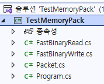

# 테스트
- 활용 방법이나 SuperSocketLite의 기능을 테스트 한다.   
      
  
## Test
기능을 테스트 한다.  
- Receive 버퍼를 링버퍼 처럼 사용하는지 테스트    
  
  
## TestMemoryPack
    
  
- 직렬화 라이브러리인 `MemoryPack` 사용 예제 코드 
- 네트워크 프로그램의 패킷으로 사용할 때의 코드도 있다  
```
void Test6()
{
    Console.WriteLine("[ Test 6 ] 패킷 데이터 직렬화");

    var reqPkt = new PKTReqLogin
    {
        TotalSize = 0, // 여기에서는 패킷의 전체 크기를 알 수 없다
        Id = 22,
        Type = 0,
        UserID = "jacking75",
        AuthToken = "jacking75",
    };
    // 직렬화 하면 앞에 1 바이트는 갯수, 이후는 데이터 순서대로 직렬화한다
    var bin = MemoryPackSerializer.Serialize(reqPkt);
    var totalSize = (UInt16)bin.Length;
    Console.WriteLine($"[Test6] Packet bin Size: {totalSize}");

    // PKTReqLogin 초기화에서 패킷의 전체 크기를 0으로 했기 때문에 올바르게 수정한다
    FastBinaryWrite.UInt16(bin, 1, totalSize);
    

    // 패킷 헤더 정보 읽기
    var headerInfo = new MemoryPackPacketHeadInfo();
    headerInfo.Read(bin);
    headerInfo.DebugConsolOutHeaderInfo();


    var obj = MemoryPackSerializer.Deserialize<PKTReqLogin>(bin);

    if (obj != null)
    {
        Console.WriteLine($"{obj.UserID}:{obj.AuthToken}");

        if (obj.Id == reqPkt.Id && obj.AuthToken == reqPkt.AuthToken)
        {
            Console.WriteLine("OK - Test6");
        }
    }
}
```  
  
```
[MemoryPackable]
public partial class PkHeader
{
    public UInt16 TotalSize { get; set; } = 0;
    public UInt16 Id { get; set; } = 0;
    public byte Type { get; set; } = 0;
}

// 로그인 요청
[MemoryPackable]
public partial class PKTReqLogin : PkHeader
{
    public string UserID { get; set; } = default!;
    public string AuthToken { get; set; } = default!;
}

[MemoryPackable]
public partial class PKTResRoomEnter : PkHeader
{
    public Int16 ErrorCode { get; set; }
    public int RoomNumber { get; set; }
}
```  
    
```
public struct MemoryPackPacketHeadInfo
{
    const int PacketHeaderMemoryPackStartPos = 1;
    public const int HeadSize = 6;

    public UInt16 TotalSize;
    public UInt16 Id;
    public byte Type;

    public static UInt16 GetTotalSize(byte[] data, int startPos)
    {
        return FastBinaryRead.UInt16(data, startPos + PacketHeaderMemoryPackStartPos);
    }

    public static void WritePacketId(byte[] data, UInt16 packetId)
    {
        FastBinaryWrite.UInt16(data, PacketHeaderMemoryPackStartPos + 2, packetId);
    }

    public void Read(byte[] headerData)
    {
        var pos = PacketHeaderMemoryPackStartPos;

        TotalSize = FastBinaryRead.UInt16(headerData, pos);
        pos += 2;

        Id = FastBinaryRead.UInt16(headerData, pos);
        pos += 2;

        Type = headerData[pos];
        pos += 1;
    }

    public void Write(byte[] mqData)
    {
        var pos = PacketHeaderMemoryPackStartPos;

        FastBinaryWrite.UInt16(mqData, pos, TotalSize);
        pos += 2;

        FastBinaryWrite.UInt16(mqData, pos, Id);
        pos += 2;

        mqData[pos] = Type;
        pos += 1;
    }

    
    public void DebugConsolOutHeaderInfo()
    {
        Console.WriteLine("DebugConsolOutHeaderInfo");
        Console.WriteLine("TotalSize : " + TotalSize);
        Console.WriteLine("Id : " + Id);
        Console.WriteLine("Type : " + Type);
    }   
}
```   
  
     
## TestProtocolBuffer
   
  
  